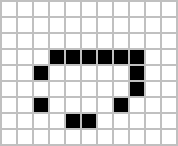

import GOL from "./GOL.astro";

<GOL />

Have you seen this animation before? It's called the **Game of Life**.

In 1970, **John Horton Conway** created the Game of Life (or Conway's Game of Life ), a cellular automaton that simulates the evolution of a grid of cells based on a few simple rules. Despite its simplicity, the Game of Life exhibits complex behaviors, such as gliders, oscillators, and even Turing-complete machines.

In this article, we'll explore how simple rules can give rise to complex phenomena and how they can be used to model real-world systems.

## The Game of Life

The universe of the Game of Life is a two-dimensional grid of cells, each of which can be alive or dead. The state of each cell evolves over time according to the following rules:

1. Any live cell with fewer than two live neighbours dies, as if by underpopulation.
2. Any live cell with two or three live neighbours lives on to the next generation.
3. Any live cell with more than three live neighbours dies, as if by overpopulation.
4. Any dead cell with exactly three live neighbours becomes a live cell, as if by reproduction.

Or in other words:

- If the sum of all nine fields in a given neighbourhood is three, the inner field state for the next generation will be life.
- If the all-field sum is four, the inner field retains its current state; and every other sum sets the inner field to death.

And that's it! We can implement these simple rules in code and simulate the evolution of the grid over time. The animation at the beginning of this article shows the Game of Life in action.

Various patterns emerge in the Game of Life, each categorized based on its behavior. Some common types include:

**Still lifes**, which do not change from one generation to the next.

<table class="prose-tr:border-none prose-img:m-0 prose-td:text-center">
  <tr>
    <td></td>
    <td></td>
    <td></td>
    <td></td>
    <td></td>
  </tr>
  <tr>
    <td>Block</td>
    <td>Beehive</td>
    <td>Loaf</td>
    <td>Boat</td>
    <td>Tub</td>
  </tr>
</table>

**Oscillators**, which return to their initial state after a finite number of generations.

<table class="prose-tr:border-none prose-img:m-0 prose-td:text-center">
  <tr>
    <td></td>
    <td></td>
    <td></td>
    <td></td>
    <td></td>
  </tr>
  <tr>
    <td>Blinker</td>
    <td>Toad</td>
    <td>Beacon</td>
    <td>Pulsar</td>
    <td>Penta-decathlon</td>
  </tr>
</table>

**Spaceships**, which translate themselves across the grid.

<table class="prose-tr:border-none prose-img:m-0 prose-td:text-center">
  <tr>
    <td></td>
    <td></td>
    <td></td>
    <td></td>
  </tr>
  <tr>
    <td>Glider</td>
    <td>Light-weight spaceship (LWSS)</td>
    <td>Middle-weight spaceship (MWSS)</td>
    <td>Heavy-weight spaceship (HWSS)</td>
  </tr>
</table>
