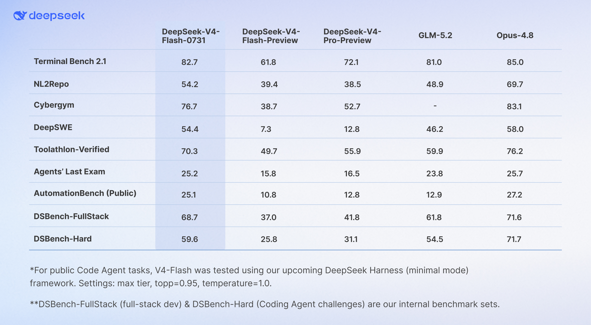
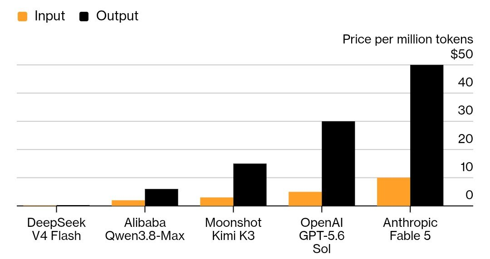

AI stopped being a novelty for me a long time ago. These days it's just part of how I get things done. My [token analytics](https://tokscale.ai/u/Th1nhNg0) say I've burned 201 million tokens across 2,149 messages for a grand total of \$1.66. Let me share how.

I'm doing my master's in Business Administration, and ChatGPT is basically my unofficial research assistant. Need a chart or a graph for a chapter? I describe what I want and it generates the image in seconds. The killer combo is ChatGPT plus the Consensus MCP — I ask for research papers and instead of scrolling Google Scholar for hours, I get relevant articles instantly, with their journal ranks (Q1, Q2...) checked and each one summarized. For a thesis student, that's like having a librarian and a translator on call 24/7.

The ChatGPT Plus subscription is worth it for the scheduled feature alone. I've set up automations that run by themselves: every morning one of them scrapes the news and reports back only the topics I actually want to read. And once a week it goes through my chat history, summarizes it, and suggests what I should prepare or do next. It's like a personal assistant that never sleeps.

I also use Gemini, though it hasn't been great lately — which is a shame, because it has a big context window and Google search built in, with access to information other providers just don't have. But Google's AI can be very stupid sometimes xD. The best thing is the Flow: AI Creative Studio for videos and images, which lets me make both for free (I just don't need them much). And then there's NotebookLM — now called Google Notebook — which works like a local RAG system: it only answers from the sources you give it. Upload a PDF, spreadsheet, docx, audio file, or website link and chat about them; the answers are correct because it only reads what's in your docs, with citations and no hallucination. Its only weak spot is audio transcription.

That's where ElevenLabs comes in. Its speech-to-text can transcribe very long recordings with every speaker labeled, and the quality is insane — far fewer typos than NotebookLM. It helps a lot when I want an AI system to actually understand something. The text-to-speech side is just as good: natural voices and accents.

So right now I'm paying for a handful of subscriptions:

- ChatGPT Plus — \$20/month
- Consensus — \$9/month with a student discount, I'll keep it until I finish my master's thesis
- Google AI Pro — roughly \$9.6/month
- ElevenLabs Starter — \$6/month
- opencode — \$10/month

Total: roughly \$55/month. All of it replaces things I used to do by hand, so it pays for itself.

My favorite story though: I told opencode — my coding agent — to build an automatic video generator. No specs, no detailed plan, just "make this thing." It spent two hours researching how to do it, and the whole thing cost about \$0.20. When it came back it had built a full pipeline: it generates the script, writes the voiceover text, creates image generation prompts, connects to ComfyUI to generate the images, and uses Edge TTS for the voiceover. A tool that would've taken me weeks to build, done in an afternoon for the price of a piece of candy.

The secret is DeepSeek v4 Flash inside opencode. The latest update — [DeepSeek V4 Flash 0731](https://artificialanalysis.ai/models/deepseek-v4-flash) — has performance close to the top-tier models like GPT-5 and Claude, but at the cheapest price per million tokens I've ever seen. The numbers from my own usage tell the story: it runs at roughly \$0.01 per million tokens while Claude Opus runs around \$5/M and Sonnet around \$3/M — 100 to 500 times more expensive. On top of that there's a free tier; I've pushed 107 million tokens through it for exactly \$0.00.

That changes your behavior completely. I can experiment, try wild ideas, and let long tasks run for hours without watching the meter. With Claude or Codex I was always counting tokens in my head. With DeepSeek I just let it cook. I genuinely don't think I need the expensive coding agents anymore.

For big tasks with heavy context, I also use subagents. Most models only work well within a ~256k token context window, so instead of cramming a huge project into one giant session, I spawn subagents — each one handles a small, focused task in its own small context window — and they report back to the main agent. Everything stays sharp, fast, and cheap.

The honest downside: DeepSeek isn't multimodal yet — it can't read images. So I split the work: ChatGPT handles anything visual, DeepSeek handles the code. A small tax, and the savings more than make up for it.

AI isn't some futuristic thing anymore. It's my everyday sidekick — writing, researching, coding, building — and it's making my life faster, cheaper, and way more fun.
