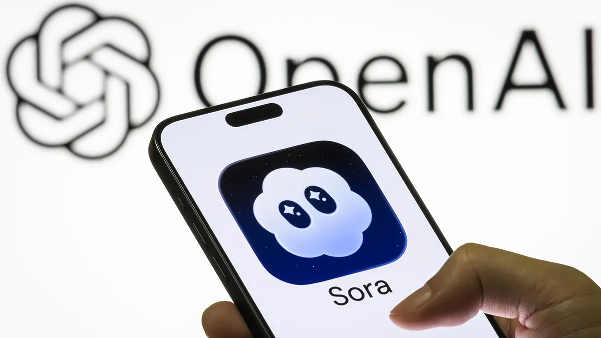
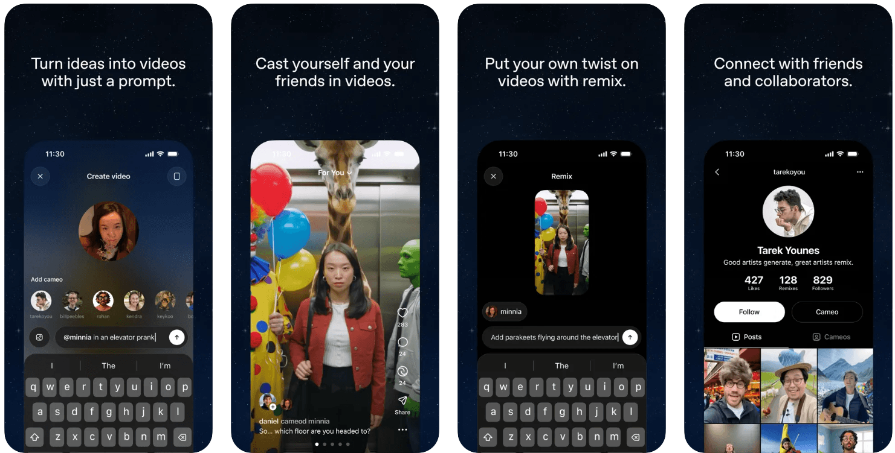
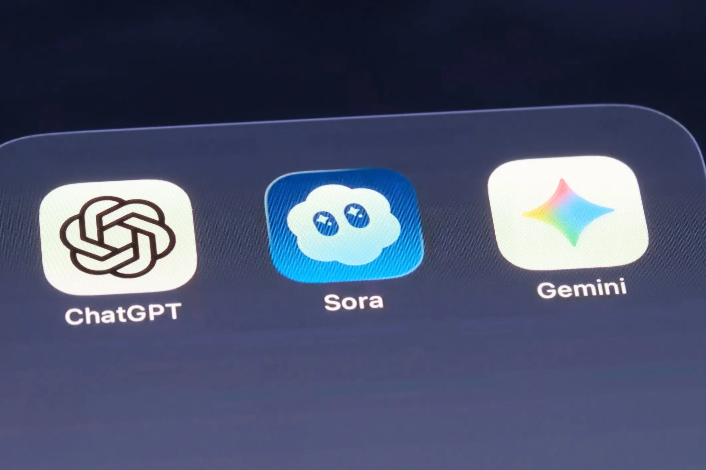

Yesterday, OpenAI shut down Sora.

If you've been following the AI space, you know what Sora was. The text-to-video app that genuinely shocked people when it launched — hyperrealistic motion, decent physics, audio. Not perfect, but miles ahead of anything else at the time. It hit #1 on the App Store within a day. It had a Disney deal worth a billion dollars.

And now it's gone. Six months after its standalone launch.

I keep thinking about this one thing: **being first doesn't mean you win.**

## The window only buys you time

Sora had a real head start. Nobody else was doing AI video at that quality and scale when it dropped. That's what got them the headlines, the downloads, the Disney partnership.

But a head start only buys you a window — not a finish line. What you do inside that window is what actually determines if you're still standing six months later.

Sora burned through it fast. Deepfake problems surfaced almost immediately. Copyright holders were furious. Guardrails were flimsy. Growth peaked in November and was already sliding by February.

Getting there first opened the door. Not having the product sorted is what got them pushed back out.

## The product question nobody could answer

Sora was impressive as technology. As a product, it never really figured itself out.

It was designed like a TikTok clone for AI video, and the flagship feature was essentially a deepfake-yourself tool. Fun for a week, weird the next, a legal headache after that.

Nobody had a clean answer to "who actually needs this, every single day, and why?" Compare that to ChatGPT — you understood the use case the moment you tried it. Drafting, summarizing, thinking out loud. Immediately obvious. Sora wasn't.

Novel ≠ useful. You can be the first to build something the world doesn't quite need yet, and it won't save you.

## The second mover was watching the whole time

There's actually a name for this pattern: the **second-mover advantage**.

The first mover does the hard part — they educate the market, absorb the regulatory and social backlash, and figure out (expensively) what doesn't work. The second mover watches all of that unfold, then steps in with a cleaner product, better timing, and fewer of the original mistakes baked in.

Google's Veo is still standing. Runway is still standing. They watched Sora walk straight into the copyright minefield and they're adjusting accordingly.

Being second or third — with sharper execution — often beats being first with a rough product.

## What actually matters

Timing alone is just attention. You also need execution to keep users around, real market fit to make them come back, and enough runway — financially, legally, computationally — to iterate before the window closes.

Sora had the first one. The rest is where things fell apart.

The story of Sora isn't really a tragedy. It's a reminder that a great demo isn't a great product. That impressive and *useful* aren't the same thing. The race doesn't go to whoever fires the starting gun.

It goes to whoever is still running when it matters.
