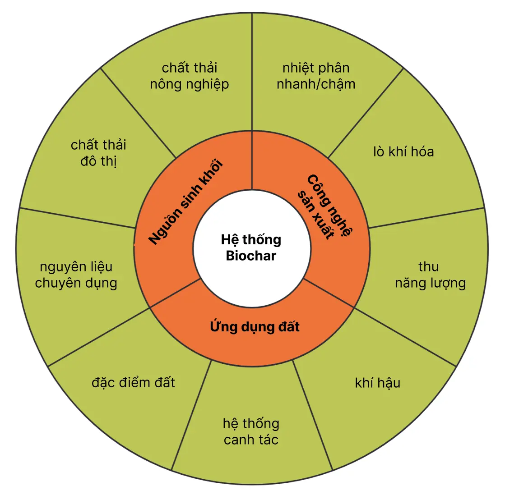

Vấn đề khí hậu hiện nay đã trở nên vô cùng nghiêm trọng. Mỗi năm, loài người thải ra hơn 43 tỷ tấn CO2 vào khí quyển, lượng này cao hơn 25% so với chỉ một thập kỷ trước. Các nhà khoa học đã tính toán một “ngân sách carbon” cho Trái đất. Nếu chúng ta muốn có 75% cơ hội giữ cho mức ấm lên dưới 2 độ C, thì trong nửa đầu thế kỷ này ta chỉ có thể thải ra tối đa 1.000 tỷ tấn CO2. Thế nhưng, lượng khí thải carbon của chúng ta đã tăng nhanh đến mức vào năm 2013, chúng ta đã sử dụng gần 40% hạn mức đó. Và đến năm 2024, ta chỉ còn lại 8% ngân sách carbon. Với tốc độ như vậy, chúng ta sẽ hết “hạn mức” vào năm 2028. Do đó, thời gian để giải quyết cuộc khủng hoảng khí hậu là rất hạn chế, và những năm còn lại của thập kỷ này đặc biệt quan trọng[^CO@2COUNT].

Vào tháng 12 năm 2015 ở Paris, nhân loại đã đối mặt với một thách thức khó khăn – xây dựng một hiệp ước toàn cầu đủ mạnh để giải quyết cuộc khủng hoảng khí hậu. Hội nghị Liên Hợp Quốc về Biến đổi Khí hậu (COP21) đã diễn ra với mục tiêu xây dựng hiệp ước này. Sự kiện này được kỳ vọng cao, đặc biệt sau thất bại của Hội nghị Copenhagen năm 2009, nơi các quốc gia không đạt được thỏa thuận ràng buộc về pháp lý để giảm phát thải khí nhà kính.[^Copenhagen].

Tại COP21, gần 200 quốc gia đã thông qua Thỏa thuận Paris, một hiệp định mang tính lịch sử với mục tiêu giữ mức tăng nhiệt độ toàn cầu dưới 2°C so với thời kỳ tiền công nghiệp, và nỗ lực giới hạn ở mức 1,5°C. Thỏa thuận này yêu cầu các quốc gia đệ trình các cam kết tự nguyện về giảm phát thải và định kỳ cập nhật, nhằm thúc đẩy hành động mạnh mẽ hơn trong tương lai. [^ParisAgreement]

Kể từ khi Thỏa thuận Paris được thông qua vào năm 2015, cộng đồng quốc tế đã liên tục nỗ lực để thực hiện các cam kết nhằm hạn chế biến đổi khí hậu. Dưới đây là một số cập nhật quan trọng liên quan đến tiến trình này:

**COP28: Đánh giá Toàn cầu về Thỏa thuận Paris**[^COP28]

Hội nghị lần thứ 28 Các Bên tham gia Công ước khung của Liên Hợp Quốc về Biến đổi Khí hậu (COP28), diễn ra từ ngày 30/11 đến 12/12/2023, đã công bố Bản Đánh giá Toàn cầu (Global Stocktake - GST) đầu tiên. Đây là đánh giá toàn diện về tiến trình thực hiện Thỏa thuận Paris, giúp các quốc gia điều chỉnh nỗ lực ứng phó với biến đổi khí hậu. GST tập trung vào bốn trụ cột chính:

1. Thúc đẩy quá trình chuyển đổi công bằng và có trật tự.
2. Ổn định tài chính khí hậu.
3. Phát triển bền vững về tự nhiên, cuộc sống và sinh kế.
4. Thúc đẩy sự hội nhập trong hành động khí hậu.

**COP29: Thông qua Cơ chế Thị trường Carbon Quốc tế**[^COP29]

Tại Hội nghị COP29, diễn ra vào tháng 11/2024, các quốc gia đã thống nhất về quy tắc, phương thức và thủ tục cho Thị trường carbon quốc tế theo Điều 6.4 của Thỏa thuận Paris. Cơ chế này cho phép các quốc gia trao đổi kết quả giảm phát thải khí nhà kính, tạo điều kiện cho dòng vốn đầu tư xanh chảy về các quốc gia đang phát triển. Mukhtar Babayev, Chủ tịch COP29, cho biết: "Bằng cách kết nối hiệu quả giữa người mua và người bán, các thị trường này có thể giảm chi phí thực hiện NDCs xuống 250 tỷ USD mỗi năm."

Việt Nam đã thể hiện cam kết mạnh mẽ trong việc thực hiện Thỏa thuận Paris. Năm 2020, Việt Nam là một trong 20 quốc gia đầu tiên trên thế giới trình Báo cáo Đóng góp do quốc gia tự quyết định (NDC) cập nhật lên Ban Thư ký Công ước khung của Liên Hợp Quốc về Biến đổi Khí hậu (UNFCCC). Trong NDC cập nhật, Việt Nam cam kết giảm 9% lượng phát thải khí nhà kính bằng nguồn lực quốc gia, và có thể tăng lên 27% nếu nhận được hỗ trợ quốc tế.[^vietnamParis]

Dù thế nào, nhiều nhà khoa học cho rằng ngay cả khi đạt được một hiệp ước, thời điểm này cũng đã quá muộn để tránh những xáo trộn khí hậu nghiêm trọng. Trên thực tế, hành tinh của chúng ta đang nóng lên với tốc độ phù hợp với những kịch bản xấu nhất mà Ủy ban Liên chính phủ về Biến đổi Khí hậu (The Intergovernmental Panel on Climate Change) đưa ra. Trong khi đó, tăng trưởng kinh tế và cơn khát năng lượng của Trung Quốc và Ấn Độ dường như không thể ngăn cản, việc giảm đốt nhiên liệu hóa thạch trở nên cực kỳ khó khăn. Hơn nữa, tiến bộ không thể đạt được bằng cái giá đánh đổi an ninh lương thực hay an ninh năng lượng. Điều chúng ta cần trong thế kỷ XXI này là những giải pháp có khả năng giải quyết đồng thời nhiều vấn đề lớn, lại phải có tính khả thi, nhanh chóng và đủ quy mô để tạo ra sự khác biệt thực sự.

Cách tiếp cận biochar (than sinh học) mang đến một giải pháp đầy sức mạnh độc đáo: nó cho phép chúng ta giải quyết vấn đề an ninh lương thực, khủng hoảng nhiên liệu và vấn đề khí hậu, tất cả theo một cách thức vô cùng thực tiễn. Biochar vừa là một khái niệm cực kỳ cổ xưa, vừa là một ý tưởng rất mới trong tư duy hiện đại. Người da đỏ ở Amazon đã sử dụng nó để tạo ra những vùng đất Terra Preta ở lưu vực sông Amazon, và sau 1000 năm chúng vẫn màu mỡ hơn những vùng đất xung quanh. Mặc dù có nhiều lợi ích, rất ít nông dân hiện nay nghĩ đến việc sản xuất biochar. Tệ hơn, các cuộc tranh luận chính trị về biến đổi khí hậu lại tiếp tục diễn ra trong sự thiếu hiểu biết về biochar, trong khi các ngành công nghiệp có thể hưởng lợi to lớn chỉ mới bắt đầu những bước đi chập chững trong việc phát triển nó ở quy mô lớn.

Yếu tố cốt lõi trong các công nghệ biochar là quá trình làm than sinh học, bao gồm việc đốt nóng vật liệu hữu cơ trong điều kiện thiếu oxy. Thay vì chỉ là một công nghệ duy nhất, biochar là một sợi chỉ đỏ xuyên suốt nhiều hướng tiếp cận công nghệ khác nhau, có thể linh hoạt tùy theo mục tiêu hoặc cơ hội nhất định. Có rất nhiều sản phẩm quan trọng từ quá trình làm than sinh học, bao gồm khí tổng hợp (syngas) có thể dùng để phát điện, chất thay thế dầu diesel và chính bản thân than sinh học.

Một trong những khía cạnh quan trọng nhất của biochar là quy mô triển khai. Nếu chúng ta chuyển toàn bộ lượng phế thải nông nghiệp và lâm nghiệp hằng năm trên thế giới thành biochar và lưu giữ carbon, chúng ta có thể loại bỏ khoảng 4 gigatonnes CO2 khỏi khí quyển. Điều này khiến việc sản xuất biochar trở thành một trong những “động cơ” làm sạch khí quyển hiệu quả nhất mà ta có. Thật vậy, đó là một trong những công nghệ vào vòng chung kết Giải thưởng Virgin Earth Challenge[^VirginEarthChallenge] – giải thưởng lớn nhất thế giới – nhắm đến việc khuyến khích các công nghệ có khả năng loại bỏ hàng tỷ tấn carbon khỏi khí quyển mỗi năm.

Trong số những kết quả giá trị nhất của việc ứng dụng công nghệ biochar là tăng hiệu quả kinh tế trong nông nghiệp, nâng cao năng suất cây trồng và làm chậm quá trình carbon quay trở lại khí quyển. Kết quả đó bao gồm các nguồn năng lượng sạch và đa dạng hơn, nhiều lương thực hơn trên mỗi đơn vị đầu vào, và một cơ hội để đảm bảo an ninh khí hậu. Nói đơn giản, đó là những gì cuộc cách mạng biochar mang đến cho chúng ta.

## Biochar là gì?

Ngắn gọn: Biochar (than sinh học) là một sản phẩm được tạo ra trong quá trình nhiệt phân (pyrolysis) các vật liệu hữu cơ trong môi trường yếm khí hoặc nghèo oxy, có khả năng tồn tại bền vững trong môi trường đất và làm tăng lượng cacbon lưu giữ trong đất, giảm cacbon phát thải vào khí quyển, có ảnh hưởng tích cực đến sức sản xuất của đất.[^Scholz]

Theo Lehmann & Joseph[^Johannes], Biochar là sản phẩm được tạo ra từ quá trình nung sinh khối ở nhiệt độ trên 250°C trong điều kiện thiếu hoặc không có không khí (charring/pyrolysis). Khác với than củi, biochar được thiết kế chủ yếu để cải thiện đất và quản lý môi trường, giàu carbon hữu cơ và các kim loại như phốt pho, canxi, magiê. Đặc tính của biochar giúp nó không dễ cháy và thân thiện với môi trường đất, trong khi vẫn giữ hình dáng tương tự như nguyên liệu ban đầu nhưng có màu đen đặc trưng

Thuật ngữ "biochar" là một từ mới trong tiếng Anh vào cuối thế kỷ 20, xuất phát từ tiếng Hy Lạp "βίος" (bios) có nghĩa là "sự sống" và "char", tức là than được tạo ra từ quá trình cacbon hóa sinh khối. Thuật ngữ này được công nhận để chỉ loại than tham gia vào các quá trình sinh học trong đất, môi trường nước và hệ tiêu hóa của động vật.

Kỹ thuật sử dụng than để cải thiện độ phì nhiêu của đất có nguồn gốc từ lưu vực Amazon ít nhất cách đây 2500 năm. Người bản địa trong khu vực này đã tạo ra than, trộn nó với chất hữu cơ và mảnh gốm vỡ, sau đó bón vào các mảnh đất nhỏ có diện tích từ 1 - 80 hecta. "Terra Preta," như được gọi tại khu vực Brazil này, vẫn giữ được độ phì nhiêu cao cho đến ngày nay, ngay cả khi bón rất ít hoặc không sử dụng phân bón. Điều này đặc biệt ấn tượng khi xét đến khu vực này nổi tiếng với các loại đất nhiệt đới cực kỳ nghèo dinh dưỡng.

Người dân địa phương luôn biết rằng Terra Preta có độ phì nhiêu đặc biệt, nhưng nó hầu như không được biết đến trên toàn thế giới cho đến khi một nhà khoa học tên Wim Sombroek bắt đầu nghiên cứu sâu về nó. Từ niềm đam mê của Wim đối với đất Terra Preta, sự quan tâm đến việc tạo ra "Terra Preta Nuova" đã nảy sinh, và cuối cùng được gọi là biochar. Bên cạnh hàm lượng than cao như đã đề cập, đất Terra Preta còn được đặc trưng bởi hàm lượng phốt pho cao, đạt tới 200-400 mg P/kg, cùng với khả năng trao đổi cation, độ pH và độ bão hòa bazơ cao hơn so với các loại đất xung quanh...

## Hệ thống Biochar

Để hiểu rõ tác động thực sự của biochar, chúng ta cần phải xem xét toàn diện hệ thống biochar. Dù nghiên cứu ở quy mô nào, một hệ thống biochar luôn bao gồm những yếu tố chính sau: (a) nguồn sinh khối ban đầu, (b) cách thức sản xuất ra biochar, và (c) khả năng và cách thức sử dụng nó cho đất.[^Scholz]

### Nguồn Sinh Khối Sản Xuất Biochar

Biochar có thể được sản xuất từ hầu hết mọi loại sinh khối, bao gồm phế phẩm nông nghiệp, vỏ trấu, bã mía, giấy vụn, phân động vật và rác thải xanh đô thị[^Johannes]. Loại sinh khối được sử dụng làm nguyên liệu đầu vào quyết định đến loại biochar tạo ra và các đặc tính của nó. Chẳng hạn, biochar từ vỏ trấu thường có hàm lượng tro cao hơn so với biochar từ lõi ngô.[^Raveendran]

Việc lựa chọn sinh khối làm nguyên liệu cần cân nhắc kỹ vì nó ảnh hưởng đến hiệu quả và tính bền vững của hệ thống sản xuất biochar. Những yếu tố quan trọng khi lựa chọn bao gồm:

- **Độ ẩm ban đầu của sinh khối**: Độ ẩm cao làm giảm hiệu suất nhiệt phân.
- **Khoảng cách vận chuyển**: Sinh khối cần được thu gom và vận chuyển đến địa điểm sản xuất một cách hợp lý để giảm chi phí và tác động môi trường.
- **Nguồn gốc sinh khối**: Sinh khối có thể xuất phát từ khu vực nông thôn, đô thị, hay công nghiệp.
- **Tính chất của sinh khối**: Nguyên liệu có thể là cây trồng chuyên dụng hoặc là sản phẩm phụ của các hoạt động sản xuất khác [^Johannes].

Ưu tiên sử dụng **“chất thải thực sự”** làm nguyên liệu sẽ giúp giảm tác động tiêu cực đến môi trường. "Chất thải thực sự" là những vật liệu không làm gián đoạn chu trình carbon và dinh dưỡng địa phương, như việc tận dụng tàn dư cây trồng mà không gây tổn hại cho đất, hoặc tránh tạo ra nhu cầu sử dụng đất không bền vững, chẳng hạn như phá rừng để trồng cây nhiên liệu sinh học.

### Công Nghệ Sản Xuất Biochar

Biochar có thể được sản xuất ở nhiều quy mô khác nhau, từ bếp nấu ăn gia đình vừa sản xuất biochar vừa cung cấp nhiệt để nấu nướng, đến các nhà máy nhiệt phân công nghiệp tạo ra cả năng lượng sinh học và biochar. Quy mô và nhu cầu của hệ thống—dù là cung cấp năng lượng để nấu ăn, sưởi ấm hay đáp ứng các nhu cầu năng lượng lớn hơn—là yếu tố quan trọng quyết định tác động cuối cùng của các hệ thống này.

Các hệ thống sản xuất biochar thường được phân loại thành hệ thống khí hóa hoặc nhiệt phân, với ba sản phẩm chính được tạo ra tùy thuộc vào công nghệ sử dụng:

- **Biochar** (rắn),
- **Syngas** (khí tổng hợp),
- **Bio-oil** (chất lỏng phụ phẩm).

Hệ thống nhiệt phân sử dụng lò hoặc thiết bị kín để loại trừ oxy, cho phép khí sinh ra trong quá trình nhiệt phân (syngas) thoát ra và được thu giữ để đốt cháy. Nhiệt phân được phân thành ba loại: chậm, nhanh và siêu nhanh:

- **Nhiệt phân nhanh**: Tạo ra nhiều dầu và chất lỏng hơn.
- **Nhiệt phân chậm**: Tạo ra nhiều syngas hơn.
- **Nhiệt phân siêu nhanh**: Chủ yếu tạo biochar.

Hệ thống khí hóa thường được thiết kế để tập trung sản xuất khí, thay vì biochar hay dầu, nên tạo ra ít biochar hơn so với nhiệt phân. Điều này là do trong hệ thống khí hóa có sự cung cấp một lượng oxy nhất định; càng ít oxy, lượng biochar tạo ra càng cao. Tuy nhiên, các hệ thống khí hóa có thể được tối ưu hóa để sản xuất biochar, với hiệu suất dự đoán đạt tới 30%. Ví dụ, các hệ thống khí hóa vỏ trấu là trường hợp đặc biệt, trong đó hàm lượng silica cao trong vỏ trấu ngăn cản quá trình đốt cháy hoàn toàn carbon. Kết quả là tro trấu có thể chứa tới 80% carbon và thường được mô tả không phải là tro mà là “vỏ trấu carbon hóa.”

Khi không bị hạn chế về công nghệ, lựa chọn công nghệ phù hợp sẽ phụ thuộc vào sự ưu tiên của người sử dụng giữa việc sản xuất năng lượng và sản xuất biochar.

### Ứng Dụng Biochar vào Đất

Ứng dụng cuối cùng phổ biến nhất của biochar là bón trực tiếp vào đất. Việc này mang lại nhiều lợi ích nông học, cải thiện độ phì nhiêu và giảm phát thải khí nhà kính từ đất, đồng thời giúp lưu trữ carbon lâu dài.

Để ứng dụng hiệu quả, cần lựa chọn loại biochar phù hợp với các vấn đề cụ thể của đất và áp dụng đúng phương pháp. Biochar có thể được bón trực tiếp hoặc trộn với các nguyên liệu khác như phân chuồng, phân compost, hoặc phân khoáng. Một số phương pháp bón biochar bao gồm:

- **Cày vào tầng đất mặt** trong quá trình làm đất.
- **Bón theo hàng** (bón cục bộ tại vị trí rễ cây).
- **Rải trên bề mặt đất** và để các quá trình tự nhiên như mưa hoặc tưới nước đưa biochar xuống đất.
- **Bón vào hố trồng cây**, sử dụng như lớp phủ hạt giống hoặc trộn vào ống trồng.
- **Ứng dụng trong xây dựng đất cho mái nhà xanh** hoặc cỏ sân vườn.

Hiệu quả của biochar phụ thuộc vào sự kết hợp phù hợp giữa đặc tính của biochar và tính chất của đất. Vì biochar là một công nghệ mới trong nông nghiệp, cần có thêm nghiên cứu để phát triển các chiến lược bón tối ưu, đặc biệt trong việc phối hợp biochar với các phương pháp canh tác khác.

## Nhân tố then chốt trong thị trường tín chỉ carbon

Nguyên tắc của thị trường carbon là gán giá trị cho mỗi tấn phát thải tương đương CO2 (CO2e), biến nó thành một hàng hóa có thể giao dịch. Điều này cho phép trao đổi cả phát thải carbon và loại bỏ carbon, thường được gọi là bù đắp[^carbontrade]. Sự trao đổi này được thực hiện thông qua một bên trung gian – một nền tảng được gọi là thị trường giao dịch. Tín chỉ carbon là giấy phép để tạo ra và phát thải một tấn CO2, và có thể được mua thông qua thị trường này. Mặt khác, khi một tấn CO2 được loại bỏ khỏi bầu khí quyển thông qua các công nghệ CCS (Carbon capture and storage), nó sẽ tạo ra một khoản bù đắp carbon. Thị trường giao dịch liên kết các tín chỉ và khoản bù đắp để hình thành nên thị trường carbon [^5] [^6]. Doanh thu từ các giao dịch này được sử dụng để tài trợ cho các dự án CCS và duy trì hoạt động của thị trường giao dịch.

Tín chỉ carbon đã thu hút sự chú ý đáng kể như một cơ chế thực tiễn để giải quyết khủng hoảng biến đổi khí hậu. Cơ chế này mang đến một phương pháp kinh tế độc đáo để giải quyết vấn đề, kết hợp trách nhiệm môi trường với các lợi ích tài chính. Bằng cách gán giá trị định lượng cho mỗi tấn CO2e phát thải, tín chỉ carbon thúc đẩy các cá nhân, doanh nghiệp và chính phủ thực hiện các bước đo lường được để giảm phát thải. Điều này không chỉ giảm thiểu khủng hoảng môi trường mà còn tạo ra cơ hội mới trong thị trường.

Trong bối cảnh này, một khái niệm đầy triển vọng đang ngày càng được công nhận là vai trò của biochar trong thị trường carbon. Biochar mang đến một phương pháp tiếp cận độc đáo và bền vững cho cơ chế bù đắp carbon, với tiềm năng cách mạng hóa việc cô lập carbon và nông nghiệp. Ủy ban Liên chính phủ về Biến đổi Khí hậu (IPCC) (AR 6, WGIII, SPM, phần D1.6) đã xác định biochar là một trong những phương pháp loại bỏ CO2 (CDR) có thể được áp dụng trong nông nghiệp để lưu trữ carbon trong đất[^ipccar6].

Trong khi thị trường carbon truyền thống đại diện cho cách tiếp cận dựa trên trao đổi bằng cách gán giá trị tiền tệ cho mỗi tấn CO2e phát thải, biochar nâng tầm khái niệm này bằng cách đồng thời giải quyết vấn đề giảm phát thải và sử dụng đất bền vững. Tham gia vào việc sản xuất biochar, các cá nhân, doanh nghiệp và chính phủ có cơ hội không chỉ giảm lượng khí thải carbon mà còn cải thiện sức khỏe đất, thúc đẩy nông nghiệp bền vững và giảm thiểu những thách thức môi trường liên quan đến suy thoái đất.

Cuộc thảo luận toàn cầu về giảm thiểu biến đổi khí hậu công nhận rằng một cách tiếp cận đa diện là rất cần thiết. Chuyển đổi sang các nguồn năng lượng tái tạo, cải thiện hiệu quả năng lượng và áp dụng các thực hành bền vững là những yếu tố không thể thiếu trong cuộc chiến chống biến đổi khí hậu. Ngoài ra, biochar đại diện cho một phương pháp tiếp cận sáng tạo và toàn diện, nâng cao hiệu quả của các chương trình trao đổi carbon. Tầm quan trọng của nó vượt ra ngoài các thị trường bù đắp carbon truyền thống, hòa hợp với các mục tiêu nông nghiệp và sinh thái.

**Cơ Chế Thị Trường Carbon**

Cơ chế tín chỉ carbon và bù đắp carbon đại diện cho một cách tiếp cận dựa trên thị trường để chống lại biến đổi khí hậu, bằng cách cung cấp các khuyến khích tài chính nhằm giảm phát thải khí nhà kính (GHG) và tăng cường cô lập carbon. Các tổ chức, bao gồm doanh nghiệp, chính phủ và cá nhân, có thể tham gia các hoạt động giảm phát thải như cải thiện hiệu quả năng lượng, phát triển năng lượng tái tạo, tái trồng rừng và phục hồi rừng. Kết quả của các hoạt động này là lượng phát thải được giảm, với độ chính xác được xác minh bởi các bên thứ ba. Sau khi xác minh, tín chỉ carbon được phát hành, thường đại diện cho việc giảm một tấn CO₂ hoặc tương đương khí nhà kính khác. Các tín chỉ này được giao dịch như hàng hóa và có thể được mua bởi các tổ chức muốn bù đắp phát thải của mình. Doanh thu từ việc bán tín chỉ carbon đóng vai trò là nguồn tài chính để đầu tư vào các nỗ lực cô lập carbon, chẳng hạn như tái trồng rừng và bảo tồn thiên nhiên.

Sự kết hợp giữa các hoạt động giảm phát thải và bù đắp carbon thông qua tín chỉ carbon cho phép các tổ chức tuyên bố đạt được trung hòa carbon. Trung hòa carbon là một mục tiêu quan trọng trong nỗ lực toàn cầu nhằm chống lại biến đổi khí hậu. Hiệu quả tổng thể của cơ chế này giúp các tổ chức đảm bảo rằng tác động ròng đến khí hậu của họ trở nên trung tính, nghĩa là không góp phần làm tăng nồng độ khí nhà kính trong khí quyển. Do đó, tín chỉ carbon không chỉ là công cụ hỗ trợ trung hòa carbon, mà còn cung cấp cơ chế tài chính để thực hiện các dự án và hoạt động giảm phát thải.

Theo Chương trình Môi trường Liên Hợp Quốc (UNEP), thị trường carbon được chia thành hai loại: **thị trường tuân thủ** và **thị trường tự nguyện**. Trong thị trường tuân thủ, như các hệ thống giao dịch phát thải quốc gia hoặc khu vực, các tổ chức tham gia để đáp ứng nghĩa vụ được quy định bởi cơ quan quản lý. Trong khi đó, thị trường tự nguyện cho phép các tổ chức hoặc cá nhân tham gia bù đắp phát thải mà không có nghĩa vụ pháp lý, ví dụ như để đạt được các mục tiêu như trung hòa khí hậu hoặc phát thải ròng bằng không.[^UNEP]

Các khung pháp lý và thị trường tín chỉ carbon thể hiện sự khác biệt lớn giữa các khu vực, phản ánh các cách tiếp cận đa dạng trong việc giải quyết biến đổi khí hậu và khai thác các lợi ích kinh tế, môi trường từ giao dịch carbon. Chẳng hạn, Liên minh Châu Âu vận hành **Hệ thống Giao dịch Phát thải EU (EU ETS)**, một thị trường carbon được quản lý chặt chẽ và phát triển toàn diện. Trái lại, Hoa Kỳ áp dụng cách tiếp cận phân quyền với sự kết hợp giữa các sáng kiến ở cấp tiểu bang và thị trường tự nguyện. Trong khi đó, Trung Quốc, một trong những quốc gia phát thải lớn nhất thế giới, đã triển khai các chương trình giao dịch phát thải như một phần của cam kết về phát triển bền vững.

Các cơ chế quốc tế như **Cơ chế Phát triển Sạch (CDM)** và **Điều 6 của Thỏa thuận Paris** đóng vai trò quan trọng trong việc thúc đẩy hợp tác toàn cầu về giảm phát thải và giao dịch carbon. Các cơ chế này cung cấp khung hợp tác quốc tế để các quốc gia cùng đóng góp vào mục tiêu giảm thiểu biến đổi khí hậu trên quy mô toàn cầu.

Ngoài ra, các thị trường carbon tự nguyện cũng xuất hiện trên toàn thế giới, cho phép các tổ chức và cá nhân bù đắp lượng phát thải của mình và hỗ trợ các sáng kiến bền vững. Sự tham gia tự nguyện này cho thấy nhận thức và cam kết ngày càng tăng đối với trách nhiệm môi trường, vượt xa các yêu cầu pháp lý.

Việt Nam là một trong những quốc gia sản xuất lúa gạo lớn nhất thế giới, với sản lượng gạo năm 2022 đạt khoảng 42,66 triệu tấn[^baocaoluagao]. Quá trình sản xuất này tạo ra một lượng lớn phụ phẩm, trong đó trấu chiếm khoảng 20% khối lượng thóc xay xát, tương ứng khoảng 12,93 triệu tấn trấu.

Trấu thường bị đốt bỏ hoặc sử dụng kém hiệu quả, gây ô nhiễm môi trường. Việc chuyển đổi trấu thành biochar không chỉ mang lại giá trị kinh tế mà còn đóng góp lớn vào việc giảm phát thải khí nhà kính thông qua cô lập carbon.

Từ 42,66 triệu tấn gạo sản xuất năm 2022, lượng thóc cần thiết là khoảng 64,64 triệu tấn, với tỷ lệ thu hồi gạo là 66%. Trong đó, trấu chiếm khoảng 20%, tương đương 12,93 triệu tấn.

Với hiệu suất nhiệt phân đạt khoảng 30%[^riceHusk], từ 12,93 triệu tấn trấu, có thể sản xuất ra khoảng 3,88 triệu tấn biochar. Biochar chứa khoảng 80% carbon, tương ứng 3,1 triệu tấn carbon. Khi quy đổi sang CO₂ tương đương với hệ số 3,67[^bio3], lượng CO₂ có thể được cô lập lên tới khoảng 11,39 triệu tấn. Đây là một đóng góp lớn vào việc giảm phát thải khí nhà kính.

Tín chỉ carbon, đại diện cho mỗi tấn CO₂ được giảm phát thải hoặc cô lập, hiện đang được giao dịch trên hai thị trường chính: tuân thủ và tự nguyện. Trên thị trường tuân thủ, giá tín chỉ carbon dao động từ **176 USD đến 525 USD mỗi tấn CO₂**. Với mức giá này, giá trị tín chỉ có thể dao động từ **2 tỷ USD** đến **5,9 tỷ USD**, tùy thuộc vào giao dịch. Trong khi đó, trên thị trường tự nguyện, giá tín chỉ thấp hơn, dao động từ **100 USD đến 200 USD mỗi tấn CO₂**, với tổng giá trị tiềm năng từ **1,1 tỷ USD** đến **2,2 tỷ USD**.[^bio1] [^bio2]

Hiện tại, các tính toán mới chỉ tập trung vào nguồn phụ phẩm nông nghiệp từ lúa gạo. Tuy nhiên, Việt Nam còn nhiều nguồn phụ phẩm khác như vỏ cà phê, bã mía, và các loại rơm rạ khác có tiềm năng tương tự để sản xuất biochar. Đầu tư vào nghiên cứu và phát triển trong lĩnh vực này sẽ mở ra cơ hội lớn để giảm phát thải khí nhà kính, gia tăng lợi nhuận cho doanh nghiệp và hỗ trợ người nông dân.

## Kết Luận

Biochar không chỉ là một giải pháp kháng biến đổi khí hậu tiềm năng, mà còn mang đến nhiều lợi ích đa chiều cho nông nghiệp, năng lượng và môi trường. Việc sản xuất biochar từ các nguồn sinh khối dư thừa không chỉ giúp giảm thiểu khí nhà kính, mà còn cải thiện độ phì nhiêu của đất, tăng năng suất nông nghiệp, và đóng góp vào an ninh lương thực. Hơn nữa, vai trò tiêm năng của biochar trong các thị trường tín chỉ carbon mở ra những hướng đi bền vững cho nền kinh tế toàn cầu.

Trong bối cảnh khủng hoảng khí hậu gia tăng, biochar tự hào là một công nghệ đối mới, giúp con người hắn chế tác động tác hại lên hành tinh mà vẫn đáp ứng nhu cầu nông nghiệp bền vững. Nó đáng để trở thành trụ cột trong các chiến lược khí hậu toàn cầu trong tương lai.

[^Copenhagen]: [Những lý do khiến hội nghị Copenhagen thất bại - báo Tuoitre](https://tuoitre.vn/nhung-ly-do-khien-hoi-nghi-copenhagen-that-bai-354816.htm?utm_source=chatgpt.com)
[^ParisAgreement]:
    [Thỏa thuận Paris về khí hậu
    ](https://vi.wikipedia.org/wiki/Th%E1%BB%8Fa_thu%E1%BA%ADn_Paris_v%E1%BB%81_kh%C3%AD_h%E1%BA%ADu)

[^COP28]:
    [COP28: Hội nghị toàn diện đầu tiên về tiến trình thực hiện Thoả thuận Paris
    ](http://dcc.gov.vn/tin-tuc/3965/COP28%3A-Hoi-nghi-toan-dien-dau-tien-ve-tien-trinh-thuc-hien-Thoa-thuan-Paris.html)

[^COP29]: [COP29 Agrees International Carbon Market Standards](https://unfccc.int/news/cop29-agrees-international-carbon-market-standards)
[^VirginEarthChallenge]: [Virgin Earth Challenge](https://en.wikipedia.org/wiki/Virgin_Earth_Challenge)
[^CO@2COUNT]: [The Global Carbon Budget](https://globalcarbonbudget.org/)
[^vietnamParis]: [Triển khai Thỏa thuận Paris với tâm thế mới](https://baotainguyenmoitruong.vn/trien-khai-thoa-thuan-paris-voi-tam-the-moi-318805.html)
[^Scholz]: [Biochar Systems for Smallholders in Developing Countries](https://documents1.worldbank.org/curated/zh/188461468048530729/pdf/Biochar-systems-for-smallholders-in-developing-countries-leveraging-current-knowledge-and-exploring-future-potential-for-climate-smart-agriculture.pdf)
[^Johannes]: [Biochar for Environmental Management](https://doi.org/10.4324/9780203762264)
[^Raveendran]: [Influence of mineral matter on biomass pyrolysis characteristics](https://www.sciencedirect.com/science/article/abs/pii/0016236195800138)
[^carbontrade]: [Carbon Trade: What it is, How it Works, Current Events](https://www.investopedia.com/ask/answers/04/060404.asp)
[^5]: [Carbon markets: a historical overview](https://wires.onlinelibrary.wiley.com/doi/10.1002/wcc.208)
[^6]: [Carbon trading: how it works and why it fails](https://doi.org/10.3898/136266210792307050)
[^ipccar6]: [AR6 Synthesis Report: Climate Change 2023](https://www.ipcc.ch/report/sixth-assessment-report-cycle/)
[^UNEP]: [Carbon Markets](https://www.unep.org/topics/climate-action/climate-finance/carbon-markets)
[^baocaoluagao]: [Báo cáo lúa gạo năm 2022](https://agro.gov.vn/vn/id374_Bao-cao-lua-gao-nam-2022.html)
[^riceHusk]: [A study of biochar yield from slow pyrolysis of rice husk](https://www.researchgate.net/publication/325385005_A_study_of_biochar_yield_from_slow_pyrolysis_of_rice_husk)
[^bio1]: [https://www.green.earth/news/biochar-market-analysis-pricing-insights-and-global-trends](https://www.green.earth/news/biochar-market-analysis-pricing-insights-and-global-trends)
[^bio2]: [Supercritical Pioneers Real-Time Pricing And Availability For Biochar Carbon Removal](https://carbonherald.com/supercritical-pioneers-real-time-pricing-and-availability-for-biochar-carbon-removal/)
[^bio3]: [The Carbon Cycle and Atmospheric Carbon Dioxide](https://www.ipcc.ch/site/assets/uploads/2018/02/TAR-03.pdf)
