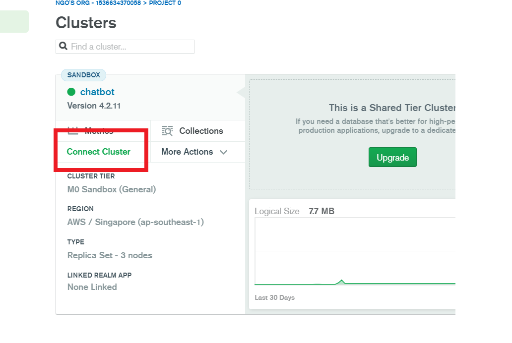
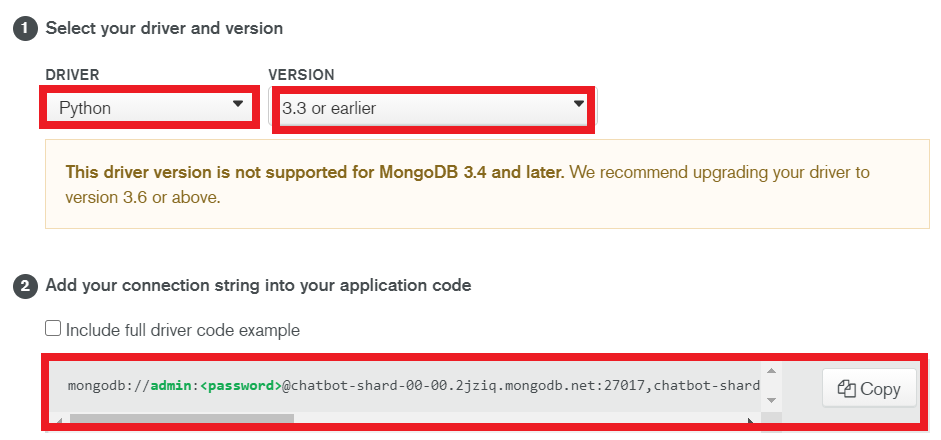
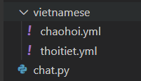
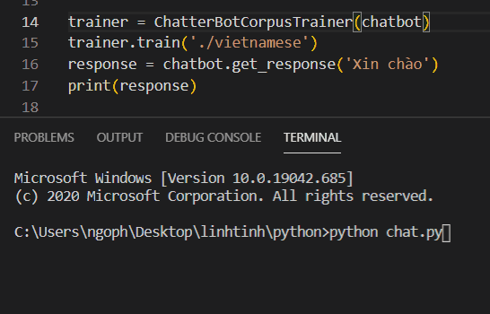

## Chatterbot là gì?

ChatterBot là một công cụ hội thoại dựa trên machine-learning được xây dựng bằng Python, giúp tạo phản hồi dựa vào dữ liệu từ các cuộc hội thoại đã biết. ChatterBot có thể hoạt động với một ngôn ngữ bất kì.

Ví dụ 1 đoạn hội thoại:


## Cách Chatterbot hoạt động

Chatterbot giống như một đứa trẻ con vậy, khi vừa được sinh ra sẽ không có khả năng giao tiếp. Khi người dùng chat với Chatterbot, đoạn chat sẽ được đưa vào cơ sở dữ liệu của nó. Khi người dùng nhập nhiều câu hỏi hơn, số lượng câu trả lời và độ chính xác sẽ được tăng lên. Chương trình sẽ đưa ra câu trả lời phù hợp nhất.

Xem kỹ hơn tại [đây](https://chatterbot.readthedocs.io/en/stable/)

## Cài đặt

Chatterbot 1.0.8 ổn định ở phiên bản python 3.6.0

Cài đặt từ [PyPi](https://pypi.org/project/ChatterBot/) bằng lệnh:

```bash
pip install chatterbot
```

## Chatbot đơn giản

```python
# import thư viện
from chatterbot import ChatBot
from chatterbot.trainers import ChatterBotCorpusTrainer

# Tạo một instance chatbot với tên là Ron Obvious
chatbot = ChatBot('Ron Obvious')

# Tạo trainer để train bot từ các đoan hội thoại có sẵn
trainer = ChatterBotCorpusTrainer(chatbot)

# Các đoạn hội thoại có sẵn của chatterbot
trainer.train("chatterbot.corpus.english")

# phản hồi từ bot với đoạn chat "Hello"
response = chatbot.get_response("Hello")
print(response)
```

Chạy đoạn code trên:


Khi chạy đoạn code trên, chatterbot mặc định sẽ tự tạo database là sqlite ở trong máy. Trong bài viết này, mình sẽ hướng dẫn các bạn kết nối bot đến database mongodb và tạo các bộ dữ liệu training cho bot.

## Kết nối đến database

Mình sử dụng mongodb atlas được free 500mb. Cách sử dụng bạn có thể xem ở bài viết này: [Viblo - Đưa dữ liệu lên mây với MongoDB Atlas](https://viblo.asia/p/dua-du-lieu-len-may-voi-mongodb-atlas-aWj53L1YK6m)

Sau khi tạo database trên mongodb, các bạn làm theo những bước sau để lấy đường dẫn:

1. Chọn Connect Cluster

   

2. Chọn Connect your application

   

3. Chọn python phiên bản 3.3, và copy đường dẫn, trong đó admin, password là tài khoản của user bạn vừa tạo trong bài viết ở trên, dbname là tên database

   

4. Thay đổi dòng thứ 6 ở đoạn code trong phần "Chatbot đơn giản" thành:

   ```python
   chatbot = ChatBot(
       'Bot thong minh',
       storage_adapter='chatterbot.storage.MongoDatabaseAdapter',
       database_uri='đường dẫn bạn vừa copy'
   )
   ```

5. Chạy thử, kết quả trên mongodb atlas:


Ta thấy, bộ dữ liệu có sẵn có 5620 câu chat khác nhau, nhưng chưa có tiếng việt, tiếp theo đây mình sẽ hướng dẫn bạn tạo bộ dữ liệu tiếng việt cho chatterbot.

## Tạo bộ dữ liệu tiếng việt

### Định dạng dữ liệu

Bộ dữ liệu của chatterbot được định dạng theo cú pháp [YAML](http://www.yaml.org/)

Một bộ dữ liệu bao gồm nhiều đoạn hội thoại, mỗi đoạn hội thoại có thể dài hoặc ngắn khác nhau. Ví dụ, file _chaohoi.yml_:

```YAML
conversations:
- - Hello
  - Hi

- - Chào
  - Chào, bạn khỏe không?
  - Tui khỏe, cảm ơn bạn.

- - Ngày mới tốt lành!
  - Cảm ơn bạn

- - Bạn ăn cơm chưa?
  - Mình ăn rồi, còn ban?
  - Mình chưa ăn :(
```

### Tạo folder chứa bộ dữ liệu và phân loại

Khi chúng ta có nhiều đoạn hội thoại theo chủ đề khác nhau, thì nên chia ra để dễ quản lí. Tạo 1 folder nằm chung thư mục với file python theo định dạng như sau:



### Training với bộ câu hỏi tiếng việt

Thay đổi dòng thứ 12 ở đoạn code trong phần "Chatbot đơn giản" thành:

```python
trainer.train("./vietnamese") # train tất cả bộ dữ liệu trong folder
hoặc
trainer.train("./vietnamese/chaohoi.yml") # train 1 bộ dữ liệu trong folder
```

Chạy thử chương trình:



## Code

Vậy là ta đã tạo ra thành công 1 con bot chat. Bạn có thể vào link [github](https://github.com/Th1nhNg0/chatterbot) để xem thêm.

Full code:

```python
from chatterbot import ChatBot
from chatterbot.trainers import ChatterBotCorpusTrainer

chatbot = ChatBot(
    'Bot THong Minh',
    storage_adapter='chatterbot.storage.MongoDatabaseAdapter',
    database_uri='duong dan toi database',
    read_only=True # True nếu bạn không muốn bot tự học khi chat với user
)


trainer = ChatterBotCorpusTrainer(chatbot)

# comment dòng này lại để không phải train mỗi khi chạy chương trình
trainer.train('./vietnamese')
# chỉ train file mình muốn:
# trainer.train('./vietnamese/chaohoi.yml')

# chương trình đơn giản để chat trên terminal
while True:
    try:
        bot_input = chatbot.get_response(input('user: '))
        print('bot:', bot_input)

    except(KeyboardInterrupt, EOFError, SystemExit):
        break
```

Mình có bonus thêm 1 đoạn code để bạn có thể train bằng tay. Chỉ cần thay đường dẫn và chạy.

```python
from chatterbot import ChatBot
from chatterbot.conversation import Statement

bot = ChatBot(
    'Bot Thong Minh',
    storage_adapter='chatterbot.storage.MongoDatabaseAdapter',
    database_uri='duong dan'
)


def get_feedback():
    text = input()
    if 'yes' in text.lower():
        return True
    elif 'no' in text.lower():
        return False
    else:
        print('Please type either "Yes" or "No"')
        return get_feedback()


while True:
    try:
        print('Type something...')
        input_statement = Statement(text=input())
        response = bot.generate_response(
            input_statement
        )
        print('\n Is "{}" a coherent response to "{}"? \n'.format(
            response.text,
            input_statement.text
        ))
        if get_feedback() is False:
            print('please input the correct one')
            correct_response = Statement(text=input())
            bot.learn_response(correct_response, input_statement)
            print('Responses added to bot!')
    except (KeyboardInterrupt, EOFError, SystemExit):
        break
```
