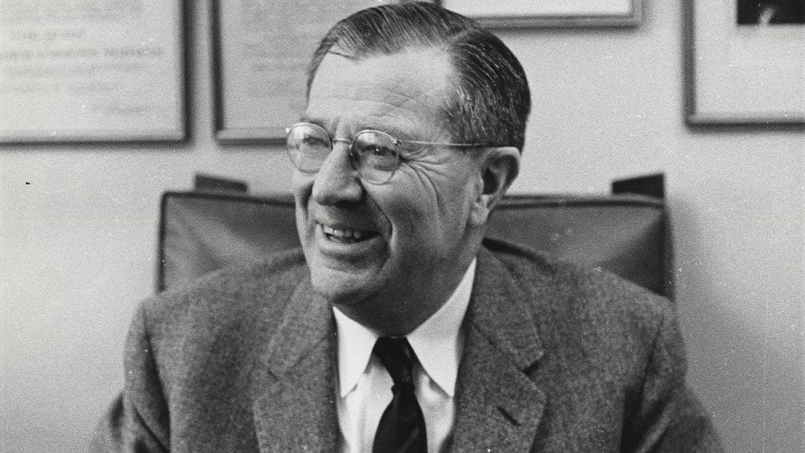
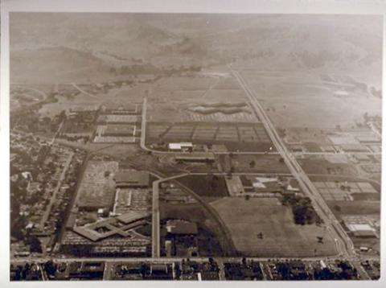
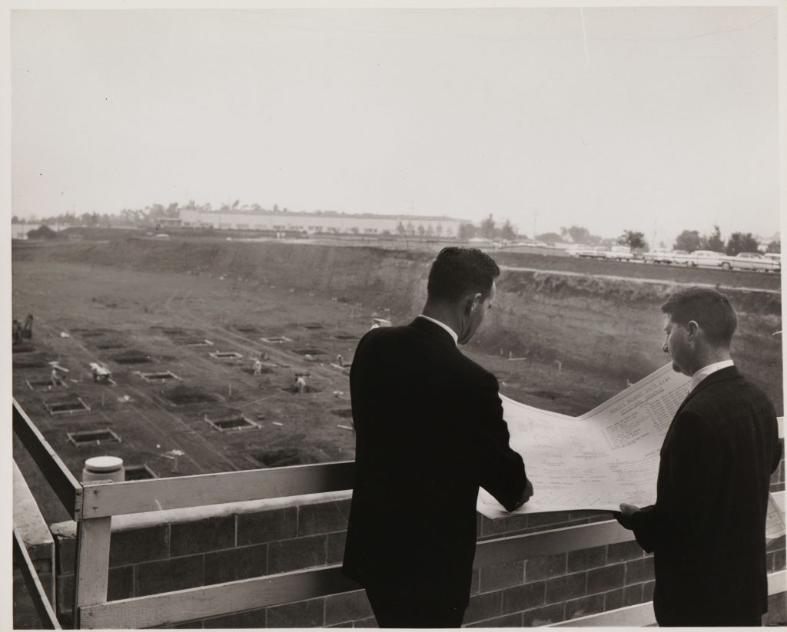
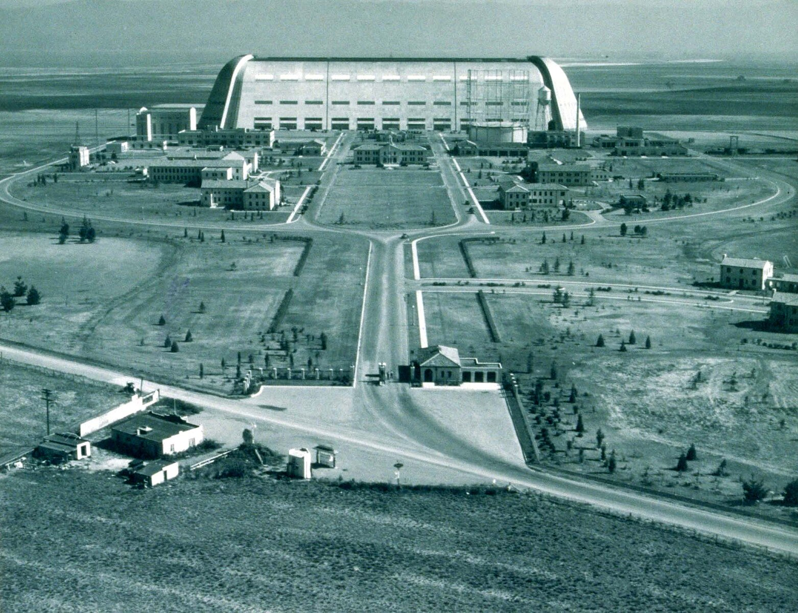
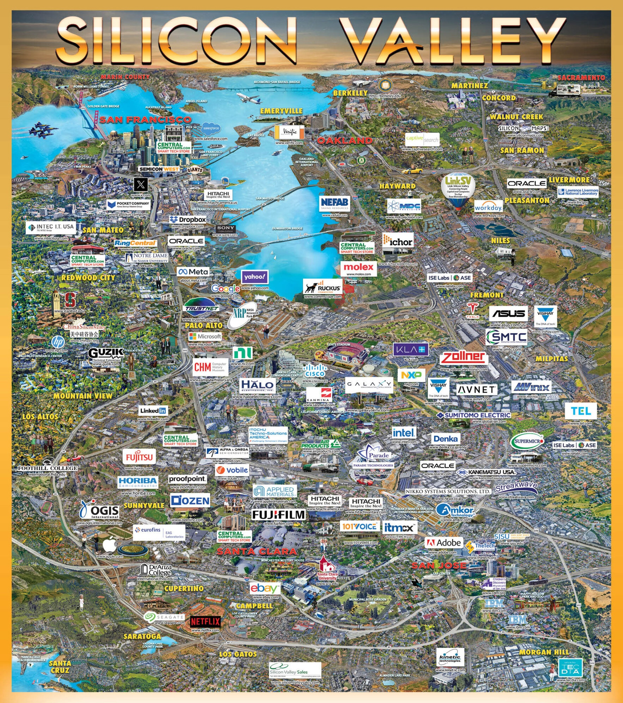

> Đây là một bài viết tâm huyết và bài viết này là một trong những trăn trở của mình trong suốt thời gian qua. Hy vọng rằng bài viết này sẽ mang lại cho bạn những góc nhìn mới mẻ về tương lai của công nghệ tại Việt Nam.

Silicon Valley (Silicon Valley), một cái tên mà bất kỳ ai làm trong mảng công nghệ cũng đều biết đến, đồng nghĩa với sự đổi mới liên tục, tinh thần khởi nghiệp và những tiến bộ vượt bậc đã định hình thế giới hiện đại. Nằm ở khu vực phía Bắc California, Hoa Kỳ[^1], khu vực này không chỉ là một địa điểm địa lý mà còn là một biểu tượng, một hệ sinh thái phức tạp đã và đang thúc đẩy cuộc cách mạng kỹ thuật số.

Đối với nhiều sinh viên đang học trong ngành công nghệ thông tin, _**Silicon Valley là một giấc mơ**_, một nơi mà mọi người đều muốn đặt chân đến. Đó là nơi mà những công ty công nghệ hàng đầu như Google, Apple, Facebook, và nhiều công ty khởi nghiệp khác đã ra đời và phát triển mạnh mẽ. Tuy nhiên, không phải ai cũng có cơ hội để trải nghiệm cuộc sống tại đây.

Việc một quốc gia hay một khu vực nào đó có thể tái tạo được một "Silicon Valley cho riêng mình" chính liều thuốc tiên mà bất kỳ ai cũng đều muốn có. Thâm Quyến, Trung Quốc là một ví dụ điển hình cho việc tái tạo thành công một Silicon Valley tại Trung Quốc[^m1]. 

Việt Nam cũng không phải là một ngoại lệ. Với sự phát triển mạnh mẽ của ngành công nghệ thông tin trong những năm gần đây, nhiều người đã đặt ra câu hỏi: "Liệu Việt Nam có thể tái tạo được một Silicon Valley cho riêng mình hay không?"

Để trả lời câu hỏi trên, đầu tiên chúng ta cần phải biết và hiểu được bản chất của Silicon Valley. Các bài viết nói về Silicon Valley hiện nay bạn có thể tìm thấy khá nhiều trên internet. Ở bài viết này, mình sẽ cố gắng tóm gọn nhất có thể những điểm quan trọng.

## Phần 1: Nguồn gốc hình thành

Sự ra đời của Silicon Valley không phải là một sự kiện đơn lẻ mà là kết quả của sự hội tụ nhiều yếu tố trong nửa đầu thế kỷ 20, trong đó vai trò của Đại học Stanford và tầm nhìn của Frederick Terman là cực kỳ quan trọng.

### Đại học Stanford và Tầm nhìn của Frederick Terman

Ngay từ những ngày đầu thành lập vào năm 1891 bởi ông trùm đường sắt Leland Stanford, Đại học Stanford đã đóng vai trò trung tâm trong sự hình thành của Silicon Valley[^2]. Các nhà lãnh đạo Stanford thời kỳ đầu đã định hướng sứ mệnh của trường là phục vụ miền Tây nước Mỹ, điều này đã tạo sự liên kết tự nhiên giữa lợi ích của trường với ngành công nghiệp công nghệ cao non trẻ trong khu vực. Trường đại học này đã trở thành một trung tâm quan trọng cho đổi mới và khởi nghiệp vào giữa thế kỷ 20, hưởng lợi từ văn hóa kinh doanh sẵn có ở Vịnh San Francisco. Sự hợp tác chặt chẽ giữa giới học thuật và ngành công nghiệp, được nuôi dưỡng tại Stanford, là một đặc điểm cốt lõi của Silicon Valley[^2].

Frederick Terman, một kỹ sư điện tài năng và nhà quản lý giáo dục sắc sảo, được nhiều người coi là nhân vật quan trọng nhất trong việc tạo ra Silicon Valley. Sau khi nhận bằng tiến sĩ tại MIT dưới sự hướng dẫn của Vannevar Bush và trở về giảng dạy tại Stanford vào năm 1925, Terman nhận thấy sự yếu kém của khoa kỹ thuật điện so với MIT và nuôi tham vọng biến Stanford thành "MIT của Bờ Tây". Ông tập trung xây dựng chương trình giảng dạy và nghiên cứu về điện tử, đặc biệt là điện tử vi sóng sau kinh nghiệm làm việc trong Thế chiến II[^5].

Terman không chỉ là một nhà giáo dục mà còn là một người thúc đẩy khởi nghiệp mạnh mẽ. Ông tích cực khuyến khích các sinh viên tài năng của mình, bao gồm William Hewlett, David Packard (những người sáng lập HP) và Eugene Litton (Litton Industries), thành lập công ty riêng ngay tại địa phương thay vì tìm kiếm cơ hội ở Bờ Đông[^4]. Ông không dừng lại ở lời khuyên mà còn trực tiếp đầu tư, hỗ trợ kỹ thuật và tài chính cho các công ty khởi nghiệp này, thể hiện cam kết cá nhân trong việc tích hợp trường đại học với ngành công nghiệp đang phát triển[^4].

Một trong những sáng kiến quan trọng nhất của Terman là việc thành lập Khu công nghiệp Stanford (Stanford Industrial Park, nay là Khu nghiên cứu Stanford - Stanford Research Park) vào năm 1951[^4]. Đây là khu công nghiệp thuộc sở hữu của trường đại học đầu tiên trên thế giới. Stanford cho các công ty công nghệ cao thuê dài hạn đất của trường, tạo ra một môi trường cộng sinh độc đáo. Các công ty như Varian Associates, HP, Eastman Kodak, General Electric và Lockheed đã nhanh chóng chuyển đến đây, biến khu vực này thành trung tâm sản xuất công nghệ cao hàng đầu nước Mỹ[^4]. Terman coi đây là "vũ khí bí mật" của Stanford, nơi các giáo sư đại học có thể tư vấn cho công ty, các nhà nghiên cứu công nghiệp có thể giảng dạy tại trường, và các công ty dễ dàng tuyển dụng những sinh viên xuất sắc nhất[^5].

Năm 1954, Stanford khởi xướng Chương trình Hợp tác Danh dự (Honors Cooperative Program), cho phép nhân viên toàn thời gian của các công ty trong khu công nghiệp theo học các chương trình sau đại học bán thời gian tại Stanford[^4]. Chương trình này càng thắt chặt mối quan hệ giữa trường đại học và ngành công nghiệp, cung cấp lợi thế quan trọng cho các công ty nhỏ trong việc thu hút và giữ chân nhân tài.

Sự hình thành của Silicon Valley không phải là một quá trình phát triển tự nhiên thuần túy mà là kết quả của một chiến lược có chủ đích. Tầm nhìn xa của Frederick Terman và những hành động cụ thể, mang tính kiến tạo của ông cùng Đại học Stanford – từ việc xây dựng một khoa kỹ thuật điện tử mạnh, chủ động khuyến khích sinh viên tài năng ở lại và khởi nghiệp tại địa phương, đến việc thành lập Khu công nghiệp Stanford để thu hút các công ty công nghệ, và thiết kế các chương trình như Honors Cooperative để củng cố liên kết đại học-công nghiệp – tất cả đã tạo ra một hệ sinh thái công nghệ độc đáo và tự duy trì. Terman còn tích cực tìm kiếm các hợp đồng nghiên cứu từ quân đội để tài trợ cho hoạt động học thuật, đặc biệt trong lĩnh vực vi sóng sau Thế chiến II. Những nỗ lực có định hướng này đã đặt nền móng vững chắc cho sự ra đời và phát triển thần kỳ của Silicon Valley.

### Hewlett-Packard: Khởi nghiệp Tiêu biểu từ Garage

Câu chuyện của Hewlett-Packard (HP) là hình mẫu kinh điển của tinh thần khởi nghiệp Silicon Valley. Năm 1939, hai sinh viên tốt nghiệp kỹ thuật điện của Stanford là Bill Hewlett và David Packard, dưới sự khuyến khích và hướng dẫn của giáo sư Frederick Terman, đã thành lập công ty trong một garage ô tô nhỏ tại 367 Addison Avenue, Palo Alto[^4]. Với số vốn ban đầu chỉ 538 đô la Mỹ, họ bắt đầu chế tạo các thiết bị điện tử.

Thành công tài chính đầu tiên của HP đến từ máy tạo dao động âm thanh chính xác HP 200A. Điểm độc đáo của thiết bị này là việc sử dụng một bóng đèn sợi đốt nhỏ hoạt động như một điện trở phụ thuộc nhiệt độ để ổn định biên độ tín hiệu. Một trong những khách hàng đầu tiên và nổi tiếng nhất của sản phẩm này là Walt Disney Studios, đã mua tám chiếc để kiểm tra hệ thống âm thanh cho bộ phim hoạt hình kinh điển "Fantasia"[^56].

HP nhanh chóng phát triển, chuyển từ garage ra cơ sở thương mại và sau đó trở thành một trong những công ty đầu tiên thuê địa điểm tại Khu công nghiệp Stanford. Quan trọng hơn cả thành công kinh doanh ban đầu là sự hình thành văn hóa công ty độc đáo được gọi là "HP Way". Văn hóa này, được xem là khá cấp tiến vào thời điểm đó so với các tập đoàn truyền thống ở Bờ Đông, nhấn mạnh sự tin tưởng và tôn trọng cá nhân, tập trung vào thành tích và đóng góp cao, kinh doanh liêm chính, làm việc nhóm, khuyến khích sự linh hoạt và đổi mới[^21]. HP áp dụng các phương pháp quản lý như Quản lý bằng Mục tiêu (Management by Objective - MBO) và Quản lý bằng cách Đi vòng quanh (Management by Wandering Around - MBWA), khuyến khích sự tương tác trực tiếp và không phân cấp.

HP được công nhận rộng rãi là công ty sáng lập mang tính biểu tượng của Silicon Valley. Chiếc garage nơi họ khởi nghiệp đã trở thành một địa danh lịch sử, được mệnh danh là "Nơi khai sinh của Silicon Valley". Di sản của HP không chỉ nằm ở các sản phẩm công nghệ mà còn ở văn hóa "HP Way". Văn hóa này đã ảnh hưởng sâu sắc đến nhiều thế hệ công ty công nghệ sau này trong Thung lũng, trở thành một hình mẫu về quản lý và môi trường làm việc[^16]. Nhiều nhân vật quan trọng của ngành công nghệ, bao gồm cả Steve Jobs (người đã gặp Steve Wozniak khi làm việc tại HP), đã từng làm việc hoặc chịu ảnh hưởng từ HP[^21]. Do đó, HP không chỉ đơn thuần là một công ty thành công, mà còn là một khuôn mẫu định hình các giá trị cốt lõi và phong cách quản lý đặc trưng của hệ sinh thái khởi nghiệp Silicon Valley.

### Các Yếu tố Ban đầu: Quân sự, Vốn Mạo hiểm Sơ khai

**Chi tiêu Quốc phòng**: Nguồn tài trợ và nhu cầu từ chính phủ, đặc biệt là Bộ Quốc phòng Hoa Kỳ, đóng vai trò không thể thiếu trong giai đoạn hình thành của Silicon Valley. Khu vực Vịnh San Francisco từ lâu đã là một địa điểm quan trọng cho nghiên cứu và công nghệ của Hải quân Hoa Kỳ. Frederick Terman đã chủ động tìm kiếm các hợp đồng quân sự cho Stanford trong và sau Thế chiến II cũng như Chiến tranh Triều Tiên, đặc biệt trong lĩnh vực điện tử vi sóng. Nhu cầu về các thành phần điện tử tiên tiến cho các hệ thống quân sự và sau này là chương trình không gian (NASA trở thành khách hàng lớn cho IC của Fairchild[^16]) đã cung cấp một thị trường ban đầu quan trọng và nguồn tài trợ nghiên cứu dồi dào, thúc đẩy sự phát triển công nghệ trong khu vực.

**Vốn Mạo hiểm (Venture Capital - VC) Sơ khai**: Sự sẵn có của vốn mạo hiểm, dù còn non trẻ, cũng là một yếu tố quan trọng[^2]. Frederick Terman đã hỗ trợ các công ty khởi nghiệp ban đầu trong việc tìm kiếm nguồn tài trợ[^5]. Mặc dù khái niệm VC hiện đại phần lớn được du nhập từ Bờ Đông (cụ thể là American Research and Development Corporation - ARDC ở Boston), Silicon Valley đã nhanh chóng trở thành mảnh đất màu mỡ cho loại hình đầu tư này. Đạo luật Đầu tư Doanh nghiệp Nhỏ năm 1958 (Small Business Investment Act) đã tạo điều kiện thuận lợi hơn cho việc thành lập các công ty đầu tư. Vào những năm 1970, các công ty VC bắt đầu tập trung tại khu vực Sand Hill Road ở Menlo Park và Palo Alto, tạo thành một trung tâm tài chính quan trọng cho các công ty công nghệ non trẻ.

**Các yếu tố khác**: Bên cạnh Stanford, HP, chi tiêu quốc phòng và VC sơ khai, các yếu tố khác cũng góp phần tạo nên môi trường độc đáo của Silicon Valley. Quy định của chính phủ tương đối dễ dãi vào thời điểm đó đã tạo điều kiện cho sự phát triển. Quan trọng không kém là văn hóa khu vực đặc thù, mang đậm tinh thần tiên phong từ thời Cơn sốt vàng California, sự cởi mở trong trao đổi ý tưởng, và thái độ chấp nhận rủi ro cao. Sự khác biệt này so với môi trường cạnh tranh và khép kín hơn ở Bờ Đông đã thúc đẩy sự hợp tác và luân chuyển nhân tài. Cuối cùng, sự di cư của các nhà khoa học, kỹ sư và doanh nhân tài năng từ khắp nơi trên thế giới đến khu vực cũng là một yếu tố không thể thiếu[^5].

Sự trỗi dậy ban đầu của Silicon Valley không thể quy cho một yếu tố duy nhất. Đúng hơn, đó là kết quả của sự giao thoa và hội tụ của nhiều điều kiện thuận lợi cùng lúc. Một nền tảng nghiên cứu khoa học vững chắc được cung cấp bởi các trường đại học hàng đầu, đặc biệt là Stanford với vai trò kiến tạo chủ động của Terman. Nguồn vốn mạo hiểm, dù ban đầu còn sơ khai, đã bắt đầu xuất hiện để tài trợ cho các ý tưởng mới. Nhu cầu và nguồn tài trợ ổn định từ chính phủ và quân đội đã cung cấp cả thị trường ban đầu lẫn kinh phí nghiên cứu. Và trên hết là một văn hóa khu vực độc đáo, nơi tinh thần hợp tác, chấp nhận rủi ro và khát vọng đổi mới được đề cao. Chính sự kết hợp cộng hưởng của những yếu tố này đã tạo ra một "hệ sinh thái" độc nhất vô nhị, đặt nền móng cho vị thế trung tâm công nghệ toàn cầu của Silicon Valley.

## Phần 2: Cuộc Cách mạng Bán dẫn

Lười quá rảnh viết sau.... ◥(ฅº￦ºฅ)◤

## Nguồn đọc thêm:

[^1]: [Where Exactly is Silicon Valley? (Local’s Response)](https://bayareatelegraph.com/2023/06/28/where-exactly-is-silicon-valley-locals-response)
[^m1]: [The rise of Shenzhen, China’s Silicon Valley – from seaside town to fast-moving city with secret pockets of tranquillity](https://www.scmp.com/lifestyle/travel-leisure/article/3227433/rise-shenzhen-chinas-silicon-valley-seaside-town-fast-moving-city-secret-pockets-tranquillity)
[^2]: [How Silicon Valley Ignited the Technology Revolution: A Comprehensive Exploration](https://gafowler.medium.com/how-silicon-valley-ignited-the-technology-revolution-a-comprehensive-exploration-d8933df0016d)
[^4]: [Silicon Valley | Wikipedia](https://en.wikipedia.org/wiki/Silicon_Valley)
[^5]: [Silicon Valley | Tech Hub, California, USA | Britannica](https://www.britannica.com/place/Silicon-Valley-region-California)
[^16]: [Silicon Valley: Building on a Culture of Looking Forward](https://computerhistory.org/stories/silicon-valley/)
[^21]: [How one story, passed through generations, created Silicon Valley](https://www.thestoryleader.com/storylibrary/2019/2/24/how-one-story-passed-through-generations-created-silicon-valley)
[^56]: [Founding Fathers | Stanford Magazine](https://stanfordmag.org/contents/founding-fathers)