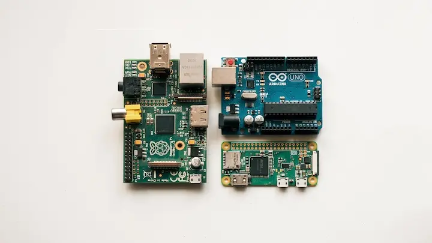
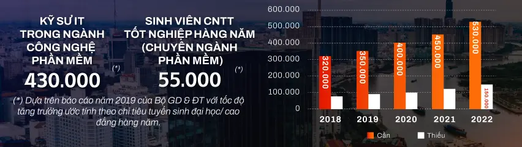
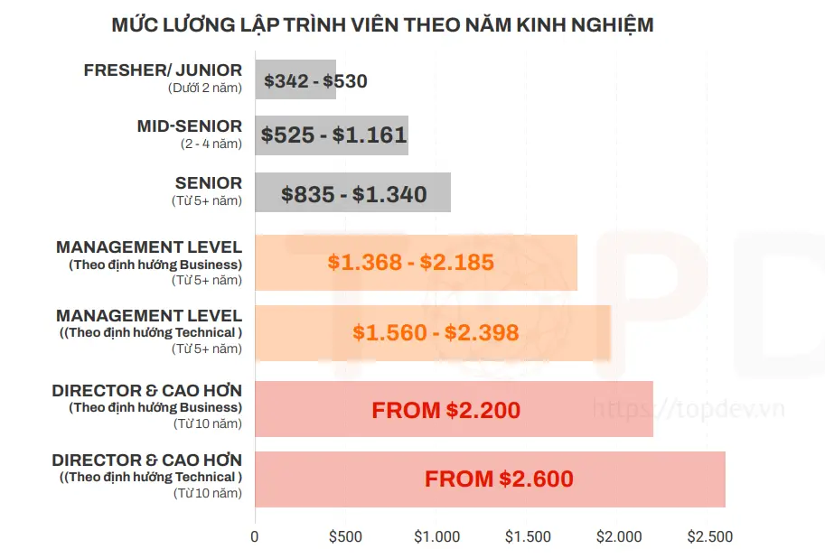
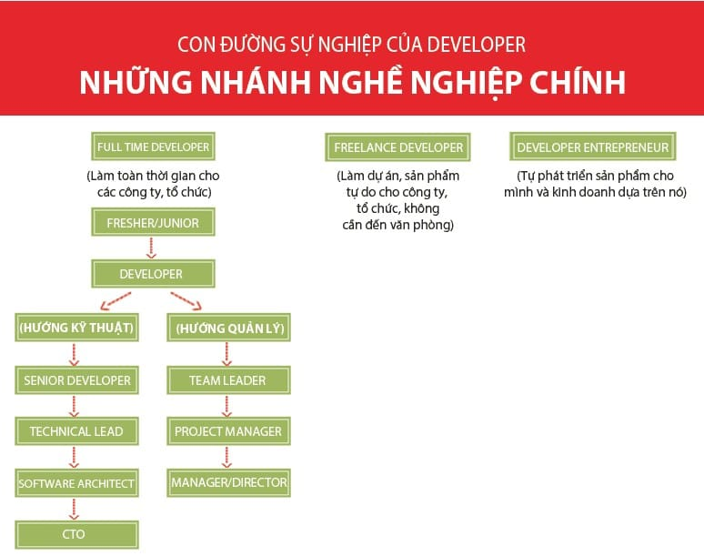

Công nghệ thông tin đang là một trong những ngành học và làm việc hot nhất hiện nay. Số người tham gia vào ngành công nghệ thông tin đang không ngừng gia tăng và những start-up công nghệ đang xuất hiện ngày càng dày đặc.

Với sự phát triển ngày càng mạnh mẽ, vai trò của ngành công nghệ thông tin ngày càng lớn đặc biệt là trong đời sống xã hội. Như trong trận đại dịch COVID-19 những năm gần đây, ngành công nghệ thông tin đã đóng vai trò to lớn trong việc phòng chống dịch: quét mã QR, khai báo y tế điện tử. Ứng dụng truy vết, khoanh vùng nơi có dịch. Tuyên truyền, thông tin chống dịch đến người dân...

## Công nghệ thông tin là gì?

Công nghệ thông tin, viết tắt CNTT, (tiếng Anh: Information technology hay là IT) là một nhánh ngành kỹ thuật sử dụng máy tính và phần mềm máy tính để chuyển đổi, lưu trữ, bảo vệ, xử lý, truyền tải và thu thập thông tin[^wiki_it].

Ở Việt Nam, khái niệm Công nghệ thông tin được hiểu và định nghĩa trong Nghị quyết Chính phủ 49/CP[^nghiquyet_49cp] ký ngày 4/8/1993:

> Công nghệ thông tin là tập hợp các phương pháp khoa học, các phương tiện và công cụ kĩ thuật hiện đại - chủ yếu là kĩ thuật máy tính và viễn thông - nhằm tổ chức khai thác và sử dụng có hiệu quả các nguồn tài nguyên thông tin rất phong phú và tiềm năng trong mọi lĩnh vực hoạt động của con người và xã hội.

## Lập trình viên là ai?

Lập trình viên (tiếng Anh: Programmer) nhiều khi còn được gọi là Developer (gọi tắt Dev) hoặc Coder là người viết ra các chương trình máy tính. Lập trình viên viết các đoạn mã (code) sử dụng ngôn ngữ lập trình (ví dụ: C++, python, Java) để tạo ra các chương trình máy tính này.

Ở Việt Nam, mọi người thường hiểu nhầm rằng: làm trong ngành công nghệ thông tin là phải biết ngôn ngữ lập trình, phải là lập trình viên. Nhưng thực tế không phải vậy, ngành IT khá rộng lớn và có những vị trí không yêu cầu phải biết ngôn ngữ lập trình.

## Làm IT là làm gì?

Nội dung của phần này được tham khảo từ sách [So, You Want to Be a Coder?](https://www.amazon.com/So-You-Want-Coder-Programming/dp/1582705798). Đây là những mảng phổ biến trong ngành công nghệ thông tin. Có thể nó sẽ có vài chỗ không đúng với thị trường Việt Nam hiện nay.

### Lập trình viên hệ thống và ứng dụng

#### Lập trình viên hệ thống

**Lập trình hệ thống** là công việc viết những phần mềm cho hệ thống (máy tính). Lập trình hệ thống nhằm xây dựng những phần mềm phục vụ cho phần cứng (hệ thống) máy tính (ví dụ chương trình chống phân mảnh đĩa cứng). Đòi hỏi phải có những hiểu biết chuyên sâu về phần cứng máy tính.

**Nơi làm việc:**

- Phòng công nghệ thông tin của các công ty.
- Các công ty phần mềm lớn như Microsoft, Oracle, Amazon và Dell.
- Các công ty dịch vụ nhỏ chuyên thiết kế web, game và ứng dụng kinh doanh.
- Các công ty tư vấn cho nhiều khách hàng.
- Các tổ chức như bệnh viện, trường học và đại học, công ty bảo hiểm, sân bay, cửa hàng bán lẻ, công ty sản xuất và chính phủ.
- Bất cứ đâu sản xuất một sản phẩm có chứa vi xử lý.

**Kiến trúc sư hoặc nhà thiết kế hệ thống máy tính**

Vị trí này làm việc chặt chẽ với khách hàng để tìm ra những gì họ cần nhằm điều hành công ty. Mong muốn của họ là có các mạng lưới hệ thống máy tính và ứng dụng tổng thể để đảm bảo khả năng làm việc hòa hợp, trôi chảy và an toàn. Để đảm nhận vị trí này cần thành thạo nhiều ngôn ngữ lập trình và hệ điều hành. Một số công ty tuyển dụng người thiết kế hệ thống song phần lớn họ thuê bên ngoài làm. Khi công việc hoàn tất, phía nhà thầu thường hỗ trợ kỹ thuật thêm từ xa. Không thể trở thành kiến trúc sư hoặc người thiết kế hệ thống ngay từ đầu, mà phải đi lên từ vị trí lập trình viên.

**Lập trình viên hệ thống máy tính**

Vị trí công việc này tạo ra và duy trì hệ điều hành (Linux, Windows, Android,...). Hệ điều hành hoạt động như bộ não của máy tính, hệ điều hành kiểm soát cách máy tính hoạt động. Trong mã của hệ điều hành là các hướng dẫn để máy tính điều khiển ứng dụng phần mềm, lưu trữ dữ liệu, xử lý các mệnh lệnh trong bộ nhớ và tương tác với các máy móc khác nhau như máy in, máy scan hoặc camera. Lập trình viên hệ thống máy tính viết mã bằng các ngôn ngữ lập trình cấp thấp - gọi là _mã máy_ hoặc _hợp ngữ_.

**Tên gọi cho vị trí thiết kế hệ thống máy tính:**

- Kỹ sư thiết kế hệ thống máy tính.
- Kỹ sư hệ thống máy tính.
- Kỹ sư phần mềm máy tính.
- Chuyên gia phân tích hệ thống.

**Công việc của Kiến trúc sư và nhà thiết kế hệ thống máy tính là gì?**

- Gặp gỡ khách hàng để tìm ra nhu cầu của công ty.
- Chọn hệ thống phù hợp nhất với từng khách hàng.
- Viết mã để hệ thống mới có thể làm việc với bất kỳ phần mềm hiện hữu nào.
- Sắp xếp các đợt năng cấp để hệ thống mới được cải thiện mà vẫn hoạt động với càng ít gián đoạn càng tốt.
- Viết các document thân thiện với người dùng.
- Kiểm tra hệ thống nhiều lần để đảm bảo tính hiệu quả của nó.
- Viết mã mới để chỉnh sửa các vấn đề hoặc mở rộng phần mềm đang sử dụng.

#### Lập trình viên ứng dụng

Cũng như lập trình hệ thống, **lập trình ứng dụng** xây dựng những phần mềm phục vụ cho người dùng máy tính. Ví dụ: word, excel, power point... Số lượng lập trình viên ứng dụng đang nhiều hơn so với lập trình viên hệ thống.

Ứng dụng hay còn gọi là _app_ trên thiết bị di động, là các chương trình phần mềm được viết để thực hiện một nhiệm vụ cụ thể. Ứng dụng được cài đặt vào thiết bị và chạy trong hệ điều hành cho đến khi nó bị đóng lại. Thường một thiết bị có thể chạy nhiều ứng dụng cùng một lúc - gọi là đa nhiệm.

**Nhà phát triển phần mềm**

Vị trí này thiết kế và viết phần mềm cho phép người dùng thực hiện nhiều tác vụ đa dạng trên máy tính hoặc điện thoại di động. Một số phát triển các hệ thống ẩn dùng để chạy thiết bị trong khi số khác viết các chương trình sử dụng trên thiết bị đó. Nhiều nhà phát triển phần mềm làm cho các công ty thiết kế hệ thống máy tính, công ty phần mềm hoặc các tập đoàn lớn như _Intel_ hoặc _Google_.

**Nhà phát triền phần mềm làm gì?**

- Tiếp nhận ý tưởng và phân tích như cầu của khách hàng.
- Thiết kế cấu trúc phần mềm để đáp ứng nhu cầu đó.
- Viết phần mềm.
- Thử nghiệm phần mềm (test) nhiều lần và sửa lỗi sai (fix bug).
- Tìm cách tương tác từng chương trình phần mềm với các chương trình khác.
- Lập lưu đồ (flowchart), thiết kế mẫu hay biểu đồ để hướng dẫn các lập trình viên viết mã.
- Duy trì và kiểm tra định kỳ để đảm bảo chương trình hoạt động ổn.
- Ghi chú mọi hoạt động của mình để người khác có thể nắm bắt.

Nhà phát triển phần mềm nhìn được bức tranh toàn cảnh, tức giám sát được việc viết phần mềm từ khi bắt đầu đến lúc kết thúc. Một khi chương trình hoàn tất, họ là người sửa bất kỳ lỗi sai nào xuất hiện, bao gồm việc giúp nó trở nên thân thiện với người dùng hơn.

Khi chương trình được tung ra, họ chịu trách nhiệm viết các bản cập nhật và bảo trì.

**Lập trình viên phần mềm, hay còn gọi là lập trình viên**

Công việc chính của lập trình viên là viết mã. Lập trình viên nhận thiết kế từ nhà phát triển phần mềm và biến nó thành những đoạn mã mà máy tính có thể hiểu được. Hầu hết lập trình viên đều thành thạo một vài ngôn ngữ lập trình. Lập trình viên thường làm việc một hình hoặc theo nhóm nhỏ, một số làm việc từ xa.

**Công việc của lập trình viên:**

- Viết mã cho một chương trình, có thể dùng nhiều loại ngôn ngữ máy tính.
- Giám sát chương trình và viết bản cập nhật để sửa lỗi.
- Viết mã để bổ sung tính năng cho chương trình.
- Viết và sử dụng các công cụ có công dụng tự động hóa một số giai đoạn viết mã.
- Lưu vào thư viện bất cứ dòng mã nào giúp đơn giản hóa các nhiệm vụ cụ thể.

**Các lĩnh vực nghề nghiệp cho lập trình viên:**

- Thiết kế và phát triển web.
- Ứng dụng cho máy tính.
- Game, phim hoạt hình và đồ họa.
- Ứng dụng cho thiết bị di động.
- Ứng dụng khoa học và cơ khí.
- Ứng dụng kinh doanh và giáo dục.

### Lập trình máy tính lớn, lập trình nhúng và phần mềm hệ thống

#### Lập trình máy tính lớn

Máy tính lớn (tiếng Anh: Mainframe) là một loại máy tính thường được sử dụng bởi các công ty, tập đoàn cũng như những tổ chức chính phủ nhằm phục vụ cho các công việc cần xử lí lượng lớn dữ liệu, chẳng hạn như thống kê dữ liệu, lên kế hoạch sử dụng tài nguyên, xử lí giao dịch… Thuở ban đầu, chữ mainframe được người ta dùng để chỉ những thùng máy lớn chứa bộ xử lí và bộ nhớ của những máy tính cỡ lớn. Thế nhưng sau này, khi nhắc tới mainframe, người ta nghĩ đến một cỗ máy to lớn và mạnh mẽ hơn những máy tính cá nhân. Ngoài ra, mainframe còn có tên gọi khác là "Big Iron".

Mainframe có khả năng lấy vào một lượng dữ liệu khổng lồ, tính toán, xử lí và xuất ra kết quả cũng khổng lồ không kém. Mainframe đòi hỏi phải có một sự tương thích ngược chặt chẽ với các phần mềm cũ bởi những công ty, tổ chức lớn sử dụng những phần mềm có tính chuyên biệt cao nên và rất tốn kém nếu phải viết lại. Ngoài ra, mainframe được thiết kế để có thể chạy liên tục (uninterrupt) trong một thời gian rất dài. Đây cũng chính là yếu tố quan trọng nhất của mainframe bởi nó vốn được dùng cho những mục đích mà chỉ cần vài phút hệ thống bị sập là một "thảm họa" sẽ xảy ra, hoặc nếu hệ thống ngừng chạy dù chỉ trong thời gian ngắn thì chi phí để khôi phục hoạt động là cực kì đắt đỏ.

Để có thể tận dụng hết thế mạnh về khả năng xử lí và hoạt động liên tục của mainframe cần đến những kĩ sư được đào tạo chuyên nghiệp và bài bản. Việc bảo trì, lắp đặt mainframe không đơn giản như ráp một bộ máy để bàn ở nhà. Nếu không cẩn thận và làm cho hệ thống bị hư hỏng một phần nào đó thì tất cả lợi thế của mainframe đối với cơ quan, tổ chức sẽ bị mất đi hoàn toàn.

Mainframe có hai loại lập trình viên khác nhau. Lập trình viên ứng dụng sử dụng COBOL, C++ và Java để làm việc với cơ sở dữ liệu và báo cáo. Lập trình viên hệ thống có nhiệm vụ duy trì hệ điều hành và giám sát phần cứng.

#### Lập trình nhúng và phần mềm hệ thống

Internet kết nối vạn vật (IoT: Internet of Things) [^wiki_iot] sẽ không thể hoạt động nếu thiếu các lập trình viên viết mã cho từng thiết bị. Mọi "vật" trong IoT đều có phần mềm được viết riêng. Mã này gọi là phần mềm hệ thống, được tải vào bộ nhớ chỉ đọc (hay bộ nhớ flash) và trở thành một phần của thiết bị. Sau khi được viết, tải vào thiết bị, phầm mềm hệ thống trở thành một phần của hệ thống nhúng. Các hệ thống nhúng được sử dụng mỗi khi có nhiệm vụ nào đó lặp đi lặp lại, các nhiệm vụ này có thể đơn giản hoặc phức tạp.

Hệ thống nhúng có mặt trong máy rửa chén, lò vi sóng, mảy ảnh, máy giặt... Trong những thiết bị này, phần mã không thể lập trình lại. Mã trong những hệ thống khác như: robot trong nhà máy sản xuất, điện thoại di động, hệ thống máy tính trong xe hơi... đều thuộc loại tái lập trình. Nếu các thiết bị này gặp trục trặc, lập trình viên có thể viết lại mã rồi tải lại để xử lý sự cố. Quy trình trên gọi là nâng cấp phần mềm hệ thống.

**Kỹ sư phần mềm nhúng**

Kỹ năng mà các công ty mong muốn:

- Bằng cử nhân hoặc thạc sĩ ngành kỹ sư phần mềm hoặc lĩnh vực liên quan.
- Kinh nghiệm phát triển phần mềm.
- Sử dụng thành thạo ngôn ngữ C và C++.
- Giỏi toán.
- Giỏi gỡ lỗi và giải quyết vấn đề.
- Biết cách làm việc với các hệ thống điều khiển xét duyệt và theo dõi vấn đề.
- Có kỹ năng viết và tổng hợp tài liệu tốt.

**Kỹ sư phần mềm hệ thống**

Kỹ năng mà các công ty mong muốn:

- Bằng cử nhân vật lý, toán học hoặc kỹ sư điện tử.
- Kinh nghiệm lập trình, đặc biết với ngôn ngữ Java, C, C++.
- Kinh nghiệm sử dụng phần mềm quản lý cơ sở dữ liệu.
- Giấy chứng nhận kỹ sư phần mềm hệ thống do một trường uy tín cấp.
- Hiểu biết về hệ điều hành Linux.
- Có khả năng làm việc nhóm.

### Video game

#### Phát triển videogame

Video game chia làm 2 loại. Thứ nhất là loại game lớn, phức tạp (AAA)[^3a_game] thường được chơi trên các máy console hoặc pc. Những game này được một nhóm tạo ra trong khoảng thời gian từ 18 đến 28 tháng. Loại còn lại nhỏ hơn, ít phức tạp hơn và có thể chơi trên các thiết bị di động. Game di động có thể mất từ 3 đến 6 tháng để sản xuất. Dù là game lớn hay nhỏ thì hầu hết đều có quá trình phát triển như nhau.

**Tiền sản xuất**

Đây là giai đoạn game chào đời. Các ý tưởng được sàng lọc cho tới khi chỉ còn một ý tưởng duy nhất được chọn. Với sự hỗ trợ của các họa sĩ và lập trình viên, nhân viên thiết kế phác thảo cốt truyện của game và lên ý tưởng cho các yếu tố đọc nhất vô nhị hoặc thú vị.

Suốt giai đoạn tiền sản xuất, game được chia làm nhiều phần để nhiều nhóm thực hiện như tình tiết, cấu trúc phần mềm và nhân vật. Công việc của mỗi nhóm được tổng hợp thành một vản thiết kế dùng để tạo ra nguyên mẫu game. Trong quá trình tạo nguyên mẫu, một số thiết kế sẽ được xem lại. Các nguyên mẫu cũng được dùng để "chào hàng" với các nhà sản xuất và tìm kiếm thêm nguồn đầu tư. Sau khi nguyên mẫu hoàn tất, giai đoạn sản xuất bắt đầu.

**Sản xuất**

Trong giai đoạn này, gane được phát triển và hoàn thiện dần. Đây là khoảng thời gian đồi hỏi sự hợp tác chặt chẽ. Các nhóm thiết kế, họa sĩ và lập trình viên sử dụng nguyên mẫu và bản thiết kế để làm hướng dẫn cho ra bản game cuối cùng.

Nhà thiết kế quyết định tiến triển của game, như mỗi cấp có những gì hay các nhân vật được làm gì và không được làm gì. Họa sĩ cho ra các bản vẽ thể hiện các thành phần khác nhau trong game như nhân vật chính, phong cảnh, bản đồ, xe cộ, vũ khí hay công cụ và quái vật - mấy tên xấu xa 😈. Lập trình viên xây dựng bộ khung phần mềm cho game, bao gồm cách tương tác với nhau giữa các thành phần game cũng như thể hiện các yếu tố trực quan.

Trong giai đoạn sản xuất, game trải qua nhiều khâu xem xét, cứ mỗi khâu lại được cải thiện về thiết kế, độ hoàn thiện và chất lượng so với bản trước đó. Giai đoạn sản xuất kết thúc khi nhạc và hiệu ứng âm thanh được chèn vào. Mốc phát triển này thường được ăn mừng và gọi là "Hoàn tất nội dung".

**Hậu sản xuất**

Đây là giai đoạn game được chơi thử nghiệm. Những người thử game sẽ "soi" lỗi, ghi lại và chuyển cho lập trình viên để chỉnh sửa. Họ cũng phát hiện những điểm mâu thuẫn trong game hoặc lỗi về nội dung, nhân vật, cốt truyện... Riêng bộ phận kiểm soát chất lượng lường trước những hành động bất ngờ của người chơi mà đội ngữ sản xuất không để ý đến. Chỉnh sửa hết những vấn đề này có thể mất rất nhiều thời gian, đặc biệt là đối với các game lớn và phức tạp. Khi lỗi được chỉnh sửa hết cũng là lúc game được ra mắt. Sau khi phát hành, các game thủ thường báo lỗi mà họ gặp phải. Những lỗi này sẽ được sửa thông qua bản vá hoặc cập nhật. Nếu game được yêu thích, nhiều khả năng nó sẽ được mở rộng và nhóm sản xuất sẽ có thêm việc đẻ làm.

#### Các đầu việc trong phát triển video game

Những người phát triển game biết thiết kế game, viết code và làm đồ họa. Tùy thuộc vào quy mô của game và của công ty mà người thiết kế đẩm trách một hoặc tất cả vai trò kể trên. Với những game lớn do các công ty lớn ra lò, phần thiết kế sẽ do một nhóm nhiều người phụ trách. Mục tiêu chính của người thiết kế là tạo ra phiên bản video game tốt nhất có thể.

Người thiết kế game thường là những người mộng mơ, có trí tưởng tượng phong phú. Thường làm việc cá nhân hoặc theo nhóm, người thiết kế game nảy ra các ý tưởng về cốt truyện, nhân vật và cách chơi. Sau khi ý tưởng được tập hợp, cả nhóm họp lại để chọn ra ý tưởng tốt nhất. Trong quá trình sản xuất, người thiết kế làm việc với các lập trình viên và họa sĩ để đảm bảo các yếu tố thiết kế của họ được chuyển tải xuyên suốt trong game. Người thiết kế theo sát công việc của lập trình viên bằng cách xem nguyên mẫu của game. Nếu thấy cần chỉnh sửa gì đó, người thiết kế cũng tham gia.

**Một số vị trí dành cho người thiết kế game:**

- **Thiết kế trưởng**: chịu trách nhiệm tập hợp và sắp xếp ý tưởng cho bản thiết kế. Quản lý khối lượng công việc và thời gian biểu của từng thành viên trong nhóm. Ghi lại tiến độ, giải quyết khúc mắc và đảm bảo việc sản xuất game đúng kế hoạch.
- **Thiết kế nội dung**: tạo ra những nút thắt, kịch tính cho cốt truyện cũng như cho ra đời các nhân vật thú vị, độc đáo. Chịu trách nhiệm về tính nhất quán trong thế giới game.
- **Thiết kế cơ học**: tập trung vào các luật chơi và cơ chế hoạt động trong game. Quyết định cách các nhân vật tương tác với nhau và tương tác với môi trường. Các nhân vật lấy vật phẩm, phát triển kỹ năng và thăng cấp như thế nào đều nằm trong tay bộ phần thiết kế này.
- **Thiết kế cấp độ**: tạo ra môi trường mà các nhân vật tương tác. Chọn các đối tượng và nhân vật có khả năng thu hút người chơi game. Ví dụ, game kinh dị thường có gam màu tối, nhiều nơi ẩn nấp. Game cho trẻ em sẽ có màu sắc tươi sáng, có nhiều cây cối, cầu vồng,... Các nhà thiết kế cấp độ cũng xác định nơi đặt các đối tượng và đối thủ ở mỗi cấp.
- **Viết lời thoại**: Tạo ra lời thoại, hình thành tính cách cho từng nhân vật. Trong các game nhập vai, người viết thoại đóng vai trò quan trọng trong việc tạo ra tương tác chân thật giữa các nhân vật. Game giải đố hay mê cung thường sẽ không cần vị trí này.

**Lập trình viên**

Lập trình viên là người đưa những bản vẽ từ người thiết kế thành hiện thực bằng những dòng code. Lập trình viên có thể sử dụng nhiều ngôn ngữ khác nhau dựa vào yêu cầu của video game đó. Ví dụ: game trên điện thoại sẽ viết bằng ngôn ngữ khác so với game trên máy tính.

**Lập trình viên làm việc ở các vị trí sau:**

- **Lập trình viên trưởng**: Phân công công việc và bảo đảm kế hoạch. Là các lập trình viên giỏi nhưng dành nhiều thời gian để giám sát các lập trình viên khác.
- **Lập trình viên công cụ game**: Thiết kế các đoạn mã nền cho game, có thể bao gồm phát triển đồ họa và thiết kế game engine[^wiki_game_engine]. Thưởng sử dụng ngôn ngữ lập trình cấp thấp để chương trình chạy nhanh và hiệu quả hơn. Vị trí này đòi hỏi kỹ năng, kỹ thuật lập trình cao.
- **Lập trình viên AI**: Lập trình bộ não cho các nhân vật trong game. Cách các nhân vật tương tác với nhau, tương tác với môi trường sao cho chân thật nhất.
- **Lập trình viên đồ họa**: Tạo ra các công cụ cho phép họa sĩ "vẽ" trên màn hình. Sử dụng toán học để viết ra các thuật toán cho đồ hoạ 2-D và 3-D. Vị trí này thường làm việc chung với các họa sĩ.
- **Lập trình viên mạng**: Giúp game thủ có thể chơi trực tuyến. Công việc của lập trình viên mạng thường tập trung vào bảo mật internet và phòng chống gian lận trong game.
- **Lập trình viên vật lý**: Viết mã xác định cách vận động của các đối tượng trong game. Tuân theo các định luật vật lý do nhà thiết kế game tạo ra. Ví dụ: một nhân vật trong thế giới game nhảy cao được bao nhiêu? Xe trượng trên đường đóng băng bao xa?...

**Họa sĩ**

Họa sĩ là người thiết kế hình hài cho game, từ môi trường, nhân vật đến mọi đối tượng trong game. Họa sĩ thiết kế cả ảnh bìa và tài liệu hướng dẫn chơi game. Họa sĩ có thể vẽ chì, vẽ trên máy tính, phác thảo hoặc nhiều cách khác nhau để phác họa ý tưởng cho game. Tạo ra các mô hình, định hình chuyển động của các nhân vật và đối tượng.

**Nhân viên âm thanh**

Nhân viên âm thanh có nhiệm vụ phát triển, ghi âm và xử lý tất cả âm thanh trong game, bao gồm âm nhạc, đối thoại và các tiếng động như nước chảy, chim kêu hay một tòa tháp đổ sập xuống đất. Những người phụ trách âm thanh bao gồm nhà thiết kế âm thanh, kỹ sư âm thanh, lập trình viên âm thanh cũng như nhạc sĩ.

### Lập trình web

Website là một tập hợp các trang thông tin có chứa nội dung dạng văn bản, chữ số, âm thanh, hình ảnh, video, v.v... được lưu trữ trên máy chủ (web server) và có thể truy cập từ xa thông qua mạng Internet.

Ở Việt Nam, website thường được gọi với tên là "trang thông tin điện tử", được định nghĩa trong Nghị định Chính phủ 72/2013/NĐ-CP ngày 15/07/2013[^nghidinh_2]:

> Trang thông tin điện tử (website) là hệ thống thông tin dùng để thiết lập một hoặc nhiều trang thông tin được trình bày dưới dạng ký hiệu, số, chữ viết, hình ảnh, âm thanh và các dạng thông tin khác phục vụ cho việc cung cấp và sử dụng thông tin trên Internet.

Với sự phát triển chóng mặt của công nghệ, hiện nay đã có nhiều công cụ giúp cho người dùng có thể tạo nên một trang web mà không cần đụng đến một dòng code nào. Từ blog, website giới thiệu, thương mại điện tử... đều có thể tạo ra bằng vài cú click. Một số công cụ nổi tiếng: wordpress, shopify, wix.

**Những vị trí lập trình web:**

- **Lập trình viên Front-End**: Lập trình viên Front-End chịu trách nhiệm cho giao diện của một trang web và trải nghiệm sử dụng của người dùng. Thường sử dụng 3 ngôn ngữ lập trình chính là HTML, CSS và JavaScript.
- **Lập trình viên Back-End**: Lập trình viên Back-End làm việc với máy chủ, ứng dụng và cơ sở dữ liệu. Thường là các phần mà người dùng không nhìn thấy được, nhưng luôn chạy trên web, cung cấp chức năng và trải nghiệp đến tất cả người dùng.
- **Lập trình viên Full-Stack**: Làm việc ở cả front-end và back-end. Yêu cầu trình độ hiểu biết sâu và rộng, lập trình viên ở mảng này có số lượng cực kỳ ít.

### Trí tuệ nhân tạo và robot

#### Trí tuệ nhân tạo

Trí tuệ nhân tạo hay trí thông minh nhân tạo (Artificial intelligence - viết tắt là AI) là một ngành thuộc lĩnh vực khoa học máy tính (Computer science). Công nghệ AI là công nghệ mô phỏng các quá trình suy nghĩ và học tập của con người cho máy móc, đặc biệt là các hệ thống máy tính. Các quá trình này bao gồm việc học tập (thu thập thông tin và các quy tắc sử dụng thông tin), lập luận (sử dụng các quy tắc để đạt được kết luận gần đúng hoặc xác định) và tự sửa lỗi.

**Lập trình viên _AI_ làm những công việc sau:**

- Viết phần mềm nhận biết giọng nói, nhận biết chữ viết, nhận biết hình ảnh, đối tượng...
- Dạy máy suy nghĩ như người.
- Làm việc với robot, tức máy móc đủ thông minh để di chuyển xung quanh, thực hiện các nhiệm vụ và cầm nắm đồ vật.
- Làm việc với các tổ chức tài chính có sử dụng _AI_ để đầu tư và theo dõi các loại tài sản.
- Hỗ trợ trong y học, giúp chẩn đoán bệnh, kê đơn thuốc...
- Hệ thống gợi ý khi mua sắm online, gợi ý tìm kiếm như google.

#### Robot

Robot hoặc Rôbốt, Rô-bô , Người máy (tiếng Anh: Robot) là một loại máy có thể thực hiện những công việc một cách tự động bằng sự điều khiển của máy tính hoặc các vi mạch điện tử được lập trình. Robot là một tác nhân cơ khí, nhân tạo, ảo, thường là một hệ thống cơ khí-điện tử. [^wiki_robot]

Từ ngữ "robot" thường được hiểu với hai nghĩa: robot cơ khí và phần mềm tự hoạt động. Do sự đa dạng mức độ tự động của hệ thống cơ-điện tử mà ranh giới phân chia robot với phần còn lại không được rõ ràng, thể hiện ở quan niệm về định nghĩa robot. Về lĩnh vực Robot, Mỹ và Nhật Bản là những nước đi đầu thế giới về lĩnh vực này.

Kỹ sư robot thiết kế và bảo trì robot, phát triển những các thức mới để sử dụng chúng và nghiên cứu nhằm mở rộng giới hạn khả năng của robot. Biết cách viết mã cho robot theo từng lĩnh vực nghề nghiệp cụ thể là điều rất quan trọng.

**Một số lĩnh vực sử dụng robot:**

1. Nông nghiệp: robot dùng để thu hoạch mùa màng, robot dùng để tưới cây, phun thuốc...
2. Xe hơi: robot lắp gáp xe hơi, kiểm tra xem bộ phận có đạt chuẩn không và hàn các bộ phận lại.
3. Xây dựng: robot cắt, chất đống, đóng gói, xếp vật liệu.
4. Giải trí: robot được dùng làm đồ chơi, thậm chí là thú cưng.
5. Chăm sóc sức khỏe: robot chăm sóc bệnh nhân, phát thuốc và phụ mổ.
6. Thực thi pháp luật và quân sự: robot tuần tra các khu vực nguy hiểm, vô hiệu hóa bom mìn, làm nhiệm vụ do thám, tham gia giải cứu con tin và đưa người bị thương ra khói các hiện trường nguy hiểm.
7. Sản xuất: robot đảm nhận những công việc lặp đi lặp lại, như đóng gói, sơn và lắp ráp.
8. Kho hàng: robot thực hiện hầu hết việc sắp xếp hàng hóa nhằm không để công nhân bị thương.
9. Thám hiểm không gian: robot làm việc trong không gian, trên quỹ đạo các hành tinh và thậm chí là trên sao Hỏa.

### An ninh mạng

An ninh mạng (cybersecurity), an ninh máy tính (computer security), bảo mật công nghệ thông tin (IT security) là việc bảo vệ hệ thống mạng máy tính khỏi các hành vi trộm cắp hoặc làm tổn hại đến phần cứng, phần mềm và các dữ liệu, cũng như các nguyên nhân dẫn đến sự gián đoạn, chuyển lệch hướng của các dịch vụ hiện đang được được cung cấp.[^wiki_security]

An ninh mạng là thực tiễn của việc bảo vệ các hệ thống điện tử, mạng lưới, máy tính, thiết bị di động, chương trình và dữ liệu khỏi những cuộc tấn công kỹ thuật số độc hại có chủ đích. Tội phạm mạng có thể triển khai một loạt các cuộc tấn công chống lại các nạn nhân hoặc doanh nghiệp đơn lẻ; có thể kể đến như truy cập, làm thay đổi hoặc xóa bỏ dữ liệu nhạy cảm; tống tiền; can thiệp vào các quy trình kinh doanh.

An ninh mạng hoạt động thông qua một cơ sở hạ tầng chặt chẽ, được chia thành ba phần chính:

- **Bảo mật công nghệ thông tin**: Bảo vệ dữ liệu ở nơi chúng được lưu trữ và cả khi các dữ liệu này di chuyển trên các mạng lưới thông tin. Trong khi an ninh mạng chỉ bảo vệ dữ liệu số, bảo mật công nghệ thông tin nắm trong tay trọng trách bảo vệ cả dữ liệu kỹ thuật số lẫn dữ liệu vật lý khỏi những kẻ xâm nhập trái phép.
- **An ninh mạng**: Là một tập hợp con của bảo mật công nghệ thông tin. An ninh mạng thực hiện nhiệm vụ đảm bảo dữ liệu kỹ thuật số trên các mạng lưới, máy tính và thiết bị cá nhân nằm ngoài sự truy cập, tấn công và phá hủy bất hợp pháp.
- **An ninh máy tính**: Là một tập hợp con của an ninh mạng. Loại bảo mật này sử dụng phần cứng và phần mềm để bảo vệ bất kỳ dữ liệu nào được gửi từ máy tính cá nhân hoặc các thiết bị khác đến hệ thống mạng lưới thông tin. An ninh máy tính thực hiện chức năng bảo vệ cơ sở hạ tầng công nghệ thông tin và chống lại các dữ liệu bị chặn, bị thay đổi hoặc đánh cắp bởi tội phạm mạng.

Nhân sự làm việc trong mảng an ninh mạng có thể được chia thành 3 dạng sau:

- **Hacker mũ trắng** (White-hat hacker) – cũng còn gọi là "ethical hacker" (hacker có nguyên tắc/đạo đức) hay penetration tester (người xâm nhập thử ngiệm vào hệ thống). Hacker mũ trắng là những chuyên gia công nghệ làm nhiệm vụ xâm nhập thử nghiệm vào hệ thống công nghệ thông tin để tìm ra lỗ hổng, từ đó yêu cầu người chủ hệ thống phải vá lỗi hệ thống để phòng ngừa các xâm nhập khác sau này với ý đồ xấu (thường là của các hacker mũ đen).
- **Hacker mũ đen** (Black-hat hacker): là các chuyên gia công nghệ xâm nhập vào hệ thống với mục đích xấu như đánh cắp thông tin, phá hủy hệ thống, làm lây nhiễm các phần mềm độc hại cũng như các hành vị phá hoại mạng máy tính vi phạm pháp luật khác.
- **Hacker mũ xám** (Grey-hat hacker): là các chuyên gia công nghệ có thể vừa làm công nghệ của cả hacker mũ trắng và mũ đen.

## Vì sao ngành IT hot?

### 1. Nhu cầu tuyển dụng nhân lực cao

Thống kê từ TopDev[^topdev] cho thấy nhu cầu nhân lực CNTT tăng nhưng thị trường lao động lĩnh vực này tại Việt Nam luôn trong tình trạng thiếu hụt về cả số lượng và chất lượng. Năm 2021, số lượng nhân lực CNTT cần là 500.000 người và thiếu hụt 190.000 người.

Phân tích dữ liệu (Big Data), trí tuệ nhân tạo (AI), an toàn thông tin, blockchain... là những công nghệ mới mà hiện nay nhiều công ty bắt đầu nghiên cứu và hiện đang rất thiếu nhân lực chất lượng cao. Đặc biệt là lĩnh vực an toàn thông tin, các trường đại học ở Việt Nam gần như đào tạo không đáp ứng được yêu cầu về kỹ năng và chuyên môn, nên nhiều tập đoàn lớn phải tuyển nguồn từ nước ngoài.

### 2. Mức lương hấp dẫn

Dải lương phổ biến của ngành CNTT là từ 8,4 triệu đồng đến 27,4 triệu đồng. Tùy theo chính sách ở các doanh nghiệp khác nhau, con số này có thể thay đổi. Với những sinh viên mới tốt nghiệp chuyên ngành CNTT, lương cơ bản nằm trong khoảng 7 - 10 triệu đồng/tháng. Những người 1 - 2 năm kinh nghiệm sẽ nhận lương mỗi tháng khoảng 10 - 15 triệu đồng. Con số này có thể lên hơn 20 triệu đồng nếu có tối thiểu 3 năm kinh nghiệm và kỹ năng chuyên sâu, đa dạng.

Một thống kê của TopDev về thị trường IT Việt Nam tính đến quý II/2021 cho thấy kỹ sư trí tuệ nhân tạo (AI) và học máy (machine learning) có mức lương trung bình tháng cao nhất, khoảng 70 triệu đồng. Mức này cao gấp đôi lương kỹ sư dữ liệu lớn (Big Data) và kỹ sư Backend hay lập trình viên (trung bình 30 triệu đồng mỗi tháng). 6 trong số 10 vị trí IT có lương tháng cao nhất thuộc về các cấp quản lý và kiến trúc sư công nghệ. Vị trí có lương trung bình tháng cao nhất hiện nay là CTO, CIO, khoảng 5.776 USD (khoảng 132 triệu đồng).

### 3. Thăng tiến nhanh

Ngành công nghệ thường được triển hai theo dự án. Vì vậy, sau mỗi dự án được hoàn thành, người quản lý có thể đánh giá được năng lực và xem xét khả năng thăng tiến của nhân viên. Do đó, nhân viên trong ngành IT có thể thăng tiến rất nhanh chỉ sau 6 tháng đến một năm nếu chịu khó học hỏi, tiếp thu những kiến thức, công nghệ mới.

## Đôi lời của tác giả

Mình hiện tại đang học đại học năm 3. Có thể nói ngành của mình học về công nghệ thông tin chậm hơn so với các ngành khác. Nhưng qua thời gian khảo sát và học hỏi thì mình thấy ngành IT này không phụ thuộc lắm vào những kiến thức ở trường đại học, mà đa số những kiến thức mình có được đều qua việc tự học trên mạng. Phần lớn các bạn sinh viên học IT mà mình quen biết đều rất phụ thuộc vào phần kiến thức được dạy trên trường - những kiến thức đã cũ, có những môn học còn đem tài liệu 10 năm về trước ra dạy. Các bạn ấy đều đi học với tâm thế là dạy đến đâu, học đến đó, chỉ cần qua môn, tốt nghiệp là sẽ đi làm được thì sớm muộn gì cũng vỡ mộng. Có thể là do lúc thi đại học,
do không biết chọn trường gì, ngành nào mà chọn bừa những ngành hot nhất, hoặc do nghe những người đi trước nói ngành IT nhàn, ra làm lương nghìn đô 💵... Đúng là lương nghìn đô thật nhưng chỉ những người thật sự có kĩ năng, chuyên môn, tâm huyết với ngành của mình mới có thể đặt được mức lương đó một cách dễ dàng.

Vì những nguyên do đó, mình viết ra series này để những bạn sắp bước chân vào môi trường đại học hoặc các bạn sinh viên vẫn chưa biết con đường mình chọn có đúng không, có cái nhìn rộng hơn về ngành IT. Từ đó có thể đưa ra những kế hoạch phù hợp hơn cho mình.

## Tái bút

Xin chào, cảm ơn bạn đã đọc đến cuối bài viết 😁. Đây là lần đầu tiên mình viết một series dài như thế này, có thể sẽ có những chỗ không vừa ý với bạn đọc đây. Những kiến thức trong bài đều là sự hiểu biết của mình và một số nguồn kham khảo khác, khó có thể nào mà không mắc sai sót được. Nếu bạn đọc phát hiện ra chỗ nào có thông tin sai hoặc không vừa ý thì cho mình biết vào phần comment nhé ヾ(≧▽≦\*)o.

[^topdev]: [Topdev](https://topdev.vn/), trang tuyển dụng IT
[^nghiquyet_49cp]: [Nghị quyết số 49/CP](https://thuvienphapluat.vn/van-ban/Cong-nghe-thong-tin/Nghi-quyet-49-CP-phat-trien-cong-nghe-thong-tin-o-nuoc-ta-trong-nhung-nam-90-38659.aspx) về phát triển công nghệ thông tin ở nước ta trong những năm 90 do chính phủ ban hành
[^nghidinh_2]: [Nghị định 72/2013/NĐ-CP](https://thuvienphapluat.vn/van-ban/Cong-nghe-thong-tin/Nghi-dinh-72-2013-ND-CP-quan-ly-cung-cap-su-dung-dich-vu-Internet-va-thong-tin-tren-mang-201110.aspx) về quản lý, cung cấp, sử dụng dịch vụ internet và thông tin trên mạng
[^wiki_it]: [Wikipedia - Công nghệ thông tin](https://vi.wikipedia.org/wiki/C%C3%B4ng_ngh%E1%BB%87_th%C3%B4ng_tin)
[^wiki_iot]: [Wikipedia - Internet kết nối Vạn Vật](https://vi.wikipedia.org/wiki/Internet_V%E1%BA%A1n_V%E1%BA%ADt)
[^3a_game]: [Wikipedia - AAA video game](<https://vi.wikipedia.org/wiki/AAA_(c%C3%B4ng_nghi%E1%BB%87p_tr%C3%B2_ch%C6%A1i_%C4%91i%E1%BB%87n_t%E1%BB%AD)>)
[^wiki_game_engine]: [Wikipedia - Game engine](https://vi.wikipedia.org/wiki/Game_engine)
[^wiki_robot]: [Wikipedia - Robot](https://vi.wikipedia.org/wiki/Robot)
[^wiki_security]: [Wikipedia - An ninh mạng](https://vi.wikipedia.org/wiki/An_ninh_m%E1%BA%A1ng)
