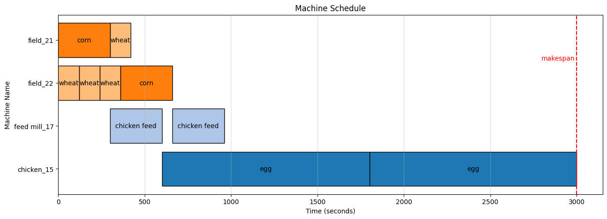

It's has beed a long time since my last post. I was researching the scheduling problem in the Hay Day game for a while. And now is the good time to share the result with you.

## What is Hay Day?

Hay Day is a popular mobile game created by Supercell in 2012. It is a farming simulator where you can plant crops and trees, raise animals, sell products, compete in derbies, and so much more. Hay Day is a freemium game so all features of the game are open to players who choose not to buy in-app-purchases.

<iframe class="mx-auto aspect-video w-full" src="https://www.youtube.com/embed/mSev84nF1HA?si=mqU5IAwLBnhXcOGV" title="YouTube video player" frameborder="0" allow="accelerometer; autoplay; clipboard-write; encrypted-media; gyroscope; picture-in-picture; web-share" referrerpolicy="strict-origin-when-cross-origin" allowfullscreen></iframe>

In Hay Day, your main job is to make products based on the orders that you receive from the customers. When you complete the order, you will get coins and experience points. The orders are combine of products that you can make in the game. The orders are generated randomly and you can choose to accept or decline them.


To make products in the game, you need two main resources: goods (or product) and machine. Each goods has a production time, a machine that can produce it and goods that are required to make it. For example, to make a _chicken feed_, you need _2 wheat_ and _1 corn_. The production time of a _chicken feed_ is _5 minutes_ and it can be made in the _feed mill_.

For a deep dive into the game, you can check out the [Hay Day Wiki](https://hayday.fandom.com/wiki/Hay_Day_Wiki).


## The problem

Hay Day is a really easy game, at least when I started playing. Wheat is planted, gathered, and sold. Alternately, you may use wheat to produce and sell bread. However, as the game progresses, you will acquire additional machines, goods, and orders.


As you can see, just in level 20 of the game, we have 40 goods and 10 machines. The permutation of the goods and machines is huge. At this point, the scheduling issue arises.

So what do we want to solve here? Let clarify the problem:

- An order is a set of goods that need to be made.
- A machine can only produce one goods at a time.
- A machine can only produce a goods if it has all the required goods.
- A goods can only be produced on a specific machine.

Our target:

- Given a set of orders, find a schedule that optimize the **makespan** of the orders.
- The makespan is the time between the start of the first order and the end of the last order.

A simple scheduling to make a order with two egg will look like this:



But in reality, the scheduling is more complex. Here is the image showing the scheduling of 2 orders with 4 goods:


Specifically, our problem is a **Flexible Job Shop Scheduling Problem (FJSP)**. The Flexible Job Shop Scheduling Problem is a variations of the [Job-shop scheduling problem (JSSP)](https://en.wikipedia.org/wiki/Job-shop_scheduling).

The JSSP can be formulated as follows:

- For $n$ jobs, each one is composed of several operations that must be executed on $m$ machines. For each operation uses only one machine for a fixed duration.
- Each machine can process at most one operation at a time and once an operation starts processing on a given machine, it must complete processing on that same machine without any interruption.
- The operations of a given job have to be processed in a given set of order.
- The problem’s main aim is to schedule the activities or operations of the jobs on the machines such that the total time to finish all jobs, that is the makespan, is minimized.

The term makespan refers to the cumulative time to complete all the operations of all jobs on all machines. It is a measure of the time period from the starting time of the first operation to the ending time of the last operation. Sometimes there may be multiple solutions that have the minimum makespan, but the goal is to find out any one of them: it is not necessary to find all possible optimum solutions

## Solution

So how can we solve this problem? There are many algorithms that can be used to solve the FJSP. Some of them are: Genetic Algorithm, Annealing
,Tabu Search
,Ant Colony Optimization

But I'm a math lover, so I choose to use **Mixed-integer linear programming** (MILP) to solve this problem. MILP is a mathematical optimization or feasibility program in which some or all of the variables are restricted to be integers. In many settings, the term refers to integer linear programming (ILP), in which the objective function and the constraints (other than the integer constraints) are linear.

Let's break down the mathematical formulation behind the FJSP problem:

**Problem Definition**

We have a set of tasks $T=\{1,2,...,n\}$ that need to be scheduled on a set of machines $M=\{1,2,…,m\}$. Each task $t \in T$ has a duration $d t$ ​ and can be assigned to one or more machines. Additionally, tasks may have dependencies such that a task $t$ can only start after another task $t'$ finishes.

**Variables**

- $S_t$: The start time of task $t$.
- $E_t$: The end time of task $t$.
- $I_t$: The interval during which task $t$ is executed. This can be represented as a tuple $(S_t, d_t, E_t)$.
- $M_t$: The machine on which task $t$ is scheduled.

**Constraints**

- $E_t = S_t + d_t, \quad \forall t \in T$.
- For tasks $t_1$ and $t_2$ assigned to the same machine, either $E_{t_1} \leq S_{t_2}$ or $E_{t_2} \leq S_{t_1}$.
- If task $t$ depends on task $t'$, then $S_t \geq E_{t'}$.
- Each task must be assigned to one of its allowable machines

**Objective**

The objective is to minimize the makespan, which is the total time required to complete all tasks. Mathematically, this can be formulated as minimizing the maximum of all end times:

$
\text{Minimize} \quad \max_{t \in T} E_t 
$

## Let code

I will use the Google OR-Tools to solve the FJSP problem. OR-Tools is an open-source, fast, and portable software suite for solving combinatorial optimization problems. It is a powerful tool that can be used to solve a wide range of optimization problems.

First, we need to import the necessary libraries and load the task data from a JSON file. OR-Tools provides a powerful constraint programming solver, which is well-suited for solving our scheduling problem.

```py
from ortools.sat.python import cp_model
import collections
import json

class SolutionPrinter(cp_model.CpSolverSolutionCallback):
    """Print intermediate solutions."""

    def __init__(self):
        cp_model.CpSolverSolutionCallback.__init__(self)
        self.__solution_count = 0

    def on_solution_callback(self):
        """Called at each new solution."""
        print(
            "Solution %i, time = %f s, objective = %i"
            % (self.__solution_count, self.wall_time(), self.ObjectiveValue())
        )
        self.__solution_count += 1
```

The **\`SolutionPrinter\`** class is a callback that prints each solution found by the solver. This helps in understanding the progress of the solver and the quality of solutions.

Next, we load the task data and define the structure for tasks and machines.

```py
task_type = collections.namedtuple("task_type", "start end interval machine")

data = json.load(open("./data/hayday_tasks.json"))
source_id = data["machine"]
machine_len = sum(len(source_id[machine_id]) for machine_id in source_id)
tasks = data["tasks"]

duration = {task['id']: task['duration'] for task in tasks}
horizon = sum(task['duration'] for task in tasks)
times = range(horizon)
```

Here, **\`horizon\`** represents the maximum possible time required to complete all tasks, assuming they are executed sequentially.

We create a CP model and initialize variables for each task, including start time, end time, interval, and machine assignment.

```py
model = cp_model.CpModel()

all_tasks = {}
intervals_per_resources = collections.defaultdict(list)

for task in tasks:
    start_var = model.NewIntVar(0, horizon, 'start_%i' % task['id'])
    end_var = model.NewIntVar(0, horizon, 'end_%i' % task['id'])
    interval_var = model.NewIntervalVar(start_var, duration[task['id']], end_var, 'interval_%i' % task['id'])
    machine_var = model.NewIntVarFromDomain(cp_model.Domain.FromValues(task['machine']), 'machine_%i' % task['id'])
    all_tasks[task['id']] = task_type(
        start=start_var, end=end_var, interval=interval_var, machine=machine_var,
    )
```

For tasks that can run on multiple machines, we create optional intervals and presence variables to handle the flexibility.

```py
    if len(task['machine']) == 1:
        intervals_per_resources[task['machine'][0]].append(interval_var)
    else:
        l_presences = []
        for machine_id in task['machine']:
            l_presence = model.NewBoolVar('presence_%i_%i' % (task['id'], machine_id))
            l_start = model.NewIntVar(0, horizon, 'start_%i_%i' % (task['id'], machine_id))
            l_end = model.NewIntVar(0, horizon, 'end_%i_%i' % (task['id'], machine_id))
            l_interval = model.NewOptionalIntervalVar(l_start, duration[task['id']], l_end, l_presence, 'interval_%i_%i' % (task['id'], machine_id))
            l_presences.append(l_presence)

            model.Add(start_var == l_start).OnlyEnforceIf(l_presence)
            model.Add(end_var == l_end).OnlyEnforceIf(l_presence)
            model.Add(machine_var == machine_id).OnlyEnforceIf(l_presence)

            intervals_per_resources[machine_id].append(l_interval)
        model.AddExactlyOne(l_presences)
```

We add constraints to ensure that tasks do not overlap on the same machine and that dependencies are respected.

```py
for machine_id in range(1, machine_len + 1):
    intervals = intervals_per_resources[machine_id]
    if len(intervals) > 1:
        model.AddNoOverlap(intervals)

for task in tasks:
    for dependency in task['dependent']:
        model.Add(all_tasks[task['id']].start >= all_tasks[dependency].end)
```

The objective is to minimize the makespan, represented by the maximum end time of all tasks.

```py
obj_var = model.NewIntVar(0, horizon, 'makespan')
model.AddMaxEquality(obj_var, [all_tasks[task['id']].end for task in tasks])
model.Minimize(obj_var)
```

Finally, we solve the model and print the solution status and statistics.

```py
solver = cp_model.CpSolver()
solver.parameters.max_time_in_seconds = 60
solution_printer = SolutionPrinter()
status = solver.Solve(model, solution_printer)
print()
print("Solve status: %s" % solver.StatusName(status))
print("Optimal objective value: %i" % solver.ObjectiveValue())
print("Statistics")
print("  - Conflicts : %i" % solver.NumConflicts())
print("  - Branches  : %i" % solver.NumBranches())
print("  - Wall time : %f s" % solver.WallTime())
```

After running the code, the solver finds multiple solutions, progressively improving the objective value (makespan) with each solution:

```
Solution 0, time = 0.070021 s, objective = 18720
Solution 1, time = 0.072630 s, objective = 12780
Solution 2, time = 0.088733 s, objective = 12779
Solution 3, time = 0.089533 s, objective = 12661
Solution 4, time = 0.094715 s, objective = 12600
Solution 5, time = 0.110961 s, objective = 12000
Solution 6, time = 0.133855 s, objective = 11701
Solution 7, time = 0.141637 s, objective = 11700
Solution 8, time = 0.142342 s, objective = 11280
Solution 9, time = 0.182769 s, objective = 11161
Solution 10, time = 0.206984 s, objective = 10200

solve status: OPTIMAL
Optimal objective value: 10200
Statistics
  - conflicts : 0
  - branches  : 710
  - wall time : 0.243868 s
```

For the complete code and data, please visit my [GitHub repository](https://github.com/Th1nhNg0/hayday). Feel free to explore and adapt it for your scheduling needs!

And that it! Very simple, right? Despite this is a NP-hard problem, we can solve it with a simple code.

## Conclusion

In this post, we explored the scheduling problem in the Hay Day game and discussed how it can be formulated as a Flexible Job Shop Scheduling Problem (FJSP). We used Integer Programming to solve the problem and implemented the solution using Google OR-Tools. The solver found multiple solutions, progressively improving the makespan with each iteration.

> Can I create a Hay Day bot to play the game for me? No, you can't. This discussion is purely a research study into potential real-world applications of automation and is not intended for use in games. Creating bots for games is against most game policies and could lead to penalties. Instead, focus on enjoying the game as it was designed to be played.

## Resource

- [Hay Day Good list](https://hayday.fandom.com/wiki/Goods_List)
- [Hay Day Production Buildings List](https://hayday.fandom.com/wiki/Production_Buildings_List)
- [Integer programming](https://en.wikipedia.org/wiki/Integer_programming)
- [Google's OR-Tools Code for Flexible Job Shop Scheduling](https://github.com/google/or-tools/blob/stable/examples/python/flexible_job_shop_sat.py)
