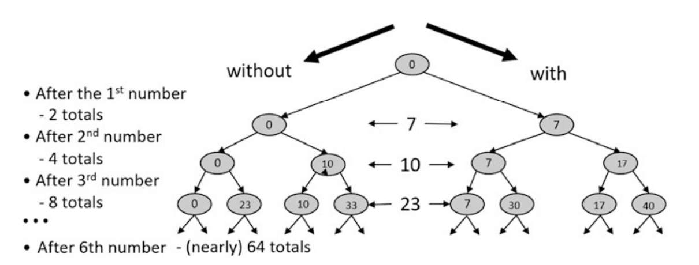

Ở phần [trước](./he-thong-ho-tro-ra-quyet-dinh-thong-minh-1), chúng ta đã tìm hiểu bản chất và vai trò của một Hệ thống hỗ trợ ra quyết định thông minh (IDS). Chúng ta đã thấy rằng "trí thông minh" của hệ thống không phải là phép màu, mà là một công cụ mạnh mẽ đòi hỏi sự thấu hiểu sâu sắc từ chính con người để kiến tạo và sử dụng. Vậy, câu hỏi thực tế được đặt ra là: Chúng ta bắt đầu quá trình "kiến tạo" đó như thế nào? Làm thế nào để chuyển một bài toán kinh doanh phức tạp, mơ hồ thành một thứ mà máy tính có thể "lý luận"?

Câu trả lời nằm ở bước đầu tiên, cũng là bước quan trọng nhất. Khi một khách hàng tìm đến một hệ thống IDS, người ta thường mặc định rằng họ đã biết rõ vấn đề của mình là gì. Nhưng trớ trêu thay, cũng như bao hệ thống Công nghệ Thông tin khác, việc phát biểu bài toán một cách rõ ràng, chính xác và tường tận lại chính là một phần quan trọng—thậm chí là phần khó nhất—của lời giải.

Một khi đã định hình được bài toán, phần còn lại của hành trình là xây dựng một thuật toán có khả năng tiếp nhận dữ liệu đầu vào và trả về một lời giải tối ưu, hoặc ít nhất là những phương án tốt.

Trong phần tiếp theo này, chúng ta sẽ cùng "mổ xẻ" khái niệm mô hình hóa một bài toán (problem modeling) thông qua một vài ví dụ đơn giản. Đây chính là nghệ thuật biến một vấn đề trong thế giới thực thành một cấu trúc mà máy tính có thể hiểu và giải quyết.

## Vài Ví Dụ Khởi Động

### Chọn số từ một tập hợp

Để có một chút trực giác về điều gì khiến một bài toán trở nên khó giải quyết, chúng ta hãy bắt đầu với một vài biến thể của một bài toán rất đơn giản. Dữ liệu đầu vào chỉ là một tập hợp các con số, ví dụ: $\{7, 10, 23, 13, 4, 16$\}.

Bây giờ, hãy cùng xem xét một chuỗi các bài toán liên quan đến tập hợp này, với độ khó tăng dần. Không có bài toán nào thực sự khó (vì tập hợp chỉ có sáu số), nhưng ý tưởng ở đây là để quan sát cách một vấn đề có thể trở nên phức tạp hơn.

1. **Tìm số lớn nhất.**

   Tất nhiên, câu trả lời là 23. Một cách để tìm ra là duyệt qua từng số, ghi nhớ số lớn nhất mà ta đã thấy, và cập nhật nó nếu số tiếp theo lớn hơn.

2. **Tìm hai số lớn nhất.**

   Bài toán này có thể được giải bằng cách tìm số lớn nhất, loại bỏ nó khỏi tập hợp, rồi tìm số lớn nhất trong phần còn lại. Một cách thông minh hơn là duyệt qua tập hợp một lần, ghi nhớ hai số lớn nhất, và cập nhật chúng nếu gặp một số mới lớn hơn một trong hai số đó.

3. **Liệu có tồn tại bốn số có tổng lớn hơn 40 không?**

   Rất dễ để tìm ra câu trả lời—chỉ cần chọn bốn số đầu tiên là đủ. Tuy nhiên, đây chỉ là một sự may mắn.

4. **Liệu có tồn tại bốn số có tổng lớn hơn 63 không?**

   Câu này không còn dễ dàng như vậy. Tuy nhiên, nếu chúng ta tìm ra bốn số lớn nhất (bằng một phương pháp tương tự như bài toán thứ hai), chúng ta có thể cộng chúng lại và được tổng là 62. Vì đây là bốn số lớn nhất, không thể có một tổ hợp bốn số nào khác cho ra tổng lớn hơn. Do đó, câu trả lời là không.

Hai bài toán cuối (3 và 4) thực chất là một, chỉ khác nhau ở con số tổng mà chúng ta tìm kiếm—40 và 63. Thực tế, chúng ta có thể tạo ra vô số bài toán khác nhau bằng cách thay đổi giá trị của tổng này. Mỗi giá trị của tổng sẽ tạo ra một **bài toán cụ thể** (problem instance).

Tất cả những bài toán cụ thể này đều là phiên bản của một **lớp bài toán** (problem class) duy nhất. Lớp bài toán này có thể phát biểu như sau: Với một số $K$ cho trước, liệu có tồn tại bốn số có tổng lớn hơn $K$ không? Ở đây, $K$ được gọi là **tham số** (parameter) của lớp bài toán. Các bài toán cụ thể khác nhau được tạo ra bằng cách chọn các giá trị khác nhau cho tham số.

Chúng ta có thể tổng quát hóa thêm nữa bằng cách biến số lượng các số cần cộng thành một tham số thứ hai, $N$: "Liệu có tồn tại N số trong tập $\{7, 10, 23, 13, 4, 16$\} có tổng lớn hơn $K$ không?". Lớp bài toán này có hai tham số: số lượng và tổng.

Và chúng ta có thể đi xa hơn nữa bằng cách đưa vào một tham số thứ ba, $S$, chính là tập hợp các con số mà chúng ta đang xét. Lớp bài toán mới, ở dạng tổng quát nhất, sẽ là:

**"Liệu có tồn tại N số trong tập hợp S có tổng lớn hơn K không?"**

Mỗi một cách gán giá trị cho các tham số này sẽ tạo ra một bài toán cụ thể. Ví dụ, khi gán $S = \{7, 10, 23, 13, 4, 16\}$, $N = 4$ và $K = 40$, chúng ta có lại bài toán số 3 ở trên.

Hoàn toàn có thể viết ra một thuật toán để giải quyết bất kỳ bài toán nào thuộc lớp bài toán tổng quát nhất này.

1. Nếu tập hợp $S$ có ít hơn $N$ phần tử, câu trả lời là **không**.
2. Nếu không, lặp lại $N$ lần:

   a. Tìm số lớn nhất trong $S$.

   b. Loại nó khỏi $S$ và ghi nhận lại.

3. Cộng tất cả các số đã ghi nhận.
4. Nếu tổng của chúng lớn hơn $K$, câu trả lời là **có**.
5. Nếu không, câu trả lời là **không**.

Bản thân thuật toán này không quá quan trọng—và chắc chắn có thể cải tiến để nó chạy hiệu quả hơn. Tuy nhiên, nó là một minh họa cho một **thuật toán tổng quát** (generic algorithm), có thể áp dụng cho cả một lớp bài toán, chứ không chỉ cho một bài toán cụ thể đơn lẻ.

Điều đáng ngạc nhiên là, với một lớp bài toán trông có vẻ rất tương tự: "Liệu có tồn tại N số trong tập hợp S có **tổng chính xác** bằng K không?" thì thuật toán hiệu quả nhất để giải nó lại phức tạp và kém hiệu quả hơn rất nhiều.

(Thử tìm xem có 4 số nào trong tập $\{7, 10, 23, 13, 4, 16$\} có tổng chính xác bằng 41 không!)

Và đây chính là chủ đề mà chúng ta sẽ đào sâu trong phần tới.

### Bài toán Cái Túi (The Knapsack Problem)

Bài toán Cái Túi là lớp bài toán đầu tiên trong bốn lớp bài toán kinh điển mà chúng ta sẽ dùng làm ví dụ xuyên suốt hành trình tìm hiểu về mô hình hóa và giải quyết vấn đề.

Nội dung của bài toán như sau:

> Cho một tập hợp các món đồ, mỗi món có một trọng lượng và một giá trị riêng. Hãy xác định nên chọn những món đồ nào (để cho vào túi) sao cho tổng trọng lượng không vượt quá một giới hạn cho trước, đồng thời tổng giá trị phải lớn nhất có thể.

Dù nghe có vẻ đơn giản, đây lại là một bài toán nền tảng trong ngành logistics: từ việc chất hàng lên tàu, xe tải, máy bay—cho đến cả tàu con thoi!

Bài toán Cái Túi có rất nhiều biến thể. Dưới đây là một vài dạng phổ biến:

- Biến thể "Quyết định" (Decision Variant): Thay vì tối đa hóa tổng giá trị, bài toán chỉ yêu cầu tìm xem liệu có tồn tại một cách chọn đồ để đạt được (hoặc vượt qua) một mức giá trị mục tiêu nào đó hay không.
- Phiên bản "0-1" (0–1 Version): Đối với mỗi món đồ, bạn chỉ có hai lựa chọn: một là lấy nó (1), hai là không lấy nó (0). Bạn không thể lấy một phần của món đồ hay lấy nhiều hơn một bản sao.
- Biến thể "Đa Ràng Buộc" (Multiple Constraint Version): Có nhiều hơn một giới hạn cần phải tuân thủ. Ví dụ, mỗi món đồ vừa có trọng lượng, vừa có thể tích, và chiếc túi của bạn cũng có giới hạn cho cả tổng trọng lượng và tổng thể tích.

Tất nhiên vẫn còn các biến thể khác, nhưng chúng ta sẽ không đi sâu vào chúng ở đây.

Vậy điều này liên quan gì đến ví dụ "tìm tổng chính xác bằng 41" của chúng ta ở phần trước?

Thực chất, bài toán đó chính là một **biến thể quyết định của bài toán Cái Túi 0-1**. Hãy cùng phân tích:

- Mỗi số trong tập hợp là một "món đồ". Bạn chỉ có thể chọn nó một lần hoặc không chọn (tính chất 0-1).
- "Giá trị" của mỗi món đồ chính bằng "trọng lượng" của nó (ví dụ, số 7 có trọng lượng là 7 và giá trị cũng là 7).
- Chúng ta không tối ưu hóa giá trị. Thay vào đó, chúng ta cần tìm một giải pháp có tổng giá trị chính xác bằng sức chứa của cái túi (tức là giới hạn $K$). Đây chính là tính chất của biến thể quyết định.

Khi được phát biểu lại theo đúng thuật ngữ, bài toán của chúng ta có tên là Bài toán Tổng Tập Con (Subset Sum Problem):

> Cho một tập hợp các số nguyên $S$ và một giá trị mục tiêu $K$, liệu có tồn tại một tập hợp con của $S$ có tổng các phần tử đúng bằng $K$ không?

Với một tập hợp cụ thể (ví dụ $\{7, 10, 23, 13, 4, 16\}$) và một tổng cụ thể (ví dụ 41), chúng ta có thể tìm ra câu trả lời bằng cách duyệt qua từng số và đưa ra lựa chọn: hoặc là cộng nó vào tổng, hoặc là không. Quá trình này sẽ tạo ra tất cả các tổng khả dĩ, có thể được hình dung như một cây quyết định.

Một thuật toán đơn giản để tìm ra tập con có tổng cần thiết là tạo ra toàn bộ cái cây này và xem ở hàng cuối cùng (các nút lá), có nút nào mang giá trị đúng bằng mục tiêu hay không.

Tuy nhiên, đây chính là mấu chốt của sự phức tạp: dường như không có cách nào thông minh để tạo ra các nút lá theo một thứ tự nhất định, để có thể dừng lại sớm nếu chắc chắn không có giải pháp. Chúng ta buộc phải duyệt qua một không gian khả năng khổng lồ—một hiện tượng gọi là bùng nổ tổ hợp—và đây là lý do tại sao một bài toán trông có vẻ đơn giản lại trở nên khó nhằn đến vậy.

### Bài toán Bẻ Sô-cô-la

Hãy tưởng tượng bạn có một thanh sô-cô-la khổng lồ, với kích thước 13 hàng và 9 cột, tức là tổng cộng 117 miếng vuông nhỏ! Nhiệm vụ của bạn là bẻ thanh sô-cô-la này ra thành 117 miếng vuông riêng lẻ.

Luật chơi như sau: ở bước đầu tiên, bạn cầm cả thanh lớn và bẻ nó thành hai mảnh. Ở mỗi bước tiếp theo, bạn chỉ được chọn một mảnh và tiếp tục bẻ nó thành hai. Khi bẻ, bạn chỉ có thể bẻ theo một đường thẳng, hoặc dọc hoặc ngang.

Bài toán đặt ra là: làm thế nào để bẻ thanh sô-cô-la thành các miếng riêng lẻ với số lần bẻ ít nhất có thể? Bạn cần bao nhiêu lần bẻ?

Thoạt nghe, bài toán này có vẻ phức tạp. Ở mỗi bước, bạn phải đối mặt với hàng loạt lựa chọn:

- Nên chọn miếng nào để bẻ tiếp theo?
- Khi đã chọn một miếng, nên bẻ theo chiều dọc hay chiều ngang?
- Và nếu đã quyết định chiều, nên bẻ ở đường nào—gần mép hay gần giữa?

Hãy thử suy nghĩ xem bạn sẽ giải bài toán này như thế nào. Đáp án sẽ có ở cuối bài viết này.

## Nền Tảng Của Mô Hình Hóa Bài Toán

### Các Khái Niệm Nền Tảng

Trong phần này, chúng ta sẽ xây dựng nền móng cho việc mô hình hóa bài toán. Cụ thể, chúng ta sẽ giới thiệu bộ khái niệm được dùng để xây dựng các mô hình mà một Hệ thống IDS có thể xử lý. Ba khái niệm—những viên gạch nền tảng của một mô hình hệ thống IDS—là:

- **Biến (Variables)**: Đại diện cho các quyết định cần đưa ra. Một giá trị của biến đại diện cho một lựa chọn cụ thể cho quyết định đó.
- **Ràng buộc (Constraints)**: Loại bỏ những tổ hợp lựa chọn không tương thích với nhau.
- **Tham số (Parameters)**: Chỉ định một bài toán cụ thể trong một lớp bài toán lớn hơn.

Một ràng buộc được áp đặt lên một tập hợp các biến, gọi là phạm vi (scope) của nó, và giới hạn các tổ hợp giá trị mà những biến đó có thể nhận. Ví dụ, ràng buộc $X > Y$ trên hai biến $X$ và $Y$ sẽ loại bỏ bất kỳ tổ hợp nào mà giá trị của $X$ không lớn hơn giá trị của $Y$. Phạm vi của ràng buộc $X > Y$ chính là tập hợp các biến mà nó tác động lên: $\{X, Y\}$.

Một phép gán (assignment) giá trị cho các biến trong phạm vi của một ràng buộc có thể thỏa mãn (satisfy) hoặc vi phạm (violate) ràng buộc đó.

- Phép gán $X = 1, Y = 2$ vi phạm ràng buộc $X > Y$.
- Ngược lại, phép gán $X = 2, Y = 1$ thỏa mãn nó.

Khi mô hình hóa, việc xác định phạm vi lựa chọn cho mỗi quyết định là rất quan trọng. Để người ra quyết định có thể xem xét tất cả các lựa chọn khả dĩ, mỗi quyết định chỉ có thể có một số lượng lựa chọn hữu hạn.

Do đó, với mỗi biến (quyết định), chúng ta xác định một tập hợp các giá trị (lựa chọn) khả dĩ, mà chúng ta gọi là miền giá trị (domain) của biến đó.

Mục đích của một hệ thống IDS là hỗ trợ việc đưa ra một tập hợp các quyết định, được thể hiện trong mô hình bằng cách gán giá trị cho các biến.

- Một phép gán đầy đủ (complete assignment) là một phép gán giá trị (lấy từ miền giá trị) cho mỗi biến trong mô hình.
- Một phép gán khả thi (feasible assignment) là một phép gán trên một tập hợp biến mà thỏa mãn mọi ràng buộc có phạm vi nằm trong tập hợp đó.
- Một lời giải (solution) là một phép gán đầy đủ và khả thi. Nói cách khác, một lời giải phải thỏa mãn tất cả các ràng buộc trong mô hình bài toán!

Để hệ thống lại, dưới đây là các định nghĩa chính thức cho những khái niệm chúng ta sẽ sử dụng.

| Thuật ngữ (Tiếng Anh)   | Thuật ngữ (Tiếng Việt) | Định nghĩa                                                                                                                                                      |
| ----------------------- | ---------------------- | --------------------------------------------------------------------------------------------------------------------------------------------------------------- |
| **Model**               | **Mô hình**            | Sự biểu diễn một bài toán dưới dạng các biến, ràng buộc và tham số của nó.                                                                                      |
| **Variable**            | **Biến**               | Đại diện cho một điều gì đó chưa biết khi mô hình được định nghĩa. Nó sẽ được gán một giá trị cụ thể khi mô hình được giải.                                     |
| **Domain**              | **Miền giá trị**       | Tập hợp các giá trị thay thế mà một biến có thể nhận.                                                                                                           |
| **Assignment**          | **Phép gán**           | Việc liên kết mỗi biến trong một tập hợp với một giá trị cụ thể từ miền giá trị của nó. Một phép gán đầy đủ sẽ gán giá trị cho mọi biến trong mô hình.          |
| **Constraint**          | **Ràng buộc**          | Quy định các điều kiện trên các biến trong phạm vi của nó. Khi mô hình được giải, các giá trị được gán cho các biến phải thỏa mãn ràng buộc này.                |
| **Feasible Assignment** | **Phép gán khả thi**   | Một phép gán trên một tập hợp biến mà thỏa mãn mọi ràng buộc có phạm vi nằm trong tập hợp đó.                                                                   |
| **Solution**            | **Lời giải**           | Một phép gán đầy đủ và khả thi.                                                                                                                                 |
| **Parameter**           | **Tham số**            | Một giá trị được cung cấp làm đầu vào cho một mô hình.                                                                                                          |
| **Problem Class**       | **Lớp bài toán**       | Một bài toán ở dạng tổng quát. Cùng một mô hình có thể được sử dụng cho tất cả các bài toán trong một lớp, nhưng một hoặc nhiều đầu vào vẫn chưa được xác định. |
| **Problem Instance**    | **Bài toán cụ thể**    | Một bài toán cụ thể. Tất cả các đầu vào cho bài toán cụ thể đều đã được xác định.                                                                               |
| **Array**               | **Mảng**               | Một danh sách có độ dài cố định chứa các giá trị hoặc biến.                                                                                                     |
| **Matrix**              | **Ma trận**            | Một bảng, hoặc tổng quát hơn là một mảng đa chiều, chứa các giá trị hoặc biến.                                                                                  |
| **Operation**           | **Phép toán**          | Một thao tác trên một danh sách các biến và/hoặc giá trị để trả về một kết quả là một giá trị. Danh sách này gọi là đối số (arguments) hoặc "đầu vào".          |

...
