

import GOL from "./GOL.astro";

<GOL />

Have you seen this animation before? It's called the **Game of Life**.

In 1970, **John Horton Conway** created the Game of Life (or Conway's Game of Life), a cellular automaton that simulates the evolution of a grid of cells based on a few simple rules. Despite its simplicity, the Game of Life exhibits complex behaviors, such as gliders, oscillators, and even Turing-complete machines.

In this article, we'll explore how simple rules can give rise to complex phenomena and how they can be used to model real-world systems.

## The Game of Life

The universe of the Game of Life is a **two-dimensional grid of cells**, each of which can be **alive or dead**. The state of each cell **evolves over time** according to the following rules:

1. Any live cell with fewer than two live neighbors dies, as if by underpopulation.
2. Any live cell with two or three live neighbors lives on to the next generation.
3. Any live cell with more than three live neighbors dies, as if by overpopulation.
4. Any dead cell with exactly three live neighbors becomes a live cell, as if by reproduction.

Or in other words:

- If the sum of all nine fields in a given neighborhood is three, the inner field state for the next generation will be life.
- If the all-field sum is four, the inner field retains its current state, and every other sum sets the inner field to death.

And that's it! We can implement these simple rules in code and simulate the evolution of the grid over time. The animation at the beginning of this article shows the Game of Life in action.

Various patterns emerge in the Game of Life, each categorized based on its behavior. Some common types include:

**Still lifes**, which do not change from one generation to the next.

<table class="prose-tr:border-none prose-img:m-0 prose-td:text-center">
  <tr>
    <td>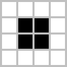</td>
    <td>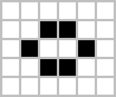</td>
    <td>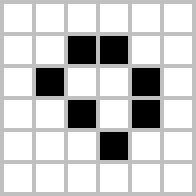</td>
    <td>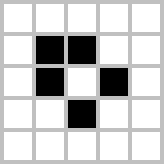</td>
    <td>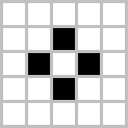</td>
  </tr>
  <tr>
    <td>Block</td>
    <td>Beehive</td>
    <td>Loaf</td>
    <td>Boat</td>
    <td>Tub</td>
  </tr>
</table>

**Oscillators**, which return to their initial state after a finite number of generations.

<table class="prose-tr:border-none prose-img:m-0 prose-td:text-center">
  <tr>
    <td>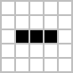</td>
    <td>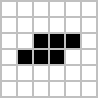</td>
    <td>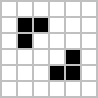</td>
    <td>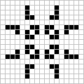</td>
    <td>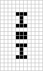</td>
  </tr>
  <tr>
    <td>Blinker</td>
    <td>Toad</td>
    <td>Beacon</td>
    <td>Pulsar</td>
    <td>Penta-decathlon</td>
  </tr>
</table>

**Spaceships**, which translate themselves across the grid.

<table class="prose-tr:border-none prose-img:m-0 prose-td:text-center">
  <tr>
    <td>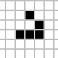</td>
    <td>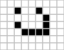</td>
    <td>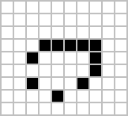</td>
    <td>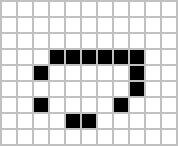</td>
  </tr>
  <tr>
    <td>Glider</td>
    <td>Light-weight spaceship (LWSS)</td>
    <td>Middle-weight spaceship (MWSS)</td>
    <td>Heavy-weight spaceship (HWSS)</td>
  </tr>
</table>

So cool, right?

We can even run the Game of Life in the Game of Life! It's been proven that the Game of Life is **Turing complete**, meaning that it can simulate any algorithm that a computer can run.

<iframe
  class="w-full aspect-video"
  src="https://www.youtube.com/embed/xP5-iIeKXE8?si=L7L213HWpasV9e8X"
  title="YouTube video player"
  frameborder="0"
  allow="accelerometer; autoplay; clipboard-write; encrypted-media; gyroscope; picture-in-picture; web-share"
  referrerpolicy="strict-origin-when-cross-origin"
  allowfullscreen
  loading="lazy"
></iframe>

If you are interested and want to know more about Turing completeness in the Game of Life, I recommend watching [this video by Alan Zucconi.](https://youtu.be/Kk2MH9O4pXY?si=5HzphfDG0ZLY-A8b)

I learned about the Game of Life from [The Coding Train](https://youtu.be/FWSR_7kZuYg?si=tkyfWgT1C1k3kJNZ) about 6 years ago. Since then, I have fallen in love with concepts like these, and I started to explore more about them.

## Wave Function Collapse Algorithm

In 2022, I found a game called [Townscaper](https://www.townscapergame.com/)–a game that let you build a town by just clicking. It's a simple game, but the concept behind it is really interesting.

<iframe
  class="w-full aspect-video"
  src="https://www.youtube.com/embed/QtVkteAS15M?si=QMQkzdjeCkJATwOA"
  title="YouTube video player"
  frameborder="0"
  allow="accelerometer; autoplay; clipboard-write; encrypted-media; gyroscope; picture-in-picture; web-share"
  referrerpolicy="strict-origin-when-cross-origin"
  allowfullscreen
></iframe>

As you can see in the video, the game is generating a town by just clicking on a grid. But how does it work? How can a simple click generate a complex town?

How does the game know what tile to place and what tile should change so it doesn't break the town?

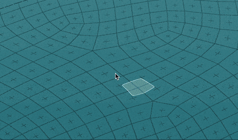

Turns out, the game is using an algorithm called the **Wave Function Collapse algorithm** (WFC)–a greedy, computational algorithm that generates a grid of tiles based on a set of constraints. Developed by [Maxim Gumin](https://paulmerrell.org/model-synthesis/) based on work by [Paul Merrell](https://paulmerrell.org/model-synthesis/).

The algorithm is based on the idea of **quantum mechanics**, where a particle is in a superposition until it is observed. This means a particle can be in any possible state until it is observed.

For example, place a cat in a box with a poison that will be released if a radioactive atom decays. The cat is in a superposition of being alive and dead until the box is opened and the cat is observed. At that point, the cat is either alive or dead. This is called the [Schrödinger's cat](https://en.wikipedia.org/wiki/Schr%C3%B6dinger%27s_cat) thought experiment.

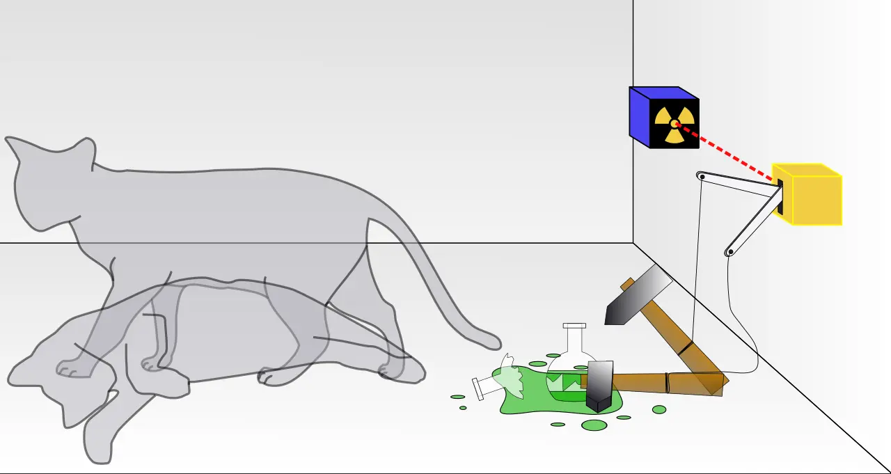

In WFC, the process starts with a grid where each cell can be any possible tile from a given set. The algorithm then searches for the cell with the lowest **entropy**–essentially, the one with the most uncertainty. Once found, this cell is **observed**, meaning it collapses into a specific tile based on predefined constraints. These constraints ensure that neighboring tiles fit together logically, just like puzzle pieces. The new information then ripples outward, updating the possible states of nearby cells. This cycle repeats until every cell has settled into its final form, producing the completed level.

Consider a Sudoku puzzle as an analogy: each empty cell can be one of several numbers initially. You scan the grid for a spot where only one or two digits can logically fit, fill that in, and then use the updated information to further limit the options for the remaining cells. Just like in Sudoku, the WFC algorithm uses constraints to gradually and methodically complete the grid, turning uncertainty into a coherent, final solution.

import Sudoku from "./sudoku.astro";

<Sudoku />

So basically, we just loop through the grid and find the cell with the lowest entropy, collapse it, and update the neighbors. This process repeats until the grid is filled.

Let’s replace the Sudoku grid with a game's tileset, the rule of it is more simpler now. For each tile, we have a set of possible neighbors can be placed next to it. The constraints we are going to use are that the colors on adjacent tiles must match up with each other. Check out [Wave by Oskar Stålberg](https://oskarstalberg.com/game/wave/wave.html) to see the algorithm in action.

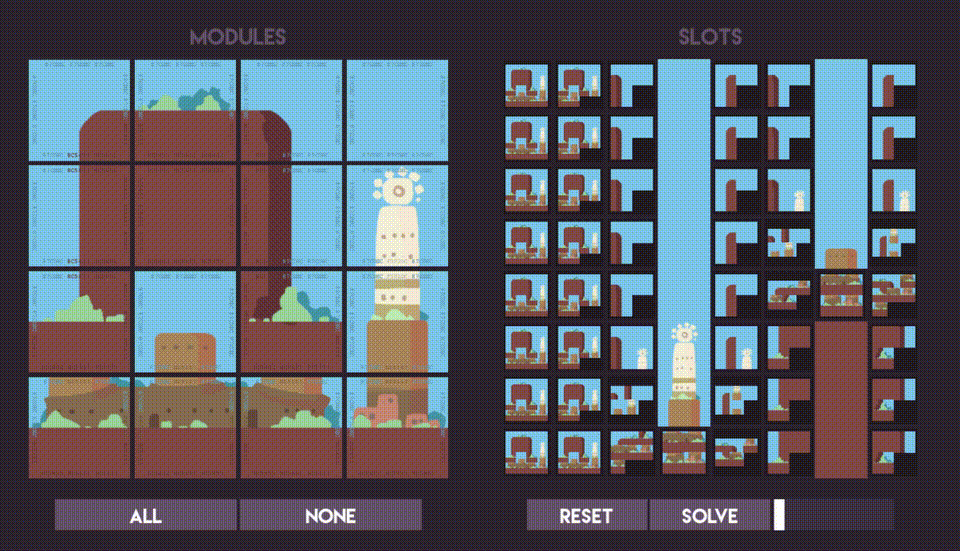
