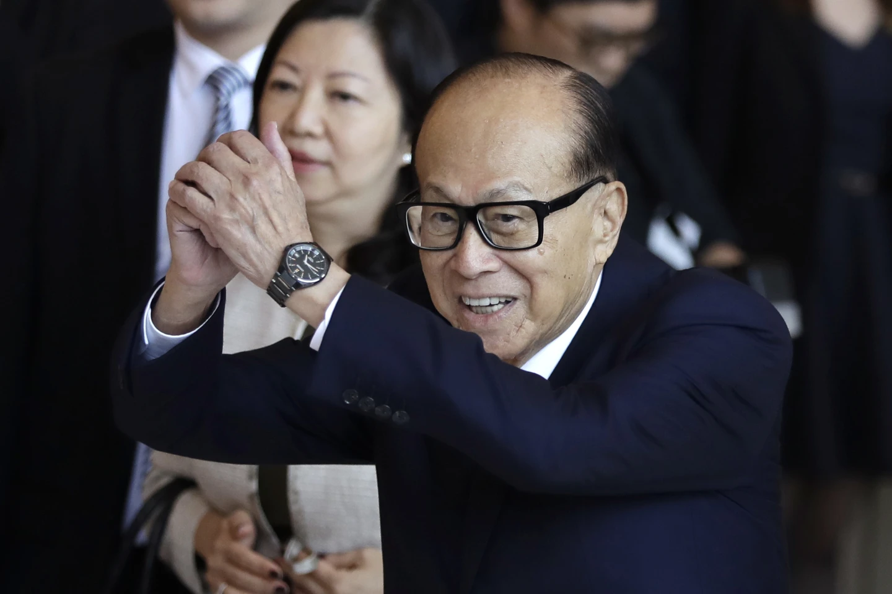

Có những buổi sáng, mình chỉ định lướt tin cho vui trong lúc uống cà phê – nhưng rồi lại thấy một dòng tiêu đề khiến mình tỉnh ngủ ngay lập tức: “Tỷ phú Lý Gia Thành bán 43 cảng biển quốc tế cho liên minh Mỹ – thương vụ hơn 22 tỷ USD.”

Ở tuổi 97, nhiều người đã dừng lại, nhưng Lý Gia Thành thì không. Ông vừa bán gần hết mạng lưới cảng biển toàn cầu của mình – bao gồm cả những cảng siêu chiến lược nằm sát hai đầu kênh đào Panama – cho một nhóm đầu tư do BlackRock và MSC dẫn đầu.

Mình bắt đầu tò mò: Tại sao lại bán? Tại sao bây giờ? Và tại sao bán cho Mỹ – nhất là trong bối cảnh căng thẳng Mỹ - Trung ngày càng tăng cao? Phải chăng đây là một nước cờ kinh doanh thông minh, hay còn là một bước đi mang màu sắc địa chính trị?

Trong bài viết này, mình sẽ cùng bạn đi sâu vào vụ chuyển nhượng lịch sử này – từ động cơ của Lý Gia Thành, phản ứng của Bắc Kinh, cho đến những hệ quả chiến lược với Mỹ, Trung Quốc và cả thế giới.

## 1. Tóm tắt Điều hành

Tháng 3 năm 2025, tập đoàn CK Hutchison Holdings do tỷ phú Hồng Kông Lý Gia Thành kiểm soát đã đồng ý bán 80% cổ phần trong mảng kinh doanh cảng biển quốc tế của mình, bao gồm 43 cảng tại 23 quốc gia, và 90% cổ phần của công ty cảng Panama, cho một liên minh do công ty quản lý tài sản của Mỹ BlackRock và hãng vận tải biển Địa Trung Hải (MSC) dẫn đầu. Thương vụ trị giá khoảng 22,8 tỷ đô la Mỹ này có ý nghĩa chiến lược đặc biệt do bao gồm hai cảng quan trọng là Balboa và Cristobal ở hai đầu kênh đào Panama[^1]. Việc bán các cảng này đã thu hút sự chú ý lớn do những tác động địa chính trị liên quan, đặc biệt là sự phản đối mạnh mẽ từ Trung Quốc và những tuyên bố từ phía Mỹ về việc giành lại ảnh hưởng đối với kênh đào Panama[^3]. Động thái này của Lý Gia Thành được cho là xuất phát từ sự kết hợp giữa việc tái cơ cấu danh mục đầu tư kinh doanh và việc ứng phó với những áp lực địa chính trị ngày càng gia tăng[^1]. Đồng thời, việc Mỹ mua lại các cảng này mang lại những lợi ích chiến lược quan trọng trong việc tăng cường ảnh hưởng và đảm bảo an ninh kinh tế tại một tuyến đường hàng hải huyết mạch[^8].

## 2. Giới thiệu

### 2.1. Lý Gia Thành và CK Hutchison Holdings:

Lý Gia Thành là một doanh nhân Hồng Kông có tầm ảnh hưởng lớn, nổi tiếng với vai trò là người sáng lập và chủ tịch của CK Hutchison Holdings, một tập đoàn đa quốc gia hoạt động trong nhiều lĩnh vực khác nhau trên toàn cầu[^1]. CK Hutchison là một tập đoàn kinh doanh rộng lớn với các mảng hoạt động đa dạng, từ viễn thông và bán lẻ đến cơ sở hạ tầng và đặc biệt là quản lý cảng biển[^10]. Sự hiện diện toàn cầu của tập đoàn này trải rộng khắp nhiều quốc gia và khu vực, cho thấy tầm quan trọng của nó trong nền kinh tế thế giới. Với danh mục kinh doanh đa dạng, CK Hutchison không chỉ là một tập đoàn bất động sản hàng đầu ở Hồng Kông mà còn sở hữu cổ phần trong nhiều doanh nghiệp hàng đầu của Mỹ như Walmart, Apple, Amazon, Microsoft và Alphabet[^13].

### 2.2. Mạng lưới Cảng Biển Toàn cầu của CK Hutchison (Trước khi Bán):

Trước giao dịch này, CK Hutchison vận hành một trong những mạng lưới cảng container lớn nhất thế giới[^2]. Quy mô hoạt động của họ bao gồm một danh mục đầu tư đáng kể với 43 cảng, trải dài trên 199 bến tại 23 quốc gia, bao gồm các trung tâm vận tải biển quan trọng như Rotterdam (Hà Lan), Laem Chabang (Thái Lan) và Karachi (Pakistan)[^2]. Đặc biệt, CK Hutchison có một vị trí chiến lược tại cả hai đầu của kênh đào Panama thông qua các cảng Balboa và Cristobal[^13]. Với vai trò là "nhà khai thác cảng biển toàn cầu ban đầu"[^2], công ty đã có một lịch sử lâu dài và kinh nghiệm sâu rộng trong ngành, bắt đầu từ Hồng Kông vào đầu những năm 1990 và nhanh chóng mở rộng ra quốc tế. Trong suốt nhiều năm, mạng lưới cảng của CK Hutchison là lớn nhất trên thế giới, góp phần quan trọng vào sự phát triển của thương mại toàn cầu. Tuy nhiên, trong 20 năm qua, vị thế dẫn đầu của CK Hutchison trong lĩnh vực cảng biển toàn cầu đã giảm xuống vị trí thứ sáu[^2].

### 2.3. Bối cảnh của Vụ Bán:

Thỏa thuận gần đây, được công bố vào ngày 4 tháng 3 năm 2025[^11], liên quan đến việc bán 80% cổ phần kiểm soát trong Hutchison Port Holdings (ngoại trừ các cảng ở Trung Quốc đại lục và Hồng Kông) và 90% cổ phần trong Công ty Cảng biển Panama[^11]. Bên mua là một liên minh tài chính do BlackRock, một công ty quản lý đầu tư hàng đầu của Mỹ, và Mediterranean Shipping Co (MSC), một trong những hãng vận tải container lớn nhất thế giới, thông qua công ty con chuyên về đầu tư cảng biển Terminal Investment Limited (TiL), dẫn dắt[^1].

## 3. Chi tiết Giao dịch

### 3.1. Xác định các Cảng đã Bán:

Giao dịch này bao gồm việc chuyển giao quyền kiểm soát hoạt động đối với 43 bến container nằm tại 23 quốc gia trên toàn thế giới[^2]. Đặc biệt, các cảng Balboa và Cristobal, nằm ở lối vào Thái Bình Dương và Đại Tây Dương của kênh đào Panama, có tầm quan trọng chiến lược[^13]. Một danh sách chi tiết hơn về các cảng và quốc gia liên quan bao gồm:

* **Châu Âu:** Hà Lan (Rotterdam, Amsterdam, Velsen, IJmuiden), Bỉ (Antwerp), Vương quốc Anh (Felixstowe, London, Harwich), Đức (Duisburg, Bremerhaven), Thụy Điển (Stockholm), Tây Ban Nha (Barcelona, Valencia), Ba Lan (Gdynia)[^12].
* **Châu Á & Trung Đông:** Thái Lan (Laem Chabang), Pakistan (Karachi), Ả Rập Xê Út[^12].
* **Châu Mỹ:** Mexico, Bahamas[^5].
* **Châu Đại Dương:** Úc[^12].
* **Châu Phi:** Ai Cập[^5].

Quy mô và sự phân bố địa lý của các cảng được bán cho thấy tầm quan trọng to lớn của sự thoái vốn này, có khả năng tác động đến các tuyến vận tải biển toàn cầu và chuỗi cung ứng trên nhiều lục địa.

### 3.2. Bên Mua: BlackRock và Mediterranean Shipping Co (MSC):

BlackRock, một tập đoàn quản lý đầu tư hàng đầu thế giới, đóng vai trò là một trong những bên mua chính, cho thấy sự quan tâm của các nhà đầu tư tài chính lớn của Mỹ đối với cơ sở hạ tầng cảng biển[^1]. MSC, thông qua công ty con TiL, là một trong những công ty vận tải container lớn nhất thế giới, và việc mua lại này thể hiện sự quan tâm chiến lược của họ trong việc đảm bảo năng lực bến cảng[^2]. Liên minh này có thể tận dụng sự vững mạnh về tài chính của BlackRock và kinh nghiệm hoạt động sâu rộng trong lĩnh vực cảng biển và logistics của MSC/TiL[^2]. Sự kết hợp này cho thấy một thương vụ mua lại có tính toán chiến lược, hướng đến việc tạo ra giá trị lâu dài và tăng cường quyền kiểm soát đối với một phần quan trọng của cơ sở hạ tầng cảng biển toàn cầu.

### 3.3. Các Điều khoản Tài chính:

Giá trị doanh nghiệp của giao dịch được báo cáo là khoảng 22,8 tỷ đô la Mỹ[^1]. Các cổ phần được chuyển nhượng bao gồm 80% cổ phần kiểm soát trong Hutchison Port Holdings (bao gồm 43 cảng bên ngoài Trung Quốc và Hồng Kông) và 90% cổ phần trong Công ty Cảng biển Panama, đơn vị vận hành các cảng Balboa và Cristobal[^2]. CK Hutchison dự kiến sẽ thu về hơn 19 tỷ đô la Mỹ tiền mặt sau giao dịch, sau khi trừ đi các khoản lợi ích thiểu số và hoàn trả một số khoản vay cổ đông[^6]. Mặc dù có một số khác biệt nhỏ trong tổng giá trị giao dịch được báo cáo giữa các nguồn khác nhau (ví dụ, một số nguồn đề cập đến 19 tỷ đô la)[^3], giá trị cụ thể của Công ty Cảng biển Panama được một nguồn tin nêu là 14,21 tỷ đô la[^21], cho thấy có thể có sự khác biệt trong cách tính toán hoặc báo cáo giá trị giao dịch. Quy mô tài chính đáng kể của giao dịch này nhấn mạnh giá trị kinh tế to lớn của cơ sở hạ tầng cảng biển toàn cầu được chuyển nhượng, đồng thời cung cấp cho CK Hutchison một lượng vốn lớn có thể được tái đầu tư một cách chiến lược vào các cơ hội khác.

### 3.4. Bảng: Các Chi tiết Chính của Vụ Bán Cảng

| Thuộc tính          | Chi tiết                                                                                                                                                                                                                                                                                                                                                        |
| :------------------ | :----------------------------------------------------------------------------------------------------------------------------------------------------------------------------------------------------------------------------------------------------------------------------------------------------------------------------------------------------------------- |
| Giá trị             | Khoảng 22,8 tỷ đô la Mỹ (Giá trị Doanh nghiệp)                                                                                                                                                                                                                                                                                                                    |
| Bên Bán            | CK Hutchison Holdings (Kiểm soát bởi Lý Gia Thành)                                                                                                                                                                                                                                                                                                             |
| Liên minh Mua       | BlackRock, Mediterranean Shipping Co (MSC) (thông qua Terminal Investment Limited - TiL)                                                                                                                                                                                                                                                                           |
| Số lượng Cảng       | 43                                                                                                                                                                                                                                                                                                                                                              |
| Số lượng Quốc gia   | 23                                                                                                                                                                                                                                                                                                                                                              |
| Các Cảng Chính (Ví dụ) | Balboa (Panama), Cristobal (Panama), Rotterdam (Hà Lan), Antwerp (Bỉ), Felixstowe (Anh), Laem Chabang (Thái Lan), Karachi (Pakistan), Barcelona (Tây Ban Nha) (Lưu ý: Đây chỉ là danh sách một phần để ngắn gọn).                                                                                                                                                |
| Cổ phần đã Bán      | 80% Hutchison Port Holdings (ngoại trừ Trung Quốc & HK), 90% Công ty Cảng biển Panama                                                                                                                                                                                                                                                                               |
| Loại trừ            | Các cảng nằm ở Trung Quốc đại lục và Hồng Kông (do HPH Trust vận hành)                                                                                                                                                                                                                                                                                               |
| Lý do Chính (Được Báo cáo) | Tái cơ cấu kinh doanh chiến lược của CK Hutchison; Mong muốn của Mỹ giảm ảnh hưởng của Trung Quốc đối với cơ sở hạ tầng chiến lược như kênh đào Panama.                                                                                                                                                                                                           |

## 4. Động lực Đằng sau Quyết định của Lý Gia Thành

### 4.1. Thay đổi Chiến lược Kinh doanh và Tái cân bằng Danh mục Đầu tư:

Quyết định bán "đế chế cảng biển" trị giá 22,8 tỷ đô la Mỹ của tỷ phú Lý Gia Thành, ở tuổi 97, được mô tả là một "nước cờ táo bạo" để chuyển hướng đầu tư vào các lĩnh vực tiềm năng mới[^1]. CK Hutchison chính thức tuyên bố rằng việc bán đi các tài sản cốt lõi trong ngành cảng biển toàn cầu là một động thái nhằm tái tập trung danh mục tài sản toàn cầu của mình[^6]. Sau nhiều thập kỷ phát triển trong lĩnh vực cảng biển, Lý Gia Thành có thể đang tìm cách hiện thực hóa giá trị đáng kể từ các tài sản trưởng thành này vào thời điểm có thể đạt được mức định giá cao[^2]. Sự thoái vốn này cho thấy một chiến lược kinh doanh hướng tới tương lai của Lý Gia Thành, có khả năng nhằm mục đích giảm thiểu rủi ro từ một lĩnh vực nhạy cảm về chính trị và tái triển khai vốn vào các thị trường hoặc ngành mới nổi có tiềm năng tăng trưởng lớn hơn. Việc bán một đơn vị kinh doanh lớn với giá cao thường báo hiệu một sự thay đổi chiến lược trong trọng tâm đầu tư và mong muốn tận dụng các điều kiện thị trường thuận lợi.

### 4.2. Ứng phó với Áp lực Địa chính trị:

Đã có những áp lực đáng kể và được ghi nhận rõ ràng từ chính phủ Mỹ, đặc biệt là dưới thời Tổng thống Trump, nhằm giảm bớt ảnh hưởng ngày càng tăng của Trung Quốc đối với kênh đào Panama có tầm quan trọng chiến lược[^2]. Các quan chức Mỹ, bao gồm Thượng nghị sĩ Ted Cruz và Ngoại trưởng Marco Rubio, đã bày tỏ lo ngại về các rủi ro an ninh tiềm ẩn và khả năng Trung Quốc sử dụng các cảng ở kênh đào Panama cho mục đích quan sát chiến lược hoặc can thiệp[^5]. CK Hutchison gần đây đã được gia hạn nhượng quyền khai thác cảng Panama thêm 25 năm mà không qua đấu thầu, và việc gia hạn này đã bị kiểm toán, có khả năng tạo ra sự không chắc chắn và thêm áp lực[^16]. Áp lực địa chính trị mạnh mẽ từ chính phủ Mỹ dường như đã đóng một vai trò quan trọng, thậm chí có thể là quyết định, trong quyết định của Lý Gia Thành về việc thoái vốn khỏi các tài sản cảng quốc tế quan trọng này, đặc biệt là các tài sản xung quanh kênh đào Panama.

### 4.3. Giảm thiểu Rủi ro Chính trị từ Bắc Kinh:

Đã có những phản ứng tiêu cực mạnh mẽ và một cuộc điều tra được báo cáo do Bắc Kinh khởi xướng về việc bán cảng, với những lo ngại về an ninh quốc gia và các vi phạm chống độc quyền tiềm ẩn[^3]. Bằng cách bán cho một liên minh do Mỹ dẫn đầu, Lý Gia Thành có thể đã cố gắng ngăn chặn hoặc giảm thiểu những hậu quả chính trị tiềm ẩn trong tương lai hoặc các hạn chế từ Bắc Kinh, trong bối cảnh căng thẳng gia tăng giữa Mỹ và Trung Quốc[^2]. CK Hutchison khẳng định rằng giao dịch này "hoàn toàn mang tính thương mại"[^16], điều này có thể được hiểu là một nỗ lực nhằm giảm nhẹ mọi động cơ chính trị và xoa dịu Bắc Kinh. Mặc dù phải đối mặt với sự không hài lòng ngay lập tức từ Bắc Kinh, quyết định bán cho một thực thể liên kết với Mỹ của Lý Gia Thành có thể đại diện cho một động thái tính toán nhằm bảo vệ các lợi ích kinh doanh rộng lớn hơn của ông khỏi những rủi ro tiềm ẩn lâu dài liên quan đến việc vận hành cơ sở hạ tầng có tính chiến lược trong bối cảnh cạnh tranh Mỹ-Trung gia tăng. Việc bán cho một thực thể Mỹ, bất chấp sự phản đối của Trung Quốc, có thể được xem là một lựa chọn chiến lược để liên kết với cường quốc thống trị trong bối cảnh địa chính trị cụ thể này, có khả năng mang lại sự ổn định lâu dài hơn cho các liên doanh kinh doanh khác.

### 4.4. Hiện thực hóa Các Điều khoản Thương mại Hấp dẫn:

CK Hutchison đã thừa nhận mức định giá "hấp dẫn" được đưa ra bởi liên minh mua, cho thấy rằng các điều khoản tài chính của thỏa thuận là rất hấp dẫn[^2]. Tập đoàn dự kiến sẽ nhận được số tiền mặt đáng kể vượt quá 19 tỷ đô la Mỹ, cung cấp nguồn vốn dồi dào cho các khoản đầu tư và sáng kiến chiến lược trong tương lai[^6]. Bất chấp sự chồng chéo đáng kể của các yếu tố địa chính trị, lý do thương mại cơ bản về việc hiện thực hóa một khoản lợi nhuận đáng kể từ các tài sản này có khả năng là một động lực chính trong quyết định tiến hành bán của Lý Gia Thành. Các giao dịch kinh doanh quy mô lớn thuộc loại này luôn được thúc đẩy bởi các cân nhắc tài chính mạnh mẽ, và mức định giá cao có khả năng đã tạo ra một thời điểm thích hợp để thoái vốn.

## 5. Ý nghĩa Chiến lược và Kinh tế đối với Hoa Kỳ

### 5.1. Khẳng định Ảnh hưởng và Đối trọng với Sự Hiện diện của Trung Quốc:

Việc mua lại này được nhìn nhận rộng rãi như một động thái chiến lược của Mỹ nhằm tái khẳng định ảnh hưởng của mình tại một khu vực có tầm quan trọng kinh tế và địa chính trị quan trọng, đặc biệt là xung quanh kênh đào Panama[^7]. Tổng thống Trump đã công khai coi thỏa thuận này là một chiến thắng trong việc "giành lại" ảnh hưởng đối với kênh đào, nhấn mạnh mong muốn của Mỹ trong việc đối trọng với sự hiện diện ngày càng tăng của Trung Quốc ở Mỹ Latinh và các khoản đầu tư ngày càng tăng của họ vào cơ sở hạ tầng toàn cầu[^3]. Việc mua lại này có hiệu quả hạn chế sự kiểm soát hoạt động trực tiếp của Trung Quốc đối với các tài sản cơ sở hạ tầng quan trọng liền kề một tuyến đường thương mại toàn cầu huyết mạch[^7]. Bằng cách tạo điều kiện cho một liên minh do Mỹ dẫn đầu mua lại các cảng này, Mỹ đã đạt được một mục tiêu chiến lược quan trọng là giảm bớt sự hiện diện hoạt động của một thực thể liên kết chặt chẽ với Trung Quốc ở gần một tuyến đường thủy có tính chiến lược và nhạy cảm cao.

### 5.2. Tăng cường An ninh Quốc gia và Bảo vệ Lợi ích Chiến lược:

Kênh đào Panama có tầm quan trọng hàng đầu đối với an ninh quốc gia của Mỹ, tạo điều kiện triển khai hải quân nhanh chóng giữa Đại Tây Dương và Thái Bình Dương[^26]. Các quan chức Mỹ đã bày tỏ lo ngại về khả năng Trung Quốc lợi dụng quyền kiểm soát hoạt động đối với các cảng của kênh đào để cản trở hoạt động vận chuyển quân sự hoặc thương mại của Mỹ, đặc biệt trong các tình huống liên quan đến căng thẳng địa chính trị (ví dụ: liên quan đến Đài Loan)[^5]. Cũng có những lo ngại về khả năng các cảng này có thể được sử dụng cho mục đích thu thập thông tin tình báo hoặc các hoạt động khác gây tổn hại đến lợi ích của Mỹ nếu nằm dưới sự kiểm soát của nước ngoài[^5]. Việc giành được ảnh hưởng đáng kể đối với hoạt động của các cảng ở kênh đào Panama thông qua việc mua lại này củng cố an ninh quốc gia của Mỹ bằng cách giảm thiểu các rủi ro tiềm ẩn liên quan đến sự kiểm soát của nước ngoài đối với một điểm nghẽn hàng hải quan trọng và đảm bảo dòng chảy không bị cản trở của các tài sản chiến lược.

### 5.3. Củng cố Đòn bẩy Kinh tế và An ninh Chuỗi Cung ứng:

Kênh đào Panama đóng một vai trò then chốt trong thương mại toàn cầu, với khối lượng hàng hóa quốc tế đáng kể và một tỷ lệ lớn lưu lượng container của Mỹ đi qua đây[^24]. Ảnh hưởng của Mỹ đối với các cảng có thể tạo cơ hội định hình các quy định, tiêu chuẩn và thông lệ hoạt động theo cách có lợi cho lợi ích kinh tế của Mỹ, chẳng hạn như trong thị trường nhiên liệu sinh học đang nổi lên[^7]. Việc đảm bảo quyền kiểm soát đối với các cảng này góp phần vào khả năng phục hồi và an ninh của chuỗi cung ứng Mỹ bằng cách giảm sự phụ thuộc vào cơ sở hạ tầng do các đối thủ địa chính trị tiềm năng kiểm soát[^7]. Việc mua lại này củng cố vị thế kinh tế của Mỹ bằng cách đảm bảo quyền kiểm soát lớn hơn đối với một động mạch quan trọng của thương mại toàn cầu, tăng cường an ninh chuỗi cung ứng và có khả năng cung cấp đòn bẩy trong các cuộc đàm phán thương mại hoặc tranh chấp trong tương lai.

## 6. Các Tài sản Cảng Quốc tế Còn lại của Lý Gia Thành

### 6.1. Tập trung ở Trung Quốc và Hồng Kông:

Các tài sản cảng biển mà CK Hutchison giữ lại sau đợt thoái vốn lớn này chủ yếu nằm ở Trung Quốc đại lục và Hồng Kông[^2]. Đặc biệt, giao dịch không bao gồm các lợi ích của CK Hutchison trong HPH Trust, đơn vị vận hành các cơ sở cảng quan trọng ở Hồng Kông, Thâm Quyến và Nam Trung Quốc[^2]. Quyết định chiến lược này cho thấy CK Hutchison tiếp tục cam kết với thị trường Trung Quốc và ý định duy trì sự hiện diện mạnh mẽ trong lĩnh vực cảng biển tại khu vực hoạt động chính của mình. Việc loại trừ rõ ràng các tài sản cảng biển nội địa quan trọng này cho thấy một chiến lược có chủ ý tập trung vào thị trường quê nhà.

### 6.2. Sự Hiện diện Quốc tế Tối thiểu Bên ngoài Trung Quốc và Hồng Kông:

Việc bán này bao gồm phần lớn (80%) các tài sản cảng biển quốc tế của CK Hutchison bên ngoài Trung Quốc đại lục và Hồng Kông[^2]. Mặc dù có thể vẫn còn một số cổ phần thiểu số nhỏ hơn hoặc các hoạt động cảng biển quốc tế ít quan trọng hơn trong danh mục đầu tư của CK Hutchison, tác động tổng thể của chúng đối với chiến lược cảng biển toàn cầu của công ty sẽ giảm đi đáng kể. Quy mô của việc thoái vốn này biểu thị một sự thay đổi đáng kể trong chiến lược cảng biển toàn cầu của CK Hutchison, có hiệu quả đánh dấu sự rút lui gần như hoàn toàn khỏi thị trường cảng biển quốc tế bên ngoài các hoạt động cốt lõi của họ ở Trung Quốc và Hồng Kông.

## 7. Các Khoản Đầu tư Khác của Mỹ vào Cơ sở Hạ tầng Cảng Biển Quốc tế

### 7.1. Trọng tâm Chủ yếu vào Hiện đại hóa Cảng Nội địa:

Các sáng kiến gần đây của chính phủ Mỹ, chẳng hạn như các khoản đầu tư đáng kể của chính quyền Biden-Harris được tài trợ thông qua Đạo luật Đầu tư và Việc làm Cơ sở Hạ tầng lưỡng đảng, chủ yếu nhắm vào việc hiện đại hóa và nâng cấp cơ sở hạ tầng cảng nội địa trên khắp nước Mỹ[^8]. Các khoản đầu tư này nhằm mục đích tăng cường hiệu quả của cảng, tăng khả năng xử lý hàng hóa, cải thiện tính bền vững thông qua việc áp dụng các công nghệ không phát thải và củng cố khả năng phục hồi của chuỗi cung ứng Mỹ[^8]. Khoản đầu tư đáng kể của chính phủ Mỹ vào cơ sở hạ tầng cảng nội địa phản ánh một ưu tiên quốc gia là củng cố năng lực thương mại, cải thiện khả năng cạnh tranh kinh tế và giải quyết các nhu cầu cơ sở hạ tầng đã tồn tại từ lâu.

### 7.2. Các Sáng kiến Cơ sở Hạ tầng Chiến lược ở Châu Phi:

Mỹ tham gia vào các dự án cơ sở hạ tầng chiến lược ở Châu Phi, chẳng hạn như Hành lang Lobito Trans-Africa, chủ yếu thông qua Đối tác về Cơ sở hạ tầng và Đầu tư Toàn cầu (PGI), hợp tác với các đồng minh châu Âu[^9]. Các sáng kiến này, mặc dù tập trung vào phát triển cơ sở hạ tầng rộng lớn hơn (bao gồm đường sắt, nông nghiệp và năng lượng sạch), thường có tác động đến kết nối cảng và một phần được thúc đẩy bởi mong muốn cung cấp cho các quốc gia châu Phi một giải pháp thay thế cho Sáng kiến Vành đai và Con đường của Trung Quốc[^36]. Mỹ đang tham gia một cách chiến lược vào phát triển cơ sở hạ tầng ở các khu vực trọng điểm như Châu Phi để thúc đẩy các lợi ích địa chính trị và kinh tế của mình, nhằm mục đích tăng cường quan hệ đối tác và cung cấp các giải pháp thay thế cho các dự án cơ sở hạ tầng do Trung Quốc dẫn đầu.

### 7.3. Đầu tư Trực tiếp Hạn chế của Chính phủ Mỹ vào Cảng Quốc tế trong Lịch sử:

Trong lịch sử, đầu tư trực tiếp quy mô lớn của chính phủ Mỹ vào quyền sở hữu hoặc vận hành cơ sở hạ tầng cảng quốc tế tương đối hạn chế, với trọng tâm thường là cung cấp hỗ trợ kỹ thuật hoặc hỗ trợ các dự án của ngân hàng phát triển đa phương[^38]. Việc tập đoàn BlackRock dẫn đầu mua lại mạng lưới cảng của CK Hutchison đại diện cho một động thái quan trọng của một thực thể liên kết với Mỹ vào một hoạt động cảng biển toàn cầu lớn, mặc dù thông qua đầu tư của khu vực tư nhân hơn là tài trợ trực tiếp của chính phủ. Việc mua lại các cảng của CK Hutchison cho thấy một cách tiếp cận có khả năng đang phát triển, trong đó các lợi ích chiến lược của Mỹ trong cơ sở hạ tầng cảng quốc tế đang được theo đuổi thông qua các quan hệ đối tác và đầu tư của khu vực tư nhân, thay vì chỉ thông qua các sáng kiến trực tiếp của chính phủ.

## 8. Phân tích và So sánh Thông tin từ Nhiều Nguồn Tin Tức

### 8.1. Sự Đồng thuận Cao về Các Chi tiết Giao dịch Cốt lõi:

Hầu hết các nguồn được cung cấp đều có sự nhất quán cao về các khía cạnh chính của giao dịch: việc bán 43 cảng ở 23 quốc gia bởi CK Hutchison, sự tham gia của BlackRock và MSC với tư cách là những người mua chính, và giá trị tài chính xấp xỉ của thỏa thuận (khoảng 22,8 tỷ đô la)[^2]. Vai trò trung tâm của các cảng ở kênh đào Panama (Balboa và Cristobal) trong câu chuyện giao dịch được nhấn mạnh trong tất cả các nguồn[^13]. Cũng có sự nhất trí chung về việc loại trừ các hoạt động cảng biển của CK Hutchison ở Trung Quốc đại lục và Hồng Kông khỏi việc bán[^2].

### 8.2. Các Điểm Khác biệt Nhỏ và Sự Phân kỳ:

Có một số khác biệt nhỏ trong giá trị giao dịch được báo cáo (một số nguồn đề cập đến 19 tỷ đô la trong khi những nguồn khác trích dẫn 22,8 tỷ đô la), cho thấy sự khác biệt tiềm ẩn trong cách trình bày định giá (ví dụ: giá trị vốn chủ sở hữu so với giá trị doanh nghiệp) hoặc thời điểm báo cáo[^3]. Một nguồn[^41] đã nhầm lẫn khi đưa Hồng Kông vào danh sách các cảng đã bán, nhấn mạnh tầm quan trọng của việc tham khảo chéo thông tin. Mức độ nhấn mạnh vào động cơ chính trị đằng sau việc bán cũng khác nhau, với một số nguồn tập trung mạnh vào áp lực của Mỹ và phản ứng tiêu cực của Trung Quốc, trong khi những nguồn khác tập trung hơn vào các khía cạnh thương mại[^3]. Tuyên bố được báo cáo của Victor Li với một nhà lãnh đạo Trung Quốc về việc bán cho một "công ty Ý" (ám chỉ MSC/TiL) có thể là một thông tin liên lạc chiến lược nhằm giảm nhẹ sự tham gia của Mỹ và xoa dịu những lo ngại của Bắc Kinh, một sắc thái không được báo cáo nhất quán trên tất cả các nguồn[^18].

### 8.3. Các Chủ đề Nổi bật và Câu chuyện Cơ bản Nhất quán:

Chủ đề bao trùm về sự cạnh tranh địa chính trị giữa Mỹ và Trung Quốc nổi lên như một động lực quan trọng đằng sau giao dịch, được nhấn mạnh một cách nhất quán trên nhiều nguồn[^3]. Câu chuyện lặp đi lặp lại về việc Mỹ coi thương vụ mua lại này là một mệnh lệnh chiến lược để đối trọng với ảnh hưởng toàn cầu ngày càng tăng của Trung Quốc trong các lĩnh vực cơ sở hạ tầng quan trọng[^7]. Sự phản đối và nghi ngờ mạnh mẽ của Trung Quốc đối với việc bán, coi đó là một mối đe dọa tiềm ẩn đối với lợi ích chiến lược và an ninh quốc gia của họ, cũng là một quan sát nhất quán[^3]. Có một ngụ ý nhất quán rằng quyết định của Lý Gia Thành có khả năng bị ảnh hưởng bởi sự kết hợp giữa các cân nhắc kinh doanh chiến lược (tái cơ cấu danh mục đầu tư, định giá hấp dẫn) và nhu cầu điều hướng bối cảnh căng thẳng địa chính trị phức tạp và leo thang[^1]. Thành phần của liên minh mua, kết hợp sức mạnh tài chính và chuyên môn trong ngành, cho thấy một chiến lược dài hạn được cân nhắc kỹ lưỡng và có khả năng mang tính chuyển đổi cho các tài sản cảng biển đã mua cũng là một nhận xét thường xuyên xuất hiện[^2].

## 9. Kết luận

Báo cáo này đã phân tích sâu rộng việc Lý Gia Thành bán 43 cảng quốc tế cho một liên minh do Mỹ dẫn đầu, một giao dịch trị giá 22,8 tỷ đô la Mỹ. Thương vụ này nổi bật với tầm quan trọng chiến lược của các cảng ở kênh đào Panama trong bối cảnh cạnh tranh địa chính trị ngày càng gia tăng giữa Mỹ và Trung Quốc. Quyết định của Lý Gia Thành có khả năng được thúc đẩy bởi sự kết hợp giữa các yếu tố, bao gồm việc tái cơ cấu danh mục đầu tư kinh doanh, tận dụng các điều kiện thị trường thuận lợi và ứng phó với áp lực chính trị quốc tế ngày càng gia tăng. Đối với Mỹ, việc mua lại này mang lại những lợi ích chiến lược và kinh tế đáng kể, bao gồm việc khẳng định ảnh hưởng trong một khu vực quan trọng, tăng cường an ninh quốc gia và củng cố an ninh chuỗi cung ứng. Tuy nhiên, giao dịch này cũng đã vấp phải sự phản đối mạnh mẽ từ Trung Quốc, cho thấy sự nhạy cảm về địa chính trị của việc chuyển giao quyền sở hữu cơ sở hạ tầng quan trọng. Nhìn chung, việc bán cảng này là một sự kiện quan trọng trong bối cảnh sở hữu cơ sở hạ tầng toàn cầu đang phát triển và các mối quan hệ quốc tế, minh họa cho sự giao thoa ngày càng tăng giữa lợi ích thương mại và các mệnh lệnh chiến lược địa chính trị trong thế giới hiện đại.

[^1]: Tỷ phú Lý Gia Thành 97 tuổi gây chấn động: Bán đế chế cảng biển ..., truy cập vào tháng 3 22, 2025, [https://kenh14.vn/ty-phu-ly-gia-thanh-97-tuoi-gay-chan-dong-ban-de-che-cang-bien-228-ty-usd-tung-nuoc-co-tao-bao-chuyen-huong-dau-tu-21525031716553461.chn](https://kenh14.vn/ty-phu-ly-gia-thanh-97-tuoi-gay-chan-dong-ban-de-che-cang-bien-228-ty-usd-tung-nuoc-co-tao-bao-chuyen-huong-dau-tu-21525031716553461.chn)
[^2]: Li Ka-shing steps back from ports, sells to MSC and BlackRock ..., truy cập vào tháng 3 22, 2025, [https://splash247.com/li-ka-shing-steps-back-from-ports-sells-to-msc-and-blackrock/](https://splash247.com/li-ka-shing-steps-back-from-ports-sells-to-msc-and-blackrock/)
[^3]: Bán cảng Panama cho Mỹ, tỷ phú Lý Gia Thành hứng cơn thịnh nộ từ Trung Quốc | Vietstock, truy cập vào tháng 3 22, 2025, [https://vietstock.vn/2025/03/ban-cang-panama-cho-my-ty-phu-ly-gia-thanh-hung-con-thinh-no-tu-trung-quoc-775-1282853.htm](https://vietstock.vn/2025/03/ban-cang-panama-cho-my-ty-phu-ly-gia-thanh-hung-con-thinh-no-tu-trung-quoc-775-1282853.htm)
[^4]: Commentary: China's anger over Panama ports sale is a wake-up call for Hong Kong tycoons - CNA, truy cập vào tháng 3 22, 2025, [https://www.channelnewsasia.com/commentary/china-panama-canal-port-sale-ck-hutchison-blackrock-li-ka-shing-hong-kong-5012966](https://www.channelnewsasia.com/commentary/china-panama-canal-port-sale-ck-hutchison-blackrock-li-ka-shing-hong-kong-5012966)
[^5]: BlackRock strikes $23 billion deal to place Panama Canal ports under American control, truy cập vào tháng 3 22, 2025, [https://www.cbsnews.com/news/blackrock-panama-canal-deal-ck-hutchison-trump/](https://www.cbsnews.com/news/blackrock-panama-canal-deal-ck-hutchison-trump/)
[^6]: BlackRock-led deal for Panama Ports draws ire from China - Investment News, truy cập vào tháng 3 22, 2025, [https://www.investmentnews.com/industry-news/blackrock-led-deal-for-panama-ports-draws-ire-from-china/259711](https://www.investmentnews.com/industry-news/blackrock-led-deal-for-panama-ports-draws-ire-from-china/259711)
[^7]: Bio-Bunkering Market Implications After BlackRock's Panama Canal Deal - ResourceWise, truy cập vào tháng 3 22, 2025, [https://www.resourcewise.com/environmental-blog/bio-bunkering-market-implications-as-panama-canal-now-us-controlled](https://www.resourcewise.com/environmental-blog/bio-bunkering-market-implications-as-panama-canal-now-us-controlled)
[^8]: Port Infrastructure Investments in US | TOC Logistics International, truy cập vào tháng 3 22, 2025, [https://www.toclogistics.com/strengthening-us-ports-with-infrastructure-investments/](https://www.toclogistics.com/strengthening-us-ports-with-infrastructure-investments/)
[^9]: FACT SHEET: Partnership for Global Infrastructure and Investment in the Lobito Trans-Africa Corridor - U.S. Embassy & Consulates in China, truy cập vào tháng 3 22, 2025, [https://china.usembassy-china.org.cn/fact-sheet-partnership-for-global-infrastructure-and-investment-in-the-lobito-trans-africa-corridor/](https://china.usembassy-china.org.cn/fact-sheet-partnership-for-global-infrastructure-and-investment-in-the-lobito-trans-africa-corridor/)
[^10]: Thắng lợi của ông Trump: Công ty Mỹ thâu tóm cảng biển ở kênh đào Panama, truy cập vào tháng 3 22, 2025, [https://vneconomy.vn/thang-loi-cua-ong-trump-cong-ty-my-thau-tom-cang-bien-o-kenh-dao-panama.htm](https://vneconomy.vn/thang-loi-cua-ong-trump-cong-ty-my-thau-tom-cang-bien-o-kenh-dao-panama.htm)
[^11]: Tỷ phú Lý Gia Thành 97 tuổi gây chấn động: Bán đế chế cảng biển 22,8 tỷ USD, tung NƯỚC CỜ táo bạo chuyển hướng đầu tư! - CafeF, truy cập vào tháng 3 22, 2025, [https://cafef.vn/ty-phu-ly-gia-thanh-97-tuoi-gay-chan-dong-ban-de-che-cang-bien-228-ty-usd-tung-nuoc-co-tao-bao-chuyen-huong-dau-tu-188250317160825859.chn](https://cafef.vn/ty-phu-ly-gia-thanh-97-tuoi-gay-chan-dong-ban-de-che-cang-bien-228-ty-usd-tung-nuoc-co-tao-bao-chuyen-huong-dau-tu-188250317160825859.chn)
[^12]: A major reshuffle in ports: China sells its terminals to the US - Ośrodek Studiów Wschodnich, truy cập vào tháng 3 22, 2025, [https://www.osw.waw.pl/en/publikacje/analyses/2025-03-11/a-major-reshuffle-ports-china-sells-its-terminals-to-us](https://www.osw.waw.pl/en/publikacje/analyses/2025-03-11/a-major-reshuffle-ports-china-sells-its-terminals-to-us)
[^13]: Công ty Mỹ mua lại 2 cảng nằm ngay lối vào kênh đào Panama - Báo Mới, truy cập vào tháng 3 22, 2025, [https://baomoi.com/cong-ty-my-mua-lai-2-cang-nam-ngay-loi-vao-kenh-dao-panama-c51636648.epi](https://baomoi.com/cong-ty-my-mua-lai-2-cang-nam-ngay-loi-vao-kenh-dao-panama-c51636648.epi)
[^14]: MSC to benefit from BlackRock TIL buyout of Hutchinson terminals | Automotive Logistics, truy cập vào tháng 3 22, 2025, [https://www.automotivelogistics.media/hutchinson-sell-off-could-propel-msc-to-top-of-container-charts-says-drewry/46898.article](https://www.automotivelogistics.media/hutchinson-sell-off-could-propel-msc-to-top-of-container-charts-says-drewry/46898.article)
[^15]: Hutchison Sells Panama and Other Ports to BlackRock and MSC in $22.8B Deal, truy cập vào tháng 3 22, 2025, [https://www.maritime-executive.com/article/hutchison-sells-panama-and-other-ports-in-22-8b-deal-to-blackrock-and-msc](https://www.maritime-executive.com/article/hutchison-sells-panama-and-other-ports-in-22-8b-deal-to-blackrock-and-msc)
[^16]: BlackRock strikes deal to bring ports on both sides of Panama Canal under American control | AP News, truy cập vào tháng 3 22, 2025, [https://apnews.com/article/hong-kong-panama-canal-beijing-hutchison-blackrock-rubio-d02a8439cc63d9e740e5154d4e0c56f6](https://apnews.com/article/hong-kong-panama-canal-beijing-hutchison-blackrock-rubio-d02a8439cc63d9e740e5154d4e0c56f6)
[^17]: Chinese Ports in Panama Come Under New Management - CSIS, truy cập vào tháng 3 22, 2025, [https://www.csis.org/analysis/chinese-ports-panama-come-under-new-management](https://www.csis.org/analysis/chinese-ports-panama-come-under-new-management)
[^18]: China probes Li Ka-shing's Panama ports deal for security concerns - Asia Times, truy cập vào tháng 3 22, 2025, [https://asiatimes.com/2025/03/china-probes-li-ka-shings-panama-ports-deal-for-security-concerns/](https://asiatimes.com/2025/03/china-probes-li-ka-shings-panama-ports-deal-for-security-concerns/)
[^19]: CK Hutchison sells int'l ports business to BlackRock, MSC for US$22.8B - Asia Cargo News, truy cập vào tháng 3 22, 2025, [https://asiacargonews.com/en/news/detail?id=10593](https://asiacargonews.com/en/news/detail?id=10593)
[^20]: Hong Kong Chief Executive Addresses CK Hutchison's $19 Billion ..., truy cập vào tháng 3 22, 2025, [https://www.caixinglobal.com/2025-03-19/hong-kong-chief-executive-addresses-ck-hutchisons-19-billion-global-port-sale-102299703.html](https://www.caixinglobal.com/2025-03-19/hong-kong-chief-executive-addresses-ck-hutchisons-19-billion-global-port-sale-102299703.html)
[^21]: CK Hutchison to sell stake in Panama ports to BlackRock group amid Trump pressure, truy cập vào tháng 3 22, 2025, [https://m.economictimes.com/news/international/business/ck-hutchison-to-sell-stake-in-panama-ports-to-blackrock-group-amid-trump-pressure/articleshow/118715143.cms](https://m.economictimes.com/news/international/business/ck-hutchison-to-sell-stake-in-panama-ports-to-blackrock-group-amid-trump-pressure/articleshow/118715143.cms)
[^22]: How a 96-year-old billionaire from Hong Kong escaped Trump's glare with $19 billion port deal - The Economic Times, truy cập vào tháng 3 22, 2025, [https://m.economictimes.com/news/international/business/how-a-96-year-old-billionaire-from-hong-kong-escaped-trumps-glare-with-19-billion-port-deal/articleshow/118733085.cms](https://m.economictimes.com/news/international/business/how-a-96-year-old-billionaire-from-hong-kong-escaped-trumps-glare-with-19-billion-port-deal/articleshow/118733085.cms)
[^23]: Breaking Down Black Rock's Deal to 'Reclaim' the Panama Canal, truy cập vào tháng 3 22, 2025, [https://www.maritimeprofessional.com/news/breaking-down-black-rock-deal-403075](https://www.maritimeprofessional.com/news/breaking-down-black-rock-deal-403075)
[^24]: Panama: From Zoned Out to Strategic Opportunity - CSIS, truy cập vào tháng 3 22, 2025, [https://www.csis.org/analysis/panama-zoned-out-strategic-opportunity](https://www.csis.org/analysis/panama-zoned-out-strategic-opportunity)
[^25]: China scrutinising Hong Kong firm's sale of Panama Canal ports - Al Jazeera, truy cập vào tháng 3 22, 2025, [https://www.aljazeera.com/news/2025/3/18/china-scrutinising-hong-kong-firms-sale-of-panama-canal-ports](https://www.aljazeera.com/news/2025/3/18/china-scrutinising-hong-kong-firms-sale-of-panama-canal-ports)
[^26]: Panama Canal: A Coveted Space at the Heart of the US-China Rivalry - IRIS, truy cập vào tháng 3 22, 2025, [https://www.iris-france.org/en/panama-canal-a-coveted-space-at-the-heart-of-the-us-china-rivalry/](https://www.iris-france.org/en/panama-canal-a-coveted-space-at-the-heart-of-the-us-china-rivalry/)
[^27]: U.S. action in Panama signals a shift in global strategy - GIS Reports, truy cập vào tháng 3 22, 2025, [https://www.gisreportsonline.com/r/us-panama-global-strategy/](https://www.gisreportsonline.com/r/us-panama-global-strategy/)
[^28]: BlackRock's Panama Canal Acquisition: A Strategic - Financial Modeling Prep, truy cập vào tháng 3 22, 2025, [https://site.financialmodelingprep.com/market-news/blackrocks-panama-canal-acquisition-a-strategic-bargain-or-a-risky-bet](https://site.financialmodelingprep.com/market-news/blackrocks-panama-canal-acquisition-a-strategic-bargain-or-a-risky-bet)
[^29]: Biden Administration Commits $580 Million to Strengthen U.S. Port Infrastructure, truy cập vào tháng 3 22, 2025, [https://www.globaltrademag.com/biden-administration-commits-580-million-to-strengthen-u-s-port-infrastructure/](https://www.globaltrademag.com/biden-administration-commits-580-million-to-strengthen-u-s-port-infrastructure/)
[^30]: INVESTING IN AMERICA: Biden-Harris Administration Announces Nearly $580 Million for Ports to Strengthen American Supply Chains and Lower Costs, truy cập vào tháng 3 22, 2025, [https://www.maritime.dot.gov/newsroom/investing-america-biden-harris-administration-announces-nearly-580-million-ports](https://www.maritime.dot.gov/newsroom/investing-america-biden-harris-administration-announces-nearly-580-million-ports)
[^31]: US government injects US$580 million investment into port sector - Container News, truy cập vào tháng 3 22, 2025, [https://container-news.com/us-government-injects-us580-million-investment-into-port-sector/](https://container-news.com/us-government-injects-us580-million-investment-into-port-sector/)
[^32]: Biden-Harris Administration announces $580 million for port improvement projects, truy cập vào tháng 3 22, 2025, [https://www.porttechnology.org/news/biden-harris-administration-announce-580-million-for-port-improvement-projects/](https://www.porttechnology.org/news/biden-harris-administration-announce-580-million-for-port-improvement-projects/)
[^33]: INVESTING IN AMERICA: Biden-Harris Administration Announces Nearly $580 Million for Ports to Strengthen American Supply Chains and Lower Costs | US Department of Transportation, truy cập vào tháng 3 22, 2025, [https://www.transportation.gov/briefing-room/investing-america-biden-harris-administration-announces-nearly-580-million-ports](https://www.transportation.gov/briefing-room/investing-america-biden-harris-administration-announces-nearly-580-million-ports)
[^34]: MARAD announces US$ 580m for US ports - WorldCargo News, truy cập vào tháng 3 22, 2025, [https://www.worldcargonews.com/news/2024/11/marad-announces-us-580m-for-us-ports/](https://www.worldcargonews.com/news/2024/11/marad-announces-us-580m-for-us-ports/)
[^35]: Federal Funding for Ports - American Association of Port Authorities, truy cập vào tháng 3 22, 2025, [https://www.aapa-ports.org/Federal%20Funding%20for%20Ports](https://www.aapa-ports.org/Federal%20Funding%20for%20Ports)
[^36]: U.S. Plans to Build Africa's Infrastructure Bring Opportunities, Challenges, truy cập vào tháng 3 22, 2025, [https://www.usip.org/publications/2024/03/us-plans-build-africas-infrastructure-bring-opportunities-challenges](https://www.usip.org/publications/2024/03/us-plans-build-africas-infrastructure-bring-opportunities-challenges)
[^37]: The Empty Promises of the US-EU Lobito Infrastructure Project - Stimson Center, truy cập vào tháng 3 22, 2025, [https://www.stimson.org/2024/the-empty-promises-of-the-us-eu-lobito-infrastructure-project/](https://www.stimson.org/2024/the-empty-promises-of-the-us-eu-lobito-infrastructure-project/)
[^38]: Ports of Power: China's Expanding Grip on Africa's Trade Gateways - Boundless Discovery, truy cập vào tháng 3 22, 2025, [https://www.boundlessdiscovery.com/p/ports-of-power-china-s-expanding-grip-on-africa-s-trade-gateways](https://www.boundlessdiscovery.com/p/ports-of-power-china-s-expanding-grip-on-africa-s-trade-gateways)
[^39]: Hutchison sold the Panama Canal ports to a US firm, and China is furious | World News, truy cập vào tháng 3 22, 2025, [https://www.business-standard.com/world-news/hutchison-blackrock-panama-canal-ports-china-anger-beijing-trump-125032001213_1.html](https://www.business-standard.com/world-news/hutchison-blackrock-panama-canal-ports-china-anger-beijing-trump-125032001213_1.html)
[^40]: Blackrock-TiL to acquire CK Hutchison's port operations - Port Technology International, truy cập vào tháng 3 22, 2025, [https://www.porttechnology.org/news/blackrock-til-to-acquire-ck-hutchisons-port-operations/](https://www.porttechnology.org/news/blackrock-til-to-acquire-ck-hutchisons-port-operations/)
[^41]: CK Hutchison's blockbuster port sale — a triple win for MSC, CK and Trump - Lloyd's List, truy cập vào tháng 3 22, 2025, [https://www.lloydslist.com/LL1152781/CK-Hutchisons-blockbuster-port-sale--a-triple-win-for-MSC-CK-and-Trump](https://www.lloydslist.com/LL1152781/CK-Hutchisons-blockbuster-port-sale--a-triple-win-for-MSC-CK-and-Trump)
[^42]: TRUMP Effect? Massive Shocker to CCP as Li-Ka Shing sells 43 ports incl Panama Canal • What next? - YouTube, truy cập vào tháng 3 22, 2025, [https://www.youtube.com/watch?v=zpL6yf_vBys](https://www.youtube.com/watch?v=zpL6yf_vBys)