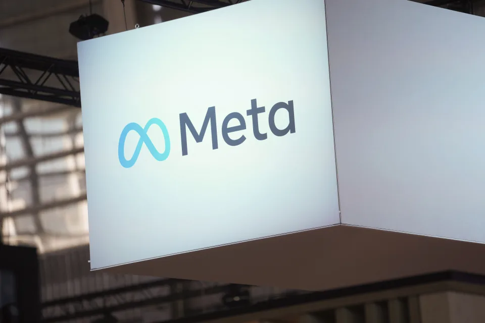
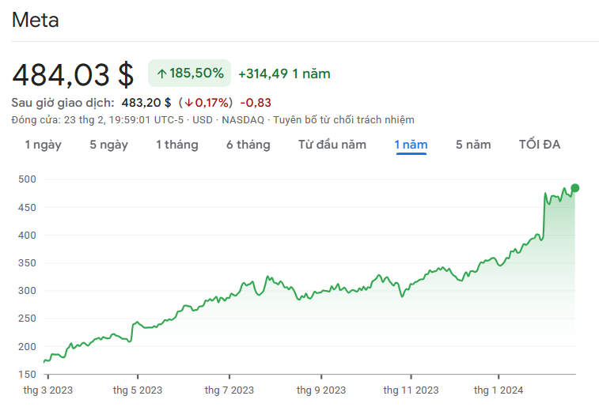
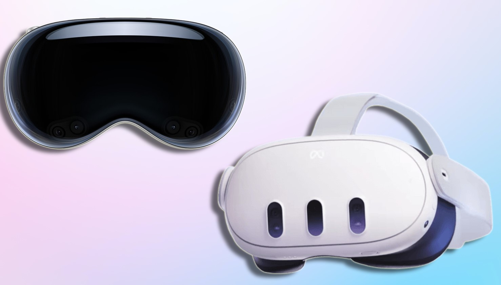
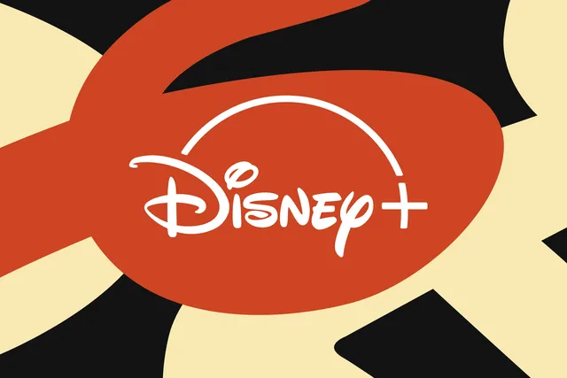
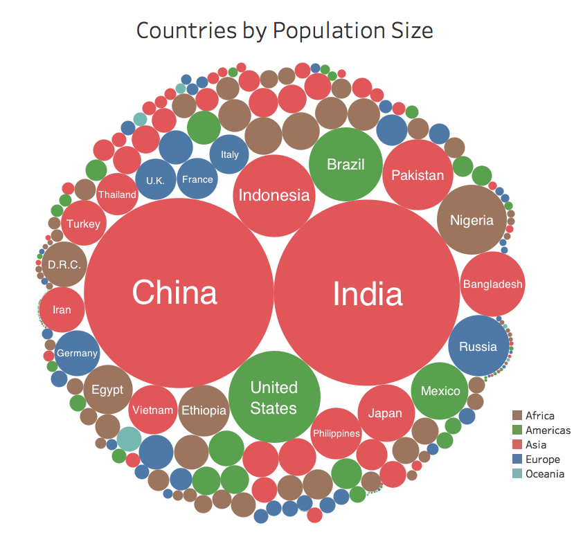

> Bài viết này sẽ không thể hoàn thành nếu thiếu sự đồng hành của bạn [Lê Huy Hoàng](https://www.facebook.com/hoang.lehuy.96343)

Khi trí tuệ nhân tạo đang là chủ đề nóng bỏng nhất và dường như Metaverse đã bị đặt sang một bên do quyết định của Mark Zuckerberg: **chuyển sự đầu tư từ Metaverse sang trí tuệ nhân tạo**[^Mark_pivot_AI]. Metaverse vẫn luôn là một chủ đề rất hấp dẫn và không thể tránh khỏi.

Trong cộng đồng các lập trình viên, Metaverse không còn là một khái niệm xa lạ. Nó đã trở thành một chủ đề được bàn tán sôi nổi, với nhiều ý kiến trái chiều. Một số người cho rằng Metaverse sẽ là tương lai của thế giới ảo, một số người khác lại cho rằng Metaverse chỉ là một trào lưu và sẽ không thể phát triển lâu dài. Sự thật là không ai biết chính xác tiềm năng tổng thể của Metaverse và tác động của nó đối với cuộc sống của chúng ta. Để Metaverse có thể xảy ra, cần hội tụ đủ rất nhiều yếu tố, từ công nghệ, đến nguồn lực và cả sự chấp nhận của cộng đồng. Điều này khác xa với tỷ lệ chấp nhận của internet, mạng xã hội, smartphone, v.v.

## Vậy, Metaverse - Vũ trụ ảo là gì?

Metaverse, hay còn gọi là vũ trụ ảo, là một mạng lưới rộng lớn gồm các thế giới ảo 3D đang được phát triển, nơi mọi người có thể tương tác với nhau bằng cách sử dụng các công nghệ như thực tế ảo (VR) và thực tế tăng cường (AR).

**Nguồn gốc:**

Thuật ngữ "Metaverse" được nhắc đến lần đầu tiên vào năm 1992 bởi tác giả Neal Stephenson trong cuốn tiểu thuyết khoa học viễn tưởng "Snow Crash"[^snow_crash]. Trong tác phẩm này, Metaverse được mô tả như một thế giới ảo nơi con người tương tác với nhau và sử dụng hình ảnh số hóa của chính họ để khám phá thế giới trực tuyến.

Dưới đây là một số đặc điểm chính của Metaverse:

- **Tính liên tục**: Metaverse là một thế giới ảo tồn tại 24/7, bất kể người dùng có đăng nhập hay không.
- **Tính 3D**: Metaverse cho phép người dùng trải nghiệm thế giới ảo một cách trực quan và sống động hơn thông qua hình ảnh 3D.
- **Tính tương tác**: Người dùng có thể tương tác với nhau, với các vật thể trong môi trường ảo và với các nội dung được tạo ra bởi người khác.
- **Tính phi tập trung**: Metaverse không được kiểm soát bởi một tổ chức duy nhất, mà được xây dựng và vận hành bởi nhiều công ty và cá nhân khác nhau.

<YouTubeEmbed videoid="D8GMeEZSfPQ" />

Mark Zuckerberg, CEO của Meta (trước đây là Facebook), là người tiên phong khởi đầu cho thế giới kỹ thuật số Metaverse. Vào tháng 10 năm 2021, ông thông báo rằng chiến lược của công ty sẽ tập trung vào phát triển Metaverse và Facebook không còn là thứ ưu tiên hàng đầu. Mục tiêu của Mark Zuckerberg là phát triển công nghệ giúp mọi người có thể tương tác và kết nối với nhau một cách chân thực hơn trong môi trường ảo.

## Mark Zuckerberg đã tiến được bao xa?

Facebok đã mua lại Oculus VR vào năm 2014 với giá 2 tỷ đô[^oculus_acquire]. Đây được xem là một bước quan trọng giúp Meta có được nền tảng cơ sở để phát triển công nghệ thực tế ảo.

Vào tháng 10 năm 2021, Facebook đã chính thức đổi tên công ty mẹ thành **Meta Platforms, Inc.**, đánh dấu một bước ngoặt quan trọng trong tầm nhìn và chiến lược phát triển của tập đoàn. Việc đổi tên này thể hiện rõ cam kết của Meta trong việc xây dựng "siêu vũ trụ" (Metaverse) - một môi trường ảo 3D kết hợp các yếu tố của mạng xã hội, trò chơi trực tuyến và thực tế ảo.[^meta_rebranding]

Meta đã đầu tư 10 tỷ đô vào Metaverse trong năm 2021[^meta_cost_1] và tính đến cuối tháng 10 năm 2022 số tiền đã đổ vào bộ phận **Reality Labs** ước tính lên đến 36 tỷ đô[^meta_cost_2]. Việc đầu tư này đã mang lại một số kết quả rõ rệt, bao gồm:

- **VR headsets**: Dòng kính thực tế ảo VR Quest của Meta đã trở thành một trong những lựa chọn phổ biến nhất đối với người tiêu dùng, mang đến cái nhìn thoáng qua về tiềm năng của những trải nghiệm sống động.
- **Horizon Worlds**: Nền tảng VR xã hội này cho phép người dùng tạo và khám phá không gian ảo, mặc dù có cơ sở người dùng và chức năng hạn chế.
- **Tích hợp nơi làm việc**: Meta đang khám phá các cách tích hợp VR vào nơi làm việc, chẳng hạn như cho các cuộc họp và cộng tác ảo.

Kể từ khi Mark Zuckerberg tuyên bố đổi thương hiệu Facebook thành Meta và đặt cược lớn vào Metaverse, giá trị của Meta đã giảm sút. Giá cổ phiếu của công ty giảm hơn 70% trong vòng chưa đầy một năm, với cổ phiếu giảm mạnh 23% sau khi công ty không đạt được mục tiêu thu nhập[^meta_falling]. Rớt khỏi top 20 công ty có giá trị thị trường lớn nhất nước Mỹ. Tuy nhiên, công ty vẫn tiếp tục đầu tư vào Metaverse và không có dấu hiệu rút lui.

Tưởng chừng như quyết định này của Mark Zuckerberg là một sai lầm lớn, nhưng thời gian đã chứng minh rằng Mark Zuckerberg không hề sai lầm. Giá trị cổ phiếu của Meta đã tăng trở lại kể từ đầu năm 2023 và tiếp tục tăng trưởng mạnh mẽ.

Tuy nhiên Metaverse mà Mark Zuckersberg muốn vẫn chưa thực sự xảy ra. Ngay cả nhân viên của Meta cũng hầu như không sử dụng ứng dụng Metaverse tiên tiến nhất của công ty, **Horizon Worlds**, và trong vài năm qua, định nghĩa về metaverse của Zuckerberg dường như đã thay đổi từ thế giới ảo kiểu **Ready Player One[^ready_player_ones]** sang một **thế giới kết hợp giữa thực và ảo** khi những thuật ngữ thời thượng mới như AI bắt đầu được chú ý. Dù bằng cách nào, tầm nhìn mới về internet này cũng không thực sự thành công theo cách Mark Zuckerberg lên kế hoạch - ít nhất là không phải từ Meta.

Mặc dù vậy, khi đem sản phẩm **kính thực tế ảo** ra so sánh với các đối thủ khác. Điển hình như kính thực tế ảo **Vision Pro** từ Apple. Kính thực tế ảo của Meta vượt trội hơn về mọi mặt. Từ giá thành, Meta Quest 3 có giá chỉ 500 USD khi so với 2500 USD của Vision Pro. Đến các công nghệ và phần cứng liên quan. Điều này khẳng định rằng, tuy chưa có nhiều thành công về Metaverse, nhưng Meta vẫn đang dẫn đầu về công nghệ thực tế ảo. Công nghệ làm nền tảng cho Metaverse.

## Còn ai trên đường đua?

Nói nhiều về Meta như thế này không có nghĩa là chỉ có mình Meta đang đầu tư vào Metaverse. Có rất nhiều công ty khác cũng đang âm thầm đầu tư vào Metaverse và phát triển với một tốc độ chóng mặt.

Điều bất ngờ nhất gần đây chính là sự thành công của **[Epic Games](https://www.epicgames.com/)** với đứa con cưng **[Fornite](https://www.fortnite.com/)**.

Vào ngày 8 tháng 2 năm 2024, **Disney** đã bất ngờ đầu tư 1.5 tỷ đô la vào Epic Games[^Disney_invest]. Với mục tiêu tạo ra thứ mà công ty này hằng mong muốn: "Vũ trụ trò chơi và giải trí rộng mở và bao la" gắn liền với tựa game Fornite. Điều này xuất phát từ một cuộc tái cấu trúc lớn của Fortnite vào đầu năm nay, trong đó nó chuyển từ một tựa game bắn súng trực tuyến sang một tập hợp các trải nghiệm được kết nối, từ tựa game kết hợp với **LEGO** cho đến trải nghiệm lễ hội âm nhạc ảo trong game[^fortnite_festival].

<YouTubeEmbed videoid="HsahlWt7Um0" />

​
**Tim Sweeney**, Giám đốc điều hành của Epic Games, là một người tin tưởng vào metaverse. Vào tháng 5 năm 2023, khi Business Insider đăng tải bài báo cho rằng metaverse sẽ gia nhập danh sách những trào lưu thất bại của ngành công nghệ[^RIP_Metaverse], Sweeney đã đăng tweet trả lời một cách đùa vui kêu gọi tổ chức một buổi tang lễ trực tuyến để "600 triệu người dùng hoạt động hàng tháng trong Fortnite, Minecraft, Roblox, PUBG Mobile, Sandbox và VRChat có thể cùng nhau chia buồn cho sự ra đi của nó trong thế giới 3D thời gian thực."

<StaticTweet id="1655995809270202392"/>

Disney trước đây đã có những nỗ lực riêng trong lĩnh vực này. Vào năm 2022, công ty đã giao nhiệm vụ cho giám đốc Mike White dẫn dắt các nỗ lực về metaverse của mình, với cựu CEO Bob Chapek tuyên bố "cái gọi là metaverse, mà tôi tin rằng là biên giới kể chuyện vĩ đại tiếp theo"[^disney_metaverse]. Một năm sau, bộ phận metaverse của họ đã bị loại bỏ như một phần của làn sóng sa thải hàng loạt[^disney_metaverse_cutoff].

Vậy điều gì đã tạo ra khác biệt? Tại sao một tập đoàn giải trí khổng lồ hay một mạng xã hội khổng lồ như Meta không thể khai thác được metaverse, nhưng một trò chơi ngớ ngẩn nơi một quả chuối có thể chiến đấu với Ariana Grande lại có thể? Câu trả lời là, vì đó là một trò chơi ngớ ngẩn. Meta và Disney (và mọi công ty khác đuổi theo xu hướng metaverse) bắt đầu với mong muốn tạo ra một tầm nhìn mới của internet, một thế giới ảo bao trùm tất cả có thể phục vụ làm nơi để chơi và làm việc. Nhưng họ không đưa ra lý do để mọi người muốn tồn tại trong không gian đó. Ngược lại, Fortnite bắt đầu như một thứ hàng triệu người thực sự muốn làm — chơi một trò chơi vui với các nhân vật họ biết và yêu thích — và xây dựng tham vọng thế giới ảo của mình dựa trên điều đó.

Sự phát triển của Fortnite đã diễn ra chậm rãi và ổn định kể từ khi nó ra mắt. Thực tế, nó bắt đầu như một trò chơi sinh tồn trước khi chế độ battle royale[^battle_royale] của nó trở nên phổ biến. Kể từ đó, Epic đã thử nhiều cách để biến Fortnite thành một địa điểm hơn là một trò chơi. Đã có các buổi hòa nhạc ảo, hàng triệu đô la được chi cho esports, các phòng trưng bày nghệ thuật, các khu vực tụ tập không bạo lực, và nhiều hơn nữa. Nhưng ở cốt lõi của điều này luôn là một trò chơi video thay đổi liên tục và phổ biến nhất quán. Thực tế, sự tái phát minh mới nhất của Fortnite được tiền đề bởi sự kiện hoài cổ Fortnite OG, được thiết kế để lôi kéo lại những người chơi đã bỏ game. Không có trò chơi, phần còn lại không thể thành công.[^fornite_og]

Epic và Meta không phải là những công ty tiềm năng duy nhất đang xây dựng metaverse của riêng họ. **Roblox (RBLX)** cũng tiếp tục phát triển khái niệm metaverse của mình. Và trong báo cáo thu nhập hàng quý gần đây nhất, công ty đã thông báo rằng họ đã đạt được 1 tỷ đô la doanh thu đặt hàng.

## Trung Quốc đại lục và Metaverse

Do tính chất kinh tế chính trị, các thông tin về Metaverse tại Trung Quốc đại lục không được công bố rộng rãi. Nhưng ta có thể nhìn vào một số điều kiện cần thiết để phát triển Metaverse mà đất nước này đang có.

**Dân số lớn**: Trung Quốc đại lục có dân số lớn nhất thế giới, với hơn 1,4 tỷ người. Điều này tạo ra một cơ hội lớn để phát triển Metaverse, vì có nhiều người dùng tiềm năng.

**Công nghệ**: Trung Quốc đang dẫn đầu thế giới trong việc phát triển công nghệ, đặc biệt là trong lĩnh vực trí tuệ nhân tạo, thực tế ảo và thực tế tăng cường. Ngoài ra các công ty công nghệ ở Trung Quốc cũng có một lợi thế lớn hơn so với các công ty công nghệ ở các quốc gia khác khi họ có được sự hậu thuẫn từ chính phủ. Các công ty như **Baidu**, **Tencent** hay **Byte Dance** đều đang đầu tư mạnh mẽ vào lĩnh vực này.

**Tốc độ số hóa**: Trung Quốc đang trải qua một quá trình số hóa nhanh chóng. Các "siêu ứng dụng" như **WeChat** đã trở thành một phần không thể thiếu trong cuộc sống hàng ngày của người dân Trung Quốc. Từ nhắn tin, thanh toán, mua sắm, đặt vé, đặt phòng, đặt xe, v.v. đều có thể thực hiện thông qua WeChat. Kể cả các dịch vụ chính phủ cũng đã được tích hợp vào WeChat.

**Chính sách chính phủ**: Chính phủ Trung Quốc hiện nay đang đầu tư mạnh mẽ vào quá trình này. Các ngành liên quan như công nghệ, giáo dục, tài chính, v.v. đều được chính phủ hỗ trợ mạnh mẽ. Ví dụ như chính sách không xài tiền mặt được thí điểm ở một số địa phương đã đem lại kết quả tích cực. Đưa Trung Quốc đại lục trở thành một trong những quốc gia tiên phong trong việc sử dụng tiền điện tử. **The Cashless Era** chính là một trong những bước đầu tiên để phát triển Metaverse.

Ta có thể thấy rằng hướng tiếp cận Metaverse của Trung Quốc đại lục khá khác biệt so với các quốc gia khác. Chính phủ là một trong những người đứng đằng sau việc phát triển Metaverse, so với các công ty tư nhân ở các quốc gia khác.

## Kết luận

Định nghĩa Metaverse hôm nay có lẽ đã khác hơn so với những năm trước. Thay vì đưa con người vào một thế giới ảo, Metaverse ngày nay có vẻ như đang cố gắng đưa thế giới ảo vào cuộc sống hàng ngày của con người. Có thể nó không phải là một thế giới ảo hoàn toàn, nhưng nó sẽ là một phần không thể thiếu trong cuộc sống hàng ngày của chúng ta.

[^Mark_pivot_AI]: [How AI Replaced the Metaverse as Zuckerberg’s Top Priority](https://www.bloomberg.com/news/features/2024-01-11/mark-zuckerberg-pivots-to-ai-from-Metaverse-to-further-his-legacy)
[^snow_crash]: [Snow Crash - Wikipedia](https://en.wikipedia.org/wiki/Snow_Crash)
[^meta_rebranding]:
    [Introducing Meta: A Social Technology Company
    ](https://about.fb.com/news/2021/10/facebook-company-is-now-meta/)

[^meta_cost_1]: [Facebook is spending at least $10 billion this year on its Metaverse division](https://www.theverge.com/2021/10/25/22745381/facebook-reality-labs-10-billion-Metaverse)
[^meta_cost_2]: [Meta has spent $36 billion building the Metaverse but still has little to show for it, while tech sensations such as the iPhone, Xbox, and Amazon Echo cost way less](https://www.businessinsider.com/meta-lost-30-billion-on-Metaverse-rivals-spent-far-less-2022-10)
[^oculus_acquire]: [Facebook to Acquire Oculus](https://about.fb.com/news/2014/03/facebook-to-acquire-oculus/)
[^meta_falling]:
    [Why is Mark Zuckerberg's Metaverse failing?
    ](https://techxplore.com/news/2022-11-zuckerberg-Metaverse.html)

[^ready_player_ones]: [Ready Player One - Wikipedia](<https://en.wikipedia.org/wiki/Ready_Player_One_(film)>)
[^Disney_invest]:
    [Disney invests $1.5 billion in Epic to create ‘persistent universe’ tied to Fortnite
    ](https://www.theverge.com/2024/2/7/24065281/disney-epic-games-investment-fortnite-metaverse)

[^fortnite_festival]:
    [Fortnite Festival is Rock Band without the plastic instruments
    ](https://www.theverge.com/2023/12/9/23992574/fortnite-festival-harmonix-guitar-hero-rock-band)

[^RIP_Metaverse]:
    [RIP Metaverse
    ](https://www.businessinsider.com/metaverse-dead-obituary-facebook-mark-zuckerberg-tech-fad-ai-chatgpt-2023-5)

[^disney_metaverse]:
    [Disney has appointed a leader for its metaverse strategy
    ](https://www.theverge.com/2022/2/15/22935445/disney-metaverse-strategy-plans-mike-white-memo)

[^disney_metaverse_cutoff]:
    [Disney reportedly eliminates metaverse division in first round of layoffs
    ](https://www.theverge.com/2023/3/28/23659691/disney-metaverse-job-cuts-eliminated)

[^battle_royale]: [Battle royale game](https://en.wikipedia.org/wiki/Battle_royale_game)
[^fornite_og]: [Fornite OG](https://www.theverge.com/2023/12/9/23993686/fortnite-og-new-players-lego-fortnite)
