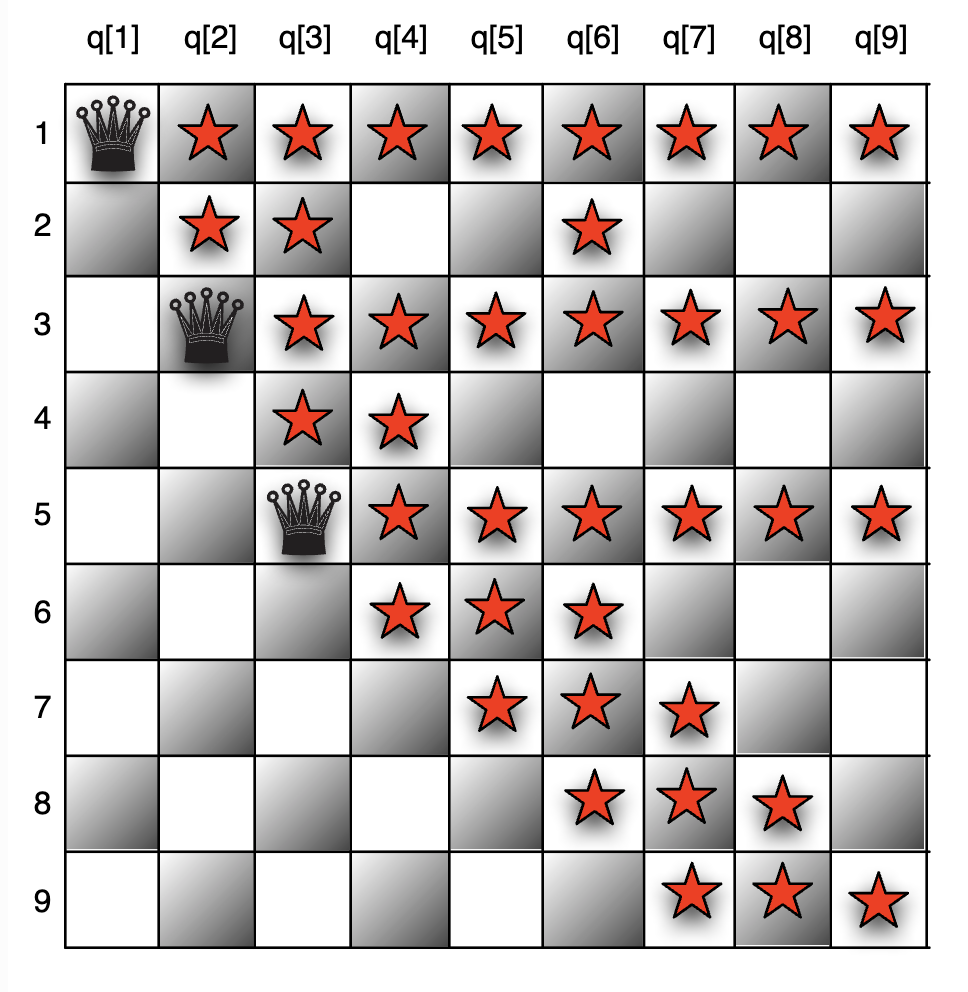

## Nỗi Khổ Và Niềm Vui Từ Một Bài Toán Lập Lịch Đơn Giản

Hãy hình dung bạn nhận một nhiệm vụ tưởng như tầm thường: tổ chức một buổi họp cho một nhóm nhỏ. Nghe qua thì đơn giản—chỉ có năm thành viên, ba phòng họp, và vài ràng buộc rõ ràng: Alice không họp được vào thứ Sáu; nếu Carol tham dự thì Bob phải ở Phòng A; sau 3 giờ chiều, Phòng C không còn khả dụng; và David buộc phải tham gia từ xa, nên phòng họp phải có máy chiếu.

Một lập trình viên đi theo lối tư duy mệnh lệnh (imperative thinking) sẽ tiếp cận vấn đề bằng cách nào? Thông thường, họ sẽ bắt đầu bằng việc xây dựng các vòng lặp lồng nhau để duyệt toàn bộ khả năng: từng người, từng phòng, từng khung giờ. Sau đó, một chuỗi rối rắm các câu lệnh điều kiện `if-then-else` sẽ lần lượt được cài đặt để kiểm tra các ràng buộc. Kết quả là một khối mã nặng nề, khó đọc, và bản thân lập trình viên cũng khó mà tiên đoán được điều gì sẽ xảy ra khi thêm một quy tắc mới.

Vấn đề sâu xa không chỉ là sự dài dòng hay tính “lộn xộn” của đoạn mã. Điểm then chốt là độ “dễ vỡ” (fragility). Hãy tưởng tượng một tình huống mới: Eve vừa gia nhập nhóm, và cô ấy không thể họp vào thứ Hai. Một ràng buộc đơn giản như vậy có thể phá vỡ toàn bộ cấu trúc điều kiện vốn đã được xây dựng công phu. Hệ thống logic không còn bền vững: một thay đổi nhỏ trong bài toán dẫn đến một chuỗi thay đổi phức tạp, khó kiểm soát, và đầy nguy cơ phát sinh lỗi. Đây là minh họa điển hình cho sự hạn chế của tư duy mệnh lệnh khi áp dụng vào các bài toán tổ hợp, chẳng hạn như bài toán lập lịch.

Vậy còn cách nào khác? Nếu thay vì ra lệnh từng bước cho máy tính “phải làm thế nào” (how), ta chỉ cần mô tả bản chất của một lịch họp hợp lệ—tức là đặc tả các tính chất mà kết quả cuối cùng phải thỏa mãn—thì sao? Khi đó, thay vì trở thành người quản lý thủ công của vô số nhánh logic, ta trao cho máy tính quyền tự tìm kiếm câu trả lời dựa trên mô tả. Đây chính là bản chất của lập trình khai báo (declarative programming): chuyển dịch trọng tâm từ điều khiển chi tiết sang mô tả ý định.

## 1. Một Sự Thay Đổi Về Tư Duy: Từ Chỉ Dẫn "Làm Thế Nào" Đến Mô Tả "Cái Gì"

Để hiểu được vẻ đẹp của việc mô hình hóa bài toán, trước tiên chúng ta cần phân biệt rõ ràng hai mô hình lập trình cơ bản.

**Lập Trình Mệnh Lệnh (Imperative Programming)**

Trong mô hình này, bạn đóng vai trò là một người quản lý vi mô. Bạn cung cấp một chuỗi các lệnh chính xác, có thứ tự mà máy tính phải thực thi. Trọng tâm là thao tác trạng thái của chương trình (thay đổi giá trị của các biến) để đi đến một giải pháp. Lập trình mệnh lệnh tập trung vào luồng điều khiển—bạn phải tự mình vạch ra con đường từng bước để giải quyết vấn đề.

**Lập Trình Khai Báo (Declarative Programming)**

Ngược lại, trong mô hình này, bạn là một kiến trúc sư. Bạn cung cấp một bản thiết kế của kết quả cuối cùng. Bạn mô tả các thuộc tính, mối quan hệ và quy tắc mà giải pháp phải thỏa mãn, nhưng bạn không chỉ định các bước thực thi. Trọng tâm ở đây là logic của việc tính toán.

Lập trình ràng buộc (Constraint Programming - CP) là một hiện thân mạnh mẽ và thực tế của phương pháp khai báo, được thiết kế đặc biệt cho các bài toán tổ hợp và tối ưu hóa. Đây là một công nghệ cho phép giải quyết vấn đề bằng cách nêu ra các ràng buộc mà một giải pháp phải tuân thủ.

### Ba Trụ Cột Của Một Mô Hình Ràng Buộc

Bất kỳ bài toán Lập trình Ràng buộc nào cũng được xây dựng dựa trên ba thành phần cốt lõi:

- **Biến (Variables)**: Đây là những ẩn số hoặc các quyết định cần được đưa ra. Ví dụ: màu sắc của một tiểu bang, thời gian bắt đầu của một công việc.
- **Miền Giá Trị (Domains)**: Đây là tập hợp các giá trị có thể có cho mỗi biến. Ví dụ: \{đỏ, xanh lá, xanh dương\}, hay một khoảng số nguyên từ 1 đến 10.
- **Ràng Buộc (Constraints)**: Đây là các mối quan hệ logic hoặc quy tắc giới hạn các giá trị mà các biến có thể nhận đồng thời. Ví dụ: $x + y < 10$, $wa \neq nt$ (màu của bang Tây Úc phải khác màu của Lãnh thổ phía Bắc). Mục tiêu là tìm một phép gán giá trị cho tất cả các biến sao cho tất cả các ràng buộc đều được thỏa mãn.

Sự chuyển đổi từ "làm thế nào" sang "cái gì" không chỉ là một sự khác biệt về ngữ nghĩa; nó nâng vai trò của lập trình viên từ _một người triển khai thuật toán_ lên thành _một kiến trúc sư bài toán_. Trong thế giới mệnh lệnh, lập trình viên chịu trách nhiệm cho cả việc hiểu bài toán và thiết kế một thuật toán hiệu quả (ví dụ: tìm kiếm quay lui, quy hoạch động) để giải quyết nó. Trong thế giới CP, trách nhiệm chính của lập trình viên là tạo ra một mô hình rõ ràng, chính xác và hiệu quả cho bài toán. Công việc thuật toán phức tạp của việc tìm kiếm giải pháp, lan truyền ràng buộc và cắt tỉa không gian tìm kiếm được ủy thác cho một phần mềm riêng biệt, được tối ưu hóa cao gọi là "bộ giải" (solver). Sự phân chia trách nhiệm này cho phép lập trình viên tập trung năng lượng nhận thức của họ vào nhiệm vụ cấp cao hơn là xây dựng bài toán, dẫn đến mã nguồn rõ ràng hơn và khả năng giải quyết các vấn đề có độ phức tạp lớn hơn nhiều.

Bảng dưới đây tóm tắt những khác biệt cơ bản giữa hai mô hình:

| Khía Cạnh              | Lập Trình Mệnh Lệnh ("HOW")                                          | Lập Trình Khai Báo ("WHAT")                                                 |
| ---------------------- | -------------------------------------------------------------------- | --------------------------------------------------------------------------- |
| Trọng Tâm Chính        | Chuỗi các bước cần thực thi.                                         | Các thuộc tính logic của kết quả cuối cùng.                                 |
| Vai Trò Lập Trình Viên | Nhà Thiết Kế Thuật Toán: Chỉ định luồng điều khiển.                  | Kiến Trúc Sư Bài Toán: Mô tả các biến và ràng buộc.                         |
| Mã Nguồn Mô Tả         | Cách thức để đạt được kết quả.                                       | Hình dáng của kết quả trông như thế nào.                                    |
| Quản Lý Trạng Thái     | Dựa vào trạng thái có thể thay đổi và các hiệu ứng phụ.              | Hướng tới tính bất biến và không có hiệu ứng phụ.                           |
| Khả Năng Bảo Trì       | Giòn; một thay đổi trong quy tắc thường đòi hỏi viết lại thuật toán. | Vững chắc; một thay đổi trong quy tắc thường chỉ là thêm/sửa một ràng buộc. |
| Phép So Sánh           | Đưa ra chỉ đường từng ngã rẽ.                                        | Cung cấp địa chỉ đích và để GPS tìm đường đi.                               |
| Các Mô Hình Liên Quan  | Lập trình thủ tục, Lập trình hướng đối tượng.                        | Lập trình logic, Lập trình hàm, Lập trình ràng buộc.                        |

## 2. Gặp Gỡ MiniZinc: “Thông dịch viên” vạn năng cho các bài toán tối ưu hóa

Câu hỏi đặt ra là: công cụ nào có thể giúp chúng ta hiện thực hóa sự chuyển dịch tư duy từ “lập trình mệnh lệnh” sang “lập trình khai báo” một cách hiệu quả? Câu trả lời nằm ở MiniZinc.

MiniZinc không phải là một ngôn ngữ lập trình theo nghĩa truyền thống. Nó là một **ngôn ngữ mô hình hóa cấp cao**, được thiết kế để diễn đạt các bài toán thỏa mãn ràng buộc và tối ưu hóa theo cách gần gũi với ký hiệu toán học. Nói cách khác, thay vì hướng dẫn từng bước, bạn chỉ cần mô tả bản chất của vấn đề, và để bộ giải đảm nhiệm phần còn lại.

### Tính độc lập với bộ giải

Đây là sức mạnh cốt lõi của MiniZinc. Một mô hình duy nhất (tệp `.mzn`) được viết ra để mô tả bài toán. MiniZinc sau đó sẽ kết hợp mô hình này với dữ liệu (tệp `.dzn`) và biên dịch thành FlatZinc (`.fzn`)—một ngôn ngữ trung gian chuẩn hóa, có thể được hiểu bởi nhiều loại bộ giải khác nhau.

Nhờ đó, một mô hình MiniZinc duy nhất có thể được chuyển giao cho các lớp bộ giải chuyên biệt:

- Bộ giải Lập trình Ràng buộc (Constraint Programming – CP): như Gecode, Chuffed. Mạnh mẽ cho các ràng buộc logic phức tạp và các bài toán lập lịch.
- Bộ giải Quy hoạch Nguyên hỗn hợp (Mixed-Integer Programming – MIP): như Gurobi, CPLEX, CBC. Xuất sắc cho các bài toán tuyến tính với ràng buộc nguyên.
- Bộ giải Thỏa mãn Mệnh đề (SAT Solvers): như fzntini. Tinh gọn cho những bài toán có thể quy về logic mệnh đề.

Điểm then chốt không chỉ là sự tiện lợi, mà là một chiến lược công nghệ dài hạn. Mỗi lớp bộ giải đều có thế mạnh riêng. Với một bài toán cụ thể, rất khó để tiên đoán trước đâu là lựa chọn tối ưu. Nếu mô hình được viết trực tiếp cho một công cụ (ví dụ, MIP cho Gurobi), tổ chức sẽ bị khóa chặt công nghệ (technological lock-in). Khi hiệu suất không đạt kỳ vọng, việc chuyển sang một bộ giải khác đòi hỏi viết lại toàn bộ mô hình—tốn kém và rủi ro.

MiniZinc cung cấp một lớp trừu tượng, tách biệt mô hình hóa bài toán khỏi công nghệ giải quyết. Điều này cho phép:

- Viết một lần, thử nghiệm nhiều lần: cùng một mô hình có thể được kiểm tra trên nhiều bộ giải để tìm ra lựa chọn tối ưu.
- Giảm thiểu rủi ro công nghệ: không cần lo lắng về quyết định sai lầm trong giai đoạn đầu.
- Tương thích với tương lai (future-proof): khi các bộ giải mới xuất hiện, mô hình MiniZinc cũ vẫn có thể tận dụng sức mạnh của chúng mà không cần chỉnh sửa.

Nói cách khác, thay vì là một giải pháp “dùng một lần”, mô hình MiniZinc trở thành một tài sản trí tuệ có khả năng tái sử dụng lâu dài.

## 3. Từ Quy Tắc Đến Thực Tế: Khởi Đầu Với Những Mô Hình MiniZinc

Một mô hình trong MiniZinc thường gồm bốn thành phần chính:

- **Khai báo tham số** (ví dụ: `int: n;`),
- **Khai báo biến quyết định** (ví dụ: `var 1..n: x;`),
- **Các ràng buộc** (`constraint ...`),
- **Câu lệnh giải (solve statement)**, chẳng hạn `solve satisfy` hoặc `solve maximize obj;`.

Những yếu tố này kết hợp với nhau tạo thành một đặc tả hình thức, vừa cô đọng vừa chính xác, của chính bài toán.

**Ví dụ 1: Tô màu bản đồ nước Úc**

**Phát biểu bài toán:** Tô màu các bang của Úc bằng một số lượng màu cho trước, sao cho không có hai bang kề nhau nào có cùng màu.

<div className="bg-white py-3"></div>

Dưới đây là mã nguồn trong MiniZinc cho bài toán này:

```minizinc
% Tô màu nước Úc bằng nc màu
int: nc = 3;

% Khai báo biến quyết định cho mỗi bang
var 1..nc: wa; % Western Australia
var 1..nc: nt; % Northern Territory
var 1..nc: sa; % South Australia
var 1..nc: q;  % Queensland
var 1..nc: nsw;% New South Wales
var 1..nc: v;  % Victoria
var 1..nc: t;  % Tasmania

% Các ràng buộc: các bang liền kề phải có màu khác nhau
constraint wa!= nt;
constraint wa!= sa;
constraint nt!= sa;
constraint nt!= q;
constraint sa!= q;
constraint sa!= nsw;
constraint sa!= v;
constraint q!= nsw;
constraint nsw!= v;

% Tìm một nghiệm hợp lệ
solve satisfy;

% Định dạng đầu ra
output ["wa=", show(wa), "\t nt=", show(nt), "\t sa=", show(sa), "\n",
        "q=", show(q), "\t nsw=", show(nsw), "\t v=", show(v), "\n",
        "t=", show(t), "\n"];
```

Điều đáng chú ý là sự “trong suốt” của mô hình: dòng `var 1..nc: wa;` nghĩa đen là “Tây Úc phải được gán một màu từ 1 đến nc”. Ràng buộc `wa != sa;` chính là “Tây Úc và Nam Úc không thể có cùng màu”. Không có vòng lặp phức tạp, không có điều kiện lồng nhau—mã chính là đặc tả của bài toán.

#### Ví dụ 2: Bài toán N quân hậu

**Phát biểu bài toán:** Đặt N quân hậu lên bàn cờ N×N sao cho không có hai quân hậu nào có thể tấn công lẫn nhau.

MiniZinc cho phép mô hình hóa ngắn gọn:

```minizinc
int: n = 8;

% q[i] là cột của quân hậu ở hàng i
array[1..n] of var 1..n: q;

% Không quân hậu nào chung cột
constraint all_different(q);

% Không quân hậu nào cùng đường chéo đi lên
constraint all_different([q[i] + i | i in 1..n]);

% Không quân hậu nào cùng đường chéo đi xuống
constraint all_different([q[i] - i | i in 1..n]);

solve satisfy;
```

Ở đây, ràng buộc toàn cục `all_different` thể hiện một ý tưởng phức tạp bằng một mệnh đề duy nhất. Trong một ngôn ngữ mệnh lệnh, ta sẽ phải tự viết vòng lặp hoặc cấu trúc dữ liệu hỗ trợ để kiểm tra từng cặp giá trị. Với MiniZinc, ta chỉ cần nói: “tất cả phải khác nhau”. Bộ giải phía sau còn có những thuật toán tối ưu đặc biệt (propagators) để tận dụng cấu trúc này, giúp quá trình tìm kiếm hiệu quả hơn đáng kể.



Điểm mấu chốt: người mô hình hóa tập trung vào bản chất toán học của vấn đề, không sa vào chi tiết triển khai.

Các ví dụ mang tính “câu đố” giúp minh họa ý tưởng, nhưng giá trị thật sự của MiniZinc nằm ở việc xử lý các **bài toán công nghiệp quy mô lớn**, nơi hàng trăm hay hàng ngàn ràng buộc phải được xét đến đồng thời.

Một số lĩnh vực ứng dụng nổi bật:

- **Lập lịch (Scheduling):** từ phân ca nhân sự, lịch bay cho phi hành đoàn, đến tối ưu hóa chuỗi sản xuất.
- **Logistics & Chuỗi cung ứng:** định tuyến phương tiện, quản lý tồn kho, bài toán vị trí cơ sở.
- **Phân bổ tài nguyên:** gán phòng học, điều phối CPU, phân chia nhân sự dự án.
- **Lập kế hoạch dài hạn:** sản xuất, tài chính, đầu tư.

Ví dụ: một robot công nghiệp vừa cần lập lịch chuyển động cánh tay (cumulative), vừa phải tìm đường đi tối ưu (circuit), và đồng thời tránh va chạm với các vật thể (diffn). MiniZinc cho phép ta mô hình hóa toàn bộ sự phức tạp này như một hệ thống tích hợp duy nhất.

## Kết luận

Chúng ta đã đi từ tư duy mệnh lệnh “làm thế nào” sang tư duy khai báo “bản chất là gì”. MiniZinc cung cấp ngôn ngữ, và các bộ giải cung cấp động cơ.

Giá trị sâu sắc nhất của MiniZinc không chỉ ở kết quả tính toán, mà ở **cách nó buộc chúng ta suy nghĩ**. Để mô hình hóa, ta phải lùi lại, phân tích vấn đề từ nguyên lý đầu tiên: đâu là quyết định cần đưa ra, đâu là quy tắc tuyệt đối, đâu là mục tiêu tối thượng. Mô hình kết quả trở thành một **đặc tả có thể thực thi**, vừa rõ ràng vừa chính xác. Đây không chỉ là kỹ thuật, mà còn là một kỷ luật tư duy.

## Tham khảo

- [Constraint Programming](https://ondrej-kvasnovsky.medium.com/constraint-programming-ac8b4f49cdd2)

- [Difference Between Imperative and Declarative Programming](https://www.geeksforgeeks.org/theory-of-computation/difference-between-imperative-and-declarative-programming/)

- [How do you conceptualize the difference between 'Imperative' vs 'Declarative' Programming?](https://www.reddit.com/r/compsci/comments/17wv25o/how_do_you_conceptualize_the_difference_between/)

- [Constraint programming](https://en.wikipedia.org/wiki/Constraint_programming)

- [Constraint Guide - Introduction](https://ktiml.mff.cuni.cz/~bartak/constraints/intro.html)

- [MiniZinc: Towards A Standard CP Modelling Language](https://people.eng.unimelb.edu.au/pstuckey/papers/minizinc.pdf)

- [Constraint Solving with Minizinc](https://www.hillelwayne.com/post/minizinc/)

- [The MiniZinc-SAT Compiler](https://www.diva-portal.org/smash/get/diva2:1539677/FULLTEXT01.pdf)

- [1.1. Introduction](https://docs.minizinc.dev/en/latest/intro.html)

- [Constraint Modeling - with MiniZinc](https://www.karlin.mff.cuni.cz/~stanovsk/vyuka/1718/msw_constraint-modeling.pdf)

- [MiniZinc/libminizinc](https://github.com/MiniZinc/libminizinc)
