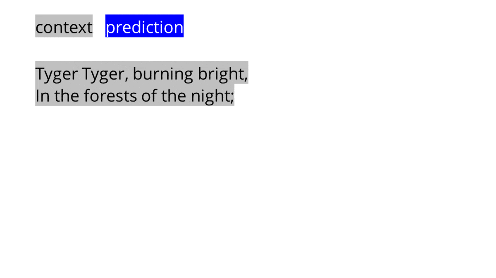
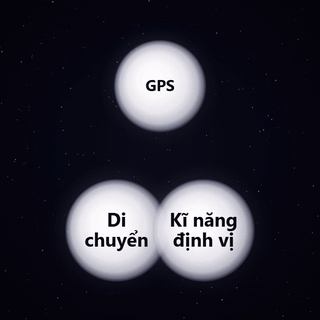

Vậy là đã hơn 3.5 năm kể từ ngày ChatGPT ra mắt công chúng. Nhiều sự kiện đã xảy ra. Quá trình phát triển của AI đã có những bước tiến vượt bậc, và nó đã trở thành một phần không thể thiếu trong cuộc sống hàng ngày của chúng ta. Tuy nhiên khi có thời gian nhìn lại và suy ngẫm, tôi nhận ra rằng AI cũng chỉ là một bước đột phá "bình thường" khác của công nghệ và việc nó ảnh hưởng đến chúng ta hiện nay cũng không khác gì các đột phá trước đây.

Dưới đây là một số quan sát và chiêm nghiệm của tôi về AI.

**1. Nhiều người vẫn không hiểu AI là gì**

Từ các quan sát trên X (Twitter), Reddit, các hội nhóm trên Facebook về AI và một số nền tảng mạng xã hội khác. Tôi nhận ra có 2 luồng ý kiến trái ngược nhau về AI. Một bên thì cho rằng AI là phát minh vĩ đại nhất của nhân loại, có thể thay đổi thế giới và mang lại nhiều lợi ích cho con người. Bên kia thì cho rằng AI là một mối đe dọa, có thể gây ra nhiều hậu quả tiêu cực cho xã hội, như mất việc làm, mất quyền riêng tư, và thậm chí là nguy cơ tồn vong của loài người.

Tuy nhiên, cả hai luồng ý kiến này đều có một điểm chung là họ không định nghĩa rõ ràng AI là gì. Điều này dẫn đến việc họ có những quan điểm rất khác nhau về AI, và đôi khi còn mâu thuẫn với nhau.

Một số thảo luận phổ biến:

- "AI là công cụ"
- "AI không phải là công cụ, nó là một agentic system"
- "AI là một dạng autocomplete"
- "AI không có ý thức, nó chỉ là một mô hình ngôn ngữ lớn"
- "AI chắc chắn có nhận thức, nó có thể tự học và tự phát triển"

Rốt cuộc không ai hiểu AI là gì cả!

Đa số những người "cuồng AI" chủ yếu là những người làm ở các cấp quản lí, những người không có kiến thức chuyên sâu về công nghệ, và họ chỉ tiếp cận AI qua những bài báo, video, và các sản phẩm AI đã được thương mại hóa. Trong khi đó, những người "anti-AI" thường là những người có kiến thức sâu về công nghệ, hoặc những người có chuyên môn cao về lĩnh vực mà ở đó nó đang bị ảnh hưởng bởi AI, đa số họ ghét AI là vì những người không học gì về lĩnh vực của họ lại có thể làm ra sản phẩm trong một thời gian ngắn để đi đánh vào thị trường của họ. Xem như bao năm học hành, nghiên cứu, và làm việc của họ bị hạ thấp giá trị chỉ trong một thời gian ngắn. Điều này dẫn đến việc họ có những quan điểm rất tiêu cực về AI, và họ thường xuyên chỉ trích và phản đối AI trên các nền tảng mạng xã hội.

**2. Bản chất của AI**

Vậy bản chất của AI thật sự là gì?

Tôi khá đồng tình với quan điểm cho rằng: **AI, là một dạng "autocomplete" cực kỳ phức tạp**.

Nói một cách dễ hiểu, những hệ thống AI mà chúng ta đang sử dụng ngày nay thực chất là các mô hình toán học được huấn luyện trên một lượng dữ liệu khổng lồ do con người tạo ra. Trong quá trình huấn luyện, mô hình học được các quy luật, khuôn mẫu, mối liên hệ và xác suất xuất hiện giữa các đơn vị thông tin. Khi người dùng đưa vào một input, mô hình sẽ dự đoán output phù hợp nhất dựa trên những gì nó đã học được.

Với ChatGPT, hay rộng hơn là các mô hình ngôn ngữ lớn — Large Language Models, LLM — cơ chế này thể hiện khá rõ. Mô hình nhận vào một đoạn văn bản, sau đó dự đoán những từ hoặc token tiếp theo có khả năng xuất hiện cao nhất, sao cho câu trả lời trở nên hợp lý, liền mạch và phù hợp với ngữ cảnh. Nói ngắn gọn, nó không “hiểu” theo cách con người hiểu, mà vận hành bằng cách dự đoán chuỗi ngôn ngữ tiếp theo dựa trên xác suất.

Với các mô hình tạo ảnh như Stable Diffusion, nguyên lý cũng có điểm tương tự, nhưng thay vì dự đoán từ ngữ, mô hình dự đoán cấu trúc thị giác của hình ảnh. Người dùng nhập vào một đoạn mô tả bằng ngôn ngữ tự nhiên, chẳng hạn “một con mèo đang ngồi trên ghế trong phong cách tranh sơn dầu”. Từ mô tả đó, mô hình từng bước tạo ra hình ảnh tương ứng.

Cụ thể hơn, mô hình bắt đầu từ một hình ảnh nhiễu, gần như vô nghĩa, rồi dần dần khử nhiễu qua nhiều bước. Ở mỗi bước, nó dự đoán phần thông tin cần được làm rõ để hình ảnh ngày càng gần hơn với mô tả ban đầu. Quá trình này có thể hình dung như việc làm rõ một bức ảnh bị làm mờ, từng chút một, cho đến khi thu được một hình ảnh hoàn chỉnh.

**3. Sự hoang mang đến từ AI**

Xuyên suốt lịch sử, công nghệ luôn phân tách các khái niệm vốn trước đây luôn đi liền với nhau. Chữ viết tách kiến thức khỏi trí nhớ; đồng hồ tách thời gian khỏi mặt trời; GPS tách việc di chuyển khỏi kỹ năng định vị; và thuốc tránh thai tách biệt tình dục khỏi việc sinh sản...

Và AI, là một động lực nữa của sự tách rời đó. Mọi người đang cố dùng từ ngữ để mô tả AI, nhưng chính AI sẽ tách những từ ngữ đó ra. Hãy gọi nó là “phân hạch khái niệm” — Concept Fission. Khi những khái niệm từng đi cùng nhau bị tách rời.

Một nghìn năm trước, không có chuyện đi siêu thị mua đồ. Khi đó, nếu bạn muốn có thức ăn, bạn phải tự làm ra nó. Bạn phải tự mình đi săn bắt, hái lượm, trồng trọt, chăn nuôi, và chế biến thức ăn.

Không có lựa chọn nào khác. Nghe với chúng ta bây giờ thật điên rồ. Nhưng trong phần lớn lịch sử loài người, thức ăn bạn ăn là thức ăn bạn tự làm. Rồi tủ lạnh, vận tải, máy kéo, chuỗi cung ứng, siêu thị xuất hiện, và cái gói ấy bị tách ra. Giờ đây việc kiếm thức ăn chỉ là một việc vặt. Chúng ta thậm chí không nghĩ về nó. Một việc căn bản như tự tạo ra thức ăn cho bản thân giờ không còn là chuyện lớn nữa, bởi vì cái gói đã bị tách. Chúng ta có thể có thức ăn mà không cần dành cả đời cho nó.
