Mỗi quyết định, thông tư hay nghị quyết đều là một mảnh ghép nhỏ trong lịch sử pháp luật. Gộp hơn nửa triệu mảnh ghép ấy lại, ta có thể nhìn ra cách vận hành của Việt Nam — không qua lời kể, mà qua dữ liệu.

Bài viết này dựa trên bộ dữ liệu do mình tổng hợp và công bố trên [HuggingFace](https://huggingface.co/datasets/th1nhng0/vietnamese-legal-documents), gồm **515.253 văn bản pháp luật** từ năm 1924 đến 2025.

---

## Dòng thời gian: Lịch sử qua những con số

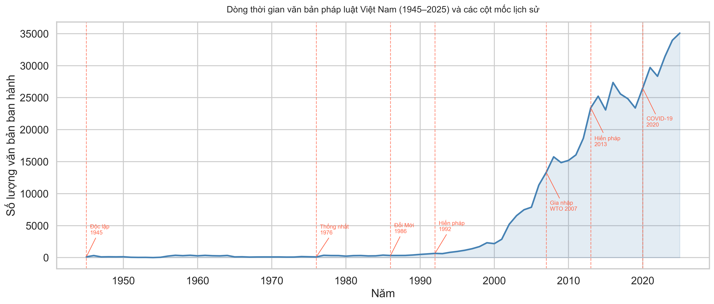

Biểu đồ trên cho thấy số lượng văn bản pháp luật qua từng năm — một cách kể lại lịch sử khá thú vị.

Trước **Đổi Mới (1986)**, mỗi năm chỉ có vài trăm đến vài nghìn văn bản. Sau khi mở cửa kinh tế, con số này tăng dần. Đến **Hiến pháp 1992**, đà tăng rõ rệt hơn khi khuôn khổ pháp lý cho kinh tế thị trường bắt đầu hình thành.

Bước ngoặt lớn là giai đoạn **gia nhập WTO (2007)** — hàng loạt luật, nghị định, thông tư được ban hành để đáp ứng cam kết quốc tế. Đến năm 2010, lần đầu tiên số văn bản vượt mốc 15.000/năm.

Đại dịch **COVID-19 (2020)** khiến nhịp ban hành chững lại một chút, nhưng chỉ tạm thời. Năm 2025, hệ thống đạt kỷ lục mới với gần **35.000 văn bản trong một năm**.

---

## Tăng trưởng theo thập kỷ

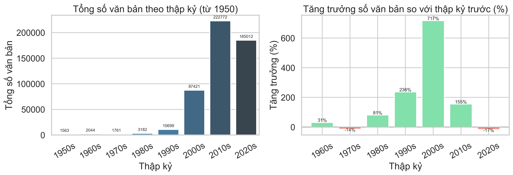

Nhìn theo thập kỷ, mức tăng trưởng rất ấn tượng:

- **Thập niên 2000s**: Tăng **717%** so với 1990s — từ 10.699 lên 87.421 văn bản.
- **Thập niên 2010s**: Tiếp tục tăng **155%**, đạt **222.772 văn bản**.
- **Thập niên 2020s** (đến hiện tại): 185.012 văn bản, giảm nhẹ 17% so với thập kỷ trước.

Đáng chú ý, thập niên 1970s là giai đoạn duy nhất có tăng trưởng âm (-14%). Đất nước vừa thống nhất, hệ thống hành chính hai miền đang trong quá trình chuyển giao và tái cơ cấu.

---

## Trung ương vs. Địa phương: Ai ban hành nhiều hơn?

Một câu hỏi quen thuộc trong quản lý nhà nước: quyền lực nên tập trung hay phân cấp? Dữ liệu cho thấy câu trả lời đã thay đổi theo thời gian.

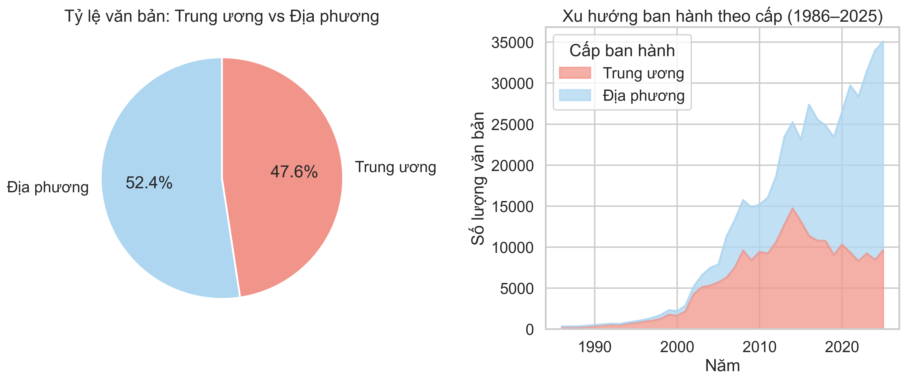

Tính tổng, **Trung ương chiếm 47,6%** và **Địa phương chiếm 52,4%** — khá cân bằng. Nhưng điều thú vị nằm ở xu hướng.

Từ biểu đồ giai đoạn 1986–2025: thời kỳ đầu, Trung ương chiếm phần lớn. Nhưng từ đầu những năm 2000, Địa phương dần vượt lên và chiếm tỷ trọng ngày càng lớn. Quá trình phân cấp phân quyền không chỉ là chủ trương — nó thể hiện rõ trong dữ liệu.

---

## Top 20 cơ quan ban hành nhiều văn bản nhất

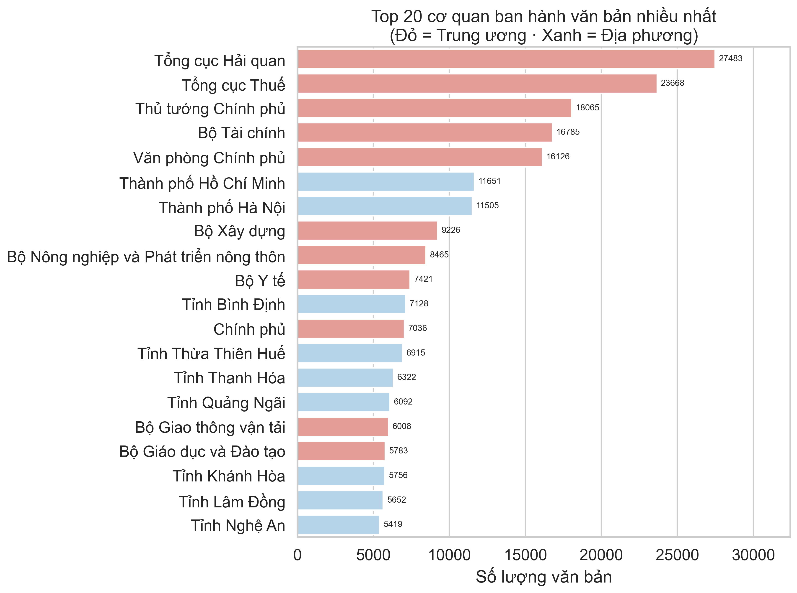

Hai vị trí dẫn đầu có thể gây bất ngờ: **Tổng cục Hải quan** (27.483 văn bản) và **Tổng cục Thuế** (23.668 văn bản) — nhiều hơn cả **Thủ tướng Chính phủ** (18.065 văn bản).

Nhưng nghĩ kỹ thì hợp lý. Hải quan và thuế phải xử lý lượng lớn nghiệp vụ hàng ngày, liên tục ban hành công văn hướng dẫn cho doanh nghiệp và người nộp thuế.

Ở cấp địa phương, **TP. Hồ Chí Minh** (11.651) và **TP. Hà Nội** (11.505) dẫn đầu — hai đô thị lớn nhất nước cũng là nơi ban hành nhiều văn bản nhất.

---

## Nhịp theo mùa: Tháng nào bận nhất?

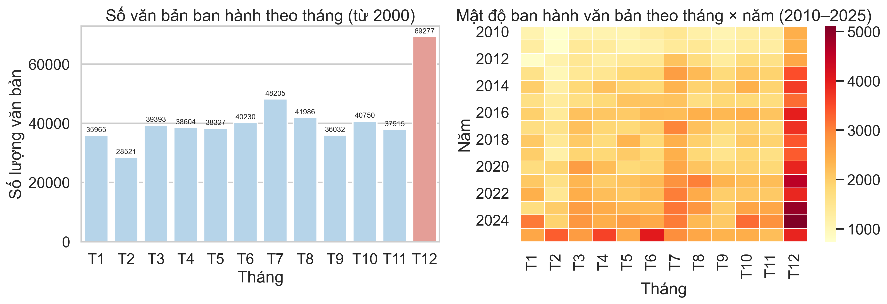

Bộ máy hành chính có nhịp hoạt động riêng theo tháng, và dữ liệu cho thấy rõ điều này.

**Tháng 12 là tháng bận rộn nhất** với 69.277 văn bản — gấp đôi tháng ít nhất. Cuối năm là lúc tổng kết, rà soát ngân sách, phê duyệt dự án mới và hoàn thành các chỉ tiêu còn dở dang.

Ngược lại, **Tháng 2 là tháng yên ắng nhất** (28.521 văn bản) do trùng với kỳ nghỉ Tết Nguyên Đán.

**Tháng 7** đứng thứ hai (48.205 văn bản) — thời điểm sơ kết 6 tháng đầu năm và điều chỉnh kế hoạch.

Bản đồ nhiệt bên phải cho thấy quy luật này lặp lại khá đều từ năm 2010: tháng 12 luôn đậm màu, tháng 2 luôn nhạt.

---

## Ưu tiên quốc gia thay đổi qua các thập kỷ

Mỗi thập kỷ, đất nước đối mặt với những ưu tiên khác nhau. Biểu đồ nhiệt dưới đây cho thấy tỷ trọng văn bản theo từng lĩnh vực qua các giai đoạn.

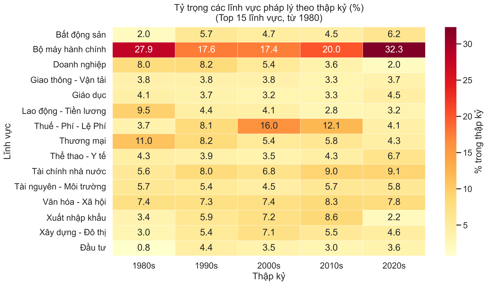

Một số điểm đáng chú ý:

- **Bộ máy hành chính** luôn dẫn đầu, đạt **32,3%** ở những năm 2020s — phản ánh làn sóng cải cách thủ tục hành chính và chuyển đổi số.
- **Thương mại** từng chiếm đến 11% ở thập niên 1980s (buổi đầu Đổi Mới), rồi giảm dần khi khung pháp lý đã ổn định.
- **Thuế - Phí - Lệ phí** đạt đỉnh **16%** vào những năm 2000s — gắn liền với quá trình hội nhập WTO.
- **Lao động - Tiền lương** chiếm 9,5% ở thập niên 1980s khi nền kinh tế tìm mô hình vận hành mới, rồi giảm khi các luật nền tảng đã được ban hành.
- **Thể thao - Y tế** tăng lên 6,7% ở thập niên 2020s — rõ ràng chịu ảnh hưởng lớn từ đại dịch COVID-19.

---

## Sự thay đổi của các loại văn bản

Không phải loại văn bản nào cũng có vai trò giống nhau. Quyết định, Công văn hay Nghị quyết — mỗi loại phục vụ một mục đích khác nhau trong hệ thống.

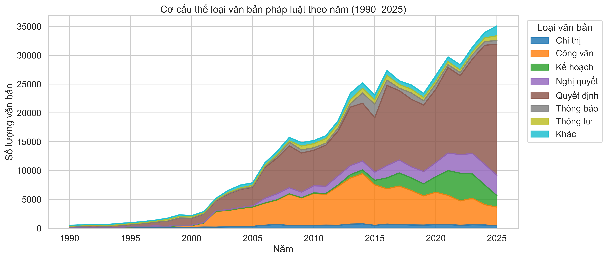

**Quyết định** (màu nâu) là loại phổ biến nhất và tăng đều theo thời gian. Đây là công cụ quản lý quen thuộc nhất trong hành chính — từ cấp phép, bổ nhiệm đến phê duyệt ngân sách.

**Công văn** (màu cam) tăng mạnh từ năm 2010 trở đi. Đây là văn bản dùng để điều hành và chỉ đạo công việc hàng ngày — sự gia tăng này cho thấy hoạt động hành chính ngày càng phức tạp.

**Nghị quyết** (màu tím) tăng rõ từ năm 2015, phản ánh xu hướng trao quyền nhiều hơn cho Hội đồng nhân dân các địa phương.

---

## Những người ký nhiều văn bản nhất

Mỗi văn bản pháp lý đều có người ký ban hành. Vậy ai là người ký nhiều nhất trong lịch sử pháp luật Việt Nam?

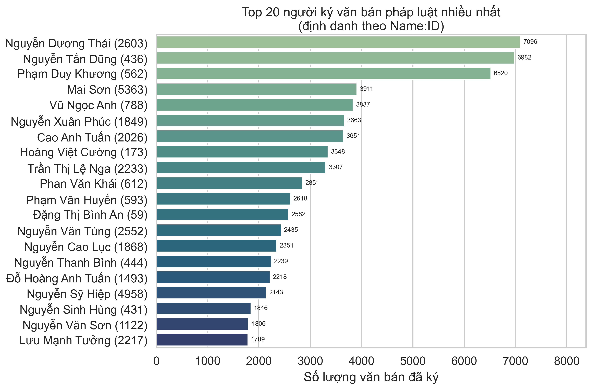

Đứng đầu là ông **Nguyễn Dương Thái** với 7.096 văn bản — một lãnh đạo địa phương ít xuất hiện trên truyền thông nhưng có tần suất ký văn bản rất cao.

Thứ hai là Cựu Thủ tướng **Nguyễn Tấn Dũng** với 6.982 văn bản, tích lũy trong 10 năm tại nhiệm (2006–2016) — giai đoạn hội nhập kinh tế mạnh mẽ.

Tiếp theo là Cựu Thủ tướng **Nguyễn Xuân Phúc** (3.663 văn bản) và Cố Thủ tướng **Phan Văn Khải** (2.851 văn bản).

Điều đáng chú ý: hơn một nửa top 20 không phải những chức danh cao nhất, mà là các cán bộ cấp Tổng cục, Cục — những người xử lý công việc hàng ngày.

---

## Dữ liệu dưới góc nhìn "Tứ Trụ"

Cấu trúc lãnh đạo cấp cao của Việt Nam xoay quanh 4 vị trí — thường được gọi là **"Tứ Trụ"**:

| Vị trí | Chức danh           | Phạm vi                                                       |
| ------ | ------------------- | ------------------------------------------------------------- |
| 🏛️     | Tổng Bí thư         | Đảng Cộng sản Việt Nam — Đường lối chính trị                  |
| 🌟     | Chủ tịch nước       | Nhà nước — Đại diện nước CHXHCN Việt Nam đối nội và đối ngoại |
| ⚙️     | Thủ tướng Chính phủ | Hành pháp — Quản lý và điều hành hệ thống hành chính nhà nước |
| 📜     | Chủ tịch Quốc hội   | Lập pháp — Cơ quan đại biểu cao nhất của nhân dân             |

Trong bộ dữ liệu, có **53.495 văn bản** do các chức danh "Tứ Trụ" trực tiếp ban hành, chiếm **10,4%** tổng số.

---

### Ai ký ban hành nhiều văn bản nhất?

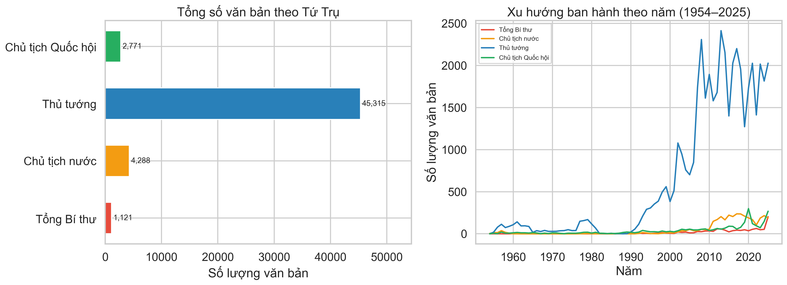

**Thủ tướng Chính phủ** chiếm phần lớn với **45.315 văn bản** — gấp khoảng 6 lần ba chức danh còn lại cộng lại. Điều này phản ánh đúng bản chất của cơ quan hành pháp: quản lý và giải quyết công việc hàng ngày của bộ máy nhà nước.

Ba vị trí còn lại có số lượng ít hơn do đặc thù chức năng:

- **Chủ tịch nước**: 4.288 văn bản.
- **Chủ tịch Quốc hội**: 2.771 văn bản.
- **Tổng Bí thư**: 1.121 văn bản.

Biểu đồ đường bên phải cũng cho thấy: trước những năm 1990, số văn bản do "Tứ Trụ" ban hành khá ít, phần nào do hệ thống số hóa chưa phát triển. Từ thập niên 2000, số văn bản do Thủ tướng ký tăng mạnh, đạt đỉnh trong giai đoạn 2008–2015.

---

### Nhiệm kỳ của các nhà lãnh đạo qua 80 năm

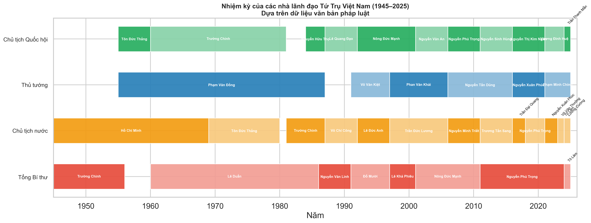

Biểu đồ Gantt cho thấy tổng quan thời gian tại vị của các nhà lãnh đạo "Tứ Trụ" suốt 80 năm qua.

Một số điểm đáng chú ý:

- Cố Thủ tướng **Phạm Văn Đồng** giữ chức Thủ tướng lâu nhất: **32 năm** (1955–1987), trải qua giai đoạn kháng chiến và những năm đầu thống nhất.
- Cố Tổng Bí thư **Lê Duẩn** giữ vị trí lãnh đạo Đảng trong **26 năm** (1960–1986).
- Chủ tịch **Hồ Chí Minh** làm Chủ tịch nước **24 năm** (1945–1969).
- Từ năm 2016 đến nay, tần suất chuyển giao nhân sự cao hơn rõ rệt, đặc biệt ở vị trí Chủ tịch nước và Chủ tịch Quốc hội.

---

### Cơ cấu văn bản theo thời gian

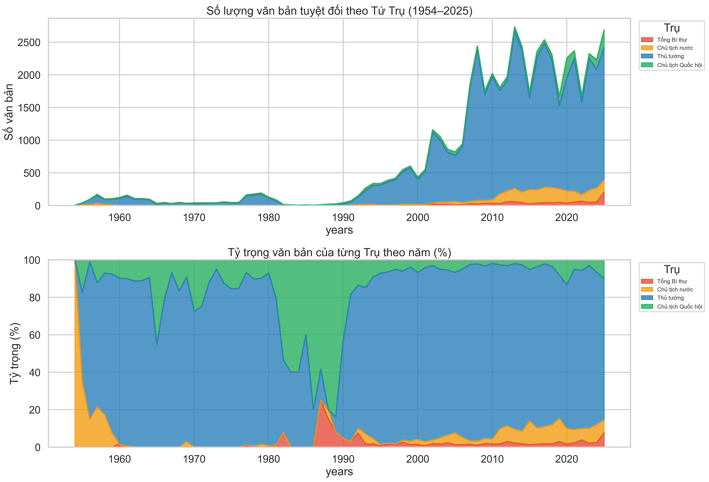

Biểu đồ diện tích phía trên cho thấy số lượng tuyệt đối: Thủ tướng (màu xanh) luôn chiếm phần lớn nhất.

Nhưng biểu đồ tỷ trọng phía dưới lại cho thấy góc nhìn khác. Đầu thập niên 1990, tỷ trọng văn bản của **Chủ tịch nước** (màu cam) có lúc đạt 20–25%, liên quan đến những thay đổi trong Hiến pháp 1992 về phân định chức năng nhà nước. Từ năm 2000 trở đi, tỷ trọng này ổn định ở mức dưới 10%.

Tỷ trọng văn bản của **Tổng Bí thư** (màu đỏ) khá nhỏ trong cơ sở dữ liệu pháp luật. Điều này dễ hiểu vì văn bản của Đảng chủ yếu mang tính định hướng, và không phải tất cả đều nằm trong kho dữ liệu văn bản quy phạm pháp luật.

---

### Loại văn bản đặc trưng của từng vị trí

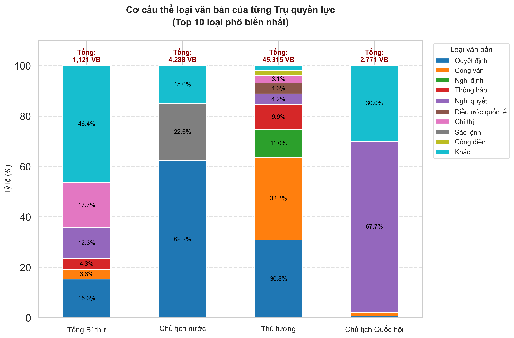

Mỗi vị trí trong "Tứ Trụ" sử dụng các loại văn bản khác nhau, phản ánh đúng chức năng của mình:

- **Tổng Bí thư**: Tỷ lệ lớn nhất thuộc mục "Khác" (46,4%), chủ yếu là văn kiện Đảng. Tiếp theo là **Nghị quyết** (17,7%) và **Chỉ thị** (12,3%) — dùng để định hướng đường lối và chủ trương.
- **Chủ tịch nước**: Chủ yếu ban hành **Quyết định** (62,2%) và **Sắc lệnh** (22,6%), phù hợp với thẩm quyền về phong tặng danh hiệu, bổ nhiệm nhân sự, đặc xá và công bố luật.
- **Thủ tướng Chính phủ**: **Công văn** (32,8%), **Quyết định** (30,8%) và **Nghị định** (11%) — sự đa dạng phản ánh vai trò điều hành thực tế ở nhiều cấp độ.
- **Chủ tịch Quốc hội**: Tập trung vào **Nghị quyết** (67,7%) — loại văn bản ghi nhận các quyết định được Quốc hội thông qua.

---

### Lĩnh vực trọng tâm của từng vị trí

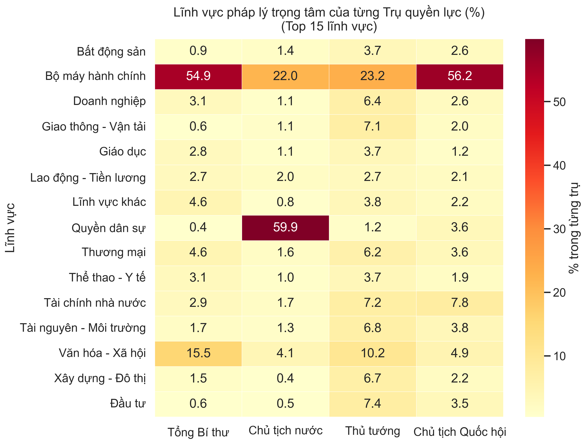

Nội dung văn bản cũng cho thấy sự phân công rõ ràng:

- **Tổng Bí thư**: Tập trung vào **Bộ máy hành chính** (54,9%) và **Văn hóa - Xã hội** (15,5%), xoay quanh công tác tổ chức cán bộ và xây dựng Đảng.
- **Chủ tịch nước**: **Quyền dân sự** chiếm 59,9%, chủ yếu từ các quyết định đặc xá, cho nhập hoặc thôi quốc tịch.
- **Thủ tướng Chính phủ**: Phủ rộng nhất — **Bộ máy hành chính** (23,2%), **Tài chính nhà nước** (7,2%), **Đất đai - Tài nguyên** (6,8%), **Thương mại - Doanh nghiệp** (6,4%).
- **Chủ tịch Quốc hội**: **Bộ máy hành chính** (56,2%) và **Tài chính nhà nước** (7,8%), phù hợp với vai trò quyết định cơ cấu tổ chức và phê duyệt ngân sách.

---

### Năng suất trung bình mỗi năm tại vị

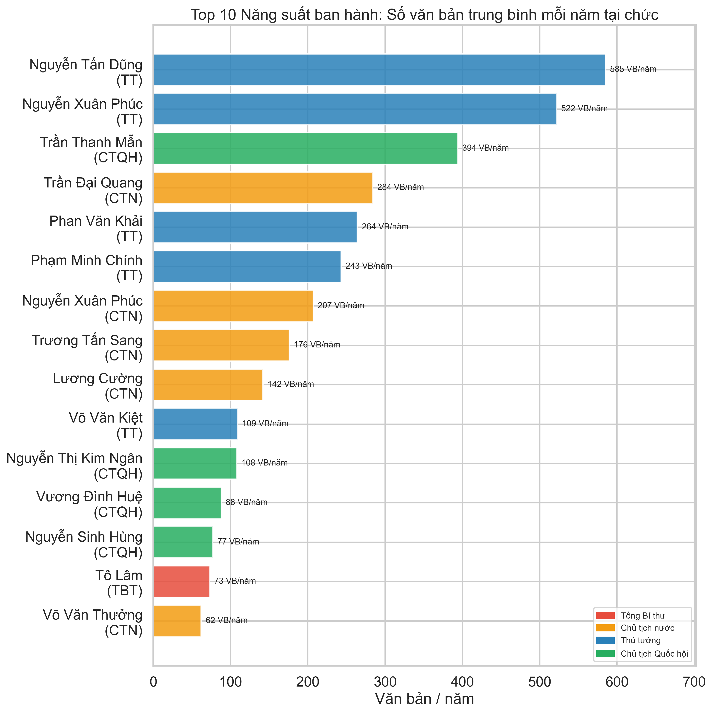

Chia số văn bản theo số năm tại chức cho thấy cường độ quản trị của từng người.

Cựu Thủ tướng **Nguyễn Tấn Dũng** dẫn đầu với khoảng **585 văn bản/năm** (2006–2016). Thứ hai là Cựu Thủ tướng **Nguyễn Xuân Phúc** với khoảng **522 văn bản/năm**.

Đương kim Chủ tịch Quốc hội **Trần Thanh Mẫn** đang ở mức **394 văn bản/năm**, cho thấy cơ quan lập pháp đang hoạt động với nhịp độ cao.

Ở chiều ngược lại, Cố Thủ tướng **Phạm Văn Đồng** chỉ có khoảng **17 văn bản/năm** trên dữ liệu số hóa. Điều này dễ hiểu: ở giai đoạn đó, bộ máy hành chính chưa phát triển quy mô như hiện tại, và không phải tất cả tài liệu thời kỳ đó đều được số hóa.

---

### Dấu ấn của từng nhà lãnh đạo

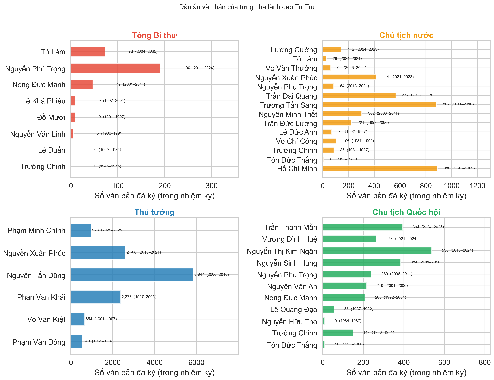

Phân loại theo cá nhân trong mỗi chức danh "Tứ Trụ":

- **Thủ tướng Chính phủ**: Cựu Thủ tướng **Nguyễn Tấn Dũng** dẫn đầu với 5.947 văn bản, tiếp theo là Cựu Thủ tướng **Nguyễn Xuân Phúc** với 2.009 văn bản.
- **Chủ tịch nước**: Chủ tịch **Hồ Chí Minh** có 999 văn bản được số hóa, vượt qua Cựu Chủ tịch **Trương Tấn Sang** (882 văn bản).
- **Chủ tịch Quốc hội**: Cố Chủ tịch **Trường Chinh** ký 149 văn bản trong hơn hai thập kỷ (1960–1981). Ở các nhiệm kỳ gần đây, Cựu Chủ tịch **Nguyễn Sinh Hùng** dẫn đầu với 384 văn bản.
- **Tổng Bí thư**: Cố Tổng Bí thư **Nguyễn Phú Trọng** ban hành tổng cộng 190 văn bản trong thời gian tại vị.

---

### Những nhà lãnh đạo đảm nhiệm nhiều chức danh "Tứ Trụ"

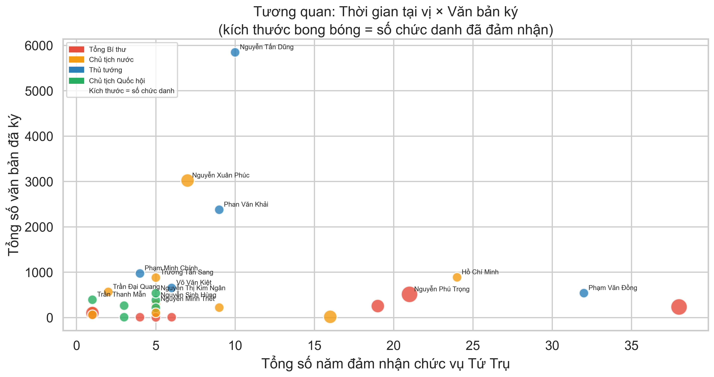

Một số nhà lãnh đạo từng đảm nhiệm nhiều hơn một vị trí trong "Tứ Trụ":

| Nhà lãnh đạo                  | Quá trình đảm nhiệm các chức danh                                                                |
| ----------------------------- | ------------------------------------------------------------------------------------------------ |
| Ông **Nguyễn Xuân Phúc**      | Thủ tướng Chính phủ → Chủ tịch nước (Tổng 3.022 văn bản)                                         |
| Cố TBT **Nguyễn Phú Trọng**   | Chủ tịch Quốc hội → Tổng Bí thư → Chủ tịch nước (Tổng 513 văn bản)                               |
| Cựu TBT **Nông Đức Mạnh**     | Chủ tịch Quốc hội → Tổng Bí thư (Tổng 255 văn bản)                                               |
| Cố TBT **Trường Chinh**       | Tổng Bí thư → Chủ tịch Ủy ban Thường vụ Quốc hội → Chủ tịch Hội đồng Nhà nước (Tổng 235 văn bản) |
| Đương kim TBT **Tô Lâm**      | Chủ tịch nước → Tổng Bí thư (Tổng 101 văn bản)                                                   |
| Cố Chủ tịch **Tôn Đức Thắng** | Trưởng ban Thường trực Quốc hội → Chủ tịch nước (Tổng 18 văn bản)                                |

Biểu đồ này cũng cho thấy sự khác biệt giữa các thời kỳ. Trước đây, với những nhiệm kỳ dài như Cố Thủ tướng **Phạm Văn Đồng** hay Chủ tịch **Hồ Chí Minh**, quản trị nhà nước ít gắn với khối lượng văn bản hành chính lớn. Trong khi đó, các nhà lãnh đạo thời kỳ hiện đại gắn liền với bộ máy thủ tục phức tạp hơn nhiều, thể hiện qua số văn bản lớn mà Cựu Thủ tướng **Nguyễn Tấn Dũng** hay ông **Nguyễn Xuân Phúc** ký ban hành.

---

## Lời kết

Hơn nửa triệu văn bản pháp luật không chỉ là dữ liệu. Đằng sau những con số là cả một quá trình phát triển của hệ thống hành chính, sự thay đổi trong ưu tiên quốc gia, và dấu ấn quản trị của từng thế hệ lãnh đạo.

Tất nhiên, đếm số lượng văn bản chỉ kể được một phần câu chuyện. Dữ liệu vĩ mô không nói được về chất lượng hay tác động thực tế của từng đạo luật. Nhưng nó cho ta một góc nhìn tổng quan và khách quan về sự chuyển mình của hệ thống pháp luật Việt Nam.
