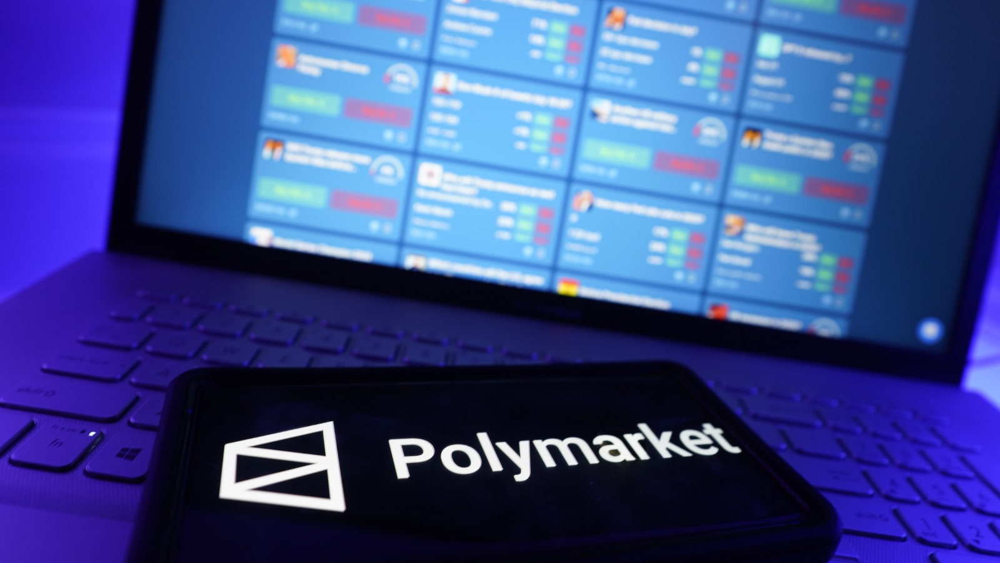

Traditional media is broken. Experts are contradicting each other. I've been experimenting with a decentralized 'truth engine' to cut through the B.S. Here's what I've learned.

## The Problem Hook: "Who Do You Even Believe Anymore?"

I'm officially suffering from information whiplash.

It feels like every time I try to understand a complex, important news story, I’m hit with two, three, or even five completely different (and completely confident) versions of the truth.

Take the origins of COVID-19. Not too long ago, you had dueling reports from the exact same House subcommittee. One day, a Republican-led report concludes that COVID-19 likely came from a Chinese lab and that U.S.-backed research may have been involved. The very next day, the Democratic [report](https://subscriber.politicopro.com/article/2024/12/house-democrats-push-back-on-gop-lab-leak-report-00192376) from the same committee concludes the GOP probe was "clouded by disdain for Anthony Fauci" and prioritized "partisan probes" over real answers.

This isn't some KOL on Facebook versus a newspaper. This is the United States government versus... itself. So, who am I supposed to believe?

This problem is everywhere. In late 2025, President Trump pardoned the billionaire crypto founder Changpeng Zhao. Watching CBS, I heard legal experts call it "unprecedented" and "corruption," citing financial ties between Zhao's company and the Trump family. But then I'd see an AP report quoting the President, who said he'd never even met Zhao and was told he "wasn't guilty of anything" and had been "persecuted by the Biden administration". One side says "corruption," the other says "persecution." The signal is completely lost in the noise.

I'm not a journalist or a data scientist. I'm just confused. So for the past few months, I've been running an experiment. I’ve been using a weird "betting" tool as a B.S. filter to navigate this chaos. The tool is **Polymarket**, a massive, decentralized **prediction market** where hundreds of thousands of people bet real money on the outcomes of real-world events. And honestly, it’s changing the way I consume information.

## What IS Polymarket, Actually?

At first glance, Polymarket looks like a giant sports-betting site... but for everything. You can bet on the big stuff: "Will Trump win the 2024 election?" You can bet on economic news: "Will the Fed cut interest rates?". And you can bet on weirdly specific, only-on-the-internet stuff, like a 2024 market that asked, "Will Kamala Harris say 'brat' before August?" (She didn't).

But here’s how it actually works, and it’s simpler than it looks. Let's take a real market that's been active: **"Will TikTok be banned in the U.S.?"**.

Instead of "odds," you buy "shares" in an outcome. You can buy "Yes" shares or "No" shares. The prices for these shares are always between \$0.00 and \$1.00, paid in a "stablecoin" called USDC (which is just a crypto-dollar, so \$1.00 USDC = \$1.00 USD). And here's the key: the "Yes" price and "No" price always add up to \$1.00.

This is the part that changes everything: **The price of a share equals the market's collective probability of that event happening.**

If a "Yes" share on the TikTok ban costs \$0.78, it means the entire market—all the traders, experts, and regular people with money on the line—collectively believes there is a 78% chance of it happening. If the ban actually happens, all the "Yes" shares instantly become worth \$1.00, and all the "No" shares go to \$0.00. It’s a binary payout. The platform is decentralized, which just means no single company or boss can step in and "decide" the odds; the price is set purely by user supply and demand. It all runs on smart contracts, which is just code that acts like a tamper-proof digital vending machine to handle the bets and payouts automatically.

Now, this isn't some brand-new, unproven crypto idea. It's the high-octane successor to an academic project called the **Iowa Electronic Markets (IEM)**. For decades, this project, run by the University of Iowa, proved the concept. And the killer stat? The IEM's political forecasts were shown to be more accurate than traditional polls 74% of the time. In the U.S. presidential elections from 1988 to 2004, it beat the polls in three out of four elections. The IEM was the academic proof-of-concept. Polymarket is what happens when you take that idea, hook it up to the global crypto financial system, and scale it by a factor of a million.

## The Accuracy Case: Does This Actually Work?

Okay, it's a cool idea. But is it just a bunch of crypto traders guessing? Does it _actually_ predict the future?

I went looking for the hard data, and according to a widely cited [dashboard](https://dune.com/alexmccullough/how-accurate-is-polymarket) on Dune by data scientist Alex McCullough, the numbers are kind of staggering. Looking at all resolved markets, Polymarket has a:

- 95.1% accuracy rate on markets just 4 hours before they resolve.
- 91.4% accuracy rate on markets a full month before they resolve.

But "accuracy" can be a misleading word. The metric that data scientists (and you) should really care about is the **Brier Score**.

Here’s the simple definition: **A Brier Score** is like a golf score for predictions. A score of 0 is a perfect record (you're never wrong). A score of 0.25 is what you'd get by just randomly guessing (like flipping a coin for every 50/50 event). A lower score is better.

Polymarket's overall Brier score is **0.0581**.

To be clear: this is insanely good. State-of-the-art 12-hour weather forecasts—some of the best modeling in the world—have a Brier score between 0.05 and 0.12. Typical sports betting models are much worse, sitting around 0.21. A Brier score of 0.0581 means Polymarket's predictions are **over 76% better than random chance**. This means the platform isn't just "right"; it's calibrated. When the market says something is 70% likely, it actually happens about 70% of the time. You can trust the probability.

## Case Study: The 2024 Election

This is the case study that got everyone's attention. While traditional media outlets were showing polls as a 50/50 "toss-up," Polymarket was telling a very different story. [Academic papers](https://arxiv.org/html/2507.08921) analyzing the 2024 election have since concluded that "Polymarket was superior to polling in predicting the outcome... particularly in swing states".

Here’s what that looked like in practice:

| 2024 Election Prediction (October 2024) | Traditional Polling (e.g., Poll Averages) | Polymarket Market Odds                | Actual Result |
| --------------------------------------- | ----------------------------------------- | ------------------------------------- | ------------- |
| Presidential Winner                     | Harris 50.1% / Trump 49.9% (A "Toss-Up")  | Trump 63.9% / Harris 35.8% (Decisive) | Trump Win     |
| Popular Vote                            | Harris +1.5%                              | Trump +2.0%                           | Trump Win     |
| Swing State: PA                         | Harris +0.5% (Toss-Up)                    | Trump ~58% (Likely)                   | Trump Win     |

So... why did it work so well?

1. **"Skin in the Game."** This is the most important part. When you can lose real money, you think harder. You're forced to "set aside subjective preferences and focus on objective analysis". Polls ask, "Who do you intend to vote for?" which measures preference. Markets capture, "Who do you think will win?" which measures expectation. That second question is infinitely more powerful. It forces you to analyze the entire system—the economy, your neighbors, the "shy voter" effect—instead of just stating your own bias.
2. **The Wisdom of Crowds**. You've probably heard of the classic "guess the weight of the ox" study. The idea is that a large, diverse group of people, each with their own little bit of information, is collectively smarter than any single expert. The market is just a machine for aggregating all that scattered information—from political insiders, data scientists, and regular people—into a single, real-time number (the price).

## The Big Idea: Prediction Markets as a Research Tool

This is the heart of my experiment. I've stopped using Polymarket to "see the future." I've started using it as a real-time research tool to fact-check the present. Here are four ways I'm doing it.

### Use case #1: Validating breaking news (The "COVID-19 Lab Leak")

The news cycle is binary. In 2020, the media and many scientific bodies called the lab leak theory a "debunked conspiracy theory". Then, over the next few years, government agencies (like the DOE and FBI) and official reports stated it was plausible or even likely. The media narrative swung from a 0% chance to a >50% chance, making anyone who spoke up early look like a crackpot and then, years later, a prophet.

A prediction market handles this so much better. A market like "Will a US agency conclude COVID-19 originated from a lab by 2026?" wouldn't have been 0% or 100%. In 2021, it might have traded at 10 cents (a 10% chance). As new evidence emerged (like the U.S. White House's 2025 declaration ), it would have climbed to 25 cents, then 40 cents.

The market gives permission for uncertainty. It tracks evolving credibility in real-time, which is a much more honest and accurate way to handle a complex, unfolding story.

### Use case #2: Cutting through political spin (The "Pardon")

Politicians make vague, un-falsifiable claims. When President Trump pardoned Changpeng Zhao, he was asked about the financial ties and said, "I don't know him... He had a lot of support". This is spin, designed to create distance.

Markets force specificity. You can't bet on "is this corrupt?" But you can bet on "Will Trump pardon Changpeng Zhao before Feb 1, 2026?". A high-trading price on that market long before the pardon happened would have told you everything you needed to know about the "I don't know him" claim. It would have revealed the real likelihood, cutting right through the spin. It forces partisans to bet on a falsifiable, clearly-defined claim, and the price tells you what the world actually thinks.

### Use case #3: Assessing expert predictions (The "Fed Rate Cut")

Pundits on TV have zero accountability. An economist can go on CNBC, say, "I see a 50/50 chance of a rate cut," and face zero consequences if he's wrong.

I'm now using Polymarket to check their work.

Here's how this looks in practice: A pundit says "50/50". I pull up Polymarket and search for the market "Will the Fed cut rates by the December FOMC meeting?". I see the market has $10.9 million in trading volume and is trading at 77 cents ("Yes").

Who am I going to trust? The one person paid to talk, or the collective wisdom of thousands of people risking $10 million on the outcome? It's a no-brainer. It filters for "skin in the game."

### Use case #4: The Future? A "Credibility Score" for Pundits

This is the one I'm most excited about. What if we used markets to create a public, un-gameable reputation score?

Polymarket (and other platforms) have public leaderboards. You can see the Profit & Loss (P&L) of the top traders. You can see who is consistently right and who is consistently wrong.

This is crucial because, according to blockchain data, somewhere between 86% and 88% of users on Polymarket lose money. This makes the tiny fraction of winners—the people who are consistently profitable—incredibly significant. They are the real experts, and the market finds them. Imagine a world where every "expert" on TV had their Polymarket P&L displayed under their name. We'd finally know who to listen to.

## The Honest Reality Check: "Here's Where It All Falls Apart"

Okay. I can feel the excitement. But now, before you log on and bet your college fund, we have to talk about the huge, glaring, terrifying problems. This is not a perfect crystal ball. I'm still learning how to spot these pitfalls, and some of them are massive.

### Problem 1: Market Manipulation (The "Trump Whale")

The first question everyone asks: "Can't a few rich guys just... buy the outcome they want?"

This isn't hypothetical. During the 2024 election, a trader (or group of traders) known as "Fredi9999" or "Théo" bet over $45 million on Trump to win. Critics immediately cried foul, claiming this was market manipulation—an attempt to artificially skew the odds to create a "Trump is winning" media narrative.

Polymarket investigated and claimed there was "no evidence... of market manipulation". Their take was that Théo, a French trader, was just a sophisticated actor who genuinely believed the polls were wrong. He cited the "shy Trump voter" effect and even commissioned his own private surveys. And... well, he was right. He walked away with over $50 million in profit.

This is the "chicken and egg" problem. Did his $45M bet cause the odds to move, or did his correct analysis lead him to place the bet? The answer is... both. It shows that a "whale" can temporarily skew prices, but if they're wrong, they lose a fortune. It's a very, very expensive way to spread propaganda, and in this case, the whale was right.

### Problem 2: The Definition "Trap" (The "TikTok Ban")

This, to me, is the biggest risk. Markets are "monkey's paws"—they give you exactly what you asked for, not what you meant.

The most painful example is the "$120 million TikTok banned in the US before May 2025?" market. Here's what happened: a law banning TikTok was enacted and signed. TikTok even went dark for a few hours. The market's decentralized arbiter (a protocol called UMA) ruled that, legally, a ban had occurred. The market resolved "Yes".

But users who bet "No" were furious. Why? Because TikTok came back online! Its enforcement was delayed by the new administration. They screamed "Scam!" and "Rigged!". But the market wasn't "Was TikTok enforced?" The question was "Was TikTok banned?" Legally, it was. This is the market's greatest weakness. The question "was a ban enacted?" (Yes) is totally different from "will I stop being able to use TikTok?" (No). A market is only as good as the clarity of its question.

### Problem 3: The Liquidity Problem

Not all markets are created equal. You have to check the liquidity—basically, how much money is in the market. A market with \$1,000 in it is just a few friends guessing. A market with $10 million is the "Wisdom of Crowds."

Polymarket's own accuracy page proves this. The "Brier Score vs Volume" chart shows that markets with less than \$10,000 in volume have a much higher (worse) Brier score (around 0.1) than markets with $1 million or more in volume (which have an incredible score below 0.02).

My Rule of Thumb: If a market has less than \$100,000 in volume, I treat its "prediction" with a huge grain of salt. It's far too easy to manipulate and doesn't have enough "crowd wisdom" to be reliable.

### Problem 4: What Markets CAN'T Do (The "Why" and the "Ought")

This is the most important limitation.

- They can't explain Why. A market can give you a terrifyingly specific odd, like "19% chance of a nuclear weapon detonation in 2025" , but it can't tell you why that number is 19% and not 15%. It's a number without a narrative. It has no causal data.
- They have no Moral Context. This is the classic "assassination market objection". A market on "Will [Public Figure] be assassinated by?" creates a direct financial incentive for someone to commit the murder. This is a real, dark, and unsolved problem. Markets are amoral; they don't care about "should," only "will."

This is why markets will never replace journalism. They are a complement. Journalism (at its best) tells us why something happened, what it feels like, and what we should do about it. The market just gives us the cold, hard what if.

## The "Wait, the NYSE?" Deal & What It Means

If you're still thinking this is just a "crypto toy," here's what's happened in the last year that proves this is the new mainstream.

In October 2025, Intercontinental Exchange (ICE)—the \$8 billion parent company of the New York Stock Exchange—[announced](https://ir.theice.com/press/news-details/2025/ICE-Announces-Strategic-Investment-in-Polymarket/default.aspx) it was investing \$2 billion in Polymarket. This is the heart of Wall Street saying, "prediction market data is a new, fundamental asset class." The biggest part of the deal? ICE will become a global distributor of Polymarket's data. This means hedge funds, banks, and political risk firms will now be paying for a direct feed of these odds.

At the same time, Polymarket became the [**"official prediction market partner"**](https://normi.es/blog/news-updates/polymarket-partners-with-x-revolutionizing-prediction-markets-in-2025) of X (formerly Twitter). You're already seeing it: Polymarket odds and widgets are being embedded directly into X posts. This creates a real-time feedback loop: breaking news happens on X, and you can see the probability shift in the same feed, sometimes with AI-driven explanations from Grok.

And finally, after being kicked out of the U.S. in 2022 by regulators (the CFTC) for running an "unregistered" platform , Polymarket is coming home. In July 2025, they [announced](https://subscriber.politicopro.com/article/2022/01/cftc-hits-ethereum-based-defi-betting-marketplace-with-14m-fine-3993136) they were acquiring a fully CFTC-licensed exchange (QCEX) for $112 million. This time, they're coming in through the front door, fully regulated.

This is the tipping point. You have Legitimization (the NYSE deal), Distribution (the X deal), and Legalization (the QCEX deal). This will pour billions in new liquidity into the markets, which, as we just saw, dramatically increases their accuracy. It's a powerful feedback loop: More Legitimacy -> More Liquidity -> Better Accuracy -> More Credibility -> More Legitimacy.

## How You Can Actually Use This

Okay, let's make this practical. You read a headline you don't trust. Here is my 3-minute workflow for using Polymarket as a B.S. detector.

- **Step 1: The Claim.** I read a controversial claim in my feed: "President Trump's new DHS policy is a massive failure and is causing chaos". This is all spin and no data.
- **Step 2: Find the Market.** The claim is vague. I need to find a specific, measurable market. I search Polymarket for "DHS," "border," "deportations." I find a market: "Will deportations exceed 50,000 in Q4 2026?"
- **Step 3: Read the Odds (The Easy Part).** The price for "Yes" is 80 cents.

  My Translation: The market is highly confident this is happening. The "policy is a failure" narrative might be spin, because the market predicts the policy's stated goal (deportations) is succeeding. This gives me a powerful counter-signal.

- **Step 4: Check the Vitals (The Most Important Part).**

  Check Liquidity (Volume): I look for the "Volume" number. It's \$1.2M. Okay, this is a high-signal market. I can trust this. (If it were \$1,200, I would ignore it completely).

  Check the Resolution Source: I scroll down to the Rules. This is the non-negotiable step. The source is: "Official quarterly report from the Department of Homeland Security (DHS)." Good. That's objective, non-debatable data. (If it said "a consensus of credible news reports," I would not trust it, thanks to the TikTok fiasco).

- **Step 5: Check the Price History.** I don't just look at the 80-cent price. I look at the chart. I see it was 40 cents two months ago. What happened? I can now search the news for that specific timeframe to find the event (a new policy, a court ruling) that made the market so confident. This helps me find the real signal.
- **Step 6: Cross-Reference.** I take this "80% probability" and go back to Google. I'm no longer searching "is the DHS policy a failure?" (a dumb, vague question). I'm searching "Why is the market so sure deportations will hit 50,000?" This reframes my entire research process. Using Polymarket didn't give me an answer; it gave me a much better question.

## Why This Matters (My Bigger Point)

So, what's the big takeaway? Why did I just spend all this time on a "betting site"?

It's simple: We are living in an era where trust in our traditional institutions is cratering. We are drowning in information but starved for truth. We need new tools.

Decentralized, financially-incentivized mechanisms (I know, it's a mouthful) are a new, weird, and powerful part of that answer. The meta-lesson is this: When people have real stakes, they get more careful.

They check their biases at the door. They do the extra hour of research. They ignore the political spin and look for the raw data. They have "skin in the game," and that incentive—the risk of loss—is what's missing from our current, broken information environment.

I'm not saying prediction markets are a perfect crystal ball. I'm still figuring out how to spot a manipulated market. I'm still furious about the vague definition of the TikTok ban. And I'm still deeply skeptical of any low-liquidity market.

But I am saying they are one of the most powerful B.S. detectors I have ever found. They are, as Polymarket's CEO said, an "inflection point in news and politics". They are not a replacement for journalists, experts, or researchers. They are a complement—a real-time, financial "lie detector" that we can all use to cross-check the claims of the powerful.

And in 2026, we need all the detectors we can get.
