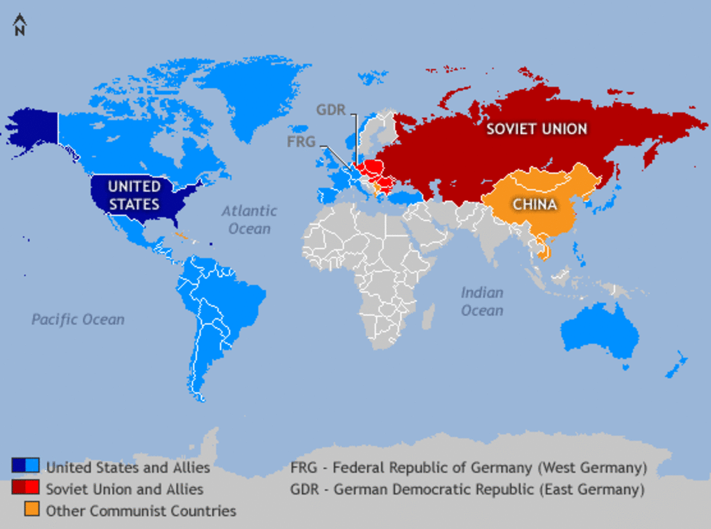
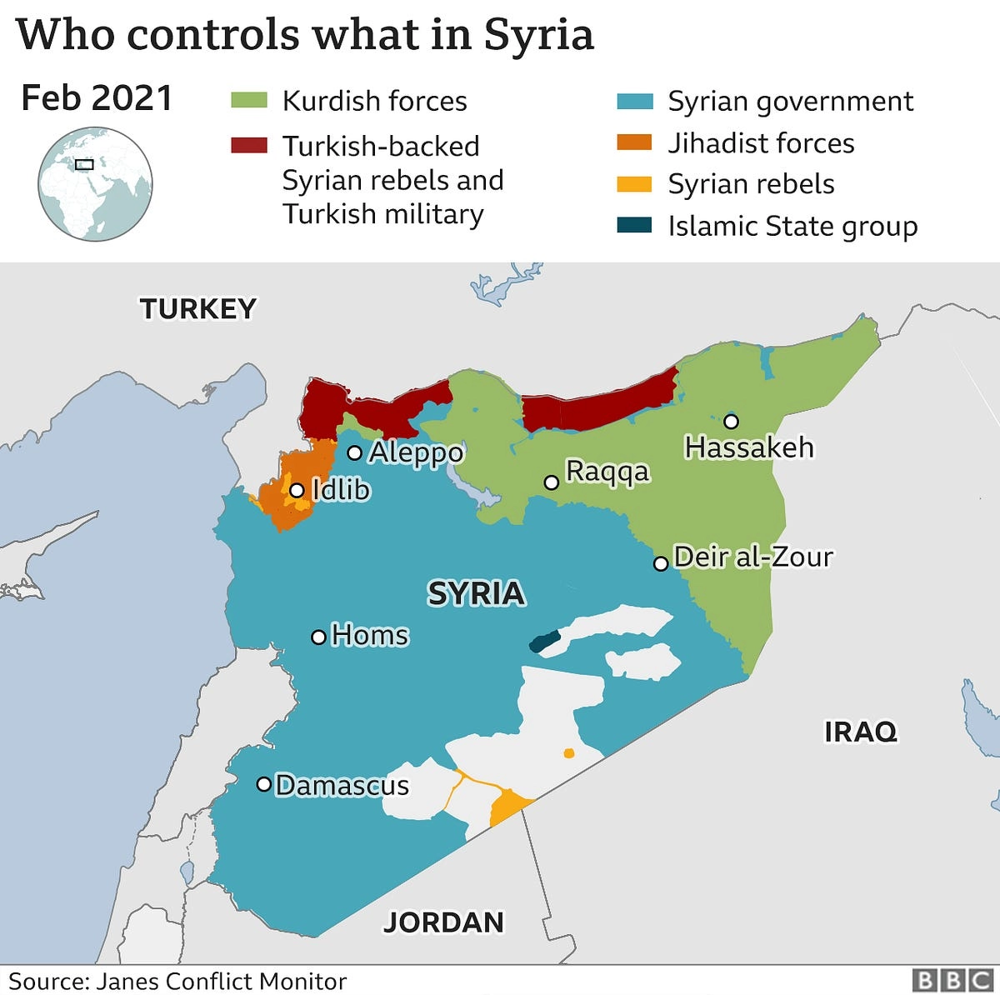
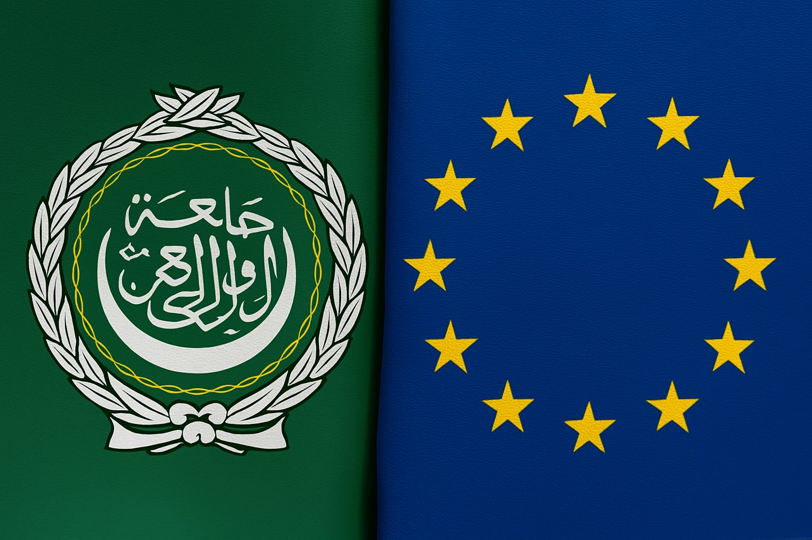

## **Chiến tranh ủy nhiệm là gì?**

Trong lĩnh vực khoa học chính trị, một chiến tranh ủy nhiệm (proxy war) được định nghĩa là một cuộc xung đột vũ trang trong đó ít nhất một bên tham chiến được chỉ đạo hoặc hỗ trợ bởi một cường quốc bên ngoài thứ ba [^1]. Thuật ngữ "chiến tranh ủy nhiệm" mô tả một bên tham chiến nhận được sự hỗ trợ từ bên ngoài; cả hai bên tham chiến trong một cuộc chiến tranh ủy nhiệm đều có thể được coi là bên ủy nhiệm nếu cả hai đều nhận được viện trợ quân sự từ một quốc gia thứ ba [^1]. Hành động như một chính phủ quốc gia hoặc như một lực lượng thông thường, một bên tham chiến ủy nhiệm hành động thay mặt cho một quốc gia tài trợ thứ ba [^1].

Theo Từ điển Oxford, một cách đơn giản, chiến tranh ủy nhiệm là "một cuộc chiến do một cường quốc lớn khơi mào nhưng bản thân cường quốc đó không tham gia" [^2]. Tuy nhiên, như Paul Rahe giải thích, không phải tất cả các cuộc chiến tranh ủy nhiệm đều tuân theo khuôn mẫu đó [^2]. Từ góc độ học thuật, chiến tranh ủy nhiệm là sản phẩm của mối quan hệ giữa một bên ban ơn, có thể là một quốc gia hoặc một chủ thể phi nhà nước bên ngoài động lực của cuộc xung đột hiện có (ví dụ: một cuộc nội chiến), và các bên ủy nhiệm được chọn làm kênh chuyển giao vũ khí, huấn luyện và tài trợ của bên ban ơn [^3]. Tóm lại, chiến tranh ủy nhiệm là sự thay thế cho các quốc gia và chủ thể phi nhà nước muốn thúc đẩy các mục tiêu chiến lược của riêng mình nhưng đồng thời tránh tham gia vào chiến tranh trực tiếp, tốn kém và đổ máu [^3]. Những phản ứng như vậy dựa trên nhận thức nội tại về rủi ro, cụ thể là sự can thiệp trực tiếp vào một cuộc xung đột sẽ không chính đáng, quá tốn kém (về chính trị, tài chính hoặc vật chất), có thể tránh được, bất hợp pháp hoặc không khả thi [^3].

Britannica định nghĩa chiến tranh ủy nhiệm là một cuộc xung đột quân sự trong đó một hoặc nhiều bên thứ ba trực tiếp hoặc gián tiếp hỗ trợ một hoặc nhiều bên tham chiến là nhà nước hoặc phi nhà nước trong nỗ lực gây ảnh hưởng đến kết quả xung đột và do đó thúc đẩy lợi ích chiến lược của riêng họ hoặc làm suy yếu lợi ích của đối thủ [^5]. Các bên thứ ba trong một cuộc chiến tranh ủy nhiệm không tham gia vào cuộc chiến thực tế ở mức độ đáng kể, nếu có [^5]. Chiến tranh ủy nhiệm cho phép các cường quốc tránh đối đầu trực tiếp với nhau khi họ cạnh tranh ảnh hưởng và tài nguyên [^5].

Từ góc độ tin tức, các cuộc xung đột ngấm ngầm này, nơi các cường quốc lớn giật dây đằng sau hậu trường, đã thay đổi số phận của cả một quốc gia [^6]. Một cuộc chiến tranh ủy nhiệm là một cuộc xung đột do một hoặc nhiều cường quốc lớn tiến hành mà bản thân họ không trực tiếp tham gia [^6]. Những cuộc chiến này được đặc trưng bởi sự tham gia của các quốc gia hùng mạnh tránh đối đầu quân sự trực tiếp và dàn dựng các trận chiến thông qua các lực lượng thay thế [^6]. Các cường quốc quan trọng này hỗ trợ chiến lược các phe phái địa phương để thúc đẩy lợi ích của họ mà không mạo hiểm chiến tranh công khai, chiến đấu một cuộc chiến không trên chiến trường mà thông qua các liên minh và các hoạt động bí mật với cái giá không thể tránh khỏi là tổn thất về người [^6]. Như một công cụ của chính sách quốc gia, chiến tranh ủy nhiệm cung cấp phương tiện cho tất cả các quốc gia, không chỉ các cường quốc, tham gia vào các cuộc can thiệp nước ngoài [^8].

Các cuộc chiến tranh ủy nhiệm có những đặc điểm chính sau: sự tham gia của bên thứ ba bên ngoài (chỉ đạo, hỗ trợ, tài trợ, vũ khí, huấn luyện, tình báo); các bên tham chiến hành động như bên ủy nhiệm cho các cường quốc tài trợ; tránh đối đầu quân sự trực tiếp giữa các cường quốc lớn; thường xảy ra ở các nước thứ ba hoặc liên quan đến các chủ thể phi nhà nước; mối quan hệ địa chính trị lâu dài giữa nhà tài trợ và bên ủy nhiệm [^1]; có thể bao gồm hỗ trợ vật chất (vũ khí, tình báo, vật tư) hoặc phi vật chất (huấn luyện, tư vấn, vận động chính trị) [^8]. Động lực cho các nhà tài trợ bao gồm thúc đẩy các mục tiêu chiến lược, làm suy yếu đối thủ, duy trì hiện trạng, can thiệp và tránh chi phí/rủi ro của chiến tranh trực tiếp [^1]. Sự hỗ trợ được cung cấp có thể từ các nguồn lực hữu hình đến hướng dẫn chiến lược, làm nổi bật tính chất đa diện của hình thức xung đột này.

**Lịch sử về Chiến tranh ủy nhiệm**

Việc sử dụng chiến tranh ủy nhiệm không phải là một hiện tượng hiện đại, với những tiền lệ lịch sử chứng minh tính hữu dụng lâu dài của nó như một công cụ chính sách đối ngoại để các cường quốc lớn gây ảnh hưởng và quản lý xung đột một cách gián tiếp. Cuộc thám hiểm Sicilia năm 415 trước Công nguyên là một ví dụ ban đầu, trong đó Sparta sử dụng Syracuse làm bên ủy nhiệm để tiến hành chiến tranh chống lại Athens và Segesta trên đảo Sicily [^2]. Đế chế Byzantine (330–1453) đã khơi mào các cuộc chiến tranh ủy nhiệm bằng cách cố tình gây ra sự thù địch giữa các nhóm khác nhau trong các quốc gia đối thủ. Sau đó, họ ủng hộ bên mạnh nhất khi nội chiến nổ ra [^1]. Trong Chiến tranh Trăm năm, Pháp và Anh đã hỗ trợ những người đi biển tư nhân nhắm vào tàu buôn của nhau [^1]. Pháp đã lợi dụng tình trạng hỗn loạn của nước Anh trong Chiến tranh Hoa hồng để làm bên ủy nhiệm, đứng về phía Lancastrians chống lại Yorkists, những người được Nhà nước Burgundy hậu thuẫn [^1]. Đế chế Ottoman cũng sử dụng cướp biển Barbary làm bên ủy nhiệm để quấy rối các cường quốc Tây Âu ở Địa Trung Hải [^1].

Thời kỳ Chiến tranh Lạnh chứng kiến sự gia tăng các cuộc chiến tranh ủy nhiệm, phần lớn do sự đối đầu ý thức hệ giữa chủ nghĩa cộng sản và chủ nghĩa tư bản, với việc Mỹ và Liên Xô hỗ trợ các phe đối lập trên toàn cầu để mở rộng ảnh hưởng và kiềm chế lẫn nhau [^1]. Với sự phát triển của kho vũ khí hạt nhân, chiến tranh ủy nhiệm trở thành một cách chấp nhận được hơn để hai siêu cường cạnh tranh ảnh hưởng trên thế giới [^5]. Các ví dụ chính bao gồm Chiến tranh Triều Tiên (1950–1953), Chiến tranh Việt Nam (1954–1975), Liên Xô xâm lược Afghanistan (1979–1989) và Nội chiến Angola (1975–2002) [^1]. Nhiều cuộc xung đột khác trong thời kỳ này cũng mang đặc điểm của chiến tranh ủy nhiệm, như Nội chiến Trung Quốc, Nội chiến Hy Lạp, Khẩn cấp Malaya, Chiến tranh Đông Dương lần thứ nhất, Khủng hoảng tên lửa Cuba, Nội chiến Campuchia, Xung đột Trung Đông, Liên Xô chiếm đóng Afghanistan, Nội chiến El Salvador và Nội chiến Nicaragua [^1].

Bảng sau tóm tắt các cuộc chiến tranh ủy nhiệm chính trong thời kỳ Chiến tranh Lạnh:

**Bảng 1: Các cuộc chiến tranh ủy nhiệm thời Chiến tranh Lạnh**

<table>
  <tr>
   <td><strong>Chiến tranh</strong></td>
   <td><strong>Thời gian</strong></td>
   <td><strong>Bên tham chiến 1 (Được hỗ trợ bởi)</strong></td>
   <td><strong>Bên tham chiến 2 (Được hỗ trợ bởi)</strong></td>
   <td><strong>Kết quả</strong></td>
  </tr>
  <tr>
   <td>Nội chiến Trung Quốc</td>
   <td>1944–1949</td>
   <td>CPC PLA (Liên Xô)</td>
   <td>KMT NRA (Hoa Kỳ)</td>
   <td>Cộng sản thắng lợi trên lục địa, bế tắc eo biển Đài Loan</td>
  </tr>
  <tr>
   <td>Khủng hoảng Iran năm 1946</td>
   <td>1945–1946</td>
   <td>Cộng hòa Nhân dân Azerbaijan (Liên Xô)</td>
   <td>Đế quốc Iran (Hoa Kỳ)</td>
   <td>Iran thắng lợi</td>
  </tr>
  <tr>
   <td>Nội chiến Hy Lạp</td>
   <td>1946–1949</td>
   <td>Cộng sản Hy Lạp (Albania, Bulgaria, Nam Tư)</td>
   <td>Hy Lạp (Anh, Hoa Kỳ)</td>
   <td>Vương quốc Hy Lạp thắng lợi</td>
  </tr>
  <tr>
   <td>Chiến tranh Đông Dương lần thứ nhất</td>
   <td>1946–1954</td>
   <td>Khmer Issarak, Pathet Lao, Việt Minh (Trung Quốc, Liên Xô)</td>
   <td>Pháp, Quốc gia Việt Nam (Hoa Kỳ)</td>
   <td>DR Việt Nam và đồng minh thắng lợi</td>
  </tr>
  <tr>
   <td>Nội chiến Paraguay</td>
   <td>1947</td>
   <td>Đảng Tự do, Đảng Febrerista (Liên Xô)</td>
   <td>Chính phủ Paraguay (Hoa Kỳ, Argentina)</td>
   <td>Chính phủ/Quân đội và Đảng Colorado thắng lợi</td>
  </tr>
  <tr>
   <td>Khẩn cấp Malaya</td>
   <td>1948–1960</td>
   <td>Cộng sản Malaya (Liên Xô, Trung Quốc)</td>
   <td>Khối thịnh vượng chung (Hoa Kỳ)</td>
   <td>Khối thịnh vượng chung thắng lợi về mặt quân sự</td>
  </tr>
  <tr>
   <td>Chiến tranh Triều Tiên</td>
   <td>1950–1953</td>
   <td>Bắc Triều Tiên, Trung Quốc (Liên Xô)</td>
   <td>Hàn Quốc, Liên Hợp Quốc (Hoa Kỳ)</td>
   <td>Bế tắc</td>
  </tr>
  <tr>
   <td>Cuộc nổi dậy Mau Mau</td>
   <td>1952–1960</td>
   <td>Quân đội Đất đai và Tự do Kenya (Liên Xô)</td>
   <td>Anh, Kenya thuộc Anh (Hoa Kỳ)</td>
   <td>Anh thắng lợi</td>
  </tr>
  <tr>
   <td>Chiến tranh Đông Dương lần thứ hai (Việt Nam)</td>
   <td>1955–1975</td>
   <td>Bắc Việt Nam, Mặt trận Dân tộc Giải phóng miền Nam Việt Nam (Liên Xô, Trung Quốc)</td>
   <td>Nam Việt Nam, Hoa Kỳ (Hàn Quốc, Úc, New Zealand)</td>
   <td>Bắc Việt Nam và Mặt trận Dân tộc Giải phóng miền Nam Việt Nam thắng lợi</td>
  </tr>
  <tr>
   <td>Khủng hoảng eo biển Đài Loan lần thứ nhất</td>
   <td>1954–1955</td>
   <td>Cộng hòa Nhân dân Trung Hoa (Liên Xô)</td>
   <td>Trung Hoa Dân Quốc (Hoa Kỳ)</td>
   <td>Bế tắc</td>
  </tr>
  <tr>
   <td>Nội chiến Sudan lần thứ nhất</td>
   <td>1955–1972</td>
   <td>Vương quốc Anh, Ai Cập (Liên Xô)</td>
   <td>Phong trào Giải phóng Nam Sudan (Ethiopia, Uganda, Israel)</td>
   <td>Bế tắc</td>
  </tr>
  <tr>
   <td>Khủng hoảng kênh đào Suez</td>
   <td>1956–1957</td>
   <td>Ai Cập (Liên Xô, Hoa Kỳ)</td>
   <td>Pháp, Israel, Anh</td>
   <td>Lãnh thổ không thay đổi. Quyền lực của Pháp và Anh suy yếu</td>
  </tr>
  <tr>
   <td>Khủng hoảng eo biển Đài Loan lần thứ hai</td>
   <td>1958</td>
   <td>Cộng hòa Nhân dân Trung Hoa (Liên Xô)</td>
   <td>Trung Hoa Dân Quốc (Hoa Kỳ)</td>
   <td>Bế tắc</td>
  </tr>
  <tr>
   <td>Khủng hoảng Lebanon năm 1958</td>
   <td>1958</td>
   <td>Phe đối lập Lebanon (Liên Xô, Ai Cập)</td>
   <td>Chính phủ Lebanon (Hoa Kỳ)</td>
   <td>Tổng thống Camille Chamoun từ chức, Tướng Fouad Chehab kế nhiệm</td>
  </tr>
  <tr>
   <td>Cuộc nổi dậy ở Tây Tạng năm 1959</td>
   <td>1959–1962</td>
   <td>Trung Quốc</td>
   <td>Tây Tạng (Hoa Kỳ, Ấn Độ, Nepal)</td>
   <td>Cuộc nổi dậy bị dập tắt</td>
  </tr>
  <tr>
   <td>Phong tỏa Berlin</td>
   <td>1948-1949</td>
   <td>Liên Xô</td>
   <td>Hoa Kỳ, Anh, Pháp</td>
   <td>Liên Xô dỡ bỏ phong tỏa</td>
  </tr>
  <tr>
   <td>Cuba</td>
   <td>1961-1962</td>
   <td>Cuba (Liên Xô)</td>
   <td>Hoa Kỳ (hỗ trợ lực lượng lưu vong)</td>
   <td>Cuba vẫn là nước cộng sản</td>
  </tr>
  <tr>
   <td>Nội chiến Campuchia</td>
   <td>1967-1975</td>
   <td>Khmer Đỏ (Trung Quốc, Việt Nam)</td>
   <td>Chính phủ Khmer (Hoa Kỳ)</td>
   <td>Khmer Đỏ thắng lợi</td>
  </tr>
  <tr>
   <td>Junta quân sự Chile</td>
   <td>1973</td>
   <td>Lực lượng cánh tả (Liên Xô)</td>
   <td>Quân đội Chile (Hoa Kỳ)</td>
   <td>Quân đội nắm quyền</td>
  </tr>
  <tr>
   <td>Xung đột Trung Đông</td>
   <td>1973-1989</td>
   <td>Các nước Ả Rập (Liên Xô)</td>
   <td>Israel (Hoa Kỳ)</td>
   <td>Tiếp tục xung đột</td>
  </tr>
  <tr>
   <td>Ethiopia</td>
   <td>1977-1978</td>
   <td>Ethiopia (Liên Xô, Cuba)</td>
   <td>Somalia (Hoa Kỳ)</td>
   <td>Ethiopia thắng lợi</td>
  </tr>
  <tr>
   <td>Liên Xô chiếm đóng Afghanistan</td>
   <td>1978-1992</td>
   <td>Cộng hòa Dân chủ Afghanistan (Liên Xô)</td>
   <td>Mujahideen (Hoa Kỳ)</td>
   <td>Liên Xô rút quân</td>
  </tr>
  <tr>
   <td>Nội chiến Angola</td>
   <td>1976-1988</td>
   <td>MPLA (Liên Xô, Cuba)</td>
   <td>UNITA (Hoa Kỳ, Nam Phi)</td>
   <td>Bế tắc</td>
  </tr>
  <tr>
   <td>Nội chiến Salvador</td>
   <td>1980-1992</td>
   <td>FMLN (Liên Xô, Cuba, Nicaragua)</td>
   <td>Chính phủ El Salvador (Hoa Kỳ)</td>
   <td>Thỏa thuận hòa bình</td>
  </tr>
  <tr>
   <td>Nội chiến Nicaragua</td>
   <td>1979-1990</td>
   <td>Sandinistas (Liên Xô, Cuba)</td>
   <td>Contras (Hoa Kỳ)</td>
   <td>Thỏa thuận hòa bình</td>
  </tr>
</table>

**Các cuộc Chiến tranh ủy nhiệm Hiện tại**

Nội chiến Syria, bắt đầu từ một cuộc nổi dậy địa phương năm 2011, vẫn là một trong những ví dụ phức tạp nhất về một cuộc chiến tranh ủy nhiệm hiện đại, thu hút các cường quốc toàn cầu và làm trầm trọng thêm sự phức tạp của nó [^6]. Cuộc xung đột này được mô tả rộng rãi là một loạt các cuộc chiến tranh ủy nhiệm chồng chéo giữa Mỹ và Nga, cũng như giữa Iran và Ả Rập Saudi [^18].

Động cơ của Nga trong cuộc nội chiến Syria chủ yếu là để bảo tồn chế độ Assad, duy trì ảnh hưởng ở Trung Đông, chống lại ảnh hưởng của Mỹ, giành quyền tiếp cận Địa Trung Hải, và thể hiện sức mạnh quân sự [^19]. Nga cũng muốn ngăn chặn đường ống dẫn khí đốt Qatar-Thổ Nhĩ Kỳ và chống lại các cuộc cách mạng [^20]. Iran coi sự tồn tại của chế độ Assad là rất quan trọng đối với lợi ích khu vực của mình, cung cấp một tuyến đường quan trọng để cung cấp vũ khí cho Hezbollah ở Lebanon và đóng vai trò là vùng đệm chống lại ảnh hưởng của Ả Rập Saudi và Mỹ [^22]. Mục tiêu của Iran bao gồm nỗ lực Shi'a hóa, thay đổi nhân khẩu học và duy trì tuyến đường chiến lược Iraq-Syria-Lebanon [^22]. Mỹ can thiệp vào Syria với mục đích chiến đấu chống lại ISIS, hỗ trợ Quân đội Syria Tự do và Lực lượng Dân chủ Syria (SDF), chống lại ảnh hưởng của Iran và có khả năng thay đổi chế độ [^22]. Động lực của Mỹ thường liên quan đến chi phí, sử dụng các lực lượng địa phương để chiến đấu [^29]. Ban đầu, Thổ Nhĩ Kỳ lên án chế độ Assad và hỗ trợ phe đối lập Syria, với mục tiêu cuối cùng là thiết lập một chính phủ thân thiện sau Assad, ngăn chặn quyền tự trị của người Kurd, quản lý cuộc khủng hoảng người tị nạn và đảm bảo lợi ích kinh tế từ quá trình tái thiết [^31]. Ả Rập Saudi ban đầu ủng hộ Assad vì sự ổn định, nhưng sau đó chuyển sang mục tiêu làm suy yếu quyền lực của Iran, hỗ trợ phiến quân (ban đầu là phi Hồi giáo, sau đó là Salafi), ngăn Syria trở thành chiến trường cho các cường quốc khu vực, đảm bảo ổn định khu vực, chấm dứt ảnh hưởng của Iran và giải quyết vấn đề người tị nạn và buôn lậu ma túy [^22].

Hậu quả của cuộc nội chiến Syria là vô cùng nghiêm trọng, với hàng trăm nghìn người thiệt mạng và hàng triệu người phải di dời [^14]. Nền kinh tế bị tàn phá, nghèo đói lan rộng và các nhóm cực đoan trỗi dậy [^16].

Cuộc nội chiến Yemen là một cuộc xung đột khác đang diễn ra, giữa chính phủ Hadi (được liên minh do Ả Rập Saudi dẫn đầu hậu thuẫn) và phiến quân Houthi (được Iran hậu thuẫn) [^1]. Động cơ của Iran bao gồm giành quyền thống trị ý thức hệ và bá quyền khu vực, tìm chỗ đứng ở Vùng Vịnh, hỗ trợ phiến quân Houthi theo đạo Hồi Shia (mặc dù là Shia Zaydi), chống lại ảnh hưởng của Ả Rập Saudi và Mỹ, và kéo dài xung đột để làm suy yếu đối thủ [^53]. Ả Rập Saudi lo ngại về an ninh biên giới, ngăn chặn ảnh hưởng của Iran ở sân sau của mình, duy trì bá quyền khu vực, kiểm soát các tuyến vận chuyển quan trọng ở Biển Đỏ, và có những tham vọng chính trị của giới lãnh đạo [^38].

Hậu quả của cuộc nội chiến Yemen là một cuộc khủng hoảng nhân đạo nghiêm trọng, với nạn đói lan rộng, dịch bệnh và các cuộc tấn công vào dân thường [^51]. Hơn 377.000 người đã thiệt mạng và hàng triệu người phải di dời [^1]. Nền kinh tế rơi vào khủng hoảng, và cuộc khủng hoảng viện trợ trở nên tồi tệ [^63]. Nghèo đói, suy dinh dưỡng và khan hiếm nước là những vấn đề nghiêm trọng [^66]. Các nỗ lực ngoại giao bao gồm các lệnh ngừng bắn do Liên Hợp Quốc làm trung gian, sự xích lại gần nhau giữa Ả Rập Saudi và Iran, và các nỗ lực của Đặc phái viên Liên Hợp Quốc [^39]. Tuy nhiên, những nỗ lực này gặp phải những thách thức do thiếu ảnh hưởng đối với lực lượng Houthi [^70].

Chiến tranh Nga-Ukraine, bắt đầu từ năm 2014 với việc Nga sáp nhập Crimea và hỗ trợ lực lượng ly khai ở Donbas, đã leo thang vào năm 2022 với cuộc xâm lược toàn diện [^2]. Hiện nay, cuộc chiến này còn được coi là một cuộc chiến tranh ủy nhiệm cho các cường quốc châu Á [^7]. Động cơ của Nga bao gồm ngăn chặn sự mở rộng của NATO, giành lại quyền kiểm soát Ukraine, thiết lập một "Thế giới Nga", thách thức ảnh hưởng của phương Tây và bảo vệ dân số nói tiếng Nga [^72]. Mỹ và NATO lên án hành động gây hấn của Nga, hỗ trợ chủ quyền và toàn vẹn lãnh thổ của Ukraine, cung cấp viện trợ quân sự và nhân đạo, và làm suy yếu Nga [^72].

Hậu quả chính trị của cuộc chiến bao gồm sự củng cố đoàn kết phương Tây, căng thẳng trong nội bộ phương Tây, gián đoạn thị trường năng lượng toàn cầu, một môi trường an ninh mới, quan hệ chặt chẽ hơn giữa Nga và Iran, và quan hệ chặt chẽ hơn giữa Mỹ và các đồng minh châu Á (Nhật Bản, Hàn Quốc, Úc) [^87]. Nga suy yếu, và châu Âu phụ thuộc nhiều hơn vào Mỹ để đảm bảo an ninh [^90]. Diễn biến sau đó là một cuộc xung đột kéo dài, bế tắc, với nhiều thương vong cho cả hai bên [^72]. Cuộc khủng hoảng người tị nạn và hàng chục nghìn người thiệt mạng [^75]. Mỹ đã đàm phán ngừng bắn với Nga [^73]. Ukraine phụ thuộc vào viện trợ quân sự của Mỹ [^84]. Có khả năng bất ổn và căng thẳng lâu dài giữa Nga và châu Âu [^91].

**Phân tích Động lực của Chiến tranh ủy nhiệm**

Các quốc gia tài trợ chiến tranh ủy nhiệm có nhiều động cơ khác nhau, thường được phân loại thành địa chính trị, ý thức hệ và kinh tế [^1]. Về mặt địa chính trị, các quốc gia tham gia vào chiến tranh ủy nhiệm do lo ngại về an ninh, cân bằng quyền lực khu vực, làm suy yếu đối thủ, mở rộng ảnh hưởng và đạt được lợi thế chiến lược, đồng thời ngăn chặn các cường quốc thù địch gần biên giới [^1]. Động cơ ý thức hệ bao gồm thúc đẩy các hệ thống chính trị (dân chủ so với cộng sản), đoàn kết tôn giáo hoặc sắc tộc, và hỗ trợ các phong trào cách mạng [^1]. Về mặt kinh tế, chiến tranh ủy nhiệm có thể ít tốn kém hơn so với can thiệp trực tiếp, mang lại quyền tiếp cận tài nguyên và bảo vệ đầu tư và thương mại, mặc dù yếu tố này thường đóng vai trò hạn chế hơn [^1].

Mối quan hệ giữa các bên tài trợ và bên ủy nhiệm có thể được phân tích thông qua lý thuyết chủ-đại lý (principal-agent theory), trong đó bên chủ (nhà tài trợ) ủy quyền cho bên đại lý (bên ủy nhiệm) [^74]. Bên chủ định hình các mục tiêu của bên ủy nhiệm thông qua các biện pháp khuyến khích và trừng phạt [^74]. Tuy nhiên, bên chủ có thể có ít quyền kiểm soát hơn để đảm bảo tính phủ nhận hợp lý [^74]. Đối với bên chủ, chiến tranh ủy nhiệm giúp tiết kiệm chi phí so với can thiệp trực tiếp [^74]. Tuy nhiên, các bên ủy nhiệm có chương trình nghị sự riêng, khiến việc quản lý trở nên khó khăn [^4]. Có sự căng thẳng giữa quyền kiểm soát và khả năng phủ nhận đối với quốc gia can thiệp [^8]. Tính hữu dụng của bên ủy nhiệm nằm ở khả năng của quốc gia can thiệp trong việc kiểm soát và tập trung bên ủy nhiệm vào việc hoàn thành các mục tiêu chính sách mong muốn [^8].

Nhiều yếu tố dẫn đến sự xuất hiện và leo thang của chiến tranh ủy nhiệm. Sự cạnh tranh chiến lược giữa các cường quốc lớn là một yếu tố chính [^1]. Bế tắc trong xung đột trực tiếp giữa các cường quốc lớn cũng có thể dẫn đến chiến tranh ủy nhiệm [^2]. Tình thế an ninh, mong muốn tránh đối đầu trực tiếp (đặc biệt trong kỷ nguyên hạt nhân), sự phản đối trong nước đối với can thiệp quân sự trực tiếp, tránh các phản ứng tiêu cực của quốc tế, sự tồn tại của các chủ thể địa phương sẵn sàng, chủ quyền nhà nước suy yếu ở các khu vực xung đột và sự hỗ trợ bên ngoài cho các phe phái trong nội chiến đều góp phần vào sự xuất hiện và leo thang của chiến tranh ủy nhiệm [^1].

**Hậu quả và Tác động của Chiến tranh ủy nhiệm**

Chiến tranh ủy nhiệm gây ra những tổn thất nhân đạo to lớn, làm thay đổi số phận của cả một quốc gia [^6]. Chúng dẫn đến cái chết và sự di dời của người dân [^1], nạn đói, sự di dời dân số và tàn phá văn hóa [^5]. Các gia đình mất nhà cửa, trẻ em mất trường học và toàn bộ cộng đồng bị ly tán [^6]. Hậu quả của sự di dời kéo dài rất lâu sau khi các tiêu đề báo chí lắng xuống, để lại những vết sẹo phải mất nhiều thế hệ mới có thể lành [^6]. Chiến tranh ủy nhiệm có thể tạo điều kiện cho sự trỗi dậy của các chế độ độc tài chính trị hoặc quân sự [^5], làm lan rộng các cuộc xung đột quân sự địa phương [^5] và làm giảm động lực cho các bên ủy nhiệm sử dụng biện pháp ngoại giao [^5].

Chiến tranh ủy nhiệm gây ra sự tàn phá kinh tế nghiêm trọng, bao gồm thiệt hại về cơ sở hạ tầng [^1], giá lương thực tăng vọt và các lệnh trừng phạt kinh tế làm tăng chi phí sinh hoạt [^40]. Chúng dẫn đến sự sụp đổ của nền kinh tế, nghèo đói lan rộng và mất kế sinh nhai [^16], mất giá tiền tệ và lạm phát [^42] và gián đoạn thương mại và hoạt động kinh tế [^89].

Chiến tranh ủy nhiệm gây ra bất ổn chính trị và có những tác động khu vực sâu rộng. Chúng có thể dẫn đến sự trỗi dậy của các chế độ độc tài chính trị [^5], làm gia tăng căng thẳng và xung đột khu vực [^6], làm thay đổi cán cân quyền lực toàn cầu [^99] và gây ra các cuộc khủng hoảng người tị nạn làm mất ổn định các nước láng giềng và châu Âu [^16]. Chúng cũng có thể làm suy yếu chủ quyền nhà nước [^50] và có khả năng gây ra những hậu quả không mong muốn và phản tác dụng cho các nhà tài trợ [^5].

**Quan điểm Quốc tế và Phân tích của Chuyên gia**

Các định nghĩa và cách diễn giải khác nhau về chiến tranh ủy nhiệm tồn tại, với sự khác biệt nhỏ giữa các nguồn học thuật, tin tức và từ điển, nhưng đều chia sẻ các yếu tố cốt lõi về xung đột gián tiếp và sự hỗ trợ từ bên ngoài [^1]. Có cuộc tranh luận về việc liệu một số cuộc xung đột nhất định có đủ điều kiện là chiến tranh ủy nhiệm hay không (ví dụ: Ukraine) [^72]. Sự nhấn mạnh vào sự tham gia gián tiếp là một đặc điểm chính [^4]. Các quan điểm khác nhau tồn tại về mức độ kiểm soát mà các nhà tài trợ có đối với các bên ủy nhiệm [^8].

Các phân tích sâu sắc từ các chuyên gia về quan hệ quốc tế và các báo cáo của tổ chức nghiên cứu xác nhận vai trò lâu dài của chiến tranh ủy nhiệm trong quan hệ quốc tế, đặc biệt trong bối cảnh cạnh tranh giữa các cường quốc lớn [^100]. Các báo cáo của tổ chức nghiên cứu nhấn mạnh các động cơ chiến lược và các rủi ro tiềm ẩn liên quan đến hình thức xung đột này, trong khi các cân nhắc về đạo đức và sự phức tạp của mối quan hệ nhà tài trợ-bên ủy nhiệm cũng được nhấn mạnh [^92]. Chủ đề này thường bị phân tích và lý thuyết hóa chưa đầy đủ [^4]. Tính hữu dụng của chiến tranh ủy nhiệm thường bị thổi phồng [^95]. Chiến tranh ủy nhiệm là một chính sách "ở giữa" [^95]. Iran đã sử dụng thành công các bên ủy nhiệm để thúc đẩy các mục tiêu an ninh quốc gia của mình [^105].

**Nỗ lực Quốc tế nhằm Ngăn chặn và Giải quyết Chiến tranh ủy nhiệm**

Liên Hợp Quốc đóng một vai trò quan trọng trong nỗ lực ngăn chặn và giải quyết các cuộc xung đột, bao gồm cả chiến tranh ủy nhiệm, thông qua nhiều cơ chế ngoại giao và gìn giữ hòa bình [^106]. Hội đồng Bảo an Liên Hợp Quốc có trách nhiệm chính trong việc duy trì hòa bình và an ninh quốc tế [^106]. Hội đồng khuyến nghị các biện pháp hòa bình, điều tra, hòa giải và cử các đại diện đặc biệt [^106]. Hội đồng có thể ban hành các chỉ thị ngừng bắn và triển khai các hoạt động gìn giữ hòa bình [^106]. Hội đồng cũng có thể quyết định các biện pháp cưỡng chế, trừng phạt hoặc hành động quân sự tập thể [^106]. Tuy nhiên, việc quy trách nhiệm cho hành động của các chủ thể phi nhà nước đối với các quốc gia trong các cuộc chiến tranh ủy nhiệm là một thách thức [^107]. Cần có một cơ quan thường trực để điều tra nguồn gốc và việc sử dụng vũ khí xung đột [^108]. Liên Hợp Quốc tham gia vào các nỗ lực hòa giải, gìn giữ hòa bình và nhân đạo [^109]. Sự bất ổn và quyền phủ quyết của Hội đồng Bảo an gây ra những thách thức [^109]. Đại hội đồng có thể thảo luận các vấn đề hòa bình và an ninh [^108]. Các nỗ lực ngoại giao và giải trừ quân bị phòng ngừa cũng được thực hiện [^106]. Liên Hợp Quốc đã nỗ lực hòa giải trong nhiều cuộc xung đột khác nhau [^111].

Các tổ chức khu vực như Liên đoàn Ả Rập và Liên minh châu Âu cũng đóng vai trò trong việc giải quyết các cuộc chiến tranh ủy nhiệm trong phạm vi ảnh hưởng của mình. Liên đoàn Ả Rập nỗ lực giải quyết các cuộc xung đột trong khu vực (Gaza, Syria, Libya, Yemen, Lebanon, Sudan, Somalia) [^112]. Việc đình chỉ và tái gia nhập Liên đoàn Ả Rập của Syria là một nỗ lực hòa giải [^113]. Phái bộ quan sát trước đây của Liên đoàn Ả Rập tại Syria đã gặp phải những thách thức [^115]. Liên minh châu Âu tập trung vào việc hỗ trợ Ukraine chống lại sự xâm lược của Nga [^76]. EU đã tăng cường nhập khẩu khí đốt của Nga bất chấp các nỗ lực loại bỏ dần [^117]. Pháp và Anh thúc đẩy việc triển khai quân đội EU tới Ukraine [^118]. EU cung cấp viện trợ tài chính và quân sự cho Ukraine [^117].

Hiệu quả của các biện pháp trừng phạt và nỗ lực ngoại giao trong việc ngăn chặn hoặc giải quyết chiến tranh ủy nhiệm còn gây tranh cãi. Các biện pháp trừng phạt được áp dụng đối với các quốc gia hỗ trợ các hành động bất hợp pháp trong chiến tranh ủy nhiệm [^6]. Có cuộc tranh luận về hiệu quả của các biện pháp trừng phạt đối với Syria và Iran [^122]. Các biện pháp trừng phạt có thể cản trở khả năng quân sự nhưng vẫn có thể trốn tránh (Nga) [^124]. Các biện pháp trừng phạt có thể làm gián đoạn nền kinh tế nhưng có thể không dẫn đến thay đổi chế độ (Nga) [^125]. Đàm phán ngoại giao, đối thoại và hòa giải là những công cụ quan trọng [^126]. Việc đạt được hòa bình lâu dài ở Yemen gặp nhiều thách thức bất chấp các nỗ lực ngoại giao [^51]. Cần có một cách tiếp cận toàn diện và đa phương để giải quyết chiến tranh ủy nhiệm [^126].

**Kết luận: Bản chất dai dẳng của Chiến tranh ủy nhiệm**

Chiến tranh ủy nhiệm là những cuộc xung đột gián tiếp có nguồn gốc lịch sử lâu đời, được thúc đẩy bởi các động cơ địa chính trị, ý thức hệ và kinh tế phức tạp. Thời kỳ Chiến tranh Lạnh chứng kiến sự gia tăng các cuộc xung đột ủy nhiệm, và chúng tiếp tục là một đặc điểm của quan hệ quốc tế đương đại, như được minh chứng bởi các cuộc chiến ở Syria, Yemen và Ukraine. Những cuộc xung đột này gây ra những hậu quả nhân đạo và kinh tế tàn khốc, góp phần gây ra bất ổn chính trị và căng thẳng khu vực. Các nỗ lực quốc tế nhằm ngăn chặn và giải quyết chiến tranh ủy nhiệm thông qua Liên Hợp Quốc và các tổ chức khu vực phải đối mặt với những thách thức đáng kể.

Việc sử dụng chiến tranh ủy nhiệm có khả năng tiếp tục trong bối cảnh cạnh tranh giữa các cường quốc lớn. Việc quản lý mối quan hệ giữa nhà tài trợ và bên ủy nhiệm vẫn còn nhiều thách thức. Việc đạt được hòa bình lâu dài trở nên khó khăn do có nhiều bên ngoài với các lợi ích cạnh tranh. Cần có những cách tiếp cận sáng tạo hơn đối với hòa giải quốc tế và giải quyết xung đột trong bối cảnh các cuộc xung đột xuyên quốc gia. Vai trò của các công nghệ mới nổi (chiến tranh mạng, máy bay không người lái) trong các cuộc xung đột ủy nhiệm trong tương lai cũng cần được xem xét. Để giải quyết hiệu quả những cuộc xung đột này, cần hiểu sâu hơn về động lực phức tạp của chúng, động cơ của tất cả các bên liên quan và phát triển các cơ chế quốc tế hiệu quả hơn để phòng ngừa và giải quyết.

##### **Nguồn trích dẫn**

[^1]: [Proxy war - Wikipedia](https://en.wikipedia.org/wiki/Proxy_war).
[^2]: [Hoover Military Experts Chart the History of Proxy Wars, from Ancient Greece to Ukraine and Gaza](https://www.hoover.org/news/hoover-military-experts-chart-history-proxy-wars-ancient-greece-ukraine-and-gaza).
[^3]: [Proxy war - Oxford Reference](https://www.oxfordreference.com/abstract/10.1093/acref/9780199670840.001.0001/acref-9780199670840-e-1742).
[^4]: [Full article: Proxy Warfare and the Future of Conflict - Taylor and Francis](https://www.tandfonline.com/doi/full/10.1080/03071847.2013.787733).
[^5]: [Proxy war | Definition, History, Examples, & Risks - Britannica](https://www.britannica.com/topic/proxy-war).
[^6]: [Proxy wars, explained | FairPlanet](https://www.fairplanet.org/story/what-are-proxy-wars-and-where-are-they-happening/).
[^7]: [Ukraine Is Now a Proxy War for Asian Powers - RAND](https://www.rand.org/pubs/commentary/2024/11/ukraine-is-now-a-proxy-war-for-asian-powers.html).
[^8]: [The Utility of Proxy War | Lawfare](https://www.lawfaremedia.org/article/utility-proxy-war).
[^14]: [Syrian civil war - Wikipedia](https://en.wikipedia.org/wiki/Syrian_civil_war).
[^16]: [Syria's Civil War: The Descent Into Horror - Council on Foreign Relations](https://www.cfr.org/article/syrias-civil-war).
[^18]: [Foreign involvement in the Syrian civil war - Wikipedia](https://en.wikipedia.org/wiki/Foreign_involvement_in_the_Syrian_civil_war).
[^19]: [Russia's foreign and security policy in Syria: historical relations, Cold War paradigms, and contemporary geopolitics - Frontiers](https://www.frontiersin.org/journals/political-science/articles/10.3389/fpos.2025.1489285/full).
[^20]: [Russian intervention in the Syrian civil war - Wikipedia](https://en.wikipedia.org/wiki/Russian_intervention_in_the_Syrian_civil_war).
[^22]: [The Syrian Proxy War - Leiden University Student Repository](https://studenttheses.universiteitleiden.nl/access/item%3A3190945/view).
[^29]: [Why engage in proxy war? A state's perspective - Brookings Institution](https://www.brookings.edu/articles/why-engage-in-proxy-war-a-states-perspective/).
[^31]: [Turkish involvement in the Syrian civil war - Wikipedia](https://en.wikipedia.org/wiki/Turkish_involvement_in_the_Syrian_civil_war).
[^38]: [Saudi Arabia's Role in Southern Yemen - Sana'a Center For Strategic Studies](https://sanaacenter.org/publications/analysis/16146).
[^39]: [A Decade after the Saudi Military Intervention in Yemen: An Assessment](https://arabcenterdc.org/resource/a-decade-after-the-saudi-military-intervention-in-yemen-an-assessment/).
[^40]: [The Syrian Conflict Explained - ShelterBox](https://shelterbox.org/where-we-work/syria/conflict/).
[^42]: [The Syrian Civil War: A Decade of Conflict, Displacement, and Global Impact](https://moderndiplomacy.eu/2024/10/10/the-syrian-civil-war-a-decade-of-conflict-displacement-and-global-impact/).
[^50]: [The “Proxy War” Prism on Yemen: Introduction - New America](https://www.newamerica.org/future-security/reports/the-proxy-war-prism-on-yemen/introduction/).
[^51]: [Yemeni civil war (2014–present) - Wikipedia](https://en.wikipedia.org/wiki/Yemeni_civil_war_(2014%E2%80%93present)).
[^53]: [Iran and Saudi Arabia's Proxy War in Yemen | Center for International Maritime Security](https://cimsec.org/iran-saudi-arabias-proxy-war-yemen/).
[^63]: [Yemen faces economic freefall and devastating aid crisis after a decade of conflict - Oxfam](https://www.oxfamamerica.org/press/yemen-faces-economic-freefall-and-devastating-aid-crisis-after-a-decade-of-conflict-oxfam/).
[^66]: [carnegieendowment.org](https://carnegieendowment.org/sada/2024/09/poverty-in-yemen-tracing-the-path-to-economic-downturn?lang=en#:~:text=A%20Gallup%20survey%20reveals%20that,the%20war%20and%20related%20practices.).
[^70]: [Yemen: Diplomats Redouble Efforts But Lack of Leverage on Houthis Undermines Impact](https://agsiw.org/yemen-diplomats-redouble-efforts-but-lack-of-leverage-on-houthis-undermines-impact/).
[^72]: [Rubio labels Russia's all-out war against Ukraine 'proxy war' between Washington, Moscow - The Kyiv Independent](https://kyivindependent.com/rubio-labels-russias-all-out-war-against-ukraine-proxy-war-between-washington-moscow/).
[^73]: [The United States' U-turn in Ukraine: From Proxy War to Sharing the Spoils of War](https://www.leftvoice.org/the-united-states-u-turn-in-ukraine-from-proxy-war-to-sharing-the-spoils-of-war/).
[^74]: [Proxy War- Ukraine: Yes or No? : r/WarCollege - Reddit](https://www.reddit.com/r/WarCollege/comments/1isvocj/proxy_war_ukraine_yes_or_no/).
[^75]: [Russo-Ukrainian War - Wikipedia](https://en.wikipedia.org/wiki/Russo-Ukrainian_War).
[^76]: [U.S.-Russia Proxy War in Ukraine: A Case of Deterrence Failure](https://peacediplomacy.org/2025/01/23/u-s-russia-proxy-war-in-ukraine-a-case-of-deterrence-failure/).
[^84]: [Ukraine endgame: from proxy war to imperialist carve-up | Counterfire](https://www.counterfire.org/article/ukraine-end-game-from-proxy-war-to-imperialist-carve-up/).
[^87]: [Seven ways Russia's war on Ukraine has changed the world | Chatham House](https://www.chathamhouse.org/2023/02/seven-ways-russias-war-ukraine-has-changed-world).
[^89]: [ROLES INSIGHTS No.2023-02: "Assessment of the Political Impact of the Russo-Ukraine War"](https://roles.rcast.u-tokyo.ac.jp/publication/20230925).
[^90]: [Implications of the Russia-Ukraine War - Council on Foreign Relations](https://www.cfr.org/blog/implications-russia-ukraine-war).
[^91]: [The Longer-Term Impact of the Ukraine Conflict and the Growing Importance of the Civil Side of War - CSIS](https://www.csis.org/analysis/longer-term-impact-ukraine-conflict-and-growing-importance-civil-side-war).
[^92]: [Proxy Warfare in Strategic Competition: Overarching Findings and Recommendations](https://www.rand.org/pubs/research_reports/RRA307-1.html).
[^95]: [Proxy War: Introduction Excerpt | Stanford University Press](https://www.sup.org/books/politics/proxy-war/excerpt/introduction-excerpt).
[^99]: [Proxy wars | Political Geography Class Notes - Fiveable](https://library.fiveable.me/political-geography/unit-9/proxy-wars/study-guide/kUXuno8oBCimmtDN).
[^100]: [Theory and Practice of Proxy Warfare in Strategic Competition - Modern War Institute](https://mwi.westpoint.edu/theory-and-practice-of-proxy-warfare-in-strategic-competition/).
[^105]: [Tony Pfaff: The ethics of proxy relationships applies to everyone - Atlantic Council](https://www.atlanticcouncil.org/blogs/menasource/tony-pfaff-us-iran-russia-proxies/).
[^106]: [Peace and Security - the United Nations](https://www.un.org/en/global-issues/peace-and-security).
[^107]: [Proxy Wars and International Criminal Law - Völkerrechtsblog](https://voelkerrechtsblog.org/proxy-wars-and-international-criminal-law/).
[^108]: [How the U.N. Can Help Prevent the Spread of Proxy Conflicts - Just Security](https://www.justsecurity.org/70369/how-the-u-n-can-help-prevent-the-spread-of-proxy-conflicts/).
[^109]: [Ten Challenges for the UN in 2024-2025 | Crisis Group](https://www.crisisgroup.org/global/sb12-ten-challenges-un-2024-2025).
[^111]: [The evolution of innovation in international mediation | Conciliation Resources](https://www.c-r.org/accord/still-time-talk/evolution-innovation-international-mediation).
[^112]: [Arab League-United Nations Cooperation Key to Resolving Conflicts, Security Council Told](https://press.un.org/en/2025/sc15974.doc.htm).
[^113]: [Return to the Arab League: How Syria's Readmission Affects Regional Stability](https://orionpolicy.org/return-to-the-arab-league-how-syrias-readmission-affects-regional-stability/).
[^115]: [how the UN and the League of Arab States failed the people of Syria - Civicus](https://www.civicus.org/images/How%20the%20UN%20and%20the%20Arab%20League%20failed%20the%20people%20of%20Syria.pdf).
[^117]: [Europe imports more Russian gas, aiding wartime economy, report finds - Al Jazeera](https://www.aljazeera.com/news/2025/3/27/europe-imports-more-russian-gas-aiding-wartime-economy-report-finds).
[^118]: [Ukraine's Allies From Across Europe Gather for Summit - Time](https://time.com/7272103/ukraine-european-allies-summit-russia-conflict/).
[^122]: [How Sanctions Work: Iran and the Impact of Economic Warfare - Air University](https://www.airuniversity.af.edu/SSQ/Book-Reviews/Article/4052619/how-sanctions-work-iran-and-the-impact-of-economic-warfare/).
[^124]: [The Impact of Sanctions and Alliances on Russian Military Capabilities - RUSI](https://my.rusi.org/resource/the-impact-of-sanctions-and-alliances-on-russian-military-capabilities.html).
[^125]: [Sanctions effectiveness: what lessons three years into the war on Ukraine?](https://www.economicsobservatory.com/sanctions-effectiveness-what-lessons-three-years-into-the-war-on-ukraine).
[^126]: [The International Proxy War: An Era of Covert Conflict | by AlliGee | Medium](https://medium.com/@alligeewriting/the-international-proxy-war-an-era-of-covert-conflict-80a5340ab216).