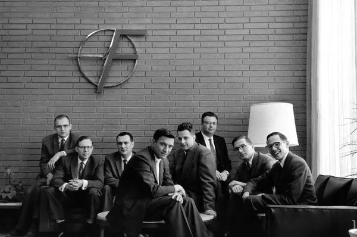

Silicon Valley (Thung lũng Silicon), một cái tên mà bất kỳ ai làm trong mảng công nghệ cũng đều biết đến, đồng nghĩa với sự đổi mới liên tục, tinh thần khởi nghiệp và những tiến bộ vượt bậc đã định hình thế giới hiện đại. Nằm ở khu vực phía Bắc California, Hoa Kỳ[^1], khu vực này không chỉ là một địa điểm địa lý mà còn là một biểu tượng, một hệ sinh thái phức tạp đã và đang thúc đẩy cuộc cách mạng kỹ thuật số.

Đối với nhiều sinh viên đang học trong ngành công nghệ thông tin, _**Silicon Valley là một giấc mơ**_, một nơi mà mọi người đều muốn đặt chân đến. Đó là nơi mà những công ty công nghệ hàng đầu như Google, Apple, Facebook, và nhiều công ty khởi nghiệp khác đã ra đời và phát triển mạnh mẽ. Tuy nhiên, không phải ai cũng có cơ hội để trải nghiệm cuộc sống tại đây.

Việc một quốc gia hay một khu vực nào đó có thể tái tạo được một "Silicon Valley cho riêng mình" chính liều thuốc tiên mà bất kỳ ai cũng đều muốn có. Thâm Quyến, Trung Quốc là một ví dụ điển hình cho việc tái tạo thành công mô hình này[^m1].

Việt Nam cũng không phải là một ngoại lệ. Với sự phát triển mạnh mẽ của ngành công nghệ thông tin trong những năm gần đây, nhiều người đã đặt ra câu hỏi: "Liệu Việt Nam có thể tái tạo được một Silicon Valley cho riêng mình hay không?"

Để trả lời câu hỏi trên, đầu tiên chúng ta cần phải biết và hiểu được bản chất của Silicon Valley. Các bài viết nói về Silicon Valley hiện nay bạn có thể tìm thấy khá nhiều trên internet. Ở bài viết này, mình sẽ cố gắng tóm gọn nhất có thể những điểm quan trọng.

## Phần 1: Nguồn gốc hình thành

Sự ra đời của Silicon Valley không phải là một sự kiện đơn lẻ mà là kết quả của sự hội tụ nhiều yếu tố trong nửa đầu thế kỷ 20, trong đó vai trò của Đại học Stanford và tầm nhìn của Frederick Terman là cực kỳ quan trọng.

### Đại học Stanford và Tầm nhìn của Frederick Terman

Ngay từ những ngày đầu thành lập vào năm 1891 bởi ông trùm đường sắt Leland Stanford, Đại học Stanford đã đóng vai trò trung tâm trong sự hình thành của Silicon Valley[^2]. Các nhà lãnh đạo Stanford thời kỳ đầu đã định hướng sứ mệnh của trường là phục vụ miền Tây nước Mỹ, điều này đã tạo sự liên kết tự nhiên giữa lợi ích của trường với ngành công nghiệp công nghệ cao non trẻ trong khu vực. Trường đại học này đã trở thành một trung tâm quan trọng cho đổi mới và khởi nghiệp vào giữa thế kỷ 20, hưởng lợi từ văn hóa kinh doanh sẵn có ở Vịnh San Francisco. Sự hợp tác chặt chẽ giữa giới học thuật và ngành công nghiệp, được nuôi dưỡng tại Stanford, là một đặc điểm cốt lõi của Silicon Valley[^2].

Frederick Terman, một kỹ sư điện tài năng và nhà quản lý giáo dục sắc sảo, được nhiều người coi là nhân vật quan trọng nhất trong việc tạo ra Silicon Valley. Sau khi nhận bằng tiến sĩ tại MIT dưới sự hướng dẫn của Vannevar Bush và trở về giảng dạy tại Stanford vào năm 1925, Terman nhận thấy sự yếu kém của khoa kỹ thuật điện so với MIT và nuôi tham vọng biến Stanford thành "MIT của Bờ Tây". Ông tập trung xây dựng chương trình giảng dạy và nghiên cứu về điện tử, đặc biệt là điện tử vi sóng sau kinh nghiệm làm việc trong Thế chiến II[^5].

Terman không chỉ là một nhà giáo dục mà còn là một người thúc đẩy khởi nghiệp mạnh mẽ. Ông tích cực khuyến khích các sinh viên tài năng của mình, bao gồm William Hewlett, David Packard (những người sáng lập HP) và Eugene Litton (Litton Industries), thành lập công ty riêng ngay tại địa phương thay vì tìm kiếm cơ hội ở Bờ Đông[^4]. Ông không dừng lại ở lời khuyên mà còn trực tiếp đầu tư, hỗ trợ kỹ thuật và tài chính cho các công ty khởi nghiệp này, thể hiện cam kết cá nhân trong việc tích hợp trường đại học với ngành công nghiệp đang phát triển[^4].

Một trong những sáng kiến quan trọng nhất của Terman là việc thành lập Khu công nghiệp Stanford (Stanford Industrial Park, nay là Khu nghiên cứu Stanford - Stanford Research Park) vào năm 1951[^4]. Đây là khu công nghiệp thuộc sở hữu của trường đại học đầu tiên trên thế giới. Stanford cho các công ty công nghệ cao thuê dài hạn đất của trường, tạo ra một môi trường cộng sinh độc đáo. Các công ty như Varian Associates, HP, Eastman Kodak, General Electric và Lockheed đã nhanh chóng chuyển đến đây, biến khu vực này thành trung tâm sản xuất công nghệ cao hàng đầu nước Mỹ[^4]. Terman coi đây là "vũ khí bí mật" của Stanford, nơi các giáo sư đại học có thể tư vấn cho công ty, các nhà nghiên cứu công nghiệp có thể giảng dạy tại trường, và các công ty dễ dàng tuyển dụng những sinh viên xuất sắc nhất[^5].

Năm 1954, Stanford khởi xướng Chương trình Hợp tác Danh dự (Honors Cooperative Program), cho phép nhân viên toàn thời gian của các công ty trong khu công nghiệp theo học các chương trình sau đại học bán thời gian tại Stanford[^4]. Chương trình này càng thắt chặt mối quan hệ giữa trường đại học và ngành công nghiệp, cung cấp lợi thế quan trọng cho các công ty nhỏ trong việc thu hút và giữ chân nhân tài.

Sự hình thành của Silicon Valley không phải là một quá trình phát triển tự nhiên thuần túy mà là kết quả của một chiến lược có chủ đích. Tầm nhìn xa của Frederick Terman và những hành động cụ thể, mang tính kiến tạo của ông cùng Đại học Stanford – từ việc xây dựng một khoa kỹ thuật điện tử mạnh, chủ động khuyến khích sinh viên tài năng ở lại và khởi nghiệp tại địa phương, đến việc thành lập Khu công nghiệp Stanford để thu hút các công ty công nghệ, và thiết kế các chương trình như Honors Cooperative để củng cố liên kết đại học-công nghiệp – tất cả đã tạo ra một hệ sinh thái công nghệ độc đáo và tự duy trì. Terman còn tích cực tìm kiếm các hợp đồng nghiên cứu từ quân đội để tài trợ cho hoạt động học thuật, đặc biệt trong lĩnh vực vi sóng sau Thế chiến II. Những nỗ lực có định hướng này đã đặt nền móng vững chắc cho sự ra đời và phát triển thần kỳ của Silicon Valley.

### Hewlett-Packard: Khởi nghiệp Tiêu biểu từ Garage

Câu chuyện của Hewlett-Packard (HP) là hình mẫu kinh điển của tinh thần khởi nghiệp Silicon Valley. Năm 1939, hai sinh viên tốt nghiệp kỹ thuật điện của Stanford là Bill Hewlett và David Packard, dưới sự khuyến khích và hướng dẫn của giáo sư Frederick Terman, đã thành lập công ty trong một garage ô tô nhỏ tại 367 Addison Avenue, Palo Alto[^4]. Với số vốn ban đầu chỉ 538 đô la Mỹ, họ bắt đầu chế tạo các thiết bị điện tử.

Thành công tài chính đầu tiên của HP đến từ máy tạo dao động âm thanh chính xác HP 200A. Điểm độc đáo của thiết bị này là việc sử dụng một bóng đèn sợi đốt nhỏ hoạt động như một điện trở phụ thuộc nhiệt độ để ổn định biên độ tín hiệu. Một trong những khách hàng đầu tiên và nổi tiếng nhất của sản phẩm này là Walt Disney Studios, đã mua tám chiếc để kiểm tra hệ thống âm thanh cho bộ phim hoạt hình kinh điển "Fantasia"[^56].

HP nhanh chóng phát triển, chuyển từ garage ra cơ sở thương mại và sau đó trở thành một trong những công ty đầu tiên thuê địa điểm tại Khu công nghiệp Stanford. Quan trọng hơn cả thành công kinh doanh ban đầu là sự hình thành văn hóa công ty độc đáo được gọi là "HP Way". Văn hóa này, được xem là khá cấp tiến vào thời điểm đó so với các tập đoàn truyền thống ở Bờ Đông, nhấn mạnh sự tin tưởng và tôn trọng cá nhân, tập trung vào thành tích và đóng góp cao, kinh doanh liêm chính, làm việc nhóm, khuyến khích sự linh hoạt và đổi mới[^21]. HP áp dụng các phương pháp quản lý như Quản lý bằng Mục tiêu (Management by Objective - MBO) và Quản lý bằng cách Đi vòng quanh (Management by Wandering Around - MBWA), khuyến khích sự tương tác trực tiếp và không phân cấp.

HP được công nhận rộng rãi là công ty sáng lập mang tính biểu tượng của Silicon Valley. Chiếc garage nơi họ khởi nghiệp đã trở thành một địa danh lịch sử, được mệnh danh là "Nơi khai sinh của Silicon Valley". Di sản của HP không chỉ nằm ở các sản phẩm công nghệ mà còn ở văn hóa "HP Way". Văn hóa này đã ảnh hưởng sâu sắc đến nhiều thế hệ công ty công nghệ sau này trong Thung lũng, trở thành một hình mẫu về quản lý và môi trường làm việc[^16]. Nhiều nhân vật quan trọng của ngành công nghệ, bao gồm cả Steve Jobs (người đã gặp Steve Wozniak khi làm việc tại HP), đã từng làm việc hoặc chịu ảnh hưởng từ HP[^21]. Do đó, HP không chỉ đơn thuần là một công ty thành công, mà còn là một khuôn mẫu định hình các giá trị cốt lõi và phong cách quản lý đặc trưng của hệ sinh thái khởi nghiệp Silicon Valley.

### Các Yếu tố Ban đầu: Quân sự, Vốn Mạo hiểm Sơ khai

**Chi tiêu Quốc phòng**: Nguồn tài trợ và nhu cầu từ chính phủ, đặc biệt là Bộ Quốc phòng Hoa Kỳ, đóng vai trò không thể thiếu trong giai đoạn hình thành của Silicon Valley. Khu vực Vịnh San Francisco từ lâu đã là một địa điểm quan trọng cho nghiên cứu và công nghệ của Hải quân Hoa Kỳ. Frederick Terman đã chủ động tìm kiếm các hợp đồng quân sự cho Stanford trong và sau Thế chiến II cũng như Chiến tranh Triều Tiên, đặc biệt trong lĩnh vực điện tử vi sóng. Nhu cầu về các thành phần điện tử tiên tiến cho các hệ thống quân sự và sau này là chương trình không gian (NASA trở thành khách hàng lớn cho IC của Fairchild[^16]) đã cung cấp một thị trường ban đầu quan trọng và nguồn tài trợ nghiên cứu dồi dào, thúc đẩy sự phát triển công nghệ trong khu vực.

**Vốn Mạo hiểm (Venture Capital - VC) Sơ khai**: Sự sẵn có của vốn mạo hiểm, dù còn non trẻ, cũng là một yếu tố quan trọng[^2]. Frederick Terman đã hỗ trợ các công ty khởi nghiệp ban đầu trong việc tìm kiếm nguồn tài trợ[^5]. Mặc dù khái niệm VC hiện đại phần lớn được du nhập từ Bờ Đông (cụ thể là American Research and Development Corporation - ARDC ở Boston), Silicon Valley đã nhanh chóng trở thành mảnh đất màu mỡ cho loại hình đầu tư này. Đạo luật Đầu tư Doanh nghiệp Nhỏ năm 1958 (Small Business Investment Act) đã tạo điều kiện thuận lợi hơn cho việc thành lập các công ty đầu tư. Vào những năm 1970, các công ty VC bắt đầu tập trung tại khu vực Sand Hill Road ở Menlo Park và Palo Alto, tạo thành một trung tâm tài chính quan trọng cho các công ty công nghệ non trẻ.

**Các yếu tố khác**: Bên cạnh Stanford, HP, chi tiêu quốc phòng và VC sơ khai, các yếu tố khác cũng góp phần tạo nên môi trường độc đáo của Silicon Valley. Quy định của chính phủ tương đối dễ dãi vào thời điểm đó đã tạo điều kiện cho sự phát triển. Quan trọng không kém là văn hóa khu vực đặc thù, mang đậm tinh thần tiên phong từ thời Cơn sốt vàng California, sự cởi mở trong trao đổi ý tưởng, và thái độ chấp nhận rủi ro cao. Sự khác biệt này so với môi trường cạnh tranh và khép kín hơn ở Bờ Đông đã thúc đẩy sự hợp tác và luân chuyển nhân tài. Cuối cùng, sự di cư của các nhà khoa học, kỹ sư và doanh nhân tài năng từ khắp nơi trên thế giới đến khu vực cũng là một yếu tố không thể thiếu[^5].

Sự trỗi dậy ban đầu của Silicon Valley không thể quy cho một yếu tố duy nhất. Đúng hơn, đó là kết quả của sự giao thoa và hội tụ của nhiều điều kiện thuận lợi cùng lúc. Một nền tảng nghiên cứu khoa học vững chắc được cung cấp bởi các trường đại học hàng đầu, đặc biệt là Stanford với vai trò kiến tạo chủ động của Terman. Nguồn vốn mạo hiểm, dù ban đầu còn sơ khai, đã bắt đầu xuất hiện để tài trợ cho các ý tưởng mới. Nhu cầu và nguồn tài trợ ổn định từ chính phủ và quân đội đã cung cấp cả thị trường ban đầu lẫn kinh phí nghiên cứu. Và trên hết là một văn hóa khu vực độc đáo, nơi tinh thần hợp tác, chấp nhận rủi ro và khát vọng đổi mới được đề cao. Chính sự kết hợp cộng hưởng của những yếu tố này đã tạo ra một "hệ sinh thái" độc nhất vô nhị, đặt nền móng cho vị thế trung tâm công nghệ toàn cầu của Silicon Valley.

## Phần 2: Cuộc Cách mạng Bán dẫn

Sau giai đoạn hình thành ban đầu, cuộc cách mạng thực sự đưa "Silicon" vào tên gọi của thung lũng chính là sự phát triển của ngành công nghiệp bán dẫn, được thúc đẩy bởi hai phát minh nền tảng: bóng bán dẫn và mạch tích hợp.

### Từ Bóng bán dẫn đến Mạch tích hợp

**Phát minh Bóng bán dẫn (Transistor)**: Bước đột phá đầu tiên diễn ra vào năm 1947 tại Bell Laboratories ở New Jersey, khi John Bardeen, Walter Brattain và William Shockley phát minh ra bóng bán dẫn tiếp xúc điểm (point-contact transistor) đầu tiên[^81]. Phát minh này, thay thế cho các ống chân không (vacuum tube) cồng kềnh, tiêu tốn năng lượng và kém bền 82, đã mở ra kỷ nguyên điện tử trạng thái rắn. Shockley, người đóng góp chính về mặt lý thuyết, sau đó đã phát minh ra bóng bán dẫn lưỡng cực (junction transistor) vào năm 1948, một thiết kế ưu việt và thực tế hơn. Cả ba nhà khoa học đã cùng nhận giải Nobel Vật lý năm 1956 cho công trình này[^82].

William Shockley, người có thời thơ ấu ở Palo Alto, đóng vai trò then chốt trong việc đưa công nghệ bán dẫn đến Bờ Tây. Ông tin rằng silicon, một nguyên tố phổ biến hơn và có đặc tính tốt hơn ở nhiệt độ cao so với germani (vật liệu bán dẫn ban đầu), sẽ là vật liệu lý tưởng cho tương lai của bóng bán dẫn[^4]. Năm 1956, với sự hậu thuẫn tài chính từ Beckman Instruments, Shockley quay trở lại khu vực và thành lập Shockley Semiconductor Laboratory ở Mountain View, với mục tiêu phát triển và sản xuất bóng bán dẫn silicon. Động thái này được xem là khởi đầu cho ngành công nghiệp bán dẫn tại nơi mà sau này được gọi là Silicon Valley.

**Phát minh Mạch tích hợp (Integrated Circuit - IC)**: Bước nhảy vọt tiếp theo là mạch tích hợp (IC), hay còn gọi là vi mạch (microchip). Đây là ý tưởng tích hợp nhiều thành phần điện tử (bóng bán dẫn, điện trở, tụ điện) lên một miếng vật liệu bán dẫn duy nhất, thường là silicon[^2]. Phát minh này giải quyết "sự chuyên chế của các con số" (tyranny of numbers) - sự phức tạp và chi phí của việc kết nối thủ công hàng ngàn hoặc hàng triệu thành phần riêng lẻ. Hai nhà khoa học đã độc lập phát triển ý tưởng này gần như cùng lúc: Jack Kilby tại Texas Instruments (TI) vào năm 1958 và Robert Noyce tại Fairchild Semiconductor ở Silicon Valley vào năm 1959. Kilby đã chế tạo thành công IC lai (hybrid IC) đầu tiên hoạt động, sử dụng dây nối vàng để kết nối các thành phần trên một miếng germani[^91]. Tuy nhiên, chính phát minh của Noyce về IC nguyên khối (monolithic IC) mới thực sự mang tính cách mạng cho sản xuất hàng loạt. Dựa trên quy trình phẳng (planar process) do đồng nghiệp Jean Hoerni tại Fairchild phát triển, Noyce đề xuất tạo ra tất cả các thành phần và kết nối chúng bằng các lớp kim loại (nhôm) lắng đọng trên bề mặt lớp oxit cách điện của tấm silicon. Phương pháp này giúp loại bỏ các dây nối thủ công phức tạp, cho phép sản xuất IC với số lượng lớn, chi phí thấp và độ tin cậy cao, đặt nền móng cho ngành công nghiệp vi điện tử hiện đại.

Cuộc cách mạng bán dẫn ở Silicon Valley thực chất được tạo nên bởi hai bước nhảy vọt công nghệ nền tảng nối tiếp nhau. Đầu tiên là bóng bán dẫn, một phát minh của Bell Labs nhưng được Shockley mang về Silicon Valley với trọng tâm là vật liệu silicon, thay thế các ống chân không lỗi thời. Bước nhảy vọt thứ hai, và có lẽ còn quan trọng hơn đối với bản sắc của khu vực, là mạch tích hợp (IC). Phát minh IC, với những đóng góp then chốt của cả Kilby (TI) và Noyce (Fairchild), cho phép tích hợp số lượng lớn bóng bán dẫn lên một chip silicon duy nhất. Đặc biệt, phương pháp chế tạo IC nguyên khối của Noyce tại Fairchild đã mở đường cho việc sản xuất hàng loạt và thu nhỏ hóa các thiết bị điện tử. Chính sự phát triển và sản xuất các chip silicon này đã định hình ngành công nghiệp cốt lõi ban đầu và mang lại tên gọi "Silicon Valley" cho khu vực.

### Fairchild Semiconductor: Cái nôi của Đổi mới và Nhân tài

Fairchild Semiconductor có một khởi đầu đầy kịch tính. Năm 1957, tám kỹ sư tài năng, sau này được Shockley gọi một cách cay đắng là "Tám kẻ phản bội" (Traitorous Eight) - bao gồm những tên tuổi lẫy lừng như Robert Noyce và Gordon Moore - đã đồng loạt từ chức khỏi Shockley Semiconductor Laboratory do không hài lòng với phong cách quản lý độc đoán và thất thường của Shockley[^4]. Nhóm này đã tìm đến Arthur Rock (một nhà đầu tư mạo hiểm tiên phong) và Sherman Fairchild, chủ sở hữu của Fairchild Camera and Instrument Corporation, người đã đồng ý tài trợ thành lập Fairchild Semiconductor như một công ty con.

Fairchild nhanh chóng trở thành một thế lực trong ngành bán dẫn non trẻ. Công ty không chỉ thành công trong việc sản xuất hàng loạt bóng bán dẫn silicon[^40], mà còn là nơi sản sinh ra những đổi mới công nghệ quan trọng bậc nhất. Jean Hoerni, một trong "Tám kẻ phản bội", đã phát minh ra quy trình phẳng (planar process) vào năm 1959. Quy trình này sử dụng một lớp silicon dioxide bảo vệ bề mặt chip, giúp tăng độ tin cậy, hiệu suất và cho phép sản xuất hàng loạt dễ dàng hơn. Dựa trên quy trình phẳng, Robert Noyce đã hình thành ý tưởng về mạch tích hợp nguyên khối, kết nối các thành phần trên chip bằng các đường dẫn kim loại lắng đọng trên lớp oxit. Fairchild đã thương mại hóa IC đầu tiên vào năm 1961. Mặc dù ban đầu rất đắt đỏ, IC của Fairchild đã tìm thấy thị trường quan trọng trong chương trình không gian Apollo của NASA, nơi yêu cầu về kích thước và độ tin cậy là tối quan trọng.

Tầm ảnh hưởng của Fairchild vượt xa những đổi mới công nghệ của chính nó. Công ty trở thành một "vườn ươm" nhân tài và khởi nghiệp phi thường. Trong suốt những năm 1960 và sau đó, hàng loạt nhân viên chủ chốt đã rời Fairchild để thành lập công ty riêng của họ. Những công ty này, được gọi chung là "Fairchildren", bao gồm những gã khổng lồ tương lai như Intel (do Noyce và Moore thành lập năm 1968), Advanced Micro Devices (AMD) và National Semiconductor[^21]. Hiện tượng này đã gieo mầm cho sự phát triển bùng nổ của ngành bán dẫn trong khu vực, lan tỏa công nghệ, kiến thức quản lý và tinh thần khởi nghiệp, tạo ra một mạng lưới dày đặc các công ty và chuyên gia[^30].

 đã ra đời qua sáu thế hệ liên doanh công nghệ")

Fairchild cũng góp phần định hình văn hóa làm việc đặc trưng của Silicon Valley. Dưới sự lãnh đạo của Noyce, công ty áp dụng phong cách quản lý ít phân cấp, thoải mái và tập trung vào kỹ năng kỹ thuật hơn là các cấu trúc cứng nhắc của các tập đoàn truyền thống. Môi trường làm việc cởi mở, năng động, pha trộn giữa sự trẻ trung, đa dạng và chấp nhận rủi ro đã trở thành hình mẫu cho nhiều công ty khởi nghiệp sau này[^30].

Mặc dù đạt được thành công vang dội trong thập kỷ đầu tiên, Fairchild bắt đầu gặp khó khăn vào cuối những năm 1960 do các vấn đề quản lý nội bộ và sự cạnh tranh ngày càng tăng từ chính các "Fairchildren" của mình[^40]. Công ty trải qua nhiều lần đổi chủ, bị mua lại bởi Schlumberger (1979), National Semiconductor (1987), và cuối cùng là ON Semiconductor (2016). Tuy nhiên, di sản của Fairchild Semiconductor với tư cách là cái nôi của đổi mới bán dẫn và là chất xúc tác cho hệ sinh thái khởi nghiệp của Silicon Valley vẫn không thể phai mờ.

Fairchild Semiconductor giữ một vị trí đặc biệt trong lịch sử Silicon Valley, không chỉ vì những đóng góp công nghệ nền tảng như quy trình phẳng và mạch tích hợp nguyên khối. Quan trọng hơn, nó hoạt động như một chất xúc tác mạnh mẽ cho toàn bộ hệ sinh thái. Việc hàng loạt nhân viên tài năng rời đi để thành lập các công ty mới - hiện tượng "Fairchildren" - đã gieo mầm cho sự phát triển theo cấp số nhân của ngành công nghiệp bán dẫn. Nó không chỉ lan tỏa công nghệ và kiến thức mà còn phổ biến một văn hóa khởi nghiệp năng động, chấp nhận rủi ro và ít phân cấp. Fairchild không chỉ đơn thuần là một công ty; nó là một trường đào tạo và bệ phóng cho cả một thế hệ doanh nhân, định hình nên cấu trúc phân tán, cạnh tranh nhưng cũng đầy hợp tác của ngành công nghiệp đã mang lại tên tuổi cho Silicon Valley.

### Intel và Sự thống trị của Bộ vi xử lý

 trên cùng một chip.")

Intel Corporation được thành lập vào ngày 18 tháng 7 năm 1968, bởi Robert Noyce và Gordon Moore, hai trong số những người sáng lập Fairchild Semiconductor, cùng với sự tham gia ban đầu của nhà hóa học Andy Grove (nhân viên thứ ba) và hỗ trợ tài chính từ nhà đầu tư mạo hiểm Arthur Rock. Tên "Intel" là viết tắt của "Integrated Electronics" (Điện tử Tích hợp)[^100]. Noyce và Moore rời Fairchild vì cảm thấy công ty mẹ (Fairchild Camera and Instrument) không tái đầu tư đủ vào nghiên cứu và phát triển bán dẫn[^107].

Bộ vi xử lý (Microprocessor): Thành tựu quan trọng nhất và định hình nên lịch sử của Intel chính là việc phát minh ra bộ vi xử lý (microprocessor) đơn chip đầu tiên trên thế giới - Intel 4004 - vào năm 1971. Bộ vi xử lý này, được thiết kế bởi một nhóm kỹ sư bao gồm Federico Faggin, Ted Hoff, Masatoshi Shima và Stanley Mazor, đã tích hợp toàn bộ đơn vị xử lý trung tâm (CPU) của máy tính lên một con chip silicon duy nhất. Đây được coi là "bộ não" của máy tính và các thiết bị điện tử, một bước đột phá đặt nền móng cho cuộc cách mạng máy tính cá nhân (PC) sau này. Intel tiếp tục củng cố vị thế dẫn đầu với việc ra mắt bộ vi xử lý 8-bit Intel 8080 vào năm 1974.

Gordon Moore, một trong những người đồng sáng lập Intel, nổi tiếng với "Định luật Moore". Vào năm 1965, ông đã quan sát và dự đoán rằng số lượng bóng bán dẫn trên một vi mạch sẽ tăng gấp đôi khoảng mỗi hai năm (sau này được điều chỉnh thành khoảng 18 tháng đến 2 năm), trong khi chi phí sản xuất sẽ giảm tương ứng. Định luật này, mặc dù là một quan sát thực nghiệm hơn là một định luật vật lý, đã trở thành kim chỉ nam và động lực thúc đẩy sự đổi mới không ngừng trong ngành công nghiệp bán dẫn trong nhiều thập kỷ, dẫn đến sự gia tăng theo cấp số nhân về sức mạnh tính toán.

 của bộ vi xử lý theo ngày ra mắt, (cho thấy số lượng này) tăng gần gấp đôi sau mỗi hai năm.")

Nhờ sự thành công của bộ vi xử lý, Intel đã nhanh chóng phát triển và thống trị thị trường này trong nhiều thập kỷ. Các bộ vi xử lý của Intel ("Intel Inside") đã cung cấp sức mạnh tính toán cho phần lớn máy tính cá nhân và máy chủ trên toàn thế giới, đóng vai trò trung tâm trong sự bùng nổ của kỷ nguyên PC và Internet.

Bộ ba sáng lập Noyce, Moore và Grove đã định hình nên văn hóa của Intel. Trong khi Noyce mang đến uy tín và tầm nhìn, Moore dẫn dắt về công nghệ, thì Andy Grove nổi tiếng với phong cách quản lý quyết đoán, tập trung vào kết quả và kỷ luật thực thi, giúp Intel vượt qua nhiều thách thức và duy trì vị thế cạnh tranh[^73].

Là một "đứa con" của Fairchild, Intel đã kế thừa và phát huy di sản bán dẫn để tạo ra một phát minh còn có tầm ảnh hưởng lớn hơn: bộ vi xử lý. Con chip nhỏ bé này đã trở thành động cơ cốt lõi thúc đẩy toàn bộ cuộc cách mạng máy tính cá nhân và phần lớn kỷ nguyên số sau này. Cùng với Định luật Moore đóng vai trò như một lời tiên tri tự ứng nghiệm, sự thống trị của Intel trong lĩnh vực vi xử lý không chỉ mang lại thành công khổng lồ cho công ty mà còn định hình sâu sắc kiến trúc, hiệu năng và giá cả của điện toán hiện đại, biến Silicon Valley từ một trung tâm sản xuất chip thành trung tâm của cuộc cách mạng điện toán toàn cầu.

Sự bùng nổ của ngành công nghiệp bán dẫn, với các công ty tiên phong như Fairchild và Intel, đã tạo ra hàng ngàn việc làm kỹ thuật cao, thu hút nhân tài toàn cầu đến Vùng Vịnh. Thành công tài chính của các công ty này cũng chứng minh tiềm năng lợi nhuận của công nghệ cao, thúc đẩy dòng vốn mạo hiểm đổ vào khu vực từ những năm 1970.

Để phục vụ sản xuất chip phức tạp, một hệ sinh thái các ngành công nghiệp phụ trợ (thiết bị, vật liệu, phần mềm thiết kế, dịch vụ thử nghiệm) đã phát triển mạnh mẽ. Quá trình này đã biến Thung lũng Santa Clara từ một vùng nông nghiệp thành trung tâm công nghệ toàn cầu - Silicon Valley.

Ngành bán dẫn không chỉ tạo ra chip mà còn tạo hiệu ứng lan tỏa kinh tế mạnh mẽ: tạo việc làm chất lượng, thu hút vốn đầu tư, và hình thành mạng lưới nhà cung cấp chuyên biệt. Nền tảng vững chắc này đã thúc đẩy sự đa dạng hóa và tăng trưởng liên tục của Silicon Valley qua các làn sóng đổi mới công nghệ sau này.

## Phần 3: Bong bóng Dot-com: Bùng nổ và Vỡ vụn

Cuối những năm 1990 đánh dấu một giai đoạn tăng trưởng phi thường nhưng cũng đầy biến động trong lịch sử Silicon Valley: thời kỳ bùng nổ và sụp đổ của bong bóng dot-com. Sự phổ biến nhanh chóng của Internet đã tạo ra một làn sóng lạc quan và đầu cơ chưa từng có.

### Sự trỗi dậy của các Công ty Internet

Vào giữa thập niên 1990, World Wide Web bắt đầu được thương mại hóa và phổ biến rộng rãi tới công chúng[^4]. Internet không còn là công cụ độc quyền của giới học thuật hay quân sự mà trở thành một nền tảng mới cho kinh doanh, giao tiếp và giải trí. Sự kiện NSFnet, tiền thân của Internet, ngừng hoạt động vào tháng 4 năm 1995 đã chính thức mở đường cho việc sử dụng Internet thương mại và tư nhân.

**Làn sóng Công ty Dot-com Đầu tiên:** Giai đoạn này chứng kiến sự ra đời và phát triển nhanh chóng của một thế hệ công ty mới hoàn toàn dựa trên nền tảng web. Netscape Communications, với trình duyệt Navigator, đã phổ biến hóa việc duyệt web. Yahoo!, ban đầu là một thư mục web do hai sinh viên Stanford là Jerry Yang và David Filo tạo ra, đã trở thành cổng thông tin hàng đầu. Amazon.com, do Jeff Bezos thành lập năm 1994, khởi đầu là một hiệu sách trực tuyến nhưng nhanh chóng mở rộng sang nhiều mặt hàng khác, định hình lại ngành bán lẻ. eBay tạo ra một thị trường đấu giá trực tuyến khổng lồ. Hàng loạt các công ty khác cung cấp dịch vụ từ tìm kiếm, email, đến tin tức và giải trí cũng đua nhau ra đời.

Vụ phát hành cổ phiếu lần đầu ra công chúng (IPO) của Netscape vào tháng 8 năm 1995, với giá cổ phiếu tăng vọt trong ngày đầu tiên, được coi là sự kiện khởi đầu cho cơn sốt dot-com. Tiếp theo đó là hàng trăm vụ IPO của các công ty Internet khác, thu hút sự quan tâm cuồng nhiệt của các nhà đầu tư và công chúng.36 Chỉ riêng năm 1999 và 2000 đã có hàng trăm công ty Internet lên sàn chứng khoán.

### Đầu cơ, Thổi phồng và Sụp đổ

Bong bóng dot-com được thổi phồng bởi sự kết hợp của nhiều yếu tố. Niềm tin mãnh liệt vào tiềm năng thay đổi thế giới của Internet và một "nền kinh tế mới" đã dẫn đến sự lạc quan quá mức. Nguồn vốn mạo hiểm trở nên dồi dào và dễ tiếp cận một cách bất thường, các nhà đầu tư đổ hàng tỷ đô la vào các công ty khởi nghiệp Internet, đôi khi chỉ dựa trên những kế hoạch kinh doanh sơ sài[^32]. Môi trường lãi suất thấp vào cuối những năm 1990 cũng tạo điều kiện cho việc vay vốn dễ dàng. Truyền thông đại chúng liên tục đăng tải những câu chuyện về các triệu phú Internet trẻ tuổi, càng làm tăng thêm sự cường điệu và thu hút các nhà đầu tư cá nhân tham gia vào thị trường. Cuối cùng, yếu tố đầu cơ thuần túy và tâm lý sợ bỏ lỡ (FOMO) đã đóng vai trò quan trọng[^38].

Hệ quả là các công ty dot-com được định giá ở mức không tưởng. Nhiều công ty có giá trị vốn hóa thị trường hàng trăm triệu, thậm chí hàng tỷ đô la mà không hề có doanh thu, lợi nhuận, hoặc thậm chí chưa có sản phẩm hoàn chỉnh. Các nhà đầu tư và công ty chạy theo chiến lược "Get Big Fast" (Lớn nhanh bằng mọi giá), tập trung vào việc thu hút người dùng và thị phần thay vì xây dựng nền tảng tài chính vững chắc. Các chỉ số như lưu lượng truy cập web ("eyeballs") được coi trọng hơn các chỉ số tài chính cơ bản như tỷ lệ P/E (giá trên thu nhập). Tỷ lệ đốt tiền (burn rate) - tốc độ tiêu tốn vốn đầu tư - trở thành một thước đo phổ biến.

**Sự sụp đổ (2000-2001):** Bong bóng cuối cùng đã vỡ tan. Chỉ số NASDAQ Composite, nơi niêm yết nhiều cổ phiếu công nghệ, đạt đỉnh lịch sử vào ngày 10 tháng 3 năm 2000, ở mức trên 5.000 điểm, gấp đôi chỉ một năm trước đó. Ngay sau đó, thị trường bắt đầu lao dốc không phanh. Các yếu tố châm ngòi cho sự sụp đổ bao gồm việc Cục Dự trữ Liên bang Mỹ (Fed) tăng lãi suất để kiềm chế lạm phát, nguồn vốn mạo hiểm bắt đầu cạn kiệt khi các nhà đầu tư trở nên thận trọng hơn, và sự nhận thức ngày càng tăng rằng nhiều công ty dot-com đơn giản là không có mô hình kinh doanh bền vững. Khi các công ty công nghệ lớn như Cisco và Dell bắt đầu bán ra cổ phiếu của họ, sự hoảng loạn lan rộng, dẫn đến một làn sóng bán tháo khổng lồ.

 kéo dài hai năm và một cuộc suy thoái nhẹ.")

Sự sụp đổ của bong bóng dot-com gây ra những hậu quả nặng nề. Hàng loạt công ty Internet đình đám như Pets.com, Webvan, Boo.com, eToys phá sản và bị thanh lý. Giá trị thị trường chứng khoán bốc hơi hàng nghìn tỷ đô la; chỉ số NASDAQ mất gần 80% giá trị từ đỉnh và phải mất 15 năm mới phục hồi được mức cũ. Ngay cả cổ phiếu của các công ty công nghệ lớn, ổn định hơn cũng mất hơn 80% giá trị. Silicon Valley hứng chịu một cú sốc lớn với làn sóng sa thải hàng loạt, tỷ lệ thất nghiệp tăng vọt, giá bất động sản sụt giảm, và nhiều văn phòng bị bỏ trống. Nền kinh tế Mỹ rơi vào suy thoái vào năm 2001. Sự kiện 11/9 sau đó càng làm trầm trọng thêm tình hình kinh tế.

Bong bóng dot-com là một chương hỗn loạn trong lịch sử Silicon Valley, một minh chứng rõ ràng cho việc sự cường điệu về công nghệ và tâm lý đầu cơ có thể vượt xa thực tế kinh doanh như thế nào. Sự kết hợp của một công nghệ mới đầy hứa hẹn (Internet), nguồn vốn đầu tư dễ dàng và dồi dào, cùng với sự phấn khích lan tỏa trên phương tiện truyền thông và tâm lý đám đông đã tạo ra một môi trường nơi các công ty được định giá phi lý dựa trên tiềm năng mơ hồ thay vì các chỉ số cơ bản. Việc bỏ qua các nguyên tắc kinh doanh cốt lõi như tạo doanh thu và lợi nhuận cuối cùng đã dẫn đến sự sụp đổ không thể tránh khỏi, gây tổn thất tài chính khổng lồ và tác động sâu sắc đến nền kinh tế, văn hóa và tâm lý của Silicon Valley cũng như toàn cầu.

### Amazon và Google: Những Kẻ sống sót và Trỗi dậy

**Amazon**: Được thành lập vào tháng 7 năm 1994 bởi Jeff Bezos tại Bellevue, Washington, Amazon ban đầu chỉ là một hiệu sách trực tuyến hoạt động từ garage. Công ty ra mắt trang web vào tháng 7 năm 1995 và IPO vào năm 1997. Mặc dù cũng chịu ảnh hưởng nặng nề từ vụ sụp đổ dot-com (giá cổ phiếu mất 90% giá trị từ 1999-2001 164), Amazon đã sống sót. Sự sống sót này phần lớn nhờ vào tầm nhìn dài hạn của Bezos, sự tập trung không ngừng vào trải nghiệm khách hàng ("Earth's most customer-centric company"), và chiến lược "Get Big Fast" được thực hiện một cách kiên nhẫn. Amazon không có lãi trong nhiều năm và chỉ ghi nhận quý có lãi đầu tiên vào cuối năm 2001 và năm có lãi đầu tiên vào năm 2003. Sau khủng hoảng, Amazon tiếp tục đa dạng hóa mạnh mẽ, trở thành "cửa hàng bán mọi thứ", ra mắt dịch vụ thành viên Prime vào năm 2005 và đặc biệt là nền tảng điện toán đám mây Amazon Web Services (AWS) vào năm 2006, một bước đi đã trở thành trụ cột lợi nhuận chính của công ty.

**Google**: Google ra đời muộn hơn một chút trong cơn sốt dot-com, được thành lập chính thức vào tháng 9 năm 1998 bởi hai nghiên cứu sinh tiến sĩ của Đại học Stanford là Larry Page và Sergey Brin. Nguồn gốc của Google là dự án nghiên cứu "BackRub" tại Stanford, tập trung vào việc phân tích cấu trúc liên kết của World Wide Web để xếp hạng mức độ liên quan của các trang web. Thuật toán PageRank độc đáo của họ, đánh giá tầm quan trọng của một trang dựa trên số lượng và chất lượng các liên kết trỏ đến nó, đã tạo ra một công cụ tìm kiếm vượt trội so với các đối thủ cạnh tranh thời bấy giờ. Công ty được thành lập trong garage của Susan Wojcicki (nhân viên Google sau này và cựu CEO YouTube) với khoản đầu tư ban đầu 100.000 USD từ Andy Bechtolsheim, đồng sáng lập Sun Microsystems. Google đã vượt qua giai đoạn sụp đổ dot-com và thực hiện IPO thành công vào năm 2004. Công ty nhanh chóng thống trị thị trường tìm kiếm trực tuyến và mở rộng sang nhiều lĩnh vực khác như quảng cáo trực tuyến (AdWords), email (Gmail), bản đồ (Maps), trình duyệt (Chrome), hệ điều hành di động (Android) và điện toán đám mây.

Sự trỗi dậy của Amazon và Google từ đống tro tàn của bong bóng dot-com cho thấy tầm quan trọng của việc có một sản phẩm hoặc dịch vụ cốt lõi mạnh mẽ, một mô hình kinh doanh có tiềm năng bền vững (ngay cả khi lợi nhuận chưa đến ngay lập tức), khả năng thực thi hiệu quả và khả năng thích ứng với thị trường. Google có công nghệ tìm kiếm vượt trội, trong khi Amazon có lợi thế đi đầu trong thương mại điện tử và sự tập trung vào khách hàng. Cả hai công ty đều được hưởng lợi từ việc các đối thủ cạnh tranh yếu hơn bị loại bỏ sau vụ sụp đổ, tạo điều kiện cho họ củng cố vị thế và chiếm lĩnh thị trường.

Sự sụp đổ của bong bóng dot-com không phải là dấu chấm hết cho cuộc cách mạng Internet, mà là một cuộc thanh lọc cần thiết. Nó đã loại bỏ những công ty được xây dựng trên sự cường điệu và thiếu nền tảng vững chắc, đồng thời tạo điều kiện cho những công ty có giá trị thực sự, như Amazon và Google, trỗi dậy mạnh mẽ. Những "kẻ sống sót" này không chỉ định hình lại cảnh quan Internet mà còn đặt nền móng vững chắc cho kỷ nguyên tiếp theo của Web 2.0. Họ đã chứng minh rằng tiềm năng ban đầu của Internet là có thật, nhưng để khai thác được nó đòi hỏi phải có mô hình kinh doanh bền vững, sự tập trung vào giá trị cốt lõi và khả năng thực thi vượt trội. Thành công của Amazon và Google sau khủng hoảng là minh chứng cho sức bật và khả năng tái tạo của hệ sinh thái Silicon Valley.

Còn tiếp...

[^1]: [Where Exactly is Silicon Valley? (Local’s Response)](https://bayareatelegraph.com/2023/06/28/where-exactly-is-silicon-valley-locals-response)
[^m1]: [The rise of Shenzhen, China’s Silicon Valley – from seaside town to fast-moving city with secret pockets of tranquillity](https://www.scmp.com/lifestyle/travel-leisure/article/3227433/rise-shenzhen-chinas-silicon-valley-seaside-town-fast-moving-city-secret-pockets-tranquillity)
[^2]: [How Silicon Valley Ignited the Technology Revolution: A Comprehensive Exploration](https://gafowler.medium.com/how-silicon-valley-ignited-the-technology-revolution-a-comprehensive-exploration-d8933df0016d)
[^4]: [Silicon Valley | Wikipedia](https://en.wikipedia.org/wiki/Silicon_Valley)
[^5]: [Silicon Valley | Tech Hub, California, USA | Britannica](https://www.britannica.com/place/Silicon-Valley-region-California)
[^16]: [Silicon Valley: Building on a Culture of Looking Forward](https://computerhistory.org/stories/silicon-valley/)
[^21]: [How one story, passed through generations, created Silicon Valley](https://www.thestoryleader.com/storylibrary/2019/2/24/how-one-story-passed-through-generations-created-silicon-valley)
[^56]: [Founding Fathers | Stanford Magazine](https://stanfordmag.org/contents/founding-fathers)
[^81]: [History of the transistor | Wikipedia](https://en.wikipedia.org/wiki/History_of_the_transistor)
[^82]: [Bell Labs' Patents for the Transistor](https://insights.taylorenglish.com/post``/102j0ve/bell-labs-patents-for-the-transistor)
[^91]: [Jack Kilby | Wikipedia](https://en.wikipedia.org/wiki/Jack_Kilby)
[^40]: [Fairchild Semiconductor](https://www.britannica.com/money/Fairchild-Semiconductor)
[^21]: [How one story, passed through generations, created Silicon Valley](https://www.thestoryleader.com/storylibrary/2019/2/24/how-one-story-passed-through-generations-created-silicon-valley)
[^30]: [Spinoff: Fairchild and the Family Tree of Silicon Valley](https://computerhistory.org/stories/spinoff-fairchild/)
[^100]: [Intel | Wikipedia](https://en.wikipedia.org/wiki/Intel)
[^107]: [Intel's Founding](https://www.intel.com/content/www/us/en/history/virtual-vault/articles/intels-founding.html)
[^73]: [Intel - PBS](https://www.pbs.org/transistor/background1/corgs/intel.html)
[^38]: [Dotcom Bubble - Overview, Characteristics, Causes - Corporate Finance Institute](https://corporatefinanceinstitute.com/resources/career-map/sell-side/capital-markets/dotcom-bubble/)
[^32]: [Journey Through Time: A Comprehensive History of Venture Capital - GoingVC](https://www.goingvc.com/post/journey-through-time-a-comprehensive-history-of-venture-capital)
