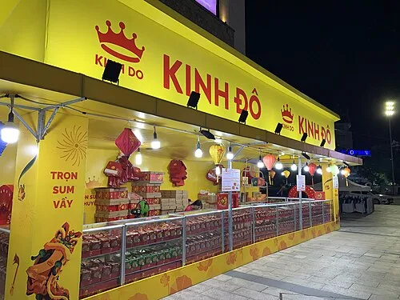
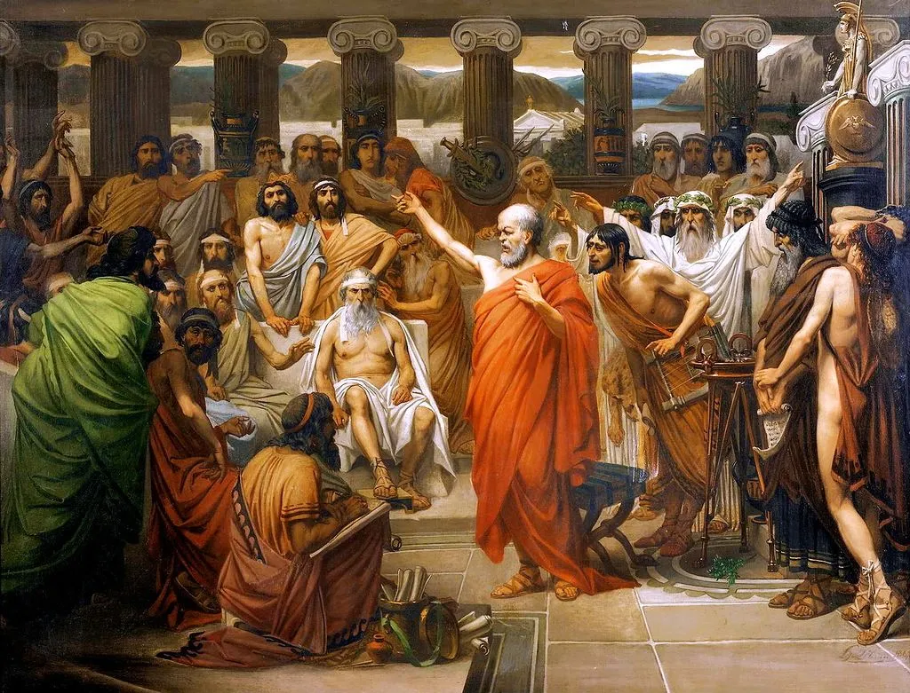
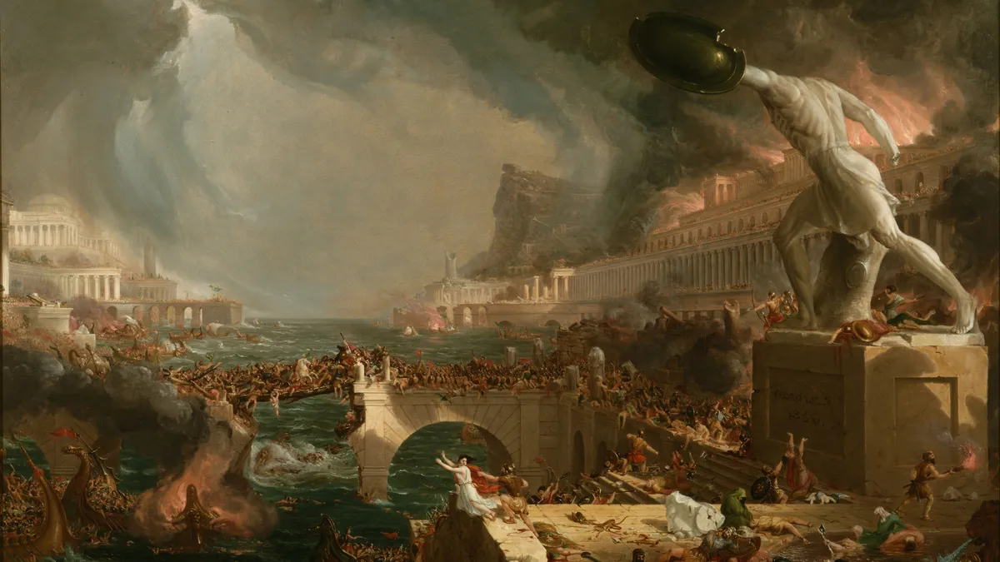
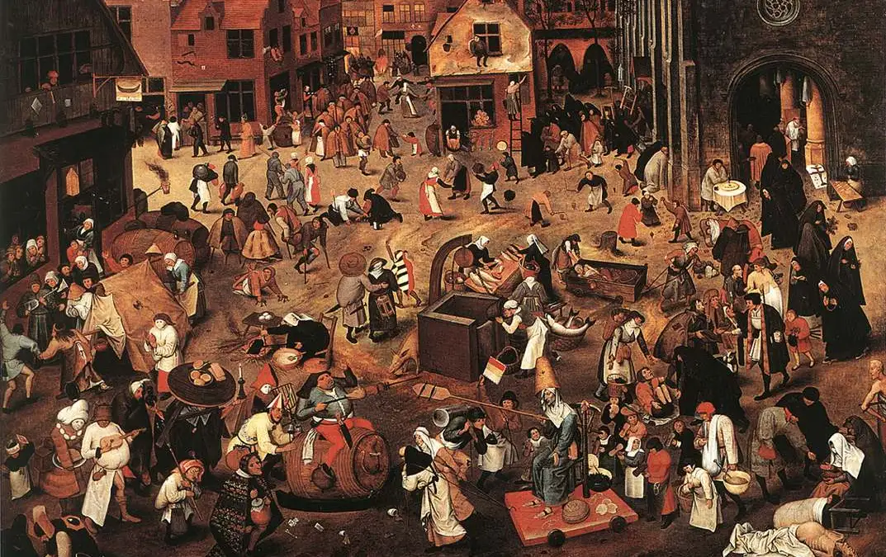
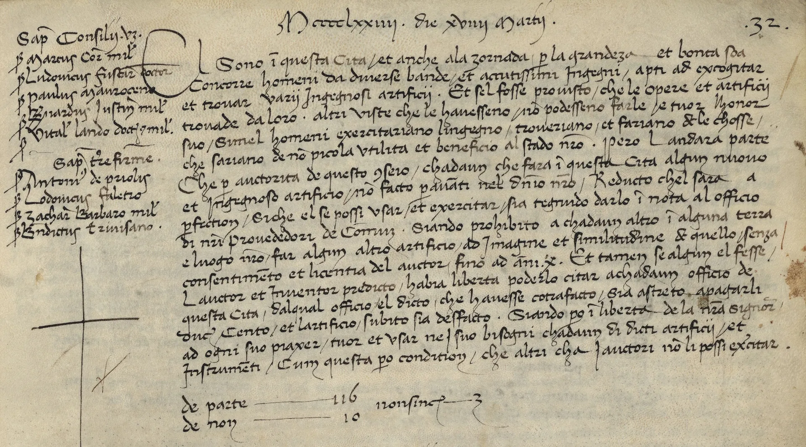
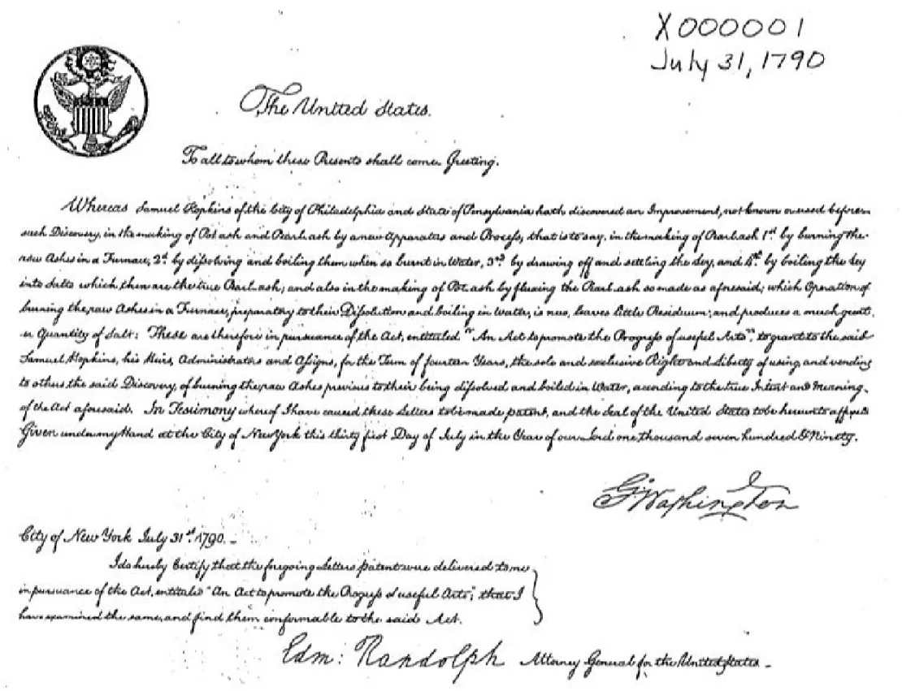
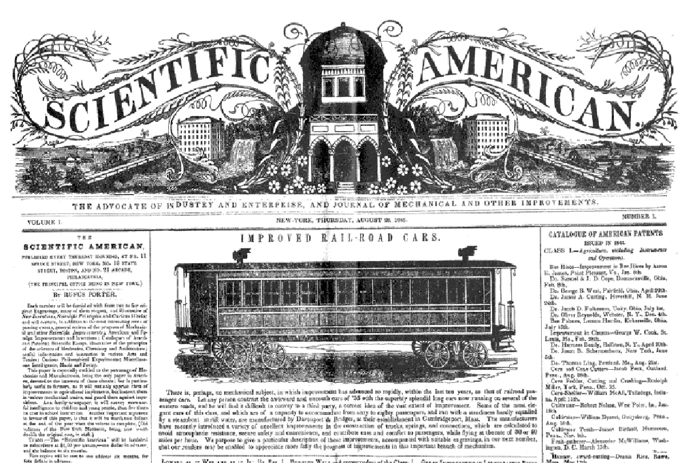
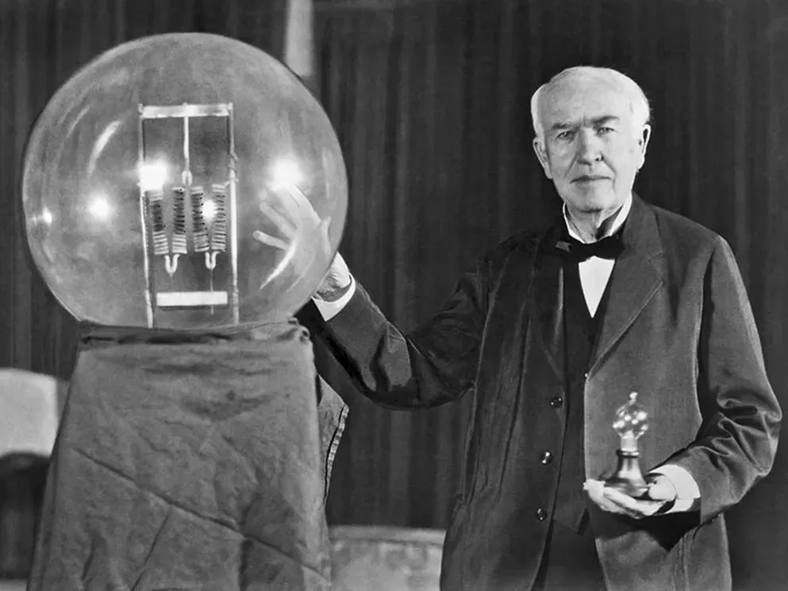
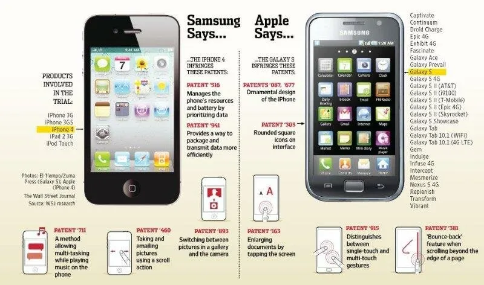

Ở bài viết [Silicon Valley](./silicon-valley), ta đã tìm hiểu được về bản chất và lịch sử hình thành của vùng đất này, nơi mà các công ty công nghệ lớn nhất thế giới được thành lập. Nhưng tại sao các công ty tại Silicon Valley có thể thành công? Những công ty này có thứ gì mà các công ty khác không có?

Đó chính là **tài sản trí tuệ** (intellectual property) hay sở hữu trí tuệ.

Theo Tổ chức Sở hữu trí tuệ thế giới (WIPO), tài sản trí tuệ là những sản phẩm sáng tạo của trí óc – bao gồm mọi thứ từ tác phẩm nghệ thuật đến phát minh, chương trình máy tính đến nhãn hiệu và các dấu hiệu thương mại khác.[^wipo]

Hay nói cách khác, tài sản trí tuệ là những sản phẩm do trí tuệ con người sáng tạo ra, không mang hình thái vật chất cụ thể nhưng lại có giá trị kinh tế to lớn và được pháp luật bảo hộ. Đây được xem là "mỏ vàng" vô hình, là động lực quan trọng cho sự phát triển của các cá nhân, doanh nghiệp và toàn bộ nền kinh tế trong kỷ nguyên số.

## Phần 1: Tại sao bạn cần quan tâm đến tài sản trí tuệ?

Trước khi đi sâu vào những khái niệm pháp lý có vẻ khô khan, hãy thử trả lời câu hỏi này: Tài sản trí tuệ có liên quan gì đến bạn?

Có thể bạn đang nghĩ nó là chuyện của các tập đoàn lớn, của những nhà phát minh vĩ đại. Nhưng sự thật là, nó đang hiện diện trong mọi ngóc ngách của cuộc sống số và ảnh hưởng trực tiếp đến bạn, dù bạn là ai.

- Bạn là một **content creator** trên YouTube hay TikTok, dành hàng tuần để lên ý tưởng, quay dựng một video tâm huyết. Một ngày nọ, bạn thấy video của mình bị một kênh khác "xào" lại, thậm chí re-up toàn bộ và bật kiếm tiền. Công sức của bạn đã đi đâu?
- Bạn là **chủ một thương hiệu thời trang online**, tự hào về mẫu thiết kế độc quyền vừa ra mắt. Chỉ vài ngày sau, bạn thấy nó xuất hiện tràn lan trên các sàn thương mại điện tử với giá rẻ bằng một nửa, đi kèm những hình ảnh sản phẩm do chính bạn chụp. Lợi thế cạnh tranh của bạn đã bị đánh cắp.
- Bạn là một **lập trình viên tự do**, xây dựng một module phần mềm thông minh cho khách hàng. Hợp đồng kết thúc, bạn phát hiện họ đã bán lại đoạn code của bạn cho nhiều công ty khác mà không có sự đồng ý hay một đồng chi trả nào. "Chất xám" của bạn đã bị định giá bằng không.

Tất cả những xung đột đó đều xoay quanh một khái niệm cốt lõi: Tài sản trí tuệ.

Đây không phải là thứ gì đó cao siêu, mà chính là "luật chơi" của nền kinh tế sáng tạo. Nó là cơ chế để xã hội công nhận và bảo vệ giá trị của những sản phẩm vô hình – những thứ sinh ra từ trí óc, từ sự sáng tạo của con người.

### Sự khác biệt cốt lõi: Chiếc búa và Ý tưởng

Để hiểu tại sao "luật chơi" này lại cần thiết, hãy thử với một so sánh đơn giản.

Hãy tưởng tượng bạn có một chiếc búa. Đây là tài sản vật chất. Nếu bạn đang dùng nó, người khác phải đợi. Nếu ai đó lấy mất, bạn sẽ mất đi chiếc búa. Tài sản vật chất có tính "cạnh tranh" (rivalrous) – việc một người sử dụng sẽ ngăn cản người khác sử dụng.

Bây giờ, hãy tưởng tượng bạn có một ý tưởng: "cách dùng búa để đóng đinh hiệu quả hơn". Bạn có thể chia sẻ ý tưởng này cho hàng ngàn người mà không hề mất đi kiến thức đó. Ý tưởng, hay tri thức, về bản chất là "không cạnh tranh" (non-rivalrous).

Và chính vì đặc tính dễ dàng lan truyền này, tri thức rất dễ bị sao chép và chiếm đoạt. Nếu không có cơ chế bảo vệ, sẽ chẳng ai còn động lực để dành thời gian, tiền bạc và công sức để tạo ra những ý tưởng mới. Tại sao phải phát minh ra một loại thuốc mới nếu bất kỳ ai cũng có thể sao chép công thức ngay ngày hôm sau? Tại sao phải viết một cuốn sách nếu nó sẽ bị in lậu và bán với giá rẻ mạt?

Đó là lý do quyền sở hữu trí tuệ ra đời. Nó tạo ra một sự "khan hiếm nhân tạo" có thời hạn cho các tài sản vô hình, trao cho người sáng tạo độc quyền khai thác thành quả của mình trong một khoảng thời gian nhất định. Đây là phần thưởng cho nỗ lực của họ và là động lực cho sự tiến bộ của toàn xã hội.

### Cuộc chơi định giá của doanh nghiệp

Trong nền kinh tế hiện đại, những công ty giá trị nhất thế giới không nhất thiết sở hữu nhiều nhà máy hay đất đai nhất. Thay vào đó, họ sở hữu những thứ vô hình: những thuật toán, những bản thiết kế, những công thức, và những thương hiệu có sức ảnh hưởng toàn cầu.

Sở hữu trí tuệ chính là công cụ pháp lý có khả năng biến một tia sáng sáng tạo vô hình thành một tài sản hữu hình trên bảng cân đối kế toán. Nó là cây cầu nối giữa thế giới của ý tưởng và thế giới của kinh doanh.

Và đây chính là điểm mấu chốt khi bạn bước vào cuộc chơi lớn.

Hãy hình dung bạn là một doanh nhân. Công ty bạn ăn nên làm ra, và bạn muốn mở rộng quy mô. Bạn cần vay vốn ngân hàng hoặc tìm nhà đầu tư chiến lược. Khi họ ngồi vào bàn đàm phán, họ sẽ định giá công ty bạn dựa vào đâu? Dây chuyền sản xuất? Vài chiếc xe tải? Lượng tiền mặt trong tài khoản? Bất động sản?

Tất cả đều quan trọng, nhưng chúng không phải thứ quyết định. Thứ quyết định giá trị thực sự của doanh nghiệp bạn chính là những tài sản trí tuệ:

- **Thương hiệu** bạn gây dựng có được đăng ký bảo hộ không?
- **Công thức pha chế** độc đáo của bạn có được bảo vệ như một bí mật kinh doanh không?
- **Kiểu dáng sản phẩm** khác biệt của bạn có được đăng ký độc quyền không?
- **Phần mềm quản lý** nội bộ do bạn tự phát triển có thuộc sở hữu của bạn không?

Nếu câu trả lời là "không", thì tất cả những tài sản vô giá đó gần như bằng không trên bàn đàm phán. Đây chính là lúc bạn mất đi lợi thế. Nhà đầu tư có thể nói: "Ý tưởng kinh doanh của anh rất tuyệt, nhưng vì anh không bảo vệ nó nên bất kỳ ai cũng có thể sao chép. Rủi ro quá lớn. Tôi đầu tư 10 tỷ, nhưng tôi cần 60% cổ phần của công ty."

Hãy nhìn vào hai trong số những thương vụ M&A đình đám nhất Việt Nam.

Đầu tiên là "gã khổng lồ" bánh kẹo **Kinh Đô**. Năm 2015, Kinh Đô đã bán 80% mảng kinh doanh bánh kẹo của mình cho tập đoàn Mondelēz International của Mỹ với giá trị gần **370 triệu USD**. Mondelēz không trả số tiền khổng lồ đó để lấy công thức làm bánh trung thu hay nhà xưởng. Họ đang trả tiền cho cái tên "Kinh Đô" – một bảo chứng cho sự lựa chọn hàng đầu của hàng triệu gia đình Việt, cùng với hệ thống phân phối và ngôi vị thống trị thị trường[^kinhdo].

Thứ hai là **Phúc Long**, một thương hiệu trà và cà phê đầy kiêu hãnh. Năm 2022, Tập đoàn Masan hoàn tất việc mua lại hơn 84% cổ phần, định giá toàn bộ chuỗi này ở mức khoảng 450 triệu USD. Masan đã phải thanh toán vào khoảng **280 triệu USD** cho một thương hiệu đang lên, một mô hình kinh doanh F&B thành công và tiềm năng kết hợp với hệ sinh thái bán lẻ của mình[^phuclong].

**Nhưng... có phải là một cái giá quá rẻ?**

Những con số hàng trăm triệu đô la nghe có vẻ khổng lồ. Nhưng khi đặt cạnh các thương vụ quốc tế mà tài sản trí tuệ là trung tâm, một góc nhìn khác sẽ hiện ra.

Năm 2012, Facebook (nay là Meta) mua lại **Instagram** với giá **1 tỷ USD**. Vào thời điểm đó, Instagram chỉ có 13 nhân viên và **0 đồng doanh thu**. Họ không có nhà máy, không có cửa hàng, tài sản duy nhất là một ứng dụng phần mềm và một cộng đồng người dùng đang phát triển[^buyig].

Năm 2009, Disney chi **4 tỷ USD** để mua lại **Marvel Entertainment**. Disney không mua các xưởng phim, họ mua **quyền sở hữu đối với một vũ trụ gồm hơn 5,000 nhân vật** như Iron Man, Captain America... Họ mua bản quyền, một loại tài sản trí tuệ có thể khai thác vĩnh viễn qua phim ảnh, game, công viên, và đồ chơi[^buymarvel].

**Tại sao lại có sự khác biệt khổng lồ này?**

Giá trị của Kinh Đô và Phúc Long chủ yếu đến từ thương hiệu (brand equity) và hệ thống kinh doanh (business model). Đây là những tài sản quý giá, nhưng chúng là loại "tài sản trí tuệ mềm". Thương hiệu có thể bị cạnh tranh, mô hình kinh doanh có thể bị sao chép.

Trong khi đó, giá trị của Instagram nằm ở công nghệ lõi và hiệu ứng mạng lưới (một dạng tài sản về công nghệ). Giá trị của Marvel nằm ở bản quyền nhân vật (copyright) – một pháo đài pháp lý gần như không thể xâm phạm. Đây là "tài sản trí tuệ cứng", có tính độc quyền được pháp luật bảo vệ một cách chặt chẽ trên toàn cầu.

Nhìn ở góc độ này, có thể thấy các thương hiệu Việt, dù rất thành công, đã được định giá quá rẻ. Mức giá đó phản ánh giá trị của một doanh nghiệp đang kinh doanh tốt, nhưng chưa phản ánh được giá trị của một tài sản trí tuệ có khả năng phòng thủ và khai thác độc quyền trên quy mô toàn cầu. Nhà đầu tư quốc tế trả giá cao cho sự độc quyền và khả năng bảo vệ vững chắc, thứ mà nhiều thương hiệu Việt dù lớn mạnh vẫn còn thiếu.

**Vậy Kinh Đô và Phúc Long đã có thể làm gì nếu họ tham gia "cuộc chơi" này một cách bài bản hơn?**

Hãy thử hình dung một kịch bản khác. Thay vì bán đi "đứa con" của mình, họ có thể:

1. Cấp phép (Licensing) thay vì bán đứt: Giống như Disney cấp phép cho các công ty sản xuất đồ chơi, Kinh Đô hoàn toàn có thể giữ lại quyền sở hữu thương hiệu và chỉ cấp phép cho Mondelēz quyền sản xuất và phân phối sản phẩm dưới tên Kinh Đô trong một thời hạn nhất định. Họ sẽ nhận được phí bản quyền đều đặn hàng năm – một nguồn thu nhập thụ động khổng lồ mà vẫn giữ được tài sản quý giá nhất.
2. Xây dựng "tàn sản trí tuệ cứng": Kinh Đô có thể đăng ký bằng sáng chế cho các công nghệ bảo quản thực phẩm, quy trình sản xuất bánh kẹo độc đáo. Phúc Long có thể phát triển và đăng ký các giống trà, cà phê mới hoặc công nghệ pha chế tự động. Những bằng sáng chế này sẽ trở thành một "pháo đài" pháp lý thực sự, nâng tầm định giá của công ty lên một mức hoàn toàn khác.
3. Trở thành người đi mua: Với một thương hiệu mạnh và một danh mục IP vững chắc, chính họ mới là người ở vị thế đi thâu tóm các thương hiệu nhỏ hơn ở khu vực, mở rộng đế chế của mình ra toàn Đông Nam Á, thay vì trở thành một phần trong đế chế của người khác.

Hiểu về sở hữu trí tuệ không chỉ là để đăng ký một cái tên. Đó là xây dựng một "pháo đài" pháp lý vững chắc quanh tài sản của mình, để khi ngồi vào bàn đàm phán, bạn không chỉ bán một công ty, mà là bán một khối tài sản được định giá đúng với tiềm năng của nó.

Vậy, luật chơi này được hình thành từ đâu? Hãy cùng quay ngược thời gian để khám phá hành trình đó.

## Phần 2: Một ~chút~ về lịch sử

Nội dung của phần này được tham khảo từ _Intellectual Property Rights: A Critical History của Christopher May và Susan K. Sell_[^may2005].

### Những tiền thân sơ khai của sở hữu trí tuệ

Có thể nói, việc đánh dấu hàng hóa là một trong những hình thức đầu tiên nhằm phân biệt thông tin và xác lập quyền sở hữu. Những dấu hiệu này không chỉ phản ánh uy tín, danh tiếng của người thợ hay nhà sản xuất mà còn chỉ rõ nguồn gốc sản phẩm. Từ rất lâu trước khi có các quy định pháp luật chính thức để giải quyết tranh chấp về quyền sở hữu, con người đã sử dụng các dấu hiệu này để khẳng định quyền sở hữu của mình đối với tài sản.

Việc đánh dấu quyền sở hữu có thể bắt nguồn từ tập quán đóng dấu lên gia súc – một trong những hình thức sơ khai nhất để xác lập quyền sở hữu. Từ thời kỳ tiền sử, con người đã sử dụng các dấu hiệu như cắt tai, ký hiệu riêng hoặc thẻ tai để nhận diện và phân biệt gia súc của mình. Những phương pháp này vẫn còn tồn tại trong nhiều nền văn hóa nông nghiệp hiện đại. Suốt hơn 6.000 năm, kể từ khi động vật được thuần hóa, con người đã liên tục đánh dấu các vật dụng, sản phẩm mà mình tạo ra hoặc sở hữu. Một số dấu hiệu này thực chất là nhãn hiệu thương mại theo nghĩa hiện đại – dùng để chỉ nguồn gốc sản phẩm, trong khi những dấu hiệu khác lại nhằm xác định quyền sở hữu đối với hàng hóa.

Nhiều bằng chứng khảo cổ học cho thấy việc đánh dấu quyền sở hữu trên đồ gốm và vật dụng gia đình đã xuất hiện phổ biến ở các nền văn minh tiền sử châu Âu và châu Á. Đến thời Ai Cập cổ đại và Lưỡng Hà, các thợ làm gạch thường khắc dấu lên sản phẩm của mình, bên cạnh tên vị vua trị vì hoặc chủ sở hữu công trình. Thợ đẽo đá cũng ghi tên nhà thầu hoặc cá nhân lên các khối đá xây dựng, có thể nhằm mục đích tính lương dựa trên sản lượng. Ở các thành bang Hy Lạp, việc gắn tên tuổi người sáng tạo lên sản phẩm không chỉ nâng cao giá trị hàng hóa vật chất mà còn lan sang lĩnh vực văn hóa và trí tuệ. Trước đó, kiến thức khoa học, công nghệ thường được giữ bí mật như một dạng "bí quyết nghề nghiệp", tương tự bí mật thương mại ngày nay, và việc tiết lộ có thể bị trừng phạt nghiêm khắc. Tuy nhiên, triết học Hy Lạp đã thúc đẩy quan niệm rằng bản thân tri thức cũng có giá trị, mở đường cho việc thương mại hóa tri thức trong tương lai.

### Những ý tưởng của người Hy Lạp về việc sở hữu ý tưởng

Vào thời Hy Lạp cổ đại, khoảng thế kỷ VI TCN, những nhà thơ như Simonides và các nghệ sĩ khác đã bắt đầu kiếm sống bằng chính tài năng sáng tạo của mình. Dù khái niệm "sở hữu trí tuệ" chưa tồn tại, họ chính là những người đầu tiên đưa tri thức và nghệ thuật vào đời sống như một cách mưu sinh. Trước đó, các nghệ sĩ thường sống nhờ vào sự bảo trợ của các quý tộc, và phải biểu diễn hay sáng tác theo yêu cầu. Tuy nhiên, tại một số thành bang Hy Lạp, dần dần xuất hiện các cuộc thi thơ, biểu diễn công khai có trả thù lao – mở đường cho việc sáng tạo trở thành một nghề độc lập.

Một nhóm đặc biệt trong thời kỳ này là các nhà Ngụy biện (Sophists) – những người đầu tiên sống bằng nghề dạy học tự do. Họ dạy nhiều kỹ năng khác nhau, từ hùng biện đến cách ứng xử trong xã hội. Tuy họ không coi những gì mình giảng dạy là thứ "có thể sở hữu", học trò của họ đã ghi chép lại bài giảng và truyền tay nhau học. Điều này khiến một số người chỉ trích, cho rằng tri thức bị lan truyền mất kiểm soát, và người thầy không còn là người duy nhất nắm giữ tri thức đó. Tuy nhiên, với các nhà Ngụy biện, những ghi chép ấy có lẽ chỉ đơn giản là cách để lan tỏa danh tiếng và thu hút thêm học trò. Họ không bán "kiến thức đóng gói", mà dạy cách suy nghĩ và lý luận.

Từ thế kỷ VI TCN trở đi, nhiều nghệ sĩ và nhà thơ bắt đầu ghi tên mình lên tác phẩm như một cách để khẳng định sự sáng tạo cá nhân. Họ xem tác phẩm là dấu ấn riêng biệt của mình – thể hiện kỹ năng, phong cách, và tài năng vượt trội. Dù chưa có khái niệm "tác quyền" như ngày nay, việc có tên tác giả đi kèm cũng giúp người khác biết ai là người sáng tạo ra nội dung đó. Thơ ca dần trở thành một sản phẩm có thể mang ra trao đổi trong xã hội, bên cạnh những mối quan hệ bảo trợ truyền thống.

Khi tiền tệ và thị trường dần phát triển, các tác phẩm nghệ thuật – từ thơ, nhạc đến hội họa – cũng bắt đầu được xem là hàng hóa. Người ta có thể tặng, bán hoặc trao đổi tác phẩm của mình. Đây là những bước khởi đầu đơn giản nhưng quan trọng cho việc thương mại hóa sáng tạo. Tuy khái niệm "quyền sở hữu trí tuệ" chỉ thực sự rõ ràng sau này, đặc biệt vào thời La Mã, thì tinh thần cá nhân hóa sáng tạo – xem người nghệ sĩ như một chủ thể độc lập – đã manh nha từ thời Hy Lạp cổ đại.

<blockquote>
Hy Lạp là cái nôi của nền văn minh phương Tây, nơi đã sản sinh ra những tư tưởng tiến bộ về tự do cá nhân, sáng tạo và nghệ thuật từ hàng nghìn năm trước. Những nhà triết học như Socrates, Plato và Aristotle đã đặt nền móng cho nhiều lĩnh vực khoa học và triết học hiện đại.

Trong đó truyện ngụ ngôn là một trong những chủ đề mình cảm thấy thú vị nhất. Aesop, một nhà thơ và ngụ ngôn gia nổi tiếng, đã sử dụng hình thức này để truyền đạt những bài học đạo đức sâu sắc. "Con cáo và chùm nho" là một trong những câu chuyện nổi tiếng nhất của ông, thể hiện sự khôn ngoan và tính thực dụng trong cuộc sống.

Trong vở kịch "Con cáo và chùm nho", Aesop đã dùng chính trí tuệ và tài kể chuyện của mình để đổi lấy tự do. Bạn có thể xem vỡ kịch tiếng Việt bên dưới đây:

<iframe
  class="w-full aspect-video"
  src="https://www.youtube.com/embed/5DIVYN6RXbc?si=wAbVXyxRhpp81vRu"
  title="YouTube video player"
  frameborder="0"
  allow="accelerometer; autoplay; clipboard-write; encrypted-media; gyroscope; picture-in-picture; web-share"
  referrerpolicy="strict-origin-when-cross-origin"
  allowfullscreen
  loading="lazy"
/>
</blockquote>

### Những phát triển thời La Mã

Người La Mã đã tiếp nối truyền thống của người Hy Lạp khi cho phép thợ thủ công sử dụng dấu hiệu cá nhân trên sản phẩm. Những dấu hiệu này không chỉ để thể hiện danh tính của người làm ra, mà còn có mục đích thực tế như xác minh đã nộp thuế, báo hiệu hàng do nhà nước quản lý, hoặc phục vụ việc thanh toán giữa người làm và người thuê. Nói cách khác, đây là một cách để thể hiện sự tin cậy và chất lượng sản phẩm.

Tuy nhiên, lúc đó chưa có luật nào bảo vệ dấu hiệu này. Nếu ai đó sao chép hoặc giả mạo, người bị hại không có quyền kiện. Dù vậy, người mua hàng có thể tố cáo người bán nếu phát hiện hàng giả, coi đó là hành vi gian lận. Một đạo luật từ năm 81 TCN thậm chí cấm dùng tên người khác để trục lợi – cho thấy xã hội La Mã đã ý thức được phần nào vấn đề “mạo danh thương hiệu”, dù chưa có khung pháp lý rõ ràng.

Ở La Mã, ngành xuất bản – tức việc sao chép sách – phát triển mạnh vào thế kỷ I TCN. Ban đầu, các tác giả sống nhờ sự giúp đỡ của người giàu, chứ không nhận tiền trực tiếp từ việc bán sách. Nhưng dần dần, xuất hiện mô hình mới: tác giả có thể bán quyền sao chép tác phẩm của mình. Nhà hùng biện nổi tiếng Cicero được cho là đã kiếm tiền từ sách ông viết, thông qua thỏa thuận với người bán sách. Sau khi ông qua đời, người ta còn mua lại quyền phát hành sách của ông – cho thấy ý tưởng về "quyền sở hữu tác phẩm" đã hình thành ở mức sơ khai.

Tác giả La Mã có thể ký hợp đồng với người sao chép và phân phối sách, giống như một hình thức hợp tác thương mại. Tuy chưa có khái niệm "bản quyền" rõ ràng như hiện nay, tác phẩm vẫn được coi là tài sản cá nhân có giá trị. Người sáng tác có quyền kiểm soát nội dung và được ghi nhận công lao. Tuy nhiên, quyền này chủ yếu chỉ là về danh tiếng – tức bảo vệ tác phẩm khỏi bị đạo văn – chứ chưa phải là quyền kinh tế.

Người La Mã rất coi trọng việc ghi công người sáng tạo. Những học giả như Vitruvius hay Pliny Già thường ghi rõ tên người mà họ trích dẫn và phê phán mạnh mẽ việc “ăn cắp” ý tưởng. Việc đạo văn bị xem là hành vi đáng xấu hổ cho thấy sự trân trọng đối với sáng tạo cá nhân đã hình thành từ khá sớm, dù chưa được luật pháp công nhận chính thức.

Mặc dù vậy, không có vụ kiện nào về bản quyền trong tài liệu luật pháp La Mã còn lại. Dù luật La Mã có thừa nhận một số dạng tài sản vô hình, hệ thống pháp luật lúc đó còn phức tạp và tốn kém, nên khó có thể bảo vệ tác giả một cách thực tế.

Sau khi Đế chế La Mã sụp đổ, những ý tưởng ban đầu về quyền sở hữu trí tuệ không hoàn toàn biến mất. Một câu chuyện nổi tiếng ở Ireland vào thế kỷ VI kể rằng Thánh Columbia đã sao chép lén một cuốn sách kinh. Khi bị phát hiện, nhà vua đã xử rằng bản gốc lẫn bản sao đều thuộc về chủ nhân ban đầu – với lời phán nổi tiếng: "Mỗi con bò đều có bê, mỗi cuốn sách đều có bản sao".

Dù tính xác thực của câu chuyện còn gây tranh cãi, nó cho thấy con người từ rất sớm đã ý thức được việc gắn liền tác phẩm với người tạo ra. Trong các thế kỷ tiếp theo, những phường hội nghề nghiệp ra đời và bắt đầu xây dựng các quy định riêng để kiểm soát và bảo vệ tri thức trong ngành của mình. Đây là tiền đề cho các quy tắc về quyền sở hữu trí tuệ sau này.

### Thời Trung Cổ, Tri Thức Phường Hội, và Quá Trình Chuyển Đổi sang Sở Hữu Trí Tuệ

Trong thời kỳ Trung Cổ, đặc biệt là giai đoạn gọi là "Thời kỳ Tăm tối", các tu viện trở thành nơi lưu giữ và sao chép tri thức. Giá trị của sách vở lúc đó nằm ở công lao sao chép và chất liệu quý hiếm, chứ không phải ở nội dung. Khi các trường đại học xuất hiện vào thế kỷ 12, tri thức bắt đầu được lưu hành rộng rãi hơn, nhưng các quy định lại hạn chế khả năng kiểm soát quyền sở hữu. Các nhà sao chép sách buộc phải cho thành viên trường đại học thuê sách để sao lại, điều này làm suy yếu mọi ý niệm về sở hữu tri thức từng manh nha từ thời La Mã. Phải đến cuối thế kỷ 15, khi các bằng sáng chế cho sách in ra đời, quyền sở hữu văn học mới thực sự được khôi phục.

Trong khi đó, một dạng sở hữu khác – nhãn hiệu thương mại – lại phát triển mạnh. Các phường hội (guilds), tổ chức tập hợp những người cùng ngành nghề, cần cách để phân biệt sản phẩm của mình và bảo vệ độc quyền. Ban đầu họ không xem tri thức nghề là tài sản. Nhưng từ thế kỷ 13, nhiều thành phố bắt đầu ban hành luật bảo vệ nhãn hiệu. Năm 1282, Parma (Ý) đã cấm việc sử dụng nhãn hiệu của người khác, khẳng định vai trò pháp lý sơ khai của thương hiệu.

Đến thế kỷ 14, các phường hội ngày càng ý thức về việc kiểm soát tri thức vì lợi ích kinh tế. Họ coi kiến thức nghề nghiệp là tài sản tập thể. Để bảo vệ điều này, họ sử dụng hai loại nhãn hiệu: nhãn hiệu thương nhân (dành cho quá trình vận chuyển hàng hóa) và nhãn hiệu sản xuất (đảm bảo chất lượng và nguồn gốc sản phẩm). Những nhãn hiệu này chưa đại diện cho danh tiếng cá nhân mà là quyền lực và tiêu chuẩn của cả cộng đồng.

Các nhãn hiệu cho phép phường hội xử lý hàng lỗi, loại trừ sản phẩm của người ngoài, và duy trì mức giá thông qua kiểm soát chất lượng và số lượng. Đây là một trong những hình thức sở hữu trí tuệ sơ khai nhất có yếu tố pháp lý rõ ràng. Thậm chí, việc sử dụng nhãn hiệu trái phép có thể bị xử phạt nghiêm khắc, như trường hợp vào thế kỷ 16, dưới thời Vua Charles V, những người sản xuất thảm giả có thể bị chặt tay.

Một bước ngoặt quan trọng diễn ra vào thế kỷ 15: phường hội bắt đầu công nhận quyền sáng tạo cá nhân. Năm 1432, phường hội lụa ở Genoa cấm sao chép mẫu thiết kế của người khác. Năm 1474, phường hội len ở Florence còn lên án việc “ăn cắp mẫu mã” do người khác tự sáng tạo ra. Việc dùng từ như "gian lận" và "đánh cắp" cho thấy mẫu thiết kế đã được coi là tài sản cá nhân, đánh dấu sự xuất hiện của tinh thần sở hữu trí tuệ hiện đại.

Khi tri thức nghề trở thành tài sản có giá trị, nó cũng trở thành đối tượng bị chiếm đoạt. Điều này tạo ra động lực để cá nhân tách khỏi phường hội, mang theo kiến thức và đăng ký quyền phát minh với nhà nước. Đây là bước đầu của khái niệm bằng sáng chế – nơi quyền sở hữu không còn là của cả tập thể mà thuộc về người sáng tạo. Từ đó, các cuộc tranh chấp về ai là người phát minh đầu tiên ngày càng phổ biến trong thế kỷ 16. Khái niệm sở hữu trí tuệ hiện đại đã dần hình thành từ chính sự chuyển đổi này: từ cộng đồng sang cá nhân, từ tập quán sang pháp lý.

### Bằng Sáng Chế Sơ Khai

Trước khi có luật sở hữu trí tuệ chính thức, các nhà cầm quyền châu Âu thường trao “đặc quyền” cho những cá nhân mang kỹ thuật mới đến quốc gia của mình. Đây là một hình thức khuyến khích phát triển công nghiệp và giảm phụ thuộc vào nhập khẩu. Ví dụ, tại Anh, các vị vua đã cấp độc quyền cho những người thợ làm kính, làm muối, hay thợ dệt từ nước ngoài để họ truyền nghề và xây dựng ngành mới trong nước.

Những đặc quyền này thường kéo dài khoảng 14 năm – đủ lâu để người được cấp quyền bù đắp chi phí di cư và đào tạo thợ bản địa. Đổi lại, sau khi đặc quyền hết hạn, quốc gia sẽ có một lực lượng lao động thành thạo mà không cần phụ thuộc vào nước ngoài.

Ngoài ra, các đặc quyền còn được áp dụng cho hoạt động khai thác mỏ – nơi cần đầu tư lớn. Người phát hiện ra mỏ hoặc phát minh thiết bị mới như bơm nước hầm mỏ sẽ được nhà nước bảo hộ độc quyền trong một thời gian nhất định. Đây là nền tảng cho các nguyên lý cơ bản của bằng sáng chế kỹ thuật hiện đại.

Một dấu mốc quan trọng là vào thế kỷ 15, tại Florence (Ý), nhà phát minh Filippo Brunelleschi đã được cấp độc quyền cho một thiết kế tàu mới. Điểm đặc biệt là phát minh này chưa từng tồn tại trước đó, và ông được bảo hộ độc quyền nhờ tính mới chứ không phải vì mang kỹ thuật từ nơi khác đến. Dù con tàu thất bại khi vận hành, sự kiện này đã mở đường cho nguyên lý: đổi sự công khai sáng tạo lấy sự bảo vệ pháp lý – nền tảng cốt lõi của luật bằng sáng chế sau này.

### Bản quyền sơ khai

Trong khi bằng sáng chế phát triển từ kỹ thuật và công nghiệp, **bản quyền** lại phát triển từ lĩnh vực văn học, nghệ thuật – đặc biệt là sau khi công nghệ **in ấn** được phát minh vào thế kỷ 15.

Trước đó, các tác giả khó kiểm soát việc sao chép tác phẩm của mình. Văn hóa truyền miệng vẫn phổ biến, và những người kể chuyện chỉ giữ được “quyền” của mình nếu không công khai tác phẩm. Một số nhà thơ nổi tiếng như **Petrarca** từng tuyên bố chỉ ông mới có quyền sao chép hay công bố tác phẩm của mình. Tuy nhiên, việc này chỉ hiệu quả vì ông nổi tiếng, chứ chưa được luật pháp công nhận.

")

Khi máy in ra đời, sách có thể sản xuất hàng loạt, bán đi khắp châu Âu. Điều này tạo ra thị trường cạnh tranh gay gắt và nhu cầu cấp thiết bảo vệ quyền của nhà in và tác giả. Các nhà in muốn ngăn người khác sao chép công trình mà họ đã đầu tư sản xuất.

Thành phố Venice, trung tâm thương mại lớn, đã đi tiên phong. Ngay từ năm 1469, một nhà in được cấp độc quyền in các tác phẩm cổ điển. Đến đầu thế kỷ 16, quyền in chữ nghiêng cũng được cấp riêng. Như vậy, các đặc quyền in ấn chính là tiền thân của bản quyền.

Thực tế, ý niệm sở hữu trí tuệ đã có từ trước. Những người minh họa bản thảo từng xem việc “ăn cắp” bản vẽ là vấn đề nghiêm trọng. Một số phường hội còn trao quyền sao chép một tác phẩm cho một người duy nhất – thể hiện quyền kiểm soát nội dung dù chưa gọi tên là "bản quyền".

Khi ngành in phát triển, tranh chấp cũng xuất hiện. Xã hội buộc phải phân biệt giữa tài sản cá nhân và tài sản công cộng (public domain). Câu hỏi "ai là chủ nhân hợp pháp của tri thức?" bắt đầu được đặt ra một cách rõ ràng.

Dù vậy, hình ảnh tác giả như một "thiên tài sáng tạo" vẫn chưa xuất hiện ngay. Phải đến thế kỷ 18, đặc biệt tại Anh – nơi trung tâm kinh tế châu Âu dịch chuyển – các đạo luật bản quyền và bằng sáng chế mới thực sự hoàn chỉnh. Nhưng Venice mới là nơi đi đầu, thử nghiệm các hình thức bảo vệ sở hữu trí tuệ hơn một thế kỷ trước Anh Quốc.

### Khoảnh khắc của Venice: Sở hữu trí tuệ ra đời

Dù những ý tưởng về quyền sở hữu tri thức đã âm ỉ từ thời cổ đại, phải đến thế kỷ 15 tại Venice, một bước ngoặt quan trọng mới diễn ra: lần đầu tiên trong lịch sử, một hệ thống pháp lý chính thức điều chỉnh việc bảo hộ sáng tạo được ra đời – cụ thể là hệ thống bằng sáng chế. Đây không chỉ là công cụ hành chính, mà là một tuyên ngôn cho sự chuyển mình từ độc quyền tùy tiện sang bảo hộ hợp pháp dựa trên các nguyên tắc rõ ràng. Venice đã thiết lập một mô hình khung – có tính mới, hữu dụng, giới hạn thời gian bảo hộ, khả năng chuyển nhượng, yêu cầu ứng dụng thực tế – những yếu tố sau này trở thành cốt lõi của mọi hệ thống bằng sáng chế hiện đại.

Vào ngày 19 tháng 3 năm 1474, Viện nguyên lão Venice thông qua một sắc lệnh mang tính lịch sử, quy định rằng bất kỳ ai sáng tạo ra một thiết bị mới tại thành phố phải đăng ký với chính quyền, và người khác không được phép sao chép trong vòng mười năm nếu không được sự đồng ý của tác giả. Người vi phạm sẽ bị xử phạt, sản phẩm sao chép bị phá hủy, nhưng nhà nước vẫn có quyền sử dụng phát minh nếu vì lợi ích cộng đồng. Đây là lần đầu tiên, luật pháp không chỉ thừa nhận công sức sáng tạo, mà còn tạo điều kiện cho sự lưu thông tri thức có kiểm soát – khuyến khích người sáng tạo chia sẻ thay vì giữ kín.

Trước đạo luật này, Venice đã có hệ thống cấp các “privilegi” – tức đặc quyền kinh tế, thường mang tính cá nhân và chính trị. Tuy nhiên, privilegi chủ yếu phục vụ mục đích phá vỡ độc quyền phường hội trong một số ngành như thủy tinh hay in ấn, chứ không hẳn là sự công nhận quyền sở hữu trí tuệ. Đạo luật 1474 tạo ra sự khác biệt rõ ràng: nó không còn là sự ban phát của quyền lực, mà là một khế ước giữa người sáng tạo và xã hội. Người phát minh sẽ công bố kiến thức để đổi lấy một thời gian bảo hộ giới hạn – một cơ chế trao đổi mà hệ thống sở hữu trí tuệ hiện đại vẫn còn giữ đến ngày nay.

Điều đáng chú ý là môi trường xã hội và kinh tế của Venice đóng vai trò rất lớn trong sự hình thành đạo luật này. Trong một xã hội dựa trên thương mại và kỹ nghệ, nơi phường hội nắm giữ phần lớn tri thức nghề nghiệp, việc bảo vệ sáng tạo cá nhân là bước đi tất yếu khi các nhà phát minh bắt đầu vượt khỏi biên giới tập thể. Đây cũng là dấu hiệu cho thấy tri thức đang dịch chuyển từ dạng "sở hữu cộng đồng" sang "tài sản cá nhân", dù ban đầu vẫn còn nhiều yếu tố trung gian và thỏa hiệp với nhà nước.

Tuy quy trình cấp bằng sáng chế thời đó còn sơ khai và mang tính thủ tục hơn là đánh giá chuyên môn, nhưng chính sự dễ dãi này lại giúp Venice thu hút một lượng lớn phát minh. Trong gần 80 năm đầu tiên kể từ đạo luật 1474, hầu như không có đơn xin bằng sáng chế nào bị từ chối – tuy nhiên, nếu không chứng minh được hiệu quả ứng dụng thực tế, bằng có thể bị thu hồi. Điều này cho thấy yếu tố công năng vẫn là một tiêu chí quan trọng, ngay cả khi công cụ kiểm định còn thô sơ.

Khi Venice bước vào giai đoạn suy tàn vào cuối thế kỷ 16, hệ thống mà họ tạo dựng không biến mất cùng với thành phố. Trái lại, các nghệ nhân, kỹ sư và nhà phát minh rời đi, mang theo kiến thức và tư tưởng pháp lý này đến các trung tâm mới của châu Âu. Từ Pháp đến Anh, các quốc gia bắt đầu xây dựng hệ thống bằng sáng chế của riêng mình, thường là dựa trực tiếp hoặc gián tiếp trên mô hình Venice. Sức hấp dẫn của cơ chế này nằm ở chỗ nó vừa khuyến khích cá nhân đổi mới, vừa mang lại lợi ích công – một cân bằng giữa sáng tạo và kiểm soát mà mọi xã hội hiện đại đều phải giải quyết.

Venice, bằng tầm nhìn đi trước thời đại, không chỉ là thành phố của thương mại và nghệ thuật, mà còn là nơi lần đầu tiên thừa nhận rằng tri thức – giống như hàng hóa – có thể được bảo vệ, trao đổi, và sở hữu. Đó là thời điểm mà trí tuệ chính thức bước vào lãnh địa của pháp lý.

### Statute of Monopolies (1624): Anh quốc và sự hợp pháp hóa sáng tạo

Sau khi mô hình bằng sáng chế của Venice lan rộng khắp châu Âu, nước Anh trở thành quốc gia đầu tiên đưa nó vào khuôn khổ pháp lý hiện đại với Statute of Monopolies năm 1624. Đây được xem là văn bản pháp lý đầu tiên đặt nền móng cho hệ thống bằng sáng chế như ta biết ngày nay: công khai, minh bạch và giới hạn quyền lực của nhà vua trong việc ban phát độc quyền.

Trước đó, quyền cấp độc quyền thuộc về hoàng gia – thông qua Hội đồng Cơ mật và các đặc ân hoàng gia (Royal Charters). Tuy nhiên, hệ thống này dễ bị lạm dụng. Những đặc quyền được cấp không chỉ cho các phát minh mới, mà cả cho các ngành nghề đã tồn tại từ lâu. Điều này tạo nên sự bất bình lớn trong giới thương nhân và dân chúng, vì một số người được hưởng lợi từ những "độc quyền" mang tính trục lợi hơn là khuyến khích đổi mới.

Statute of Monopolies ra đời trong bối cảnh đó, như một phản ứng trước tình trạng lạm dụng quyền lực. Đạo luật tuyên bố rằng mọi hình thức độc quyền đều bất hợp pháp, ngoại trừ các bằng sáng chế tạm thời (tối đa 14 năm) dành cho người đầu tiên sáng chế ra một sản phẩm mới, hữu ích và chưa từng được biết đến trước đó ở Anh. Với điều khoản này, nước Anh chính thức công nhận quyền sở hữu tạm thời cho các nhà phát minh, nhưng trong khuôn khổ pháp luật, không phụ thuộc vào đặc ân hoàng gia.

Điều đáng chú ý là đạo luật không chỉ đơn thuần điều chỉnh quyền lợi cá nhân, mà còn thể hiện tư duy quản lý nhà nước kiểu mới – một nhà nước pháp quyền hiện đại đang hình thành, trong đó tài sản trí tuệ là một phần của hệ thống tài sản được luật pháp bảo vệ. Các tiêu chí như tính mới, tính ứng dụng và thời hạn bảo hộ đều phản ánh rõ ảnh hưởng từ mô hình Venice, nhưng được thể chế hóa một cách rõ ràng và chặt chẽ hơn.

Từ đây, việc cấp bằng sáng chế trở thành một cơ chế chính thức – một công cụ quản lý tri thức và kích thích đổi mới chứ không còn là công cụ ban phát. Nhà nước giữ vai trò trung gian giữa người sáng tạo và lợi ích cộng đồng: bảo vệ quyền độc quyền trong thời gian nhất định, sau đó chuyển phát minh vào tài sản chung (public domain). Cơ chế "đổi sáng tạo lấy bảo hộ" được khẳng định, và cũng từ đây, các cuộc tranh luận về ai là người phát minh đầu tiên, sự tương tự kỹ thuật, hay sự hợp lệ của sáng chế bắt đầu có khung pháp lý để giải quyết.

Dù vẫn còn nhiều bất cập, Statute of Monopolies năm 1624 là bước ngoặt lịch sử. Nó không chỉ định nghĩa lại mối quan hệ giữa sáng tạo và quyền lực nhà nước, mà còn định hình cách xã hội hiện đại đối xử với đổi mới – không phải như một đặc ân hiếm hoi, mà như một quyền có điều kiện, gắn liền với trách nhiệm và tính công khai. Không ngạc nhiên khi hệ thống này nhanh chóng được mở rộng và trở thành hình mẫu cho các quốc gia khác, đặc biệt là sau cuộc Cách mạng Công nghiệp, khi tri thức trở thành một trong những nguồn lực quan trọng nhất của nền kinh tế.

Nếu Venice là nơi khởi đầu của ý tưởng, thì Anh là nơi chính thức hóa luật chơi – biến sở hữu trí tuệ thành một phần không thể thiếu của luật thương mại và quyền công dân hiện đại.

### Statute of Anne (1710): Khi tác giả bước ra ánh sáng

Nếu Statute of Monopolies năm 1624 đặt nền móng cho luật bằng sáng chế hiện đại, thì Statute of Anne năm 1710 là bước ngoặt lớn với bản quyền (copyright) – khi lần đầu tiên trong lịch sử, quyền đối với tác phẩm trí tuệ được trao cho chính tác giả, chứ không còn thuộc về nhà in, nhà xuất bản hay các tổ chức đặc quyền khác.

Trước đạo luật này, quyền in sách ở Anh được kiểm soát bởi Stationers' Company, một tổ chức độc quyền có từ thời Nữ hoàng Mary I. Các nhà in phải đăng ký tác phẩm với công ty này và họ nắm toàn quyền khai thác. Tác giả, trên thực tế, không có quyền gì đối với tác phẩm của mình sau khi đã “bán” nó cho nhà in – một mô hình mà một số học giả gọi là “bản quyền của nhà xuất bản”.

Tuy nhiên, đến đầu thế kỷ 18, với sự gia tăng của tầng lớp trung lưu có học và sự bùng nổ của ngành xuất bản, nhu cầu định nghĩa lại quyền lợi giữa tác giả – nhà xuất bản – công chúng trở nên cấp thiết. Statute of Anne, mang tên nữ hoàng đương thời, đã ra đời trong bối cảnh đó, với tên gọi đầy đủ là: "An Act for the Encouragement of Learning, by Vesting the Copies of Printed Books in the Authors or Purchasers of such Copies, during the Times therein mentioned."

Lần đầu tiên, tác giả được xác lập là chủ sở hữu ban đầu của tác phẩm, với quyền độc quyền khai thác trong vòng 14 năm, có thể gia hạn thêm 14 năm nếu tác giả còn sống. Sau thời gian này, tác phẩm sẽ thuộc về công chúng – một cơ chế rõ ràng giữa quyền cá nhân có thời hạn và lợi ích cộng đồng vĩnh viễn. Đồng thời, để đảm bảo sự minh bạch, luật yêu cầu tác phẩm phải được đăng ký với chính quyền và công bố ngày phát hành – mở đầu cho việc quản lý bản quyền bằng cơ chế nhà nước.

Điểm thú vị là Statute of Anne không chỉ bảo vệ tác giả, mà còn giới hạn quyền của nhà xuất bản, tránh việc họ giữ độc quyền mãi mãi đối với tác phẩm. Đây là sự điều tiết rõ ràng giữa ba bên: tác giả – nhà xuất bản – công chúng, đồng thời phản ánh tinh thần thời kỳ Khai sáng, khi tri thức được xem là nền tảng cho tiến bộ xã hội.

Statute of Anne đánh dấu một sự chuyển mình sâu sắc trong cách xã hội nhìn nhận tác phẩm trí tuệ: từ sản phẩm vật lý sang tài sản vô hình, từ quyền của người sở hữu bản in sang quyền của người sáng tạo. Dù còn nhiều bất cập – như việc quyền lợi tác giả vẫn thường bị các nhà in lấn át – nhưng đạo luật này đã mở đường cho khái niệm hiện đại về copyright, vốn ngày nay được mở rộng không chỉ với sách, mà còn với âm nhạc, phim ảnh, phần mềm và nhiều hình thức sáng tạo khác.

Nếu Venice là nơi khởi sinh ý tưởng sở hữu trí tuệ, và Anh với Statute of Monopolies là nơi hợp pháp hóa bằng sáng chế, thì Statute of Anne là khoảnh khắc mà tác giả – người sáng tạo – chính thức được thừa nhận là chủ nhân của tri thức, thay vì chỉ là nguồn cung cấp nội dung cho hệ thống thương mại. Đó là cột mốc quan trọng trên con đường định hình nên một nền kinh tế tri thức – nơi sáng tạo không chỉ được tôn vinh, mà còn được bảo vệ.

### Các quan niệm khác trên thế giới

Trong truyền thống Do Thái, khái niệm "đánh cắp ý tưởng" đã được phát triển từ sớm. Kinh Talmud của người Do Thái yêu cầu người trình bày phải xác định rõ ai là người đã đóng góp các nguyên tắc và ý tưởng mới. Điều này bắt nguồn từ một niềm tin tôn giáo sâu sắc rằng việc "đánh cắp lời của người khác" là sai trái. Mặc dù việc trích dẫn nguồn chưa phải là một quyền sở hữu đầy đủ, nó công nhận tác giả có một dạng quyền sở hữu đối với ý tưởng của mình.

Ở Trung Quốc, dù đã có nhiều đổi mới công nghệ vượt bậc, bao gồm cả kỹ thuật in bằng con chữ rời khoảng 500 năm trước châu Âu, khái niệm sở hữu trí tuệ lại không hề phát triển. Có nhiều lý do cho điều này. Một phần là do hệ thống chữ viết tượng hình phức tạp khiến việc in bằng con chữ rời không thực sự hiệu quả. Hơn nữa, người Trung Quốc rất coi trọng nghệ thuật thư pháp, một hình thức sáng tạo thủ công, và xem việc sao chép cơ học là đi ngược lại truyền thống này.

Tuy nhiên, lý do sâu xa nhất được cho là mang tính triết học. Do ảnh hưởng của tư tưởng Nho giáo, vốn coi trọng việc kế thừa và tiếp cận không giới hạn tri thức của quá khứ, xã hội Trung Quốc không hình thành khái niệm về quyền sở hữu cá nhân đối với ý tưởng. Mặc dù có những yếu tố có thể thúc đẩy sự phát triển của sở hữu trí tuệ, nhưng nếu không có sự kích thích về mặt tư tưởng chính trị, kết quả đã không giống như ở Venice và các thành phố châu Âu khác.

Tương tự, ở Hàn Quốc, triều đình đã rất nỗ lực phổ biến tri thức thông qua việc in sách và phát triển các phương pháp in mới từ rất sớm, ngay trước cả châu Âu. Tuy nhiên, cũng không có sự phát triển song song của ý tưởng về quyền sở hữu tri thức.

Trong khi đó, người Bali (Indonesia) có một nền nghệ thuật vô cùng phát triển nhưng lại không có khái niệm sở hữu trí tuệ. Họ xem hoạt động sáng tạo nghệ thuật là một biểu hiện của tư duy tập thể. Do đó, không có sự phân biệt giữa người sáng tạo và cộng đồng, và vì vậy không có nhu cầu xác định hay trao thưởng cho người khởi xướng các ý tưởng mới.

Những ví dụ ngắn gọn này nhấn mạnh một luận điểm trung tâm: Sở hữu trí tuệ không tự nhiên sinh ra. Nó là kết quả của sự hội tụ của ba yếu tố xã hội cụ thể: công nghệ, pháp lý-chính trị, và triết học (liên quan đến quan niệm về vai trò của người sáng tạo cá nhân). Chỉ trong lịch sử của chủ nghĩa tư bản hiện đại, sự kết hợp của cả ba yếu tố này mới tạo ra các luật về sở hữu trí tuệ mà chúng ta biết ngày nay.

> Phần trên chỉ là một lát cắt nhỏ về lịch sử sơ khai của sở hữu trí tuệ trong xã hội loài người. Để khám phá sâu hơn về những bước tiến vượt bậc trong thời kỳ hiện đại, có lẽ cần một bài viết riêng. Trong khuôn khổ bài viết này, mình sẽ dừng lại tại đây và chuyển sang phần tiếp theo: sở hữu trí tuệ ở Hoa Kỳ, nơi đã định hình và phát triển các quy chuẩn pháp lý quan trọng để bảo vệ quyền sở hữu trí tuệ, góp phần thúc đẩy sự đổi mới và tiến bộ toàn cầu.

## Phần 3: Sỡ hữu trí tuệ ở Hoa Kỳ

Không giống châu Âu – nơi khái niệm sở hữu trí tuệ hình thành từ các đô thị thương mại như Venice hay các nhà in tại London – ở Hoa Kỳ, nó được khai sinh như một phần trong công trình kiến tạo quốc gia. Ngay trong Hiến pháp năm 1787, các Nhà Lập quốc đã dành một điều khoản cụ thể để trao cho Quốc hội quyền:

> Thúc đẩy sự tiến bộ của Khoa học và các ngành Nghệ thuật hữu ích, bằng cách bảo hộ độc quyền trong một thời gian nhất định cho các tác giả và nhà phát minh đối với những tác phẩm và phát minh của họ.

Hoa Kỳ là quốc gia đầu tiên trên thế giới hiến định hóa quyền sở hữu trí tuệ – không chỉ như một công cụ khuyến khích đổi mới, mà như một phần không thể thiếu của nền dân chủ. Như nhà sử học kinh tế B. Zorina Khan đã chỉ ra trong công trình của mình[^khan2005], các Nhà Lập quốc hành động với một tầm nhìn rõ rệt: sở hữu trí tuệ phải là phần thưởng cho nỗ lực cá nhân, chứ không phải đặc quyền cho giới tinh hoa hay những người được bảo trợ.

Chính George Washington đã nhấn mạnh trong bài phát biểu thường niên đầu tiên trước Quốc hội năm 1790: _“Tôi không thể không nhấn mạnh với quý vị về sự cấp thiết của việc khuyến khích một cách hiệu quả cho sự ra đời của các phát minh mới và hữu ích.”_

Hai học thuyết lớn đã đồng thời định hình hệ thống này. Thứ nhất là học thuyết “thỏa thuận xã hội”, trong đó nhà phát minh công bố tri thức của mình để đổi lấy quyền độc quyền tạm thời. Điều này tạo ra một cơ chế trao đổi giữa cá nhân và xã hội, nơi tri thức được bảo vệ trong một khoảng thời gian nhất định trước khi trở thành tài sản chung. Thứ hai là học thuyết “quyền tự nhiên”, khẳng định rằng sản phẩm trí tuệ là phần mở rộng của bản thân người sáng tạo – và do đó, quyền sở hữu đối với sản phẩm này là vốn có và không thể bị phủ nhận.

Cả hai học thuyết này đã hội tụ để hình thành cơ chế bằng sáng chế của Mỹ: quyền độc quyền được trao trong một thời gian giới hạn, sau đó công trình sẽ thuộc về toàn xã hội (public domain). Điều này không chỉ khuyến khích sự đổi mới mà còn đảm bảo rằng tri thức sẽ được lan tỏa và tiếp tục phát triển. Bản thân từ _patent_, có nguồn gốc từ tiếng Latin _patere_, nghĩa là “mở ra”, đã thể hiện rõ mục tiêu ban đầu của hệ thống này: công khai tri thức để thúc đẩy sự tiếp nối và cải tiến.

Abraham Lincoln – tổng thống duy nhất của Hoa Kỳ từng được cấp bằng sáng chế ([số 6469](https://patents.google.com/patent/US6469)) – từng gọi đây là cách _“tiếp thêm nhiên liệu lợi ích vào ngọn lửa thiên tài.”_

Khả năng đó – vừa khuyến khích, vừa lan tỏa – được các nhà sử học kinh tế như Naomi Lamoreaux và Kenneth Sokoloff minh chứng bằng một thí nghiệm tư duy kinh điển: Trong một thế giới không có bằng sáng chế, các nhà phát minh sẽ giữ bí mật; còn trong thế giới có bảo hộ, họ sẽ quảng bá, chia sẻ, cấp phép – chính điều đó tạo ra dòng chảy tri thức thúc đẩy đổi mới[^iv].

Và điều đó không chỉ mang tính lý thuyết. Một khảo sát năm 2006 tại Mỹ, châu Âu và Nhật Bản cho thấy: **88% doanh nghiệp sử dụng thông tin từ bằng sáng chế để cập nhật công nghệ và định hướng R&D**[^v].

Từ thời kỳ Thomas Edison, hồ sơ sáng chế luôn là nguồn tài nguyên khổng lồ. Tạp chí *Scientific American* (ra đời năm 1845) đã trở thành cầu nối giữa sáng chế, thị trường và cộng đồng công nghệ.

Một nghiên cứu năm 2012 còn phát hiện rằng bằng sáng chế của Edison về bóng đèn ([US223,898](https://patents.google.com/patent/US223898?oq=No.%2b223%2c898)) **không cản trở** sự phát triển, mà **kích thích** các công trình kế thừa có giá trị thương mại lớn như: cuộn Tesla, dây tóc vonfram, đèn huỳnh quang – những công nghệ nền tảng cho thế kỷ 20[^vii].

### Bản quyền tại Hoa Kỳ

Cùng với bằng sáng chế, bản quyền (copyright) cũng được bảo hộ bởi Điều I, Mục 8 của Hiến pháp. Nhưng cách tiếp cận của Mỹ có sự khác biệt rõ rệt: bản quyền **hình thành tự động** khi tác phẩm được thể hiện hữu hình. Không cần nộp đơn để có bản quyền – nhưng cần đăng ký để bảo vệ trước tòa.

{/*  */}

Bản quyền bảo vệ rất rộng: từ sách, nhạc, phim, kịch bản, phần mềm, cho tới kiến trúc. Thời hạn bảo hộ thường là **suốt đời tác giả cộng thêm 70 năm**.

Tuy không có hệ thống thẩm định khắt khe như bằng sáng chế – vì giá trị sáng tạo thường mang tính chủ quan – nhưng cả hai hệ thống đều dựa trên một nguyên lý: **bảo vệ quyền của người sáng tạo để nuôi dưỡng nguồn sáng tạo cho xã hội.**

Sự khác biệt lớn nhất giữa bằng sáng chế và bản quyền là cách chúng phản ứng với công nghệ. Khi Internet xuất hiện, bản quyền là mặt trận đầu tiên bị thách thức: âm nhạc, phim ảnh, sách, phần mềm – tất cả có thể sao chép chỉ bằng một cú nhấp chuột.

Và điều đó đã khơi lên những tranh luận về sự cân bằng giữa bảo hộ và quyền tiếp cận – giữa thị trường và văn hóa mở.

Nhưng bất kể công nghệ có thay đổi thế nào, triết lý nền tảng của hệ thống sở hữu trí tuệ Hoa Kỳ vẫn giữ nguyên: _một xã hội muốn phát triển bền vững cần phải bảo vệ người sáng tạo – vì chính họ là người thắp sáng tương lai._

### Silicon Valley và sở hữu trí tuệ: Tài sản của tương lai

Nếu Hiến pháp Mỹ là lời cam kết đầu tiên với nhà phát minh, thì **Silicon Valley** là nơi lời hứa ấy được biến thành hiện thực ở quy mô chưa từng có. Từ một vùng thung lũng yên ả ở Bắc California, nơi từng trồng mơ và đào, Silicon Valley đã trở thành biểu tượng toàn cầu của sáng tạo, công nghệ, và cũng là nơi sở hữu trí tuệ đóng vai trò như **tiền tệ cốt lõi của nền kinh tế**.

Ở đây, ý tưởng – chứ không phải đất đai, tài nguyên hay máy móc – mới là thứ quyết định ai chiến thắng. Trong nền kinh tế kỹ thuật số, những thứ vô hình như mã nguồn, thuật toán, thiết kế chip, giao diện người dùng, giao thức mạng, mô hình học máy… có thể mang lại hàng tỷ USD – nếu được bảo hộ đúng cách.

Và chính vì thế, sở hữu trí tuệ ở Silicon Valley không chỉ là công cụ pháp lý. Nó là vũ khí cạnh tranh, tài sản chiến lược, và đôi khi là rào cản bảo vệ vị thế thống trị.

import Chart from "./patent_registrations_chart.html";

<Chart/>

Source: siliconvalleyindicators.org

Chẳng hạn, hãy nhìn vào các công ty như Apple, Google, Meta, Intel, NVIDIA, hay Tesla – mỗi công ty trong số đó đều sở hữu hàng ngàn bằng sáng chế và bản quyền phần mềm. Những tài sản vô hình này giúp họ bảo vệ thị phần, thu hút đầu tư, và trong nhiều trường hợp, ngăn chặn sự bắt chước từ đối thủ.

Sở hữu trí tuệ cũng là thứ biến một startup nhỏ – như khi Google còn ở trong garage – thành tập đoàn khổng lồ. Một thuật toán tìm kiếm tốt hơn, một cách tối ưu hóa mạng nơ-ron, hay một giao diện người dùng “dễ gây nghiện” – nếu được bảo hộ hợp pháp – có thể trở thành nền tảng cho một đế chế công nghệ.

Ở thung lũng Silicon, các quỹ đầu tư mạo hiểm đánh giá startup không chỉ dựa trên sản phẩm hiện tại, mà cả **hồ sơ sở hữu trí tuệ**: startup đó đã nộp bằng sáng chế nào, có công nghệ lõi độc quyền hay không, có khả năng bảo vệ trước sao chép không. Việc có hoặc không có một sáng chế đúng thời điểm có thể định đoạt khả năng gọi vốn – hay sống còn.

Không phải ngẫu nhiên mà Hoa Kỳ vẫn giữ được vai trò trung tâm của cuộc cách mạng công nghệ toàn cầu. **Hệ thống sở hữu trí tuệ của Mỹ – vốn được thiết kế để mở, nhanh, nhưng bảo vệ hiệu quả – là lý do thầm lặng nhưng mạnh mẽ phía sau thành công ấy.**

### Patent war

Từ đầu thập niên 2010, Silicon Valley chứng kiến làn sóng các “**patent wars**” – cuộc chiến bằng sáng chế giữa các gã khổng lồ công nghệ. Một trong những trận đánh nổi tiếng nhất là vụ kiện giữa Apple và Samsung năm 2012, khi Apple cáo buộc Samsung sao chép thiết kế điện thoại và giao diện người dùng của mình.

Apple đã được bồi thường hơn 1 tỷ USD – con số tượng trưng không chỉ cho tổn thất, mà cho tầm quan trọng của thiết kế và sáng tạo trong thế giới công nghệ[^applesamsum]. Từ đó, các công ty công nghệ bắt đầu **đăng ký hàng loạt bằng sáng chế phòng thủ**, lập các “kho sáng chế” (patent portfolio), và đôi khi còn mua cả công ty chỉ để sở hữu bằng sáng chế của họ.

Nhưng cuộc chiến này không chỉ xoay quanh điện thoại. Nó lan sang AI, phần mềm, chip, pin lithium, dữ liệu sinh trắc học và cả... cách vuốt ngón tay để mở khóa. Trong môi trường như vậy, sở hữu trí tuệ trở thành **lá chắn**, **con bài mặc cả**, và cũng là **rào cản ngăn sự phá giá từ các thị trường sao chép**.

Ở cấp độ chiến lược, bằng sáng chế là công cụ đàm phán. Google từng mua lại Motorola Mobility với giá hơn 12 tỷ USD – không phải để làm điện thoại, mà để sở hữu hơn 17.000 bằng sáng chế, qua đó bảo vệ Android khỏi các vụ kiện từ Microsoft và Apple[^googlebuy].

Các tập đoàn lớn cũng lập liên minh “không kiện lẫn nhau” như **LOT Network**, hay **Open Invention Network**, nhằm tránh bị vướng vào các vụ kiện vô tận – đặc biệt từ các công ty chuyên “săn kiện” (patent trolls): những thực thể không sản xuất gì, nhưng sống bằng việc mua sáng chế rồi đâm đơn kiện các bên sử dụng vô tình.

Dù vậy, hệ thống bằng sáng chế không phải lúc nào cũng thúc đẩy đổi mới. Khi các công ty bảo hộ cả những ý tưởng rất rộng hoặc hiển nhiên, điều đó khiến startup phải né tránh hoặc trả phí bản quyền ngay từ khi chưa có doanh thu. Nhiều nhà sáng lập trẻ cho rằng sân chơi này **đang ưu tiên ai có nhiều luật sư hơn là ai có ý tưởng tốt hơn**.

Trong thế giới ấy, luật sở hữu trí tuệ vừa là công cụ bảo vệ, vừa là trò chơi quyền lực – nơi sự khôn ngoan không nằm ở sáng chế gì, mà ở **cách dùng sáng chế để thương lượng, tấn công, hoặc phòng thủ**.

### Xu hướng ngược dòng

Thế nhưng, Silicon Valley không chỉ là nơi của các vụ kiện tỷ đô. Cũng chính từ đây, một làn sóng ngược dòng đã trỗi dậy: **phần mềm nguồn mở**, **cấp phép linh hoạt**, và triết lý “tri thức là tài sản chung của nhân loại”.

Hàng ngàn thư viện phần mềm được công khai miễn phí, hàng triệu dòng mã được chia sẻ trên GitHub, và cả những mô hình AI mạnh mẽ cũng được phát hành theo giấy phép mở. Google, Meta, OpenAI hay Hugging Face đều có lúc **chọn chia sẻ thay vì giữ kín**, vì biết rằng lan tỏa tri thức có thể dẫn đến sự đổi mới sâu rộng hơn – đặc biệt trong lĩnh vực như học sâu (deep learning).

Hàng triệu dòng mã được chia sẻ miễn phí trên GitHub. Các thư viện nổi tiếng như TensorFlow, PyTorch, React hay Kubernetes được phát hành theo giấy phép mở, cho phép cộng đồng toàn cầu sử dụng, tùy biến và cải tiến.

Ngay cả những tập đoàn như Google, Meta, OpenAI hay Hugging Face – vốn sở hữu công nghệ lõi hàng đầu – cũng có lúc chọn **chia sẻ thay vì giữ kín**. Họ nhận ra rằng, trong nhiều trường hợp, **đổi mới mở tạo ra giá trị lâu dài lớn hơn độc quyền ngắn hạn**.

Điển hình là làn sóng phát hành các mô hình AI mã nguồn mở trong thập niên 2020, từ LLaMA của Meta đến các phiên bản Mistral, Falcon, hay các mô hình từ cộng đồng như Vicuna, Mixtral... Mỗi mô hình mở được công bố đều giúp mở rộng biên độ sáng tạo và đẩy nhanh tốc độ tiến bộ kỹ thuật toàn cầu[^opensourcellm].

Xu hướng “dual-track” ngày càng phổ biến: những gì là công nghệ lõi – như thuật toán thương mại, hệ thống đám mây, kiến trúc chip – vẫn được bảo hộ nghiêm ngặt; nhưng phần nền tảng – như framework, công cụ, hay mô hình mẫu – lại được mở để thu hút cộng đồng, phát triển hệ sinh thái, và giảm chi phí nghiên cứu.

Điều đó phản ánh một tư duy mới về sở hữu trí tuệ trong thế kỷ 21: **tri thức nên được bảo vệ để khuyến khích sáng tạo, nhưng cũng cần được chia sẻ để lan tỏa giá trị**. Bài toán không còn là “độc quyền hay mở”, mà là **mở cái gì và giữ cái gì**, để vừa phát triển nhanh, vừa giữ lợi thế dài hạn.

## Đọc thêm

[^wipo]: [What is Intellectual Property?](https://www.wipo.int/publications/en/details.jsp?id=4528)
[^may2005]: May, C. & Sell, S.K. (2005). _Intellectual Property Rights: A Critical History_
[^khan2005]: Khan, B.Z. (2005). _The Democratization of Invention: Patents and Copyrights in American Economic Development, 1790-1920_. United Kingdom: Cambridge University Press.
[^iv]: Naomi R. Lamoreaux and Kenneth L. Sokoloff, "Inventors, Firms, and the Market for Technology: U.S. Manufacturing in the Late Nineteenth and Early Twentieth Centuries," Historical Paper 98, National Bureau of Economic Research, Cambridge, Mass., 1997.
[^v]: Francois Leveque and Yann Meniere, "Patents and Innovation: Friends or Foes?" CERNA (Centre d'economie industrielle Ecole Nationale Superieure des Mines de Paris), December, 2006.
[^vii]: Ron D. Katznelson, “Inventing Around Edison’s Incandescent Lamp Patent: Evidence of Patents’ Role in Stimulating Downstream Development"
[^applesamsum]: [Why the Apple vs Samsung $1 billion verdict is correct and should stand](https://www.androidauthority.com/why-apple-vs-samsung-1-billion-verdict-correct-should-stand-113657/)
[^googlebuy]: [Google completes purchase of Motorola Mobility](https://www.bbc.com/news/business-18164190)
[^opensourcellm]: [📋 A list of open LLMs available for commercial use.](https://github.com/eugeneyan/open-llms)
[^kinhdo]: [Kinh Đô bán 80% cổ phần mảng bánh kẹo cho đối tác ngoại](https://vnexpress.net/kinh-do-ban-80-co-phan-mang-banh-keo-cho-doi-tac-ngoai-3105663.html)
[^phuclong]: [Sau thương vụ bán Phúc Long cho Masan với giá gần 280 triệu USD, ông Lâm Bội Minh giờ ra sao?
](https://cafef.vn/sau-thuong-vu-ban-phuc-long-cho-masan-voi-gia-hon-330-trieu-usd-ong-lam-boi-minh-gio-ra-sao-188230809221750199.chn#:~:text=L%E1%BA%A7n%20%C4%91%E1%BA%A7u%20ti%C3%AAn%2C%20v%C3%A0o%20cu%E1%BB%91i,%E1%BB%9F%20m%E1%BB%A9c%2075%20tri%E1%BB%87u%20USD.)
[^buyig]: [Facebook Buys Instagram for $1 Billion](https://archive.nytimes.com/dealbook.nytimes.com/2012/04/09/facebook-buys-instagram-for-1-billion/)
[^buymarvel]: [Disney Swoops Into Action, Buying Marvel for $4 Billion](https://www.nytimes.com/2009/09/01/business/media/01disney.html)