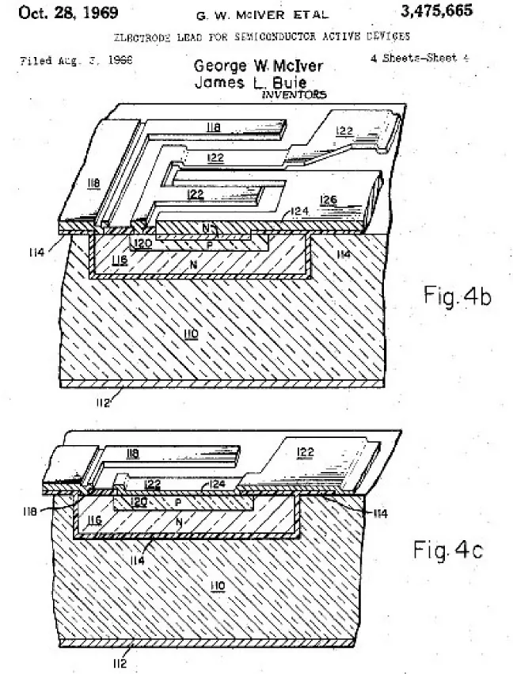

Ở bài viết [Silicon Valley](./silicon-valley), ta đã tìm hiểu được về bản chất và lịch sử hình thành của vùng đất này, nơi mà các công ty công nghệ lớn nhất thế giới được thành lập. Nhưng tại sao các công ty tại Silicon Valley có thể thành công? Những công ty này có thứ gì mà các công ty khác không có?

Đó chính là **tài sản trí tuệ** (hay sở hữu trí tuệ).

Theo Tổ chức Sở hữu trí tuệ thế giới (WIPO), tài sản trí tuệ là những sản phẩm sáng tạo của trí óc – bao gồm mọi thứ từ tác phẩm nghệ thuật đến phát minh, chương trình máy tính đến nhãn hiệu và các dấu hiệu thương mại khác.[^wipo]

Hay nói cách khác, tài sản trí tuệ là những sản phẩm do trí tuệ con người sáng tạo ra, không mang hình thái vật chất cụ thể nhưng lại có giá trị kinh tế to lớn và được pháp luật bảo hộ. Đây được xem là "mỏ vàng" vô hình, là động lực quan trọng cho sự phát triển của các cá nhân, doanh nghiệp và toàn bộ nền kinh tế trong kỷ nguyên số.

## Phần 1: Tại sao bạn cần quan tâm đến tài sản trí tuệ?

Trước khi tiếp tục bài viết này, bạn có thể xem video ngắn bên dưới để hiểu rõ hơn về tính hữu ích của bằng sáng chế - một hệ thống độc quyền giúp chia sẻ kiến thức và chuyển giao công nghệ hiệu quả.

<iframe 
class="w-full aspect-video"
src="https://www.youtube.com/embed/oSIF0Hy5TBo?si=OrwQDeuCgHA4iRGO" title="YouTube video player" frameborder="0" allow="accelerometer; autoplay; clipboard-write; encrypted-media; gyroscope; picture-in-picture; web-share" referrerpolicy="strict-origin-when-cross-origin" allowfullscreen></iframe>

### Quyền Sở Hữu Trí Tuệ là gì?

Khác với những thứ vật chất như nhà cửa hay xe cộ, tri thức và thông tin có một đặc điểm rất thú vị: chúng không bị "khan hiếm" theo nghĩa thông thường. Mình có thể chia sẻ kiến thức cho bạn mà không mất đi chính kiến thức đó.

Để hiểu rõ hơn, hãy tưởng tượng mình có một chiếc búa. Nếu mình đang dùng thì bạn phải đợi, hoặc bạn phải mua một chiếc búa khác. Chúng ta không thể cùng lúc dùng chung một chiếc búa. Đây là tính chất "cạnh tranh" của tài sản vật chất.

Nhưng nếu mình dạy bạn cách "dùng búa để đóng đinh", thì sao? Bạn có thể sử dụng kiến thức này mà không hề ảnh hưởng gì đến việc mình cũng sử dụng chính kiến thức đó. Chúng ta có thể tranh giành chiếc búa, nhưng không cần phải tranh giành ý tưởng về cách dùng búa.

Tất nhiên, đôi khi tri thức cũng có thể "cạnh tranh". Nếu cả hai chúng ta đều là thợ mộc, việc mình dạy nghề cho bạn có thể biến bạn thành đối thủ cạnh tranh, làm giảm thu nhập của mình. Hoặc khi ai đó nắm giữ thông tin mà người khác không có (như biết trước tin tức thị trường chứng khoán), thì thông tin đó trở thành lợi thế cạnh tranh.

## Phần 2: Một ~chút~ về lịch sử

Nội dung của phần này được tham khảo từ _Intellectual Property Rights: A Critical History của Christopher May và Susan K. Sell_[^may2005].

### Những tiền thân sơ khai của sở hữu trí tuệ

Có thể nói, việc đánh dấu hàng hóa là một trong những hình thức đầu tiên nhằm phân biệt thông tin và xác lập quyền sở hữu. Những dấu hiệu này không chỉ phản ánh uy tín, danh tiếng của người thợ hay nhà sản xuất mà còn chỉ rõ nguồn gốc sản phẩm. Từ rất lâu trước khi có các quy định pháp luật chính thức để giải quyết tranh chấp về quyền sở hữu, con người đã sử dụng các dấu hiệu này để khẳng định quyền sở hữu của mình đối với tài sản.

Việc đánh dấu quyền sở hữu có thể bắt nguồn từ tập quán đóng dấu lên gia súc – một trong những hình thức sơ khai nhất để xác lập quyền sở hữu. Từ thời kỳ tiền sử, con người đã sử dụng các dấu hiệu như cắt tai, ký hiệu riêng hoặc thẻ tai để nhận diện và phân biệt gia súc của mình. Những phương pháp này vẫn còn tồn tại trong nhiều nền văn hóa nông nghiệp hiện đại. Suốt hơn 6.000 năm, kể từ khi động vật được thuần hóa, con người đã liên tục đánh dấu các vật dụng, sản phẩm mà mình tạo ra hoặc sở hữu. Một số dấu hiệu này thực chất là nhãn hiệu thương mại theo nghĩa hiện đại – dùng để chỉ nguồn gốc sản phẩm, trong khi những dấu hiệu khác lại nhằm xác định quyền sở hữu đối với hàng hóa.

Nhiều bằng chứng khảo cổ học cho thấy việc đánh dấu quyền sở hữu trên đồ gốm và vật dụng gia đình đã xuất hiện phổ biến ở các nền văn minh tiền sử châu Âu và châu Á. Đến thời Ai Cập cổ đại và Lưỡng Hà, các thợ làm gạch thường khắc dấu lên sản phẩm của mình, bên cạnh tên vị vua trị vì hoặc chủ sở hữu công trình. Thợ đẽo đá cũng ghi tên nhà thầu hoặc cá nhân lên các khối đá xây dựng, có thể nhằm mục đích tính lương dựa trên sản lượng. Ở các thành bang Hy Lạp, việc gắn tên tuổi người sáng tạo lên sản phẩm không chỉ nâng cao giá trị hàng hóa vật chất mà còn lan sang lĩnh vực văn hóa và trí tuệ. Trước đó, kiến thức khoa học, công nghệ thường được giữ bí mật như một dạng "bí quyết nghề nghiệp", tương tự bí mật thương mại ngày nay, và việc tiết lộ có thể bị trừng phạt nghiêm khắc. Tuy nhiên, triết học Hy Lạp đã thúc đẩy quan niệm rằng bản thân tri thức cũng có giá trị, mở đường cho việc thương mại hóa tri thức trong tương lai.

### Những ý tưởng của người Hy Lạp về việc sở hữu ý tưởng

Dù sở hữu trí tuệ (dưới bất kỳ hình thức nào) chưa hề manh nha trong xã hội Hy Lạp thời Simonides và các thi sĩ khác, họ lại chính là những "người sáng tạo" đầu tiên trở thành doanh nhân tri thức theo cách hiểu của chúng ta ngày nay. Trước nền văn minh Hy Lạp thế kỷ VI TCN, các nghệ sĩ, thi sĩ, ca sĩ và cả giới trí thức đều được các nhà bảo trợ "nuôi" và phải biểu diễn khi có yêu cầu. Tuy nhiên, tại các thành bang Hy Lạp, bên cạnh hình thức bảo trợ trực tiếp, đã bắt đầu xuất hiện các giải thưởng cho những buổi ngâm thơ trước công chúng và các buổi biểu diễn được trả phí (tương tự các buổi độc tấu).

Các nhà Ngụy biện (Sophists) được xem là nhóm đầu tiên kiếm được thù lao đáng kể từ việc dạy học tự do. Dường như họ không coi nội dung giảng dạy của mình là một đối tượng có thể sở hữu, dù cho các cẩm nang về những lĩnh vực họ dạy (từ đấu vật đến quản gia) đã bắt đầu xuất hiện. Đa phần các tài liệu này do học trò ghi chép lại rồi được sao chép rộng rãi; thời đó chưa có công nghệ xuất bản. Những người chỉ trích các nhà Ngụy biện thường cho rằng việc để tư tưởng của mình được ghi lại thành văn bản đã khiến họ mất kiểm soát về đối tượng tiếp cận và hưởng lợi từ kiến thức đó. Điều này ngụ ý rằng chính các nhà Ngụy biện cũng không xem kiến thức hay thông tin là một món hàng có thể sở hữu. Có lẽ, họ chỉ coi những cuốn cẩm nang này là phương tiện quảng bá danh tiếng và thu hút học trò. Các nhà Ngụy biện là người thầy dạy tư duy và kỹ năng, chứ không phải người cung cấp các sản phẩm trí tuệ cụ thể.

Từ thế kỷ VI TCN trở đi, trong văn hóa Hy Lạp đã xuất hiện những nhà thơ tự nhận là tác giả của các tác phẩm cụ thể, hay các họa sĩ ký tên lên tranh của mình. Việc các tác giả để lại dấu hiệu hoặc chữ ký trên tác phẩm nghệ thuật vừa là sự ghi nhận thành tựu cá nhân, vừa là lời khẳng định quyền sở hữu đối với nội dung sáng tạo. Ý thức về chất lượng vượt trội trong tác phẩm và kỹ thuật điêu luyện của bản thân đã trở thành một phần trong thế giới quan của các nhà thơ thời kỳ này. Dù đã tồn tại mối quan hệ hợp đồng giữa nhà thơ và người đặt hàng, và đối tượng của hợp đồng là những bài thơ, nhưng khái niệm "bài thơ là một tài sản trí tuệ" theo nghĩa hiện đại vẫn chưa xuất hiện. Tuy vậy, thơ ca đã được xem là một nghệ thuật có thể bán sản phẩm của mình ngoài chợ. Trong xã hội Hy Lạp thế kỷ VI và V TCN, có thể thấy sự trỗi dậy của ý niệm về sáng tạo, thứ sau này trở thành nền tảng cho quyền sở hữu tri thức. Quan điểm về tác giả như một thiên tài đơn độc, hình thành vào thế kỷ XVII-XVIII, thực chất đã có nguồn gốc sâu xa từ Hy Lạp.

Khi xuất hiện tiền tệ và thị trường, cùng với ý tưởng về sáng tạo cá nhân, thơ ca và các sản phẩm trí tuệ bắt đầu được mua bán, trao đổi như một loại hàng hóa. Lúc này, ngoài việc tặng quà trong các mối quan hệ xã hội, người Hy Lạp còn có thể trả tiền để sở hữu tác phẩm của nhà thơ hoặc nghệ sĩ. Đây là bước đầu tiên cho việc thương mại hóa sáng tạo, dù mới chỉ ở mức đơn giản. Việc ghi nhận tên tác giả trên tác phẩm cũng giúp khẳng định ai là người sáng tạo ra nó. Tuy nhiên, phải đến thời La Mã, các hoạt động mua bán và bảo vệ quyền sở hữu trí tuệ mới phát triển rõ ràng hơn.

<blockquote>
Hy Lạp là cái nôi của nền văn minh phương Tây, nơi đã sản sinh ra những tư tưởng tiến bộ về tự do cá nhân, sáng tạo và nghệ thuật từ hàng nghìn năm trước. Những nhà triết học như Socrates, Plato và Aristotle đã đặt nền móng cho nhiều lĩnh vực khoa học và triết học hiện đại.

Trong đó truyện ngụ ngôn là một trong những chủ đề mình cảm thấy thú vị nhất. Aesop, một nhà thơ và ngụ ngôn gia nổi tiếng, đã sử dụng hình thức này để truyền đạt những bài học đạo đức sâu sắc. "Con cáo và chùm nho" là một trong những câu chuyện nổi tiếng nhất của ông, thể hiện sự khôn ngoan và tính thực dụng trong cuộc sống.

Trong vở kịch "Con cáo và chùm nho", Aesop đã dùng chính trí tuệ và tài kể chuyện của mình để đổi lấy tự do. Bạn có thể xem vỡ kịch tiếng Việt bên dưới đây:

<iframe
  class="w-full aspect-video"
  src="https://www.youtube.com/embed/5DIVYN6RXbc?si=wAbVXyxRhpp81vRu"
  title="YouTube video player"
  frameborder="0"
  allow="accelerometer; autoplay; clipboard-write; encrypted-media; gyroscope; picture-in-picture; web-share"
  referrerpolicy="strict-origin-when-cross-origin"
  allowfullscreen
  loading="lazy"
/>
</blockquote>

### Những phát triển thời La Mã

Trong lĩnh vực công nghiệp, người La Mã đã kế thừa truyền thống sử dụng dấu hiệu của thợ thủ công từ người Hy Lạp. Những dấu hiệu này không chỉ để thể hiện dấu ấn cá nhân mà còn phục vụ các mục đích thực tiễn như xác nhận việc nộp thuế, thông báo về độc quyền của nhà nước, hay để các nhà thầu và chủ lao động quyết toán sổ sách. Về cơ bản, dấu hiệu này đại diện cho sự trung thực và uy tín của nhà sản xuất. Tuy nhiên, chúng không có địa vị pháp lý, nên người tạo ra dấu hiệu không có quyền truy đòi khi bị xâm phạm. Dù vậy, luật La Mã có thể đã cho phép người mua khởi kiện kẻ bán hàng có dấu hiệu giả mạo với tội danh lừa đảo. Thậm chí, một đạo luật có từ khoảng năm 81 TCN đã cấm việc sử dụng tên người khác để kiếm lợi. Mặc dù không có bằng chứng nào liên kết trực tiếp điều này với việc xâm phạm nhãn hiệu, nhưng nó cho thấy một hình thức sơ khai chống lại hành vi "mạo danh thương hiệu" đã tồn tại, ngay cả khi người tạo ra nhãn hiệu chưa có quyền đặc biệt nào đối với nó.

Trong lĩnh vực văn học, ngành xuất bản La Mã – thực chất là việc sao chép văn bản có tổ chức – đã nổi lên và phát triển mạnh mẽ vào thế kỷ thứ nhất TCN. Ban đầu, các tác giả thường sống nhờ sự bảo trợ của những người giàu có và không trực tiếp nhận tiền từ việc "xuất bản" tác phẩm. Tuy nhiên, một mô hình mới dần xuất hiện, tạo ra mối liên kết trực tiếp giữa tác giả và việc bán tác phẩm. Chẳng bao lâu sau, một khái niệm sơ khai về tài sản văn học đã hình thành. Có bằng chứng cho thấy nhà hùng biện Cicero đã có lợi ích kinh doanh trực tiếp từ việc bán sách của mình thông qua các thỏa thuận trả tiền bản quyền. Sau khi ông qua đời, quyền xuất bản các tác phẩm của ông thậm chí còn được một người bán sách mua lại. Điều này cho thấy, dù chưa có luật bản quyền hiện đại, ngành xuất bản La Mã đã công nhận một dạng sở hữu trí tuệ ở mức độ nguyên mẫu. Việc các tác giả ký hợp đồng với nhà xuất bản để sao chép và phân phối tác phẩm cho thấy họ được thừa nhận có quyền hợp pháp đối với những sáng tạo của mình.

Người La Mã dường như cũng phân biệt giữa quyền của tác giả trong việc bảo vệ sự toàn vẹn của tác phẩm và quyền sao chép. Do việc sao chép bản thảo rất tốn thời gian, sách trong thế giới La Mã chủ yếu được lưu hành thay vì mua bán. Đôi khi, các tác giả nổi tiếng có thể trao độc quyền phân phối tác phẩm của mình cho một người bán sách cụ thể như một "thông lệ thương mại". Tuy nhiên, quyền của tác giả chủ yếu chỉ giới hạn ở việc được công nhận là người sáng tạo (để chống đạo văn) chứ chưa mở rộng thành quyền sở hữu thương mại. Đáng chú ý, các học giả như Vitruvius và Pliny Già không chỉ cẩn trọng ghi nhận các tác giả mà họ trích dẫn mà còn tỏ thái độ thù địch với nạn đạo văn. Việc "ăn cắp" tác phẩm của người khác bắt đầu bị coi là không thể chấp nhận, cho thấy những ý tưởng về sự sáng tạo cá nhân đã bắt đầu nảy nở.

Mặc dù có những dấu hiệu về các hình thức sở hữu trí tuệ sơ khai, không có vụ kiện nào được ghi nhận trong luật La Mã. Vì vậy, mọi cuộc thảo luận về vấn đề này đều chỉ mang tính phỏng đoán. Luật La Mã đã công nhận một số dạng tài sản vô hình khác, và một số học giả cho rằng chính sự công nhận này đã tạo nền tảng cho luật bản quyền thời cận đại sau này. Tuy nhiên, với một hệ thống pháp lý tốn kém và đôi khi tùy tiện, cùng với sự bảo vệ còn hạn chế dành cho thông tin, không có gì ngạc nhiên khi không có một bộ án lệ nào về lĩnh vực này được tìm thấy.

")

Sau sự sụp đổ của Đế chế La Mã, những ý tưởng ban đầu về quyền sở hữu đối với tri thức không hoàn toàn biến mất. Một tranh chấp ở Ireland vào thế kỷ thứ sáu thường được xem là vụ tranh chấp bản quyền đầu tiên, dù cách gọi này có phần phóng đại. Câu chuyện kể về Thánh Columbia đã lén sao chép một cuốn thánh vịnh của thầy mình là Finnian. Khi vụ việc được đưa ra trước Vua Diarmed, nhà vua đã phán quyết rằng cả bản gốc và bản sao đều thuộc về Finnian, với lời tuyên bố nổi tiếng: "Mỗi con bò cái đều có con bê của nó, và theo đó mỗi cuốn sách đều có bản sao của nó."

Dù tính xác thực của câu chuyện này còn gây tranh cãi, ý nghĩa biểu tượng của nó vẫn rất lớn, cho thấy sức hấp dẫn lâu dài của ý tưởng sở hữu tri thức. Huyền thoại tồn tại không chỉ để ghi lại thực tế, mà còn để lưu truyền những ý tưởng hữu ích. Khoảng trống pháp lý sau thời La Mã không dập tắt được mong muốn sở hữu ý tưởng. Trong những thế kỷ tiếp theo, các phường hội mới thành lập đã tiếp tục phát triển khái niệm về giá trị của tri thức và tìm cách thiết lập quyền kiểm soát để bảo vệ kiến thức chuyên môn của họ.

### Thời Trung Cổ, Tri Thức Phường Hội, và Quá Trình Chuyển Đổi sang Sở Hữu Trí Tuệ

Trong Thời kỳ Tăm tối (Dark Ages), các tu viện là những kho tàng tri thức chính, nơi lưu giữ các bản thảo quý giá và học vấn của tu sĩ. Dù rất được trân trọng, giá trị của một bản thảo chủ yếu được nhìn nhận qua công sức sao chép và vật liệu làm ra nó, chứ chưa có khái niệm về quyền sở hữu đối với nội dung. Khi các trường đại học trỗi dậy từ thế kỷ 12, nguồn tài nguyên trí tuệ này được chuyển giao. Tuy nhiên, trớ trêu thay, các quy định của trường đại học lại cản trở sự phát triển của quyền sở hữu trí tuệ. Họ quy định rằng người buôn bán bản thảo không được từ chối cho các thành viên trong trường thuê sách để sao chép. Điều này đã làm suy yếu mọi khái niệm non trẻ về tài sản văn học kế thừa từ thời La Mã, cho đến khi các bằng sáng chế độc quyền cho ấn phẩm ra đời vào cuối thế kỷ 15.

Trong khi quyền sở hữu văn học bị đình trệ, một hình thức sở hữu khác là nhãn hiệu thương mại lại tiếp tục phát triển mạnh mẽ, kế thừa từ thời Hy Lạp và La Mã. Động lực chính đến từ các phường hội (guilds), những tổ chức cần một phương pháp để phân biệt hàng hóa của mình và thực thi độc quyền thương mại. Ban đầu, các phường hội cổ đại không coi kiến thức nghề là tài sản. Nhưng đến thế kỷ 13, thái độ này đã thay đổi. Các đạo luật bắt đầu được ban hành trên khắp châu Âu để bảo vệ nhãn hiệu của phường hội. Ví dụ, vào năm 1282, thành phố Parma (Ý) đã ra luật cấm các thợ thủ công sử dụng nhãn hiệu của người khác và bảo vệ những nhãn hiệu đã được sử dụng lâu năm.

Đến thế kỷ 14, việc kiểm soát tri thức nghề vì lợi nhuận đã trở thành mục tiêu rõ ràng của nhiều phường hội, từ thợ dệt đến thợ kim hoàn. Họ sử dụng độc quyền để hạn chế cạnh tranh và bảo vệ lợi ích của các thành viên. Mặc dù không dùng thuật ngữ "sở hữu trí tuệ", các phường hội đã khẳng định quyền sở hữu tập thể đối với tri thức của mình. Họ nhận ra giá trị của việc tạo ra sự khan hiếm bằng cách giới hạn người được phép hành nghề.

Để thực thi quyền kiểm soát, các phường hội đã phát triển hai loại nhãn hiệu: nhãn hiệu của thương nhân (dùng để xác nhận quyền sở hữu hàng hóa khi vận chuyển) và nhãn hiệu sản xuất. Nhãn hiệu sản xuất, tương tự như nhãn hiệu thương mại hiện đại, được kiểm soát rất chặt chẽ. Các thành viên bắt buộc phải sử dụng chúng. Nhờ vậy, phường hội có thể truy xuất nguồn gốc hàng hóa lỗi để trừng phạt người làm ra nó, đồng thời ngăn chặn những người ngoài bán sản phẩm trong khu vực độc quyền của mình. Nhãn hiệu lúc này chưa phải là tài sản đại diện cho uy tín của một cá nhân, mà là biểu tượng cho kiến thức và quyền lực của cả một tập thể. Nó chứng nhận nguồn gốc và chất lượng đã được kiểm duyệt.

Có thể nói, bảo hộ nhãn hiệu thương mại là hình thức sở hữu trí tuệ đầu tiên có biểu hiện gần với luật pháp hiện đại. Nó xác định ai có quyền sản xuất, tạo ra sự khan hiếm để duy trì giá cả và bảo vệ phúc lợi cho thành viên. Các phường hội hiểu rằng nhãn hiệu giúp sản phẩm của họ khác biệt và có giá trị hơn so với hàng hóa không rõ nguồn gốc, chất lượng.

Một bước ngoặt quan trọng đã diễn ra khi các phường hội bắt đầu công nhận quyền sở hữu trí tuệ của cá nhân. Năm 1432, phường hội lụa ở Genoa quy định rằng nếu một thành viên đã thiết kế ra một mẫu nào đó, thì không ai khác được phép sử dụng mẫu đó. Đến năm 1474, phường hội len ở Florence còn đi xa hơn, lên án những kẻ "bằng gian lận và lừa dối để đánh cắp các mẫu" do các nhà sản xuất khác tự mình nỗ lực phát minh ra. Việc dùng từ "đánh cắp" cho thấy các mẫu thiết kế đã được coi là tài sản, và việc tập trung vào "nỗ lực của chính họ" đã cho thấy sự đề cao sự sáng tạo cá nhân – một nền tảng cốt lõi của luật sở hữu trí tuệ ngày nay.

Khi tri thức nghề trở nên có giá trị, nó cũng trở thành mục tiêu của sự chiếm đoạt. Việc sao chép trái phép nhãn hiệu bị coi là một tội ác nghiêm trọng với những hình phạt khắc nghiệt. Chẳng hạn, vào thế kỷ 16, dưới thời Vua Charles V, những người sản xuất thảm trái phép có thể bị chặt tay. Rõ ràng, bên cạnh việc bảo vệ chất lượng, các phường hội cũng đang ra sức đàn áp cạnh tranh.

Cuối cùng, chính sự cá nhân hóa tri thức đã làm lung lay nền tảng sở hữu tập thể của phường hội. Nhiều cá nhân đã rời bỏ phường hội, mang theo kiến thức của mình đến một nơi khác và tuyên bố đó là phát minh của riêng họ, yêu cầu được pháp luật bảo hộ. Khi thành công, họ đã biến tri thức từng thuộc về cộng đồng thành tài sản cá nhân. Điều này đã mở đường cho các tranh chấp bằng sáng chế điển hình về việc ai là người phát minh đầu tiên, vốn trở nên rất phổ biến trong thế kỷ 16. Chính các thành viên, chứ không phải cả phường hội, giờ đây đã trở thành chủ sở hữu của những sáng tạo mới, tạo tiền đề vững chắc cho sự phát triển của khái niệm sở hữu trí tuệ hiện đại.

### Bằng Sáng Chế Sơ Khai

Trước khi có luật sở hữu trí tuệ chính thức, các nhà cầm quyền châu Âu thường trao "đặc quyền" độc quyền cho những người giới thiệu các kỹ thuật hoặc ngành nghề mới vào lãnh thổ của mình. Đây là một chính sách kinh tế nhằm thu hút các thợ thủ công lành nghề từ nước ngoài, qua đó "vay mượn" các công nghệ tiên tiến để giảm nhập khẩu và phát triển công nghiệp trong nước. Ví dụ, các vị vua Anh đã cấp đặc quyền cho những người thợ dệt, thợ làm muối, hay thợ làm kính màu để họ mang kỹ thuật của mình đến Anh và truyền dạy lại.

Các đặc quyền này thực chất là một thỏa thuận. Người thợ thủ công nước ngoài sẽ được độc quyền kinh doanh trong một thời gian nhất định (thường là 14 năm) để bù đắp cho việc họ phải di cư và để bảo vệ họ khỏi sự cạnh tranh ban đầu. Đổi lại, họ phải đào tạo những người thợ học việc bản xứ. Khi đặc quyền hết hạn, quốc gia sẽ có một đội ngũ lao động lành nghề mới, sẵn sàng tiếp tục phát triển ngành nghề đó.

Ý tưởng về bằng sáng chế cũng phát triển từ các hình thức độc quyền khác, chẳng hạn như đặc quyền khai thác mỏ. Do chi phí khai thác rất cao, các nhà cầm quyền thường trao độc quyền cho những người đầu tiên tìm ra mỏ hoặc phát triển các thiết bị mới giúp thoát nước trong hầm mỏ. Tiền lệ này đã tạo nền tảng cho việc bảo hộ các phát minh kỹ thuật sau này.

Một bước ngoặt quan trọng đã xảy ra ở Florence (Ý) vào thế kỷ 15. Một nhà phát minh tên là Brunelleschi đã được cấp đặc quyền cho một thiết kế tàu hoàn toàn mới. Điểm khác biệt mấu chốt là đặc quyền này được cấp dựa trên tính mới của phát minh, chứ không chỉ đơn thuần là việc du nhập một công nghệ đã có sẵn. Thỏa thuận rất rõ ràng: nhà phát minh sẽ công khai sáng chế của mình để đổi lấy sự bảo hộ độc quyền trong một thời gian ngắn. Mặc dù con tàu đầu tiên đã bị chìm và hệ thống này không được tiếp tục ở Florence ngay lập tức do sự cạnh tranh của các phường hội và chính trị, nhưng nó đã gieo mầm cho một ý tưởng cốt lõi của luật bằng sáng chế hiện đại: bảo hộ sự đổi mới để khuyến khích tiến bộ.

### Bản quyền sơ khai
Trong khi lịch sử sơ khai của bằng sáng chế liên quan đến những người hành nghề cá nhân (có thể là nhà đổi mới hoặc không), thì lịch sử sơ khai của bản quyền lại chủ yếu liên quan đến các vật phẩm hữu hình. Sau sự sụp đổ của Rome, mọi xem xét về quyền của tác giả đã không còn nữa, cùng với luật La Mã. Rất ít điều có thể được coi là tương tự như bản quyền được công nhận cho đến thời Phục hưng, khi sự đổi mới của máy in đã thúc đẩy sự phân phối nhanh chóng của tri thức thành văn. Cho đến lúc đó, thời Trung Cổ vẫn chủ yếu là một nền văn hóa truyền miệng, và để những người hát rong nổi tiếng giữ được "quyền văn học" đối với tác phẩm của mình, họ sẽ phải giữ những câu chuyện đó cho riêng mình. Một cách giải quyết là tìm kiếm sự bảo trợ, như đã xảy ra ở thời La Mã, hoặc đề nghị bán các bản sao bài hát và câu chuyện của họ cho những người biểu diễn khác. Dù bằng cách nào, khả năng của người viết để giữ quyền đối với sản phẩm là rất khó khăn. Tuy nhiên, có ý kiến cho rằng vào thế kỷ thứ mười bốn, nhà thơ Petrarca "khẳng định trong các lá thư của mình rằng đó là quyền duy nhất của ông để cho phép hoặc ngăn chặn việc sao chép các văn bản của mình, cho đến khi chính ông đưa nó ra công chúng (tức là đã cho xuất bản) và rằng chỉ một mình ông kiểm soát tính xác thực của văn bản". Tuy nhiên, chỉ có danh tiếng và tác phẩm tương đối nổi tiếng của ông mới khiến lệnh cấm như vậy có thể thực hiện được một phần.

Sau phát minh in ấn vào thế kỷ 15, ngành xuất bản và bán sách bùng nổ, nhanh chóng vươn ra quy mô quốc tế. Sách in bằng tiếng Latinh có thể được bán khắp châu Âu, nơi đã có sẵn một thị trường nhỏ nhờ các bản chép tay của tu viện.

Khi các nhà in sản xuất sách hàng loạt, họ cần một cách để ngăn chặn người khác sao chép tác phẩm của mình. Điều này đã thúc đẩy sự ra đời của một hình thức bản quyền sơ khai. Khác với sự bảo hộ tập thể của các phường hội trước đây, giờ đây trọng tâm bảo hộ chuyển sang cá nhân nhà sản xuất.

Venice, một trung tâm kinh tế lớn thời bấy giờ, đã đi tiên phong trong lĩnh vực này. Ngay từ năm 1469, một nhà in đã được cấp độc quyền in các tác phẩm cổ điển. Sau đó, các đặc quyền được cấp cho những hình thức in ấn cụ thể, chẳng hạn như độc quyền in sách bằng chữ nghiêng vào năm 1502.

Thực ra, ý tưởng về sở hữu trí tuệ đã manh nha từ trước đó. Những người vẽ minh họa cho bản thảo chép tay đã xem việc bị "ăn cắp" bản phác thảo gốc là một vấn đề nghiêm trọng. Một số phường hội thậm chí còn trao độc quyền sao chép một tác phẩm cho người thợ cả nhận được đơn đặt hàng. Như vậy, nền tảng cho quyền sở hữu tác phẩm in đã có sẵn trước khi máy in ra đời.

Sự bùng nổ của ngành in đã tạo ra một thị trường cạnh tranh khốc liệt. Điều này dẫn đến các cuộc tranh luận gay gắt về độc quyền và vi phạm bản quyền, buộc xã hội phải định nghĩa lại một cách pháp lý đâu là tài sản chung (public domain) và đâu là tài sản riêng. Dần dần, thái độ "sở hữu" của các tác giả đối với tác phẩm của mình bắt đầu hình thành.

Dù vậy, hình ảnh người nghệ sĩ hay tác giả như một "thiên tài sáng tạo" mà chúng ta biết ngày nay chỉ thực sự xuất hiện vào thế kỷ 18. Mặc dù sau này nước Anh trở thành trung tâm với các đạo luật bản quyền và bằng sáng chế quan trọng, nhưng chính Venice mới là nơi đã thực hiện những bước đi tiên phong trong việc bảo vệ sở hữu trí tuệ, đi trước nước Anh hơn một thế kỷ. Khi trung tâm kinh tế của châu Âu dịch chuyển về phía London, nhu cầu và sự phát triển của luật sở hữu trí tuệ cũng dịch chuyển theo.

### Khoảnh khắc của Venice: Sở hữu trí tuệ ra đời

Dù các ý tưởng về việc sở hữu tri thức đã có từ lâu, hệ thống bằng sáng chế được chính thức hóa đầu tiên trên thế giới chỉ ra đời vào thế kỷ 15 tại Venice. Lần đầu tiên, một khuôn khổ pháp lý về quyền sở hữu trí tuệ đã được thiết lập rõ ràng nhằm thúc đẩy sự đổi mới. Venice là nơi tiên phong áp dụng các quy tắc nhất quán cho bằng sáng chế, thay vì chỉ cấp các độc quyền riêng lẻ một cách ngẫu nhiên.

Những quy tắc này tỏ ra có tầm nhìn xa một cách đáng kinh ngạc. Các bằng sáng chế đòi hỏi phải có tính mới (chưa từng tồn tại trong lãnh thổ), tính hữu dụng (có khả năng ứng dụng), thời hạn bảo hộ có giới hạn, và quyền sở hữu có thể chuyển nhượng. Ngoài ra, nhà phát minh phải đưa sáng chế vào sử dụng trong một thời gian nhất định, nếu không bằng sẽ bị thu hồi. Nhà nước cũng giữ quyền sử dụng các phát minh này vì lợi ích chung. Dù chưa hoàn thiện, những nguyên tắc cốt lõi này đã đặt nền móng cho luật sở hữu trí tuệ hiện đại.

Chính quyền Venice thời đó hoạt động dựa trên tập quán và tiền lệ thay vì một hiến pháp chính thức. Năm 1474, họ đã ban hành đạo luật về bằng sáng chế đầu tiên. Dù ban đầu chưa được áp dụng rộng rãi, đạo luật này cho thấy chính quyền Venice đã nhận ra tầm quan trọng của đổi mới công nghệ đối với sự thịnh vượng của thành phố.

Vào ngày 19 tháng 3 năm 1474, viện nguyên lão Venice đã thông qua một sắc lệnh lịch sử, tuyên bố rằng:

> Tại thành phố này có nhiều người tài trí, có khả năng phát minh ra các công cụ tài tình. Nếu các công trình của họ được bảo vệ, không để người khác sao chép, họ sẽ càng phát huy tài năng và tạo ra những thứ hữu ích cho nhà nước.
>
> Do đó, bất kỳ ai tạo ra một thiết bị mới và tài tình tại thành phố này đều phải đăng ký với cơ quan có thẩm quyền. Sẽ bị cấm đối với bất kỳ ai khác sao chép thiết bị đó trong thời hạn mười năm mà không có sự cho phép của tác giả. Kẻ vi phạm sẽ bị phạt tiền và thiết bị sao chép sẽ bị phá hủy. Tuy nhiên, Chính phủ có toàn quyền sử dụng các phát minh này cho nhu cầu riêng của mình.

Đây là lần đầu tiên, bằng sáng chế được điều chỉnh bởi một luật chung, thay vì quy trình kiến nghị và cấp phép riêng lẻ. Việc cấp bằng giờ đây dựa trên các tiêu chí cố định, không còn phụ thuộc vào mối quan hệ với chính quyền.

Trước đạo luật 1474, Venice đã có một hệ thống cấp "đặc quyền độc quyền" (privilegi). Hệ thống này vẫn tiếp tục tồn tại song song một thời gian. Các privilegi thường được dùng để điều chỉnh các ngành kinh tế do phường hội kiểm soát, cho phép phá vỡ độc quyền của một phường hội nếu một phát minh mới mang lại lợi ích kinh tế-xã hội lớn hơn. Ví dụ điển hình là chính quyền đã cho phép sản xuất "kính đeo mắt" một cách rộng rãi thay vì để phường hội thợ thủy tinh độc quyền, vì nhận thấy lợi ích to lớn của việc phổ biến kính đọc sách trong một xã hội ngày càng tri thức.

Đạo luật 1474 đã tạo ra sự phân biệt rõ ràng giữa bằng sáng chế (một thỏa thuận giữa phần thưởng cho nhà phát minh và lợi ích của công chúng) và các đặc quyền độc quyền cũ. Nó cân bằng giữa việc khuyến khích cá nhân sáng tạo và đảm bảo nhà nước được hưởng lợi từ các tiến bộ kinh tế.

Cấu trúc xã hội dựa trên các phường hội của Venice đã tạo điều kiện cho sự ra đời của đạo luật này. Khi vai trò của các nhà phát minh cá nhân ngày càng được đề cao, việc chuyển sang một hình thức bảo hộ chính thức đã giúp bảo vệ tri thức quý giá và chuyển trọng tâm từ phường hội sang cá nhân.

Tuy nhiên, quy trình thẩm định bằng sáng chế thời kỳ đầu còn khá sơ khai. Các quan chức thường gặp khó khăn trong việc xác định tính mới và tính hữu dụng của một phát minh. Do đó, khi có nghi ngờ, họ thường giải quyết theo hướng có lợi cho người nộp đơn. Trên thực tế, từ năm 1474 đến 1550, không có đơn xin cấp bằng nào bị từ chối. Dù vậy, các bằng sáng chế thường đi kèm điều kiện phải chứng minh được hiệu quả thực tế, nếu không sẽ bị hủy bỏ. Điều này giúp sàng lọc những phát minh thực sự giá trị.

Mặc dù hệ thống này góp phần vào sự thịnh vượng của Venice, nhưng khi thành phố dần suy tàn, các nghệ nhân đã rời đi, mang theo kỹ năng, công nghệ và sự hiểu biết về sở hữu trí tuệ đến các vùng đất khác. Hầu hết các quốc gia châu Âu sau này đã áp dụng mô hình bằng sáng chế gần như y hệt của Venice. Sức hấp dẫn của nó nằm ở khả năng thu hút nhân tài và nhập khẩu công nghệ mới, từ đó thúc đẩy nền kinh tế phát triển.

### Các quan niệm khác trên thế giới

Trong truyền thống Do Thái, khái niệm "đánh cắp ý tưởng" đã được phát triển từ sớm. Kinh Talmud của người Do Thái yêu cầu người trình bày phải xác định rõ ai là người đã đóng góp các nguyên tắc và ý tưởng mới. Điều này bắt nguồn từ một niềm tin tôn giáo sâu sắc rằng việc "đánh cắp lời của người khác" là sai trái. Mặc dù việc trích dẫn nguồn chưa phải là một quyền sở hữu đầy đủ, nó công nhận tác giả có một dạng quyền sở hữu đối với ý tưởng của mình.

Ở Trung Quốc, dù đã có nhiều đổi mới công nghệ vượt bậc, bao gồm cả kỹ thuật in bằng con chữ rời khoảng 500 năm trước châu Âu, khái niệm sở hữu trí tuệ lại không hề phát triển. Có nhiều lý do cho điều này. Một phần là do hệ thống chữ viết tượng hình phức tạp khiến việc in bằng con chữ rời không thực sự hiệu quả. Hơn nữa, người Trung Quốc rất coi trọng nghệ thuật thư pháp, một hình thức sáng tạo thủ công, và xem việc sao chép cơ học là đi ngược lại truyền thống này.

Tuy nhiên, lý do sâu xa nhất được cho là mang tính triết học. Do ảnh hưởng của tư tưởng Nho giáo, vốn coi trọng việc kế thừa và tiếp cận không giới hạn tri thức của quá khứ, xã hội Trung Quốc không hình thành khái niệm về quyền sở hữu cá nhân đối với ý tưởng. Mặc dù có những yếu tố có thể thúc đẩy sự phát triển của sở hữu trí tuệ, nhưng nếu không có sự kích thích về mặt tư tưởng chính trị, kết quả đã không giống như ở Venice và các thành phố châu Âu khác.

Tương tự, ở Hàn Quốc, triều đình đã rất nỗ lực phổ biến tri thức thông qua việc in sách và phát triển các phương pháp in mới từ rất sớm, ngay trước cả châu Âu. Tuy nhiên, cũng không có sự phát triển song song của ý tưởng về quyền sở hữu tri thức.

Trong khi đó, người Bali (Indonesia) có một nền nghệ thuật vô cùng phát triển nhưng lại không có khái niệm sở hữu trí tuệ. Họ xem hoạt động sáng tạo nghệ thuật là một biểu hiện của tư duy tập thể. Do đó, không có sự phân biệt giữa người sáng tạo và cộng đồng, và vì vậy không có nhu cầu xác định hay trao thưởng cho người khởi xướng các ý tưởng mới.

Những ví dụ ngắn gọn này nhấn mạnh một luận điểm trung tâm: Sở hữu trí tuệ không tự nhiên sinh ra. Nó là kết quả của sự hội tụ của ba yếu tố xã hội cụ thể: công nghệ, pháp lý-chính trị, và triết học (liên quan đến quan niệm về vai trò của người sáng tạo cá nhân). Chỉ trong lịch sử của chủ nghĩa tư bản hiện đại, sự kết hợp của cả ba yếu tố này mới tạo ra các luật về sở hữu trí tuệ mà chúng ta biết ngày nay.

> Phần trên chỉ là một lát cắt nhỏ về lịch sử sơ khai của sở hữu trí tuệ trong xã hội loài người. Để khám phá sâu hơn về những bước tiến vượt bậc trong thời kỳ hiện đại, có lẽ cần một bài viết riêng. Trong khuôn khổ bài viết này, mình sẽ dừng lại tại đây và chuyển sang phần tiếp theo: sở hữu trí tuệ ở Hoa Kỳ, nơi đã định hình và phát triển các quy chuẩn pháp lý quan trọng để bảo vệ quyền sở hữu trí tuệ, góp phần thúc đẩy sự đổi mới và tiến bộ toàn cầu.

## Phần 3: Sỡ hữu trí tuệ ở Hoa Kỳ

Tại Hoa Kỳ, bằng sáng chế là một công cụ pháp lý dưới dạng một văn bản do Cơ quan Sáng chế và Nhãn hiệu Hoa Kỳ (USPTO) cấp. Văn bản này trao cho nhà phát minh ra bất kỳ máy móc, quy trình, sản phẩm hoặc thành phần vật chất nào mới, hữu ích và không hiển nhiên cái quyền “ngăn cấm người khác chế tạo, sử dụng, chào bán hoặc bán sáng chế trên toàn lãnh thổ Hoa Kỳ hoặc nhập khẩu sáng chế vào Hoa Kỳ” trong một thời gian giới hạn để đổi lấy việc công bố công khai sáng chế đó. Bằng sáng chế của Hoa Kỳ chỉ được công nhận trong nước và không thể được thực thi ở một quốc gia khác.

Nền tảng pháp lý cho quyền sở hữu trí tuệ của Hoa Kỳ đã được các Nhà Lập quốc đặt nền móng từ năm 1787, ngay trong Điều I của Hiến pháp — văn kiện vạch ra những nguyên tắc cốt lõi của một xã hội dân chủ. Cụ thể, tại Điều I, Mục 8, Khoản 8, Hiến pháp trao cho Quốc hội thẩm quyền: _“Thúc đẩy sự tiến bộ của Khoa học và các ngành Nghệ thuật hữu ích, bằng cách bảo hộ độc quyền trong một thời gian nhất định cho các tác giả và nhà phát minh đối với những tác phẩm và phát minh của họ.”_

Hoa Kỳ là quốc gia đầu tiên trên thế giới hiến định hóa quyền sở hữu trí tuệ. Theo B. Zorina Khan — nhà sử học kinh tế tại Đại học Bowdoin và là tác giả của cuốn sách đoạt giải thưởng Alice Hanson Jones, “Sự dân chủ hóa của phát minh: Bằng sáng chế và Bản quyền trong sự phát triển kinh tế của Mỹ”[^khan2005] — các Nhà Lập quốc đã hành động hoàn toàn có chủ đích. Bà viết: _“Đối với những người đã tập trung tại Philadelphia để ‘thúc đẩy phúc lợi chung’, điều hiển nhiên là ý tưởng, các phát minh công nghiệp, sáng tạo văn hóa và những giá trị dân chủ có mối liên hệ không thể tách rời. Các thể chế dân chủ của Mỹ sẽ đảm bảo rằng phần thưởng được trao cho những người xứng đáng dựa trên công trạng và thực tài, chứ không phải dựa trên sự sắp đặt tùy tiện của tầng lớp xã hội, sự bảo trợ hay đặc quyền.”_

Thật vậy, các Nhà Lập quốc xem quyền sở hữu trí tuệ là yếu tố sống còn cho sự tồn tại về kinh tế của quốc gia non trẻ. Chính George Washington đã khẳng định trong bài phát biểu thường niên đầu tiên trước Quốc hội vào năm 1790: “Tôi tin rằng việc thúc đẩy nông nghiệp, thương mại và sản xuất bằng mọi phương tiện phù hợp là điều không cần phải khuyến nghị thêm. Nhưng tôi không thể không nhấn mạnh với quý vị về sự cấp thiết của việc khuyến khích một cách hiệu quả cho sự ra đời của các phát minh mới và hữu ích.”

Câu hỏi đặt ra là, giữa vô vàn thách thức phải đối mặt, tại sao các Nhà Lập quốc lại cho rằng việc kiến tạo một hệ thống sở hữu trí tuệ vững mạnh lại quan trọng đến thế? Lý do của họ vừa mang tính phổ quát, có thể áp dụng cho mọi xã hội, lại vừa rất đặc thù gắn liền với kinh nghiệm cách mạng của chính nước Mỹ.

### Học thuyết “Thỏa thuận” và Học thuyết “Quyền Tự nhiên”

Mọi xã hội khi công nhận quyền sở hữu trí tuệ đều dựa trên hai học thuyết chính để lý giải: học thuyết thỏa thuận (hoặc hợp đồng) và học thuyết quyền tự nhiên.

**Học thuyết “Thỏa thuận”**

Học thuyết này dựa trên một nguyên tắc cơ bản: mọi người sẽ có thêm động lực để tạo ra các sản phẩm và dịch vụ mới mang lại lợi ích cho xã hội nếu họ có thể thu được lợi ích kinh tế từ đó. Vì vậy, Hiến pháp Hoa Kỳ đề xuất một sự thỏa thuận với các nhà phát minh: Nếu bạn tạo ra một thứ hữu ích — chẳng hạn như máy tỉa hạt bông năm 1794 giúp tăng năng suất nông nghiệp gấp trăm lần, hay một con chip bán dẫn 163 năm sau đó đã khởi tạo một ngành công nghiệp nghìn tỷ đô la cùng hàng triệu việc làm — thì Hiến pháp và pháp luật sẽ dành cho bạn một sự trao đổi tương xứng (quid pro quo). Bạn sẽ được độc quyền khai thác phát minh đó trong một “thời gian giới hạn”, sau đó, phát minh sẽ trở thành tài sản công (public domain) và thuộc về toàn xã hội.

Khái niệm này, tuy đơn giản, lại chứa đựng một sức mạnh kinh tế to lớn. Như Abraham Lincoln — vị tổng thống duy nhất của Hoa Kỳ từng được cấp bằng sáng chế ([số 6469](https://patents.google.com/patent/US6469) cho thiết bị nâng thuyền qua bãi cạn) — đã nhận xét, nét đẹp của hệ thống bằng sáng chế chính là đã _“tiếp thêm nhiên liệu lợi ích vào ngọn lửa thiên tài.”_

**Học thuyết “Quyền Tự nhiên”**

Trong khi đó, học thuyết “quyền tự nhiên” lại dựa trên một nguyên tắc trực quan khác mà hầu hết chúng ta đều công nhận: sản phẩm của lao động trí óc, về bản chất, là tài sản của người tạo ra nó, cũng như sản phẩm của lao động chân tay là tài sản của người làm ra nó (hoặc của người mua lại sản phẩm đó). Đây chính là ý của Daniel Webster khi ông nói: _“Hiến pháp Hoa Kỳ không chủ trương ‘trao’ cho nhà phát minh quyền đối với sáng chế của họ, hay ‘tặng’ cho tác giả quyền đối với tác phẩm của mình; thay vào đó, Hiến pháp ‘công nhận’ một quyền sở hữu nguyên thủy, vốn có và đã tồn tại từ trước trong các sáng chế hay tác phẩm ấy.”_

Dĩ nhiên, quyền này không phải là tuyệt đối. Các quyền sở hữu vốn có của nhà phát minh đôi khi có thể bị giới hạn bởi lý do an ninh quốc gia hoặc các yếu tố khác. Tuy nhiên, để đổi lấy việc công bố bản chất và chi tiết của phát minh cho công chúng, Hiến pháp cho phép chính phủ bảo hộ độc quyền sở hữu của nhà phát minh đối với sáng chế đó trong một thời gian nhất định.

Nhờ vậy, hai mục tiêu chính sách công quan trọng cùng được đáp ứng. Một mặt, quyền sở hữu vốn có của các nhà phát minh và tác giả đối với sản phẩm sáng tạo của họ được bảo vệ, giúp cho nguồn mạch sáng tạo và năng suất không bị cạn kiệt vì thiếu động lực. Mặt khác, những lợi ích từ các phát minh và sáng tạo này cuối cùng được định hướng để phục vụ lợi ích chung của xã hội thông qua việc công bố, từ đó thúc đẩy sự tiến bộ của quốc gia và “phúc lợi chung” cho toàn thể công dân.

### Bằng sáng chế thúc đẩy sự đổi mới ở Hoa Kỳ như thế nào?

Để làm rõ vì sao quyền sở hữu sáng chế không chỉ khích lệ nhà phát minh mà còn thúc đẩy việc phổ biến công nghệ vì lợi ích chung, hai nhà sử học kinh tế Naomi Lamoreaux và Kenneth Sokoloff (cố học giả) đã đề xuất một thí nghiệm tư duy.

Hãy mường tượng một thế giới không tồn tại hệ thống bằng sáng chế để bảo vệ quyền sở hữu của nhà phát minh. Ở đó, họ sẽ có mọi lý do để hành động bí mật, ra sức che giấu phát minh của mình khỏi các đối thủ, bởi lẽ những phát minh đó hiển nhiên có thể bị sao chép mà không gặp phải bất kỳ chế tài nào. Ngược lại, trong một thế giới mà quyền sở hữu phát minh được bảo hộ, mọi chuyện sẽ hoàn toàn khác. Các nhà phát minh sẽ tự do quảng bá rộng rãi thành quả của mình để tối đa hóa lợi nhuận, dù bằng cách tự mình thương mại hóa hay cấp phép quyền sử dụng cho bên khác. Như vậy, cơ chế bảo hộ của hệ thống bằng sáng chế, tự nó, đã là một động lực quan trọng cho việc trao đổi thông tin công nghệ. Hơn thế nữa, sự giao thoa và học hỏi lẫn nhau từ dòng chảy thông tin này rất có thể sẽ là chất xúc tác mạnh mẽ cho những đột phá công nghệ.[^iv]

Và điều đó không chỉ dừng lại ở mức ‘có khả năng’. Các nghiên cứu sâu rộng tại Hoa Kỳ và nhiều quốc gia khác cho thấy bằng sáng chế chính là một động lực mạnh mẽ thúc đẩy việc chia sẻ tri thức công nghệ. Một khảo sát năm 2006 của hai nhà kinh tế học người Pháp, Francois Leveque và Yann Meniere, đã chỉ ra rằng 88% doanh nghiệp tại Mỹ, châu Âu và Nhật Bản đều dựa vào thông tin công bố trong các bằng sáng chế để cập nhật tiến bộ công nghệ và định hướng cho hoạt động Nghiên cứu & Phát triển (R&D) của mình.[^v]

Lịch sử Hoa Kỳ, ngay từ những ngày đầu, đã ghi nhận qua các hồ sơ pháp lý và sáng chế rằng các nhà phát minh (kể cả Thomas Edison) luôn thường xuyên cập nhật những bước tiến trong lĩnh vực của họ. Họ làm điều này bằng cách nghiên cứu mô tả sáng chế do USPTO và các ấn phẩm chuyên ngành như tạp chí *Scientific American* công bố. Tạp chí này do Munn and Company, công ty dịch vụ sáng chế hàng đầu thế kỷ 19, thành lập năm 1845 với mục tiêu rõ rệt là phổ biến tri thức công nghệ mới và xúc tiến việc mua bán bằng sáng chế. Đơn cử, Elias E. Reis — người đã phát minh ra nhiều thiết bị tận dụng nhiệt từ dòng điện — kể lại rằng, khi đọc trên tờ Công báo Chính thức năm 1886 về bằng sáng chế phương pháp hàn điện mới của Elihu Thomson, **“một lĩnh vực ứng dụng mới ngay lập tức mở ra trong tâm trí tôi, nơi tôi nhận thấy mình có thể áp dụng hệ thống tạo ra nhiệt lượng lớn của mình.”**[^vi] Nhiều tạp chí chuyên ngành cũng liên tục cập nhật cho độc giả về các bằng sáng chế mới đáng chú ý.

Thậm chí, một nghiên cứu năm 2012 còn khám phá ra rằng, thay vì cản trở, bằng sáng chế nền tảng về đèn sợi đốt của Thomas Edison năm 1880 ([Số 223,898](https://patents.google.com/patent/US223898?oq=No.%2b223%2c898)) thực chất đã “kích thích các công trình phát triển kế thừa”, tạo ra những *“công nghệ mới có giá trị thương mại lớn, bao gồm cuộn dây Tesla, đầu nối kín, quy trình lắng đọng hơi hóa học, dây tóc đèn vonfram và công nghệ chiếu sáng lân quang — tiền đề của đèn huỳnh quang ngày nay.”* [^vii]

Bản thân từ “patent” đã hàm chứa mục đích xã hội là sự công khai. Nó bắt nguồn từ chữ patent trong tiếng Latin, có nghĩa là “để ngỏ”, và là phân từ hiện tại của động từ ‘patēre’, nghĩa là “mở rộng ra”. Điều này lý giải nguồn gốc của thuật ngữ “thư patent” (letters patent), tức những văn bằng do Hoàng gia Anh cấp không niêm phong kín mà được để ngỏ, với con dấu treo ở dưới cùng, như một lời thông báo công khai để tất cả mọi người không xâm phạm độc quyền này.

Dĩ nhiên, như mọi công cụ kinh tế - pháp lý khác, bằng sáng chế có nguy cơ làm chậm lại sự đổi mới nếu phạm vi độc quyền được cấp quá rộng. Tuy nhiên, đại đa số các nghiên cứu kinh tế và kinh nghiệm thực tiễn đều chứng minh một cách thuyết phục rằng, về tổng thể, quyền sở hữu trí tuệ có xu hướng kích thích phát minh, tăng trưởng kinh tế và phổ biến tri thức công nghệ mới ở mọi quốc gia mà nó hiện diện.

### Bản quyền ở Hoa Kỳ

Tại Hoa Kỳ, nền tảng pháp lý cho bản quyền (copyright) được quy định cùng với bằng sáng chế trong Điều I, Mục 8, Khoản 8 của Hiến pháp Hoa Kỳ. Khoản này trao cho Quốc hội thẩm quyền _"thúc đẩy sự tiến bộ của Khoa học và các ngành Nghệ thuật hữu ích, bằng cách bảo hộ độc quyền trong một thời gian giới hạn cho các tác giả và nhà phát minh đối với những tác phẩm và phát minh tương ứng của họ."_

Quốc hội và tòa án đã diễn giải các thuật ngữ "tác giả" và "tác phẩm" một cách rất rộng rãi để bao gồm những người sáng tạo ra nhiều loại tác phẩm nghệ thuật và trí tuệ đa dạng. Chương 17 của Bộ luật Hoa Kỳ cho phép cấp bản quyền cho các tác giả của "tác phẩm sáng tạo gốc" — bao gồm tác phẩm văn học, tác phẩm kịch, tác phẩm biên đạo múa, tác phẩm đồ họa, tác phẩm nghe nhìn, bản ghi âm và tác phẩm kiến trúc. Trong hầu hết trường hợp, bản quyền có thời hạn bảo hộ là suốt đời tác giả cộng thêm 70 năm.

Tại Mỹ, hệ thống bản quyền được quản lý bởi Văn phòng Bản quyền Hoa Kỳ (U.S. Copyright Office), là một bộ phận của Thư viện Quốc hội và duy trì một cơ sở dữ liệu đăng ký các tác phẩm có bản quyền. Điều thú vị là việc đăng ký không bắt buộc để có được bản quyền. Bản quyền được tự động trao cho tác giả ngay tại thời điểm sáng tạo — tức là ngay khi tác phẩm được thể hiện dưới dạng hữu hình cho phép nhìn thấy hoặc sao chép, chẳng hạn như được viết trên giấy hay trên máy tính, hoặc được ghi lại dưới dạng video hoặc âm thanh. Việc đăng ký chỉ cần thiết khi chủ sở hữu bản quyền muốn khởi kiện vi phạm bản quyền tại tòa án liên bang.

**Khác biệt giữa bản quyền và bằng sáng chế**

Khác với trường hợp của bằng sáng chế, Hoa Kỳ chưa bao giờ phát triển một hệ thống thẩm định để xác định xem một tác phẩm sáng tạo có xứng đáng được bảo hộ bản quyền hay không. Lý do là vì trong khi tính hợp lệ của một phát minh có thể được đánh giá khá khách quan dựa trên tính hữu dụng, tính mới và tính không hiển nhiên, thì giá trị của bất kỳ tác phẩm văn hóa nào lại là vấn đề mang tính chủ quan hơn nhiều, như được chứng minh qua việc các nhà xuất bản thường xuyên từ chối những cuốn tiểu thuyết sau này trở thành kiệt tác văn học.

Tuy nhiên, điểm chung giữa hệ thống bằng sáng chế và bản quyền là sự công nhận rằng, nếu quyền sở hữu vốn có của các nhà phát minh và tác giả đối với sáng tạo của họ không được bảo vệ, thì nguồn mạch sáng tạo và năng suất sẽ bị ảnh hưởng tiêu cực do thiếu động lực. Cả hai hệ thống cũng chia sẻ mục tiêu chính sách công là huy động những lợi ích từ sáng tạo cá nhân — dù là công nghệ như trong trường hợp phát minh, hay văn hóa như trong tác phẩm văn học — để phục vụ lợi ích chung, từ đó thúc đẩy sự tiến bộ của quốc gia và "phúc lợi chung" của công dân.

Tuy nhiên, cách thức thúc đẩy phúc lợi chung đó được các Nhà Lập quốc tiếp cận khác nhau giữa trường hợp bằng sáng chế và bản quyền.

Trong kỷ nguyên số hóa, bản quyền đã trở thành một chủ đề gây tranh cãi lớn. Sự ra đời của internet và các công nghệ chia sẻ tệp tin đã thách thức mô hình bản quyền truyền thống, buộc các nhà hoạch định chính sách phải cân bằng giữa việc bảo vệ quyền lợi của người sáng tạo và đảm bảo quyền tiếp cận thông tin của công chúng.

## Đọc thêm

[^wipo]: [What is Intellectual Property?](https://www.wipo.int/publications/en/details.jsp?id=4528)
[^may2005]: May, C. & Sell, S.K. (2005). _Intellectual Property Rights: A Critical History_
[^khan2005]: Khan, B.Z. (2005). _The Democratization of Invention: Patents and Copyrights in American Economic Development, 1790-1920_. United Kingdom: Cambridge University Press.
[^iv]: Naomi R. Lamoreaux and Kenneth L. Sokoloff, "Inventors, Firms, and the Market for Technology: U.S. Manufacturing in the Late Nineteenth and Early Twentieth Centuries," Historical Paper 98, National Bureau of Economic Research, Cambridge, Mass., 1997.
[^v]: Francois Leveque and Yann Meniere, "Patents and Innovation: Friends or Foes?" CERNA (Centre d'economie industrielle Ecole Nationale Superieure des Mines de Paris), December, 2006.
[^vi]: “Record of Elias E. Reis,” 8, Thomson v. Reis, case 13,971, box 1,845, Interference Case Files, 1836-1905, Records of the Patent Office, Record Group 241, National Archives, courtesy of B. Zorina Khan.
[^vii]: Ron D. Katznelson, “Inventing Around Edison’s Incandescent Lamp Patent: Evidence of Patents’ Role in Stimulating Downstream Development"
