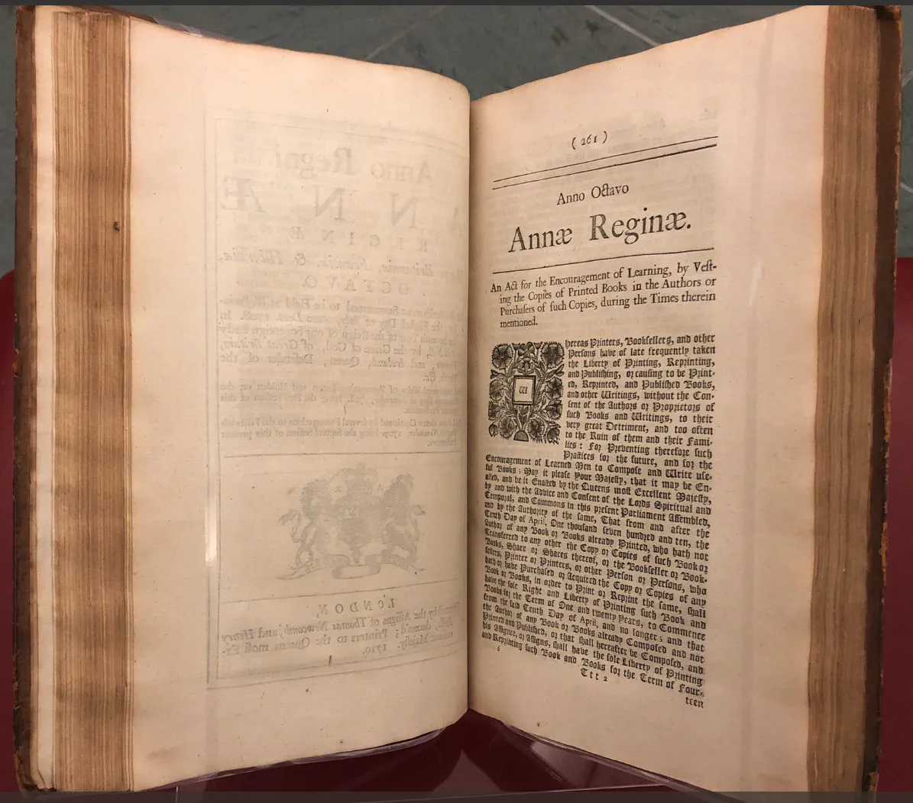

Ở bài viết [Silicon Valley](./silicon-valley), ta đã tìm hiểu được về bản chất và lịch sử hình thành của vùng đất này, nơi mà các công ty công nghệ lớn nhất thế giới được thành lập. Nhưng tại sao các công ty tại Silicon Valley có thể thành công? Những công ty này có thứ gì mà các công ty khác không có?

Đó chính là **tài sản trí tuệ** (intellectual property) hay sở hữu trí tuệ.

Theo Tổ chức Sở hữu trí tuệ thế giới (WIPO), tài sản trí tuệ là những sản phẩm sáng tạo của trí óc – bao gồm mọi thứ từ tác phẩm nghệ thuật đến phát minh, chương trình máy tính đến nhãn hiệu và các dấu hiệu thương mại khác.[^wipo]

Hay nói cách khác, tài sản trí tuệ là những sản phẩm do trí tuệ con người sáng tạo ra, không mang hình thái vật chất cụ thể nhưng lại có giá trị kinh tế to lớn và được pháp luật bảo hộ. Đây được xem là "mỏ vàng" vô hình, là động lực quan trọng cho sự phát triển của các cá nhân, doanh nghiệp và toàn bộ nền kinh tế trong kỷ nguyên số.

Mặc dù đều là "tài sản vô hình", thế giới sở hữu trí tuệ được chia thành nhiều loại hình khác nhau, mỗi loại có luật chơi và mục đích riêng. Hiểu rõ sự khác biệt này là bước đầu tiên để bạn biết mình cần bảo vệ thứ gì và bảo vệ như thế nào. Dưới đây là các loại hình phổ biến nhất:

| Loại                                          | Bảo vệ cái gì?                                                                    | Ví dụ                                                                             | Yêu cầu                                                                                | Thời hạn                                                 |
| :-------------------------------------------- | :-------------------------------------------------------------------------------- | :-------------------------------------------------------------------------------- | :------------------------------------------------------------------------------------- | :------------------------------------------------------- |
| **Bằng sáng chế (Patent)**                    | Phát minh, sáng chế có tính mới, hữu ích và không hiển nhiên.                     | Thuật toán tìm kiếm của Google, công nghệ màn hình của Apple, một loại thuốc mới. | Mới, có trình độ sáng tạo, có khả năng áp dụng công nghiệp. Phải đăng ký và công khai. | Thường là 20 năm kể từ ngày nộp đơn.                     |
| **Bản quyền (Copyright)**                     | Tác phẩm gốc của tác giả (văn học, nghệ thuật, âm nhạc, phần mềm).                | Một bài hát, một cuốn sách, mã nguồn của một ứng dụng, một bức ảnh.               | Có tính nguyên gốc (do bạn tự tạo ra). Tự động hình thành, không cần đăng ký.          | Suốt đời tác giả + 50-70 năm sau khi mất (tùy quốc gia). |
| **Nhãn hiệu (Trademark)**                     | Dấu hiệu (tên, logo, slogan) dùng để phân biệt hàng hóa/dịch vụ.                  | Tên "Apple" và logo quả táo cắn dở, slogan "Just Do It" của Nike.                 | Có khả năng phân biệt, không gây nhầm lẫn. Cần đăng ký để được bảo hộ toàn diện.       | 10 năm và có thể gia hạn vô thời hạn.                    |
| **Kiểu dáng công nghiệp (Industrial Design)** | Hình dáng bên ngoài của sản phẩm (đường nét, hình khối, màu sắc).                 | Thiết kế chai Coca-Cola, kiểu dáng xe Vespa, giao diện một ứng dụng.              | Có tính mới, sáng tạo và có khả năng dùng làm mẫu để chế tạo hàng loạt.                | 5 năm, gia hạn tối đa 2 lần (tổng 15 năm).               |
| **Chỉ dẫn địa lý (Geographical Indication)**  | Dấu hiệu cho biết sản phẩm có nguồn gốc và chất lượng đặc thù từ một vùng địa lý. | Nước mắm Phú Quốc, Vải thiều Lục Ngạn, Rượu Champagne (Pháp).                     | Sản phẩm có danh tiếng, chất lượng đặc thù gắn với khu vực địa lý.                     | Vô thời hạn, miễn là đặc tính được duy trì.              |
| **Bí mật kinh doanh (Trade Secret)**          | Thông tin có giá trị kinh tế được giữ bí mật.                                     | Công thức pha chế Coca-Cola, danh sách khách hàng, quy trình sản xuất đặc thù.    | Có giá trị thương mại, được giữ bí mật bằng các biện pháp cần thiết.                   | Vô thời hạn, miễn là nó còn được giữ bí mật.             |

## Phần 1: Tại sao bạn cần quan tâm đến tài sản trí tuệ?

Bảng so sánh trên đã cho chúng ta một cái nhìn tổng quan về các hình thức khác nhau của sở hữu trí tuệ. Nhưng lý thuyết là một chuyện, thực tế lại là một câu chuyện hoàn toàn khác. Tại sao bạn, một cá nhân đang sống và làm việc trong thế kỷ 21, lại phải thực sự quan tâm đến những khái niệm có vẻ xa vời này?

Có thể bạn đang nghĩ nó là chuyện của các tập đoàn lớn, của những nhà phát minh vĩ đại. Nhưng sự thật là, nó đang hiện diện trong mọi ngóc ngách của cuộc sống số và ảnh hưởng trực tiếp đến bạn, dù bạn là ai.

- Bạn là một **content creator** trên YouTube hay TikTok, dành hàng tuần để lên ý tưởng, quay dựng một video tâm huyết. Một ngày nọ, bạn thấy video của mình bị một kênh khác "xào" lại, thậm chí re-up toàn bộ và bật kiếm tiền. Công sức của bạn đã đi đâu?
- Bạn là **chủ một thương hiệu thời trang online**, tự hào về mẫu thiết kế độc quyền vừa ra mắt. Chỉ vài ngày sau, bạn thấy nó xuất hiện tràn lan trên các sàn thương mại điện tử với giá rẻ bằng một nửa, đi kèm những hình ảnh sản phẩm do chính bạn chụp. Lợi thế cạnh tranh của bạn đã bị đánh cắp.
- Bạn là một **lập trình viên tự do**, xây dựng một module phần mềm thông minh cho khách hàng. Hợp đồng kết thúc, bạn phát hiện họ đã bán lại đoạn code của bạn cho nhiều công ty khác mà không có sự đồng ý hay một đồng chi trả nào. "Chất xám" của bạn đã bị định giá bằng không.

Tất cả những xung đột đó đều xoay quanh một khái niệm cốt lõi: Tài sản trí tuệ.

Đây không phải là thứ gì đó cao siêu, mà chính là "luật chơi" của nền kinh tế sáng tạo. Nó là cơ chế để xã hội công nhận và bảo vệ giá trị của những sản phẩm vô hình – những thứ sinh ra từ trí óc, từ sự sáng tạo của con người.

### Sự khác biệt cốt lõi: Chiếc búa và Ý tưởng

Để hiểu tại sao "luật chơi" này lại cần thiết, hãy thử với một so sánh đơn giản.

Hãy tưởng tượng bạn có một chiếc búa. Đây là tài sản vật chất. Nếu bạn đang dùng nó, người khác phải đợi. Nếu ai đó lấy mất, bạn sẽ mất đi chiếc búa. Tài sản vật chất có tính "cạnh tranh" – việc một người sử dụng sẽ ngăn cản người khác sử dụng.

Bây giờ, hãy tưởng tượng bạn có một ý tưởng: "cách dùng búa để đóng đinh hiệu quả hơn". Bạn có thể chia sẻ ý tưởng này cho hàng ngàn người mà không hề mất đi kiến thức đó. Ý tưởng, hay tri thức, về bản chất là "không cạnh tranh".

Và chính vì đặc tính dễ dàng lan truyền này, tri thức rất dễ bị sao chép và chiếm đoạt. Nếu không có cơ chế bảo vệ, sẽ chẳng ai còn động lực để dành thời gian, tiền bạc và công sức để tạo ra những ý tưởng mới. Tại sao phải phát minh ra một loại thuốc mới nếu bất kỳ ai cũng có thể sao chép công thức ngay ngày hôm sau? Tại sao phải viết một cuốn sách nếu nó sẽ bị in lậu và bán với giá rẻ mạt?

Đó là lý do quyền sở hữu trí tuệ ra đời. Nó tạo ra một sự "khan hiếm nhân tạo" có thời hạn cho các tài sản vô hình, trao cho người sáng tạo độc quyền khai thác thành quả của mình trong một khoảng thời gian nhất định. Đây là phần thưởng cho nỗ lực của họ và là động lực cho sự tiến bộ của toàn xã hội.

### Cuộc chơi định giá của doanh nghiệp

Trong nền kinh tế hiện đại, những công ty giá trị nhất thế giới không nhất thiết sở hữu nhiều nhà máy hay đất đai nhất. Thay vào đó, họ sở hữu những thứ vô hình: những thuật toán, những bản thiết kế, những công thức, và những thương hiệu có sức ảnh hưởng toàn cầu.

Sở hữu trí tuệ chính là công cụ pháp lý có khả năng biến một tia sáng sáng tạo vô hình thành một tài sản hữu hình trên bảng cân đối kế toán. Nó là cây cầu nối giữa thế giới của ý tưởng và thế giới của kinh doanh.

Và đây chính là điểm mấu chốt khi bạn bước vào cuộc chơi lớn.

Hãy hình dung bạn là một doanh nhân. Công ty bạn ăn nên làm ra, và bạn muốn mở rộng quy mô. Bạn cần vay vốn ngân hàng hoặc tìm nhà đầu tư chiến lược. Khi họ ngồi vào bàn đàm phán, họ sẽ định giá công ty bạn dựa vào đâu? Dây chuyền sản xuất? Vài chiếc xe tải? Lượng tiền mặt trong tài khoản? Bất động sản?

Tất cả đều quan trọng, nhưng chúng không phải thứ quyết định. Thứ quyết định giá trị thực sự của doanh nghiệp bạn chính là những tài sản trí tuệ:

- **Thương hiệu** bạn gây dựng có được đăng ký bảo hộ không?
- **Công thức pha chế** độc đáo của bạn có được bảo vệ như một bí mật kinh doanh không?
- **Kiểu dáng sản phẩm** khác biệt của bạn có được đăng ký độc quyền không?
- **Phần mềm quản lý** nội bộ do bạn tự phát triển có thuộc sở hữu của bạn không?

Nếu câu trả lời là "không", thì tất cả những tài sản vô giá đó gần như bằng không trên bàn đàm phán. Đây chính là lúc bạn mất đi lợi thế. Nhà đầu tư có thể nói: "Ý tưởng kinh doanh của anh rất tuyệt, nhưng vì anh không bảo vệ nó nên bất kỳ ai cũng có thể sao chép. Rủi ro quá lớn. Tôi đầu tư 10 tỷ, nhưng tôi cần 60% cổ phần của công ty."

Hãy nhìn vào hai trong số những thương vụ M&A đình đám nhất Việt Nam.

Đầu tiên là "gã khổng lồ" bánh kẹo **Kinh Đô**. Năm 2015, Kinh Đô đã bán 80% mảng kinh doanh bánh kẹo của mình cho tập đoàn Mondelēz International của Mỹ với giá trị gần **370 triệu USD**. Mondelēz không trả số tiền khổng lồ đó để lấy công thức làm bánh trung thu hay nhà xưởng. Họ đang trả tiền cho cái tên "Kinh Đô" – một bảo chứng cho sự lựa chọn hàng đầu của hàng triệu gia đình Việt, cùng với hệ thống phân phối và ngôi vị thống trị thị trường[^kinhdo].

Thứ hai là **Phúc Long**, một thương hiệu trà và cà phê đầy kiêu hãnh. Năm 2022, Tập đoàn Masan hoàn tất việc mua lại hơn 84% cổ phần, định giá toàn bộ chuỗi này ở mức khoảng 450 triệu USD. Masan đã phải thanh toán vào khoảng **280 triệu USD** cho một thương hiệu đang lên, một mô hình kinh doanh F&B thành công và tiềm năng kết hợp với hệ sinh thái bán lẻ của mình[^phuclong].

**Nhưng... có phải là một cái giá quá rẻ?**

Những con số hàng trăm triệu đô la nghe có vẻ khổng lồ. Nhưng khi đặt cạnh các thương vụ quốc tế mà tài sản trí tuệ là trung tâm, một góc nhìn khác sẽ hiện ra.

Năm 2012, Facebook (nay là Meta) mua lại **Instagram** với giá **1 tỷ USD**. Vào thời điểm đó, Instagram chỉ có 13 nhân viên và **0 đồng doanh thu**. Họ không có nhà máy, không có cửa hàng, tài sản duy nhất là một ứng dụng phần mềm và một cộng đồng người dùng đang phát triển[^buyig].

Năm 2009, Disney chi **4 tỷ USD** để mua lại **Marvel Entertainment**. Disney không mua các xưởng phim, họ mua **quyền sở hữu đối với một vũ trụ gồm hơn 5,000 nhân vật** như Iron Man, Captain America... Họ mua bản quyền, một loại tài sản trí tuệ có thể khai thác vĩnh viễn qua phim ảnh, game, công viên, và đồ chơi[^buymarvel].

**Tại sao lại có sự khác biệt khổng lồ này?**

Giá trị của Kinh Đô và Phúc Long chủ yếu đến từ thương hiệu (brand equity) và hệ thống kinh doanh (business model). Đây là những tài sản quý giá, nhưng chúng là loại "tài sản trí tuệ mềm". Thương hiệu có thể bị cạnh tranh, mô hình kinh doanh có thể bị sao chép.

Trong khi đó, giá trị của Instagram nằm ở công nghệ lõi và hiệu ứng mạng lưới (một dạng tài sản về công nghệ). Giá trị của Marvel nằm ở bản quyền nhân vật (copyright) – một pháo đài pháp lý gần như không thể xâm phạm. Đây là "tài sản trí tuệ cứng", có tính độc quyền được pháp luật bảo vệ một cách chặt chẽ trên toàn cầu.

Nhìn ở góc độ này, có thể thấy các thương hiệu Việt, dù rất thành công, đã được định giá quá rẻ. Mức giá đó phản ánh giá trị của một doanh nghiệp đang kinh doanh tốt, nhưng chưa phản ánh được giá trị của một tài sản trí tuệ có khả năng phòng thủ và khai thác độc quyền trên quy mô toàn cầu. Nhà đầu tư quốc tế trả giá cao cho sự độc quyền và khả năng bảo vệ vững chắc, thứ mà nhiều thương hiệu Việt dù lớn mạnh vẫn còn thiếu.

Hiểu về sở hữu trí tuệ không chỉ là để đăng ký một cái tên. Đó là xây dựng một "pháo đài" pháp lý vững chắc quanh tài sản của mình, để khi ngồi vào bàn đàm phán, bạn không chỉ bán một công ty, mà là bán một khối tài sản được định giá đúng với tiềm năng của nó.

Vậy, luật chơi này được hình thành từ đâu? Hãy cùng quay ngược thời gian để khám phá hành trình đó.

## Phần 2: Một ~chút~ về lịch sử

Để hiểu rõ "luật chơi" của nền kinh tế sáng tạo ngày nay, chúng ta cần quay ngược thời gian, khám phá xem ý tưởng về việc "sở hữu" một thứ vô hình đã ra đời như thế nào. Hành trình này không bắt đầu từ những bộ luật cao siêu hay các phòng xử án trang trọng, mà từ những nhu cầu rất đời thường và thực tế.

Nội dung của phần này được tham khảo từ Intellectual Property Rights: A Critical History của Christopher May và Susan K. Sell[^may2005].

### Những tiền thân sơ khai của sở hữu trí tuệ

Ý tưởng về sở hữu trí tuệ có một khởi đầu khá... trần trụi. Nó bắt nguồn từ một trong những tập quán cổ xưa nhất: đánh dấu gia súc. Từ hàng nghìn năm trước, con người đã dùng dấu sắt nung, cắt tai hay đeo thẻ để khẳng định: "Con bò này là của tôi". Đây là cách đơn giản và hiệu quả nhất để xác lập quyền sở hữu và phân biệt tài sản trong một thế giới chưa có giấy tờ.

Tư duy "đánh dấu để sở hữu" này nhanh chóng lan sang các sản phẩm do con người tạo ra. Các nhà khảo cổ đã tìm thấy vô số đồ gốm từ các nền văn minh tiền sử ở châu Âu và châu Á có khắc dấu hiệu của người thợ. Ở Ai Cập và Lưỡng Hà, thợ làm gạch không chỉ khắc tên mình mà còn khắc cả tên của vị vua trị vì. Thợ đẽo đá cũng ghi dấu để tính công.

Đây không chỉ đơn thuần là việc "ký tên" cho vui. Nó là một dạng sơ khai của việc xây dựng thương hiệu và quản lý chất lượng. Một dấu hiệu uy tín có nghĩa là sản phẩm tốt, và ngược lại. Về bản chất, đây chính là phiên bản 1.0 của nhãn hiệu thương mại – một cách để truyền tải thông tin và khẳng định nguồn gốc.

### Những ý tưởng của người Hy Lạp về việc sở hữu ý tưởng

Nhưng từ việc sở hữu một viên gạch đến việc sở hữu một ý tưởng là cả một bước nhảy vọt. Và chính người Hy Lạp cổ đại đã thực hiện bước nhảy vọt này.

Vào thế kỷ VI TCN, các nhà thơ và nghệ sĩ như Simonides đã bắt đầu làm một việc chưa từng có tiền lệ: kiếm sống bằng chính tài năng sáng tạo của mình. Thay vì phụ thuộc vào sự bảo trợ của giới quý tộc, họ tham gia các cuộc thi, biểu diễn có thu phí và biến nghệ thuật thành một nghề độc lập.

Đặc biệt, các nhà Ngụy biện (Sophists) là những người thầy tự do đầu tiên, dạy mọi thứ từ hùng biện đến kỹ năng sống. Họ không bán "kiến thức đóng gói" mà bán phương pháp tư duy. Khi học trò của họ ghi chép và chuyền tay nhau bài giảng, một cuộc tranh cãi đã nổ ra. Một số người cho rằng tri thức đã bị "đánh cắp", nhưng có lẽ chính các Sophists lại xem đó là một hình thức marketing hiệu quả để lan tỏa danh tiếng và thu hút thêm học viên.

Cũng trong thời kỳ này, các nghệ sĩ bắt đầu ký tên lên tác phẩm của mình. Đó không chỉ là một chữ ký, mà là một lời khẳng định: "Tôi đã tạo ra thứ này. Đây là phong cách và tài năng của tôi." Dần dần, thơ ca, âm nhạc và hội họa trở thành những "sản phẩm" có thể trao đổi, mua bán trên thị trường.

### Những phát triển thời La Mã

Nếu người Hy Lạp gieo những mầm mống đầu tiên về giá trị của ý tưởng, thì người La Mã đã bắt đầu xây dựng những cấu trúc thực tế cho nó. Họ tiếp nối truyền thống đánh dấu sản phẩm, nhưng với mục đích kinh doanh rõ ràng hơn: xác nhận đã nộp thuế, đảm bảo chất lượng hàng hóa do nhà nước quản lý, và làm cơ sở để thanh toán.

Đây là một bước tiến quan trọng. Dù chưa có luật về "thương hiệu", nhưng xã hội La Mã đã có luật chống "gian lận". Nếu ai đó bán hàng giả, người mua có thể kiện người bán. Một đạo luật từ năm 81 TCN thậm chí còn cấm dùng tên người khác để trục lợi. Đây chính là những nỗ lực đầu tiên nhằm chống lại hành vi mà ngày nay chúng ta gọi là mạo danh thương hiệu.

Đồng thời, ngành xuất bản sách cũng bùng nổ. Một mô hình kinh doanh mới xuất hiện: tác giả có thể bán quyền sao chép tác phẩm của mình cho người bán sách. Nhà hùng biện nổi tiếng Cicero được cho là đã kiếm tiền từ việc này. Sau khi ông qua đời, người ta còn mua lại quyền phát hành sách của ông – một hình thức sơ khai của việc mua bán và chuyển nhượng bản quyền.

Người La Mã cực kỳ coi trọng công lao sáng tạo. Họ lên án gay gắt hành vi đạo văn (plagiarism), xem việc "ăn cắp" ý tưởng là một nỗi xấu hổ về mặt đạo đức. Sự sáng tạo cá nhân đã được trân trọng, ngay cả khi hệ thống pháp luật phức tạp và tốn kém thời đó chưa thể bảo vệ nó một cách triệt để.

Sau khi Đế chế La Mã sụp đổ, những ý tưởng này không hề biến mất. Một câu chuyện huyền thoại ở Ireland vào thế kỷ VI đã tóm gọn tinh thần đó. Chuyện kể rằng Thánh Columbia đã lén sao chép một cuốn sách kinh. Khi vụ việc được đưa ra xét xử, nhà vua đã phán một câu bất hủ:

_"Mỗi con bò đều có bê của nó, mỗi cuốn sách đều có bản sao của nó."_

Lời phán quyết này mang một thông điệp sâu sắc: bản sao chép thuộc về chủ sở hữu của bản gốc. Dù chỉ là truyền thuyết, nó cho thấy ý thức về việc gắn liền tác phẩm với người tạo ra nó vẫn tồn tại mạnh mẽ, đặt nền móng cho những phát triển sau này.

### Thời Trung Cổ và quyền lực của Phường hội

Bước vào thời Trung Cổ, đặc biệt là giai đoạn gọi là "Thời kỳ Tăm tối", tri thức được bảo tồn trong các tu viện, nhưng quyền lực kinh tế lại nằm trong tay các phường hội (guilds) – tổ chức của những người cùng ngành nghề. Để bảo vệ lợi ích, họ cần một công cụ để kiểm soát chất lượng, loại trừ đối thủ và duy trì giá cả. Công cụ đó chính là nhãn hiệu.

Không giống ngày nay, nhãn hiệu thời kỳ này không đại diện cho danh tiếng cá nhân mà là quyền lực và tiêu chuẩn của cả tập thể. Nó cho phép phường hội xử lý hàng lỗi và trừng phạt kẻ sản xuất hàng giả. Mức độ nghiêm trọng được thể hiện qua luật của Vua Charles V vào thế kỷ 16: những người làm thảm giả có thể bị chặt tay.

Một bước ngoặt quyết định đã diễn ra vào thế kỷ 15. Các phường hội bắt đầu công nhận quyền sáng tạo cá nhân. Năm 1432, phường hội lụa ở Genoa cấm sao chép mẫu thiết kế của người khác. Năm 1474, phường hội len ở Florence lên án việc "ăn cắp mẫu mã".

Việc sử dụng những từ như "gian lận" hay "đánh cắp" cho thấy một sự thay đổi trong tư duy: mẫu thiết kế giờ đây được coi là tài sản cá nhân. Khi tri thức trở thành tài sản riêng, người sáng tạo bắt đầu muốn tự mình hưởng lợi thay vì chia sẻ cho tập thể. Họ tìm đến nhà nước để đăng ký quyền phát minh, khai sinh ra khái niệm bằng sáng chế. Đây chính là sự chuyển đổi cốt lõi, từ sở hữu tập thể của phường hội sang sở hữu trí tuệ của cá nhân, định hình nên luật chơi mà chúng ta biết ngày nay.

### Bằng Sáng Chế Sơ Khai

Trước khi có luật lệ rõ ràng, các vị vua châu Âu thường dùng một công cụ kinh tế mạnh mẽ: đặc quyền (privileges). Để khuyến khích công nghiệp và thu hút nhân tài, nhà vua sẽ ban "đặc ân" độc quyền cho những thợ thủ công mang kỹ thuật mới đến vương quốc của mình, từ làm kính, dệt vải cho đến khai thác mỏ.

Đây là một thỏa thuận đôi bên cùng có lợi. Người thợ được độc quyền kinh doanh trong một thời gian (thường là 14 năm) để bù đắp chi phí và đào tạo người bản địa. Đổi lại, sau khi đặc quyền hết hạn, quốc gia sẽ sở hữu một ngành nghề mới mà không còn phụ thuộc vào nước ngoài.

Tuy nhiên, một bước ngoặt quyết định đã diễn ra ở Florence vào thế kỷ 15. Nhà phát minh Filippo Brunelleschi được cấp độc quyền cho một thiết kế tàu hoàn toàn mới. Điểm khác biệt chí mạng là: ông được bảo hộ vì đã sáng tạo ra thứ chưa từng tồn tại, chứ không phải vì mang công nghệ từ nơi khác đến. Dù con tàu của ông thất bại, nguyên tắc cốt lõi đã ra đời: công khai một ý tưởng mới để đổi lấy sự bảo hộ độc quyền. Nền móng cho bằng sáng chế hiện đại đã được dựng lên.

### Bản quyền sơ khai

Nếu bằng sáng chế sinh ra từ nhu cầu công nghiệp, thì bản quyền lại là "đứa con" của cuộc cách mạng văn hóa do máy in của Gutenberg tạo ra vào thế kỷ 15.

Trước đó, việc sao chép sách là một công việc thủ công tốn kém. Các tác giả như nhà thơ Petrarca có thể tuyên bố chỉ mình ông mới có quyền công bố tác phẩm, và điều đó phần nào hiệu quả nhờ danh tiếng của ông.

Nhưng khi máy in xuất hiện, sách được sản xuất hàng loạt, tạo ra một thị trường khổng lồ và một vấn đề nhức nhối: bất kỳ ai cũng có thể sao chép và bán lại tác phẩm mà một nhà in đã đổ công sức đầu tư. Cuộc chiến "in lậu" bắt đầu.

")

Venice, trung tâm thương mại của châu Âu, đã đi tiên phong trong việc giải quyết vấn đề này. Họ cấp các đặc quyền in ấn, cho phép một nhà in độc quyền xuất bản một tác phẩm hoặc thậm chí một kiểu chữ. Đây chính là tiền thân của bản quyền, sinh ra từ nhu cầu cấp thiết phải bảo vệ thành quả trong một thị trường tri thức đang bùng nổ.

### Khoảnh khắc của Venice: Sở hữu trí tuệ ra đời

Hành trình của chúng ta về nguồn gốc sở hữu trí tuệ cuối cùng cũng đến được trạm quan trọng nhất: thành phố Venice thế kỷ 15. Dù các ý tưởng đã âm ỉ từ trước, chính tại đây, "luật chơi" của sự sáng tạo lần đầu tiên được viết ra một cách chính thức. Venice đã khai sinh ra hệ thống bằng sáng chế (patent) hiện đại đầu tiên trên thế giới, một cuộc cách mạng pháp lý thay đổi mãi mãi cách chúng ta nhìn nhận và bảo vệ tri thức.

Vào ngày 19 tháng 3 năm 1474, Viện nguyên lão Venice đã thông qua **Quy chế Bằng sáng chế Venice** – một văn bản mang tính lịch sử. Về cơ bản, nó đưa ra một "bản hợp đồng xã hội" rõ ràng:

- Phía nhà phát minh: Bạn phải đăng ký và công khai thiết bị mới mà bạn tạo ra.
- Phía xã hội: Để đổi lại, bạn sẽ được độc quyền khai thác phát minh đó trong vòng 10 năm. Bất kỳ ai sao chép mà không có sự đồng ý của bạn sẽ bị phạt tiền và sản phẩm giả mạo sẽ bị phá hủy.
- Điều khoản chung: Nhà nước vẫn có quyền sử dụng phát minh của bạn nếu điều đó cần thiết cho lợi ích cộng đồng.

Đây là một bước tiến vượt bậc. Lần đầu tiên, luật pháp không chỉ thừa nhận công sức của người sáng tạo mà còn khuyến khích họ chia sẻ kiến thức, thay vì giữ nó làm "bí mật kinh doanh" mãi mãi.

Vậy điều gì đã làm cho đạo luật này trở nên đặc biệt? Trước đó, Venice cũng cấp các "privilegi" – một dạng đặc quyền kinh tế. Tuy nhiên, privilegi giống như một đặc ân được ban phát, phụ thuộc vào ý muốn chính trị và thường dùng để phá vỡ thế độc quyền của các phường hội. Nó không phải là một quyền lợi hợp pháp.

Đạo luật 1474 đã thay đổi tất cả. Nó không còn là một sự ban ơn tùy hứng, mà là một quyền lợi pháp lý dựa trên nguyên tắc. Bất kỳ ai, không phân biệt địa vị, miễn là tạo ra một thứ gì đó mới và hữu ích, đều có thể nộp đơn. "Luật chơi" giờ đây đã công bằng và minh bạch hơn.

Môi trường kinh tế sôi động của Venice chính là mảnh đất màu mỡ cho ý tưởng này. Khi các nhà phát minh tài năng bắt đầu tách khỏi sự kiểm soát của phường hội, xã hội cần một cơ chế mới để bảo vệ họ. Đạo luật 1474 chính là câu trả lời, đánh dấu sự dịch chuyển quyền lực từ "sở hữu tập thể" của phường hội sang "tài sản cá nhân" của người sáng tạo.

**Di sản của Venice**

Ban đầu, quy trình cấp bằng sáng chế ở Venice khá đơn giản, gần như không có đơn nào bị từ chối. Chính sự "dễ dãi" này lại biến thành phố thành một thỏi nam châm thu hút các nhà phát minh từ khắp châu Âu. Tuy nhiên, có một yêu cầu quan trọng: phát minh phải chứng minh được tính hữu dụng trong thực tế, nếu không bằng sẽ bị thu hồi.

Khi Venice dần suy tàn, di sản lớn nhất của họ lại không phải là những công trình kiến trúc hay các tuyến đường thương mại. Di sản đó chính là hệ thống bằng sáng chế. Các kỹ sư và nghệ nhân rời Venice đã mang theo tư duy pháp lý này đi khắp châu Âu. Các quốc gia như Pháp và Anh sau đó đã xây dựng hệ thống của riêng mình dựa trên mô hình của Venice.

Venice, bằng tầm nhìn đi trước thời đại, không chỉ phát minh ra cỗ máy, họ đã phát minh ra cách để bảo vệ các nhà phát minh. Họ là những người đầu tiên chính thức công nhận rằng trí tuệ, cũng giống như hàng hóa, có thể được bảo vệ, trao đổi và sở hữu theo luật định.

### Statute of Monopolies (1624): Nước Anh "nâng cấp" luật chơi

Nếu Venice là nơi khai sinh ra ý tưởng, thì nước Anh chính là nơi biến nó thành một "luật chơi" chặt chẽ và có hệ thống. Bước ngoặt đó chính là Statute of Monopolies (Đạo luật về Độc quyền) năm 1624 – văn bản được xem là nền móng của luật bằng sáng chế hiện đại.

Trước đó, việc cấp độc quyền ở Anh là một mớ hỗn độn. Hoàng gia có toàn quyền ban phát đặc ân, nhưng hệ thống này đã bị lạm dụng một cách trắng trợn. Các đặc quyền không chỉ được cấp cho những phát minh thực sự, mà còn cho cả những ngành nghề thông thường như sản xuất muối hay bài tây. Nó biến thành một công cụ kiếm chác cho giới thân cận của nhà vua, bóp nghẹt sự cạnh tranh và gây ra làn sóng phẫn nộ trong giới thương nhân.

Statute of Monopolies ra đời như một cú đấm pháp lý trực diện vào sự lạm dụng quyền lực này. Đạo luật tuyên bố thẳng thừng: mọi hình thức độc quyền đều bất hợp pháp.

Chỉ có một ngoại lệ duy nhất: bằng sáng chế có thời hạn tối đa 14 năm sẽ được cấp cho "người phát minh đầu tiên và đích thực" của một sản phẩm mới. Điều này đã thay đổi cuộc chơi hoàn toàn. Quyền sở hữu trí tuệ không còn là một đặc ân được ban phát tùy hứng, mà trở thành một quyền lợi có điều kiện, được xác lập dựa trên các tiêu chí rõ ràng: mới, hữu ích, và chưa từng được biết đến.

Quan trọng hơn, đạo luật này là một tuyên ngôn về nhà nước pháp quyền. Nó giới hạn quyền lực của nhà vua và khẳng định rằng tài sản trí tuệ, cũng như các tài sản khác, phải được bảo vệ bởi luật pháp công bằng. Cơ chế "đổi sáng tạo lấy bảo hộ có thời hạn" được chính thức hóa, sau đó phát minh sẽ được trả về cho xã hội, trở thành tài sản chung (public domain).

Statute of Monopolies năm 1624 đã định hình cách xã hội hiện đại đối xử với đổi mới: không phải như một đặc ân hiếm hoi, mà là một quyền lợi hợp pháp, gắn liền với trách nhiệm và sự minh bạch.

### Statute of Anne (1710): Khi tác giả bước ra ánh sáng

Gần một thế kỷ sau khi "luật chơi" cho các nhà phát minh được thiết lập, một cuộc cách mạng khác đã nổ ra, lần này là dành cho các nhà văn, nhà thơ. Statute of Anne (Đạo luật của Nữ hoàng Anne) năm 1710 chính là khoảnh khắc lịch sử khi bản quyền (copyright) lần đầu tiên được trao về đúng chủ nhân của nó: tác giả.

Trước đó, thế giới của các tác giả ở Anh khá u ám. Quyền lực nằm trọn trong tay Stationers' Company – một phường hội độc quyền của các nhà in. Tác giả viết xong tác phẩm, bán bản thảo cho nhà in là coi như hết phận sự. Nhà in đăng ký tác phẩm và nắm toàn quyền khai thác vĩnh viễn. Tác giả, về cơ bản, chỉ là người làm thuê trên chính đứa con tinh thần của mình.

Statute of Anne đã đập tan xiềng xích đó. Tên đầy đủ của nó đã nói lên tất cả: "Một đạo luật nhằm Khuyến khích Học thuật, bằng cách trao quyền sở hữu các bản in cho Tác giả..."

Lần đầu tiên, luật pháp xác định:

- Tác giả là chủ sở hữu ban đầu của tác phẩm.
- Họ được hưởng độc quyền trong 14 năm, và có thể gia hạn thêm 14 năm nữa nếu còn sống.
- Sau thời hạn đó, tác phẩm sẽ thuộc về công chúng (public domain), bất kỳ ai cũng có thể sử dụng.

Đây là một sự cân bằng tuyệt vời giữa ba bên: Tác giả (có động lực sáng tạo), Nhà xuất bản (có thời gian khai thác thương mại), và Công chúng (được tiếp cận tri thức một cách tự do sau một thời gian).

Statute of Anne là một cú hích vĩ đại, phản ánh đúng tinh thần của Thời kỳ Khai sáng. Nó công nhận tác phẩm không chỉ là một vật phẩm vật lý (cuốn sách), mà là một tài sản vô hình sinh ra từ trí tuệ. Nó khẳng định rằng người sáng tạo nội dung mới chính là chủ nhân thực sự của tri thức. Đây chính là cột mốc khai sinh ra khái niệm bản quyền hiện đại, làm nền tảng cho việc bảo vệ mọi loại hình sáng tạo, từ sách, nhạc, phim ảnh cho đến phần mềm ngày nay.

### Các quan niệm khác trên thế giới

Hành trình đến đây đã cho thấy "luật chơi" về sở hữu trí tuệ đã được định hình ở Venice và London. Nhưng một câu hỏi lớn vẫn còn đó: Tại sao lại là châu Âu? Tại sao một hệ thống tương tự không ra đời ở những nền văn minh vĩ đại khác, đặc biệt là Trung Quốc – nơi đã phát minh ra kỹ thuật in bằng con chữ rời trước châu Âu đến 500 năm?

Câu trả lời cho thấy sở hữu trí tuệ không phải là một quy luật tự nhiên. Nó là một sản phẩm độc đáo của lịch sử.

- Trong truyền thống Do Thái, khái niệm "đánh cắp ý tưởng" đã có từ rất sớm. Kinh Talmud yêu cầu phải ghi nhận công lao của người khởi xướng ý tưởng. Đây là một sự tôn trọng sâu sắc về mặt đạo đức, nhưng nó không phát triển thành một quyền lợi kinh tế.
- Tại Trung Quốc, dù có công nghệ vượt trội, khái niệm sở hữu cá nhân đối với ý tưởng lại không bén rễ. Lý do sâu xa nằm ở triết học: tư tưởng Nho giáo coi trọng việc kế thừa và sao chép tri thức của cổ nhân như một đức tính. Sáng tạo cá nhân bị xem nhẹ hơn so với việc duy trì truyền thống. Hơn nữa, nghệ thuật thư pháp viết tay được tôn sùng, khiến việc sao chép cơ học bị coi là thiếu giá trị.
- Ở Bali (Indonesia), nghệ thuật bùng nổ rực rỡ nhưng lại hoàn toàn vắng bóng khái niệm tác giả. Sáng tạo được xem là biểu hiện của tư duy tập thể, một hoạt động tâm linh của cộng đồng. Không có sự phân biệt giữa người sáng tạo và xã hội, nên cũng không có nhu cầu phải trao thưởng cho một cá nhân nào.

Những ví dụ này cho thấy, sở hữu trí tuệ không phải là một loài cây có thể tự mọc ở bất cứ đâu. Nó giống như một món ăn phức tạp, đòi hỏi sự kết hợp của ba "nguyên liệu" đặc biệt:

1. Công nghệ: Phải có công nghệ cho phép sao chép hàng loạt một cách dễ dàng (như máy in), tạo ra cả cơ hội và nguy cơ "đánh cắp".
2. Chính trị - Pháp lý: Cần một nhà nước pháp quyền sẵn sàng và đủ mạnh để bảo vệ quyền sở hữu tư nhân.
3. Triết học: Và quan trọng nhất, phải có một thế giới quan tôn vinh vai trò của cá nhân sáng tạo như một người hùng, một động lực cho sự tiến bộ.

Chỉ trong lịch sử của chủ nghĩa tư bản ở châu Âu, cả ba nguyên liệu này mới hội tụ cùng lúc, tạo ra các đạo luật về sở hữu trí tuệ mà chúng ta biết ngày nay.

> Hành trình khám phá nguồn gốc của "luật chơi" đã đưa chúng ta từ Hy Lạp, La Mã, qua những khoảnh khắc lịch sử ở Venice, London và cả những nền văn minh khác. Giờ là lúc chúng ta hạ cánh tại quốc gia đã kế thừa, hoàn thiện và biến những luật lệ này thành động cơ cho nền kinh tế sáng tạo hùng mạnh nhất thế giới.
>
> Hãy cùng đến với phần tiếp theo: Sở hữu trí tuệ tại Hoa Kỳ.

## Phần 3: Sở hữu trí tuệ tại Hoa Kỳ

Khác với châu Âu – nơi sở hữu trí tuệ nảy mầm từ các phường hội và nhà in – ở Hoa Kỳ, nó không chỉ là luật, mà là một lời tuyên ngôn được khắc ghi ngay từ ngày lập quốc.

Ngay trong bản Hiến pháp năm 1787, các Nhà Lập quốc đã dành riêng một điều khoản để trao cho Quốc hội quyền:

_"Thúc đẩy sự tiến bộ của Khoa học và các ngành Nghệ thuật hữu ích, bằng cách bảo hộ độc quyền trong một thời gian nhất định cho các Tác giả và Nhà phát minh đối với những Tác phẩm và Phát minh của họ."_

Hoa Kỳ đã trở thành quốc gia đầu tiên trên thế giới đưa quyền sở hữu trí tuệ vào hiến pháp. Đây không chỉ là một công cụ kinh tế, mà là một phần của nền dân chủ. Tầm nhìn của họ rất rõ ràng: sở hữu trí tuệ phải là phần thưởng cho nỗ lực cá nhân, chứ không phải đặc quyền dành cho giới tinh hoa.

Trong bài phát biểu thường niên đầu tiên trước Quốc hội năm 1790, George Washington đã nhấn mạnh sự cấp thiết của việc "khuyến khích một cách hiệu quả cho sự ra đời của các phát minh mới và hữu ích."

Hệ thống của Hoa Kỳ được định hình bởi hai triết lý lớn:

- Bản hợp đồng lớn xã hội (Social Contract): Nhà phát minh công khai bí quyết của mình cho xã hội. Để đổi lại, xã hội trao cho họ quyền độc quyền khai thác trong một thời gian nhất định.
- Quyền tự nhiên (Natural Rights): Một ý tưởng, một tác phẩm là phần "máu thịt" của người tạo ra nó. Do đó, họ có quyền sở hữu tự nhiên đối với "đứa con tinh thần" đó.

Hai luồng tư tưởng này hội tụ, tạo nên một cơ chế hoàn hảo: độc quyền có thời hạn, sau đó phát minh sẽ trở thành tài sản chung (public domain). Chính từ patent (bằng sáng chế), có gốc Latin là patere nghĩa là "mở ra," đã thể hiện rõ mục tiêu này: công khai tri thức để tất cả cùng tiến bộ.

Abraham Lincoln – vị tổng thống duy nhất từng được cấp bằng sáng chế ([số 6469](https://patents.google.com/patent/US6469)) – đã gọi hệ thống này là cách "tiếp thêm nhiên liệu lợi ích vào ngọn lửa thiên tài."

Lý thuyết này đã được chứng minh bằng thực tế. Trong một thế giới không có bằng sáng chế, các nhà phát minh sẽ giữ khư khư bí mật của mình. Nhưng trong thế giới có bảo hộ, họ sẵn sàng quảng bá, chia sẻ và cấp phép. Chính điều đó đã tạo ra một dòng chảy tri thức khổng lồ, thúc đẩy vòng quay đổi mới[^iv].

Điều này không chỉ đúng trong lịch sử. Một khảo sát năm 2006 cho thấy một con số đáng kinh ngạc: 88% doanh nghiệp tại Mỹ, châu Âu và Nhật Bản sử dụng thông tin từ các bằng sáng chế đã công bố để định hướng cho hoạt động R&D của mình[^v].

Thomas Edison là minh chứng vĩ đại nhất cho sức mạnh của hệ thống này. Nhiều người lầm tưởng rằng bằng sáng chế của ông về bóng đèn ([US223,898](https://patents.google.com/patent/US223898?oq=No.%2b223%2c898)) đã bóp nghẹt sự cạnh tranh.

Sự thật thì ngược lại. Một nghiên cứu năm 2012 chỉ ra rằng, việc công khai bằng sáng chế của Edison đã kích thích một làn sóng sáng tạo kế thừa, tạo ra những công nghệ nền tảng cho thế kỷ 20 như cuộn Tesla, dây tóc vonfram và đèn huỳnh quang[^vii].

Bằng sáng chế không phải là một bức tường, mà là một bậc thang. Nó cho phép người đi sau đứng trên vai những người khổng lồ để nhìn xa hơn.

### Bản quyền tại Hoa Kỳ

Bên cạnh các nhà phát minh, Hiến pháp Hoa Kỳ cũng dành sự bảo hộ đặc biệt cho các nhà sáng tạo nội dung – từ nhà văn, nhạc sĩ, đến các lập trình viên. Tuy nhiên, cách tiếp cận dành cho bản quyền (copyright) có một điểm khác biệt mang tính cách mạng.

Khác với bằng sáng chế đòi hỏi quy trình đăng ký và thẩm định khắt khe, bản quyền **hình thành một cách tự động**. Khoảnh khắc bạn viết xong một đoạn văn, vẽ một bức tranh, hay lập trình một dòng code, bản quyền đã tự động ra đời. Bạn không cần nộp đơn để có bản quyền, nhưng bạn cần đăng ký để có thể khởi kiện và bảo vệ nó trước tòa.

Tấm khiên này bảo vệ một phạm vi rất rộng: từ sách, nhạc, phim ảnh, cho tới các bản thiết kế kiến trúc và phần mềm máy tính. Thời hạn bảo hộ cũng vô cùng dài, thường là suốt đời tác giả cộng thêm 70 năm.

Nếu luật bằng sáng chế vận hành tương đối ổn định, thì bản quyền là mặt trận đầu tiên hứng chịu cơn bão công nghệ mang tên Internet. Âm nhạc, phim ảnh, sách, phần mềm – tất cả những tài sản trí tuệ trị giá hàng tỷ đô la bỗng chốc có thể bị sao chép và phân phối chỉ bằng một cú nhấp chuột.

Điều này đã châm ngòi cho một cuộc tranh luận toàn cầu không hồi kết về sự cân bằng mong manh giữa bảo hộ và quyền tiếp cận – giữa lợi ích của người sáng tạo và văn hóa chia sẻ của cộng đồng mạng.

Cuộc chiến đó vẫn đang tiếp diễn. Nhưng dù công nghệ có thay đổi ra sao, triết lý nền tảng của hệ thống sở hữu trí tuệ Hoa Kỳ vẫn không đổi, như một lời nhắc nhở từ các Nhà Lập quốc:

_**Một xã hội muốn phát triển bền vững thì phải bảo vệ những người sáng tạo – vì chính họ là người đang thắp lên ngọn lửa cho tương lai.**_

### Silicon Valley và sở hữu trí tuệ: Tài sản của tương lai

Nếu Hiến pháp Mỹ là lời cam kết, thì Silicon Valley chính là nơi lời cam kết đó được đẩy đến giới hạn cao nhất. Tại thung lũng Bắc California này, đất đai hay nhà máy không còn là tài sản quyết định. **Thứ tiền tệ cốt lõi** của nền kinh tế chính là những thứ vô hình: mã nguồn, thuật toán, thiết kế chip, và các mô hình học máy.

Ở đây, sở hữu trí tuệ không chỉ là một công cụ pháp lý. Nó là vũ khí cạnh tranh, là tài sản chiến lược, và là pháo đài bảo vệ những đế chế công nghệ.

import Chart from "./patent_registrations_chart.html";

  <Chart />
  
Source: siliconvalleyindicators.org

Các tập đoàn như Apple, Google, Meta, hay NVIDIA đều sở hữu hàng ngàn bằng sáng chế. Những "kho vũ khí" vô hình này giúp họ bảo vệ thị phần, thu hút đầu tư, và quan trọng nhất, ngăn chặn sự sao chép từ đối thủ.

Nó cũng là bệ phóng biến một startup trong garage thành một gã khổng lồ. Khi các quỹ đầu tư mạo hiểm (VC) đánh giá một công ty khởi nghiệp, họ không chỉ nhìn vào sản phẩm, mà còn soi rất kỹ hồ sơ sở hữu trí tuệ: startup này có công nghệ lõi độc quyền không? Có khả năng tự vệ trước các vụ kiện không? Một bằng sáng chế đúng thời điểm có thể định đoạt sự sống còn.

### Patent wars

Từ đầu thập niên 2010, Silicon Valley trở thành một trận địa với các "cuộc chiến bằng sáng chế" (patent wars). Trận đánh nổi tiếng nhất chính là vụ kiện lịch sử giữa Apple và Samsung, nơi Apple cáo buộc Samsung sao chép trắng trợn thiết kế và giao diện của iPhone.

Khoản bồi thường hơn 1 tỷ USD mà Apple thắng kiện không chỉ là tiền, nó là một thông điệp đanh thép về giá trị của thiết kế và sự độc đáo[^applesamsum]. Kể từ đó, bằng sáng chế trở thành lá chắn, con bài mặc cả, và vũ khí chiến lược. Google từng chi 12.5 tỷ USD mua lại Motorola Mobility, không phải để làm điện thoại, mà để sở hữu kho vũ khí 17.000 bằng sáng chế nhằm bảo vệ Android[^googlebuy].

Tuy nhiên, hệ thống này không phải lúc nào cũng công bằng. Khi các công ty lớn đăng ký bảo hộ cả những ý tưởng rất rộng hoặc hiển nhiên, nó tạo ra một bãi mìn pháp lý cho các startup. Nhiều nhà sáng lập trẻ phàn nàn rằng sân chơi này đang ưu tiên **ai có nhiều luật sư hơn là ai có ý tưởng tốt hơn**.

Tệ hơn nữa là sự xuất hiện của các "patent trolls" – những công ty không sản xuất gì, chỉ sống bằng việc mua lại các bằng sáng chế cũ rồi đi kiện các công ty khác để kiếm tiền.

### Làn sóng ngược dòng

Nhưng cũng chính từ Silicon Valley, một triết lý ngược dòng đã trỗi dậy mạnh mẽ: phần mềm nguồn mở (open source).

Các gã khổng lồ như Google, Meta, và các tổ chức như Hugging Face nhận ra rằng, trong nhiều trường hợp, đổi mới mở tạo ra giá trị lâu dài lớn hơn độc quyền ngắn hạn.

Hàng triệu dòng mã được chia sẻ miễn phí trên GitHub. Các thư viện nền tảng như TensorFlow (của Google) hay PyTorch (của Meta) được phát hành mở, cho phép cả thế giới sử dụng và cải tiến. Làn sóng các mô hình AI nguồn mở như LLaMA hay Mistral đã đẩy nhanh tốc độ phát triển của toàn ngành một cách chóng mặt[^opensourcellm].

Điều này dẫn đến một chiến lược "hai mang" (dual-track) ngày càng phổ biến:

- Giữ: Những gì là công nghệ lõi, là lợi thế cạnh tranh cốt lõi (thuật toán tìm kiếm của Google, thiết kế chip của Apple) vẫn được bảo hộ nghiêm ngặt.
- Mở: Những gì là nền tảng (framework, công cụ) thì được mở ra để xây dựng cộng đồng, thu hút tài năng và tạo ra một hệ sinh thái xung quanh sản phẩm lõi.

Đó chính là tư duy sở hữu trí tuệ của thế kỷ 21. Bài toán không còn là "độc quyền hay mở", mà là một lựa chọn chiến lược tinh vi: mở cái gì và giữ cái gì, để vừa phát triển thần tốc, vừa giữ vững lợi thế trong một thế giới không ngừng biến đổi.

## Phần 4: Sở hữu Trí tuệ tại Việt Nam

### Nền móng ban đầu và Di sản Lịch sử

Trong xã hội Việt Nam thời kỳ phong kiến, dù chưa tồn tại một hệ thống pháp luật về SHTT theo khái niệm hiện đại, các hình thức bảo hộ sơ khai đối với tri thức và sự sáng tạo đã manh nha hình thành và vận hành thông qua các cơ chế xã hội phi chính thức. Sự tồn tại và phát triển của các làng nghề thủ công truyền thống là minh chứng rõ nét nhất cho điều này. Các làng nghề chuyên biệt về đan lát mây tre, điêu khắc gỗ, làm gốm sứ, dệt vải, hay đúc đồng đã hình thành và phát triển thịnh vượng, trở thành những trung tâm sản xuất thu hút nhiều thợ thủ công tài giỏi.

Cơ chế bảo hộ trong giai đoạn này không dựa trên các văn bản pháp lý do triều đình ban hành mà vận hành ngầm trong cấu trúc xã hội, có thể được xem như một dạng "quyền sở hữu trí tuệ xã hội" thay vì "quyền sở hữu trí tuệ pháp lý". Sự bảo hộ này được thực thi thông qua ba hình thức chính:

- **Bí mật nghề nghiệp**: Các bí quyết kỹ thuật, công thức, hay kỹ năng đặc biệt (know-how) được coi là tài sản quý giá nhất của một gia đình hoặc dòng họ làm nghề. Chúng được bảo vệ nghiêm ngặt và chỉ truyền thụ cho con cháu trong nhà hoặc những người học trò được tin tưởng nhất. Cơ chế này đảm bảo duy trì lợi thế cạnh tranh và tính độc đáo của sản phẩm.
- **Uy tín và thương hiệu làng nghề**: Danh tiếng của một làng nghề, chẳng hạn như gốm Bát Tràng, lụa Vạn Phúc, hay tranh Đông Hồ, tự nó đã đóng vai trò như một dạng "chỉ dẫn địa lý" hoặc "nhãn hiệu tập thể" sơ khai. Uy tín này được xây dựng qua nhiều thế hệ và được cộng đồng người tiêu dùng công nhận, gắn liền với chất lượng và nguồn gốc xuất xứ của sản phẩm.
- **Cơ chế phường hội**: Các phường, hội của những người cùng làm một nghề đã thiết lập những quy ước (lệ làng, hương ước) để điều chỉnh hoạt động sản xuất, duy trì tiêu chuẩn chất lượng và đôi khi là ngăn chặn sự sao chép hoặc cạnh tranh không lành mạnh trong nội bộ cộng đồng.

Như vậy, trước khi có sự du nhập của luật pháp phương Tây, xã hội Việt Nam đã có những phương thức riêng để công nhận và bảo vệ giá trị của sự sáng tạo và tri thức kỹ thuật. Các cơ chế này dựa trên nền tảng của lòng tin, quy ước cộng đồng và sự kiểm soát xã hội, chứ không phải là quyền độc quyền được pháp luật thành văn trao cho. Đây là một hình thái "IP xã hội" tiền hiện đại, phản ánh cấu trúc kinh tế-xã hội đặc thù của thời kỳ đó.

### Hệ thống Pháp luật Sở hữu Trí tuệ thời Pháp thuộc (1887-1954)

Giai đoạn Pháp thuộc đánh dấu lần đầu tiên Việt Nam tiếp xúc và được đặt trong một hệ thống pháp luật SHTT chính thức, được pháp điển hóa theo mô hình của luật pháp Pháp. Một cột mốc quan trọng là việc Việt Nam, với tư cách là một phần của Liên bang Đông Dương, đã được Pháp cho gia nhập Công ước Paris về bảo hộ Sở hữu công nghiệp từ ngày 08/03/1949[^ipvietnam].

Hệ thống pháp luật này được áp dụng theo nguyên tắc lãnh thổ, một trong những nguyên tắc cơ bản của pháp luật SHTT quốc tế. Điều này có nghĩa là các quyền SHTT như sáng chế, nhãn hiệu, kiểu dáng công nghiệp được đăng ký và bảo hộ theo luật pháp của chính quốc (Pháp) và có hiệu lực pháp lý trên lãnh thổ Đông Dương.

Việc du nhập hệ thống pháp luật SHTT của Pháp không phải là một quá trình phát triển tự thân từ nhu cầu của xã hội Việt Nam, mà là một sự áp đặt từ chính quyền thực dân. Điều này đã tạo ra một hệ thống pháp lý song song và có phần xa lạ với thực tiễn bản địa. Một mặt, hệ thống pháp luật chính thức này chủ yếu phục vụ cho lợi ích thương mại của các công ty và cá nhân người Pháp hoặc châu Âu đang kinh doanh tại thuộc địa. Mặt khác, hệ thống "bảo hộ xã hội" phi chính thức của người Việt, dựa trên bí quyết gia truyền và uy tín làng nghề, vẫn tiếp tục tồn tại và vận hành trong các cộng đồng địa phương.

Di sản của giai đoạn này không chỉ dừng lại ở việc giới thiệu các khái niệm pháp lý hiện đại về SHTT mà còn sâu sắc hơn. Nó đã đặt nền móng cho tư duy pháp lý theo truyền thống Dân luật (Civil Law) trong lĩnh vực này, một ảnh hưởng có thể đã định hình cách các nhà lập pháp Việt Nam xây dựng hệ thống pháp luật SHTT sau này, ngay cả khi bối cảnh chính trị và hệ tư tưởng đã thay đổi hoàn toàn.

### Giai đoạn Kinh tế Kế hoạch hóa và những Quy định Sơ khởi (1954-1986)

Sau năm 1954, miền Bắc Việt Nam bắt đầu xây dựng một mô hình kinh tế hoàn toàn mới: kinh tế kế hoạch hóa tập trung theo định hướng xã hội chủ nghĩa. Trong mô hình này, nhà nước nắm giữ quyền sở hữu đối với toàn bộ tư liệu sản xuất và các nguồn lực kinh tế trọng yếu. Bối cảnh này đã định hình một cách sâu sắc quan niệm về sở hữu trí tuệ. Khái niệm sở hữu tư nhân đối với các tài sản có giá trị kinh tế lớn, bao gồm cả tài sản trí tuệ, về cơ bản không tồn tại.

Hệ thống pháp luật SHTT của Việt Nam trong giai đoạn này chịu ảnh hưởng rõ rệt từ mô hình pháp lý của Liên Xô và các nước xã hội chủ nghĩa Đông Âu. Mục tiêu tối cao của mọi hoạt động sáng tạo, cải tiến kỹ thuật là để phục vụ lợi ích của tập thể, hoàn thành các chỉ tiêu do nhà nước đề ra, và góp phần xây dựng đất nước, chứ không phải để tạo ra lợi nhuận cho cá nhân hay doanh nghiệp. Do đó, pháp luật không nhằm tạo ra độc quyền thương mại mà chủ yếu để ghi nhận công lao và khuyến khích phong trào thi đua lao động sản xuất[^ipvietnam2].

Phản ánh đúng bối cảnh kinh tế-xã hội nêu trên, các văn bản pháp lý đầu tiên về SHTT đã được ban hành. Văn bản mang tính nền tảng và tiêu biểu nhất cho thời kỳ này là **Điều lệ về sáng kiến, cải tiến kỹ thuật - hợp lý hóa sản xuất và sáng chế**, ban hành kèm theo Nghị định số 31/CP ngày 23/01/1981 của Hội đồng Bộ trưởng. Tiếp sau đó là một loạt các văn bản dưới luật khác như Điều lệ về Nhãn hiệu hàng hóa (1982), Điều lệ về Quyền tác giả (1986), Điều lệ về Giải pháp hữu ích (1988), và Điều lệ về Kiểu dáng công nghiệp (1988).

Một đặc điểm cốt lõi của các quy định này là sự phân biệt rõ ràng giữa quyền nhân thân và quyền tài sản, trong đó pháp luật tập trung bảo hộ "quyền tinh thần" (quyền nhân thân) của người sáng tạo hơn là "quyền sở hữu" (quyền tài sản). Thay vì cấp "bằng độc quyền sáng chế" như ở các nước tư bản, nhà nước Việt Nam áp dụng hình thức "bằng tác giả sáng chế" (author's certificate). Theo cơ chế này:

- **Quyền nhân thân** của người sáng tạo được ghi nhận. Họ có quyền được đứng tên là tác giả của sáng chế trong văn bằng và các tài liệu liên quan.
- **Quyền tài sản (quyền khai thác, sử dụng)** không thuộc về người sáng tạo mà thuộc về nhà nước. Nhà nước có toàn quyền quyết định việc áp dụng sáng chế đó tại bất kỳ xí nghiệp quốc doanh nào mà không cần sự cho phép của tác giả.
- **Người sáng tạo** được nhà nước thưởng một khoản tiền hoặc hưởng một số lợi ích vật chất khác như một sự ghi nhận công lao, nhưng họ không có quyền ngăn cấm người khác sử dụng hay chuyển giao sáng chế của mình để thu lợi nhuận.

Cách tiếp cận này cho thấy rõ bản chất của hệ thống SHTT thời kỳ này. Nó không được coi là một quyền tài sản tư nhân có thể tự do mua bán, chuyển nhượng trên thị trường. Thay vào đó, nó được xem như một công cụ quản lý của nhà nước, một phương tiện để điều hành và thúc đẩy hoạt động khoa học kỹ thuật trong nền kinh tế kế hoạch hóa. Pháp luật SHTT lúc này thực chất là một nhánh của luật hành chính-kinh tế, phục vụ các mục tiêu chính sách công của nhà nước.

Trong bối cảnh đó, việc thành lập **Cục Sáng chế** vào ngày 29/07/1982 theo Nghị định số 125/HĐBT của Hội đồng Bộ trưởng là một sự kiện có ý nghĩa đặc biệt quan trọng. Cục Sáng chế, tiền thân của Cục Sở hữu trí tuệ ngày nay, được thành lập trên cơ sở tổ chức lại Phòng Sáng chế phát minh thuộc Ủy ban Khoa học và Kỹ thuật Nhà nước, trở thành cơ quan chuyên trách độc lập đầu tiên về sở hữu công nghiệp tại Việt Nam.[^ipvietnam3]

Sự ra đời của Cục Sáng chế vào năm 1982, bốn năm trước khi chính sách Đổi Mới được chính thức khởi xướng, là một bước đi nhìn xa trông rộng. Nó cho thấy một tầm nhìn vượt trước cả công cuộc cải cách kinh tế toàn diện. Trong khi nền kinh tế còn khép kín, việc thiết lập một cơ quan chuyên trách về sáng chế theo mô hình quốc tế (dù nội dung bảo hộ vẫn theo mô hình Xô Viết) đã thể hiện một nhận thức sớm về tầm quan trọng của việc quản lý khoa học kỹ thuật một cách có hệ thống và sự cần thiết phải có một đầu mối để tương tác với thế giới bên ngoài. Việt Nam đã tham gia Tổ chức Sở hữu trí tuệ Thế giới (WIPO) từ năm 1976 , và việc thành lập Cục Sáng chế là một bước đi cụ thể hóa ý định hội nhập đó.[^ipvietnam3]

Cơ quan này không chỉ là sản phẩm của thời đại kinh tế kế hoạch hóa mà còn đóng vai trò là hạt nhân, chuẩn bị về mặt thể chế, con người và cơ sở dữ liệu cho sự chuyển đổi sang kinh tế thị trường và hội nhập quốc tế sâu rộng trong các giai đoạn sau này.

### Thời kỳ Đổi Mới (1986-2005)

Đại hội Đảng toàn quốc lần thứ VI năm 1986 đã khởi xướng công cuộc Đổi Mới, đánh dấu một bước ngoặt lịch sử cho Việt Nam. Nền kinh tế bắt đầu chuyển đổi từ mô hình kế hoạch hóa tập trung, bao cấp sang nền kinh tế hàng hóa nhiều thành phần, vận hành theo cơ chế thị trường có sự quản lý của Nhà nước, theo định hướng xã hội chủ nghĩa. Sự thay đổi căn bản về tư duy kinh tế này đã tạo ra một áp lực và nhu cầu cấp bách phải cải cách toàn diện hệ thống pháp luật, trong đó có pháp luật về SHTT.

Sự trỗi dậy của khu vực kinh tế tư nhân, chính sách mở cửa thu hút đầu tư trực tiếp nước ngoài (FDI), và việc khuyến khích hoạt động thương mại đã làm nảy sinh yêu cầu tất yếu phải thừa nhận và bảo vệ quyền sở hữu tư nhân một cách hiệu quả. Đối với các nhà đầu tư nước ngoài, một hệ thống bảo hộ SHTT đáng tin cậy là điều kiện tiên quyết để họ đưa công nghệ, thương hiệu và vốn vào thị trường Việt Nam. Đối với các doanh nghiệp trong nước, việc bảo hộ nhãn hiệu, kiểu dáng công nghiệp là công cụ sống còn để xây dựng vị thế và cạnh tranh. Do đó, hệ thống SHTT dựa trên "bằng tác giả sáng chế" và quyền sở hữu nhà nước đã trở nên lỗi thời và không còn phù hợp.

Để đáp ứng yêu cầu của thực tiễn, một loạt văn bản pháp luật mang tính đột phá đã được ban hành, tạo nên sự chuyển đổi về chất cho toàn bộ hệ thống SHTT.

**Pháp lệnh Bảo hộ Quyền Sở hữu công nghiệp**, được Hội đồng Nhà nước thông qua ngày 28/01/1989, được xem là một "bước ngoặt lớn" và là văn bản quan trọng nhất của thời kỳ này. Pháp lệnh này đã đặt nền móng vững chắc cho việc bảo hộ các đối tượng sở hữu công nghiệp theo cơ chế thị trường, bao gồm sáng chế, giải pháp hữu ích, kiểu dáng công nghiệp và nhãn hiệu hàng hóa. Điểm cải cách mang tính cách mạng và sâu sắc nhất của Pháp lệnh 1989 là **bãi bỏ hoàn toàn hình thức "bằng tác giả sáng chế" và chỉ còn duy nhất hình thức "bằng độc quyền sáng chế"**.

Sự thay đổi này không đơn thuần là về mặt thuật ngữ pháp lý, mà nó đánh dấu một sự chuyển đổi căn bản về hệ tư tưởng - từ "sở hữu nhà nước" sang "sở hữu tư nhân" trong lĩnh vực sáng tạo công nghiệp. Khái niệm "độc quyền" đã chính thức được thừa nhận, trao cho chủ sở hữu văn bằng bảo hộ những quyền tài sản thực sự: quyền độc quyền khai thác, sử dụng; quyền cho phép người khác sử dụng thông qua hợp đồng li-xăng; và quan trọng nhất là quyền ngăn cấm mọi hành vi sử dụng trái phép. Đây là sự công nhận vai trò trung tâm của cá nhân và doanh nghiệp với tư cách là chủ thể sở hữu tài sản, một điều kiện tiên quyết cho sự vận hành của kinh tế thị trường. Pháp lệnh 1989, do đó, không chỉ là một văn bản pháp luật mà còn là một tuyên ngôn về sự thay đổi mô hình kinh tế của Việt Nam.

Tiếp nối thành công đó, Pháp lệnh về bảo hộ Quyền tác giả năm 1994 được ban hành, đã nâng cao đáng kể mức độ và phạm vi bảo hộ đối với các tác phẩm văn học, nghệ thuật và khoa học, thay thế cho các quy định còn sơ sài trước đó.

Một bước tiến quan trọng nữa trong việc củng cố nền tảng pháp lý cho SHTT là việc đưa các quy định này vào các bộ luật gốc của hệ thống pháp luật. **Bộ luật Dân sự năm 1995** (có hiệu lực từ ngày 01/07/1996) đã dành một phần riêng (Phần thứ sáu) để quy định về quyền SHTT và chuyển giao công nghệ. Bộ luật này đã "hệ thống hóa" và thay thế các quy định pháp lý còn nằm rải rác trước đó, bao gồm cả Pháp lệnh năm 1989 và Pháp lệnh năm 1994.

Việc tích hợp các quy định về SHTT vào Bộ luật Dân sự - bộ luật được coi là "luật chung" điều chỉnh các quan hệ tài sản và nhân thân - đã chính thức khẳng định quyền SHTT là một loại quyền dân sự, một dạng tài sản, có vị thế pháp lý ngang hàng với các loại tài sản hữu hình khác như nhà cửa, đất đai. Điều này đã hoàn tất quá trình chuyển đổi SHTT từ một công cụ quản lý hành chính của nhà nước thành một quyền tài sản cơ bản của công dân và tổ chức. Nó tạo ra một cơ chế bảo vệ vững chắc hơn, cho phép các chủ thể quyền khởi kiện ra tòa án dân sự để yêu cầu bồi thường thiệt hại, bên cạnh các biện pháp xử lý hành chính.

Nền tảng này tiếp tục được củng cố trong Bộ luật Dân sự năm 2005, trong đó các quy định chung về SHTT được giữ lại và các đối tượng bảo hộ được mở rộng để bao gồm cả thiết kế bố trí mạch tích hợp bán dẫn, bí mật thương mại và chỉ dẫn địa lý. Sự pháp điển hóa này đã tạo ra một hành lang pháp lý ổn định, minh bạch và đáng tin cậy, là bước đệm không thể thiếu cho các cuộc đàm phán thương mại quan trọng sau này, đặc biệt là Hiệp định Thương mại Việt Nam - Hoa Kỳ (BTA) và quá trình gia nhập Tổ chức Thương mại Thế giới (WTO).

### Hội nhập Quốc tế và sự ra đời của Luật Sở hữu trí tuệ (2005-nay)

Bước sang thế kỷ 21, động lực chính cho việc cải cách và hoàn thiện pháp luật SHTT của Việt Nam đã có sự chuyển dịch rõ rệt. Nếu trong giai đoạn Đổi Mới, cải cách chủ yếu xuất phát từ nhu cầu nội tại của việc chuyển đổi mô hình kinh tế, thì trong giai đoạn này, các cam kết và áp lực từ quá trình **hội nhập kinh tế quốc tế** đã trở thành động lực hàng đầu.

Cột mốc quan trọng nhất là quá trình đàm phán gia nhập Tổ chức Thương mại Thế giới (WTO). Một trong những điều kiện tiên quyết để trở thành thành viên WTO là phải tuân thủ **Hiệp định về các khía cạnh liên quan đến thương mại của quyền sở hữu trí tuệ (TRIPS)**. Hiệp định TRIPS thiết lập các tiêu chuẩn tối thiểu về việc bảo hộ và thực thi quyền SHTT mà tất cả các quốc gia thành viên phải đáp ứng. Vào thời điểm đó, hệ thống pháp luật SHTT của Việt Nam, dù đã có những bước tiến lớn, vẫn còn nằm rải rác trong nhiều văn bản khác nhau và chưa hoàn toàn tương thích với các yêu cầu của TRIPS. Do đó, việc xây dựng một đạo luật SHTT thống nhất, toàn diện và phù hợp với chuẩn mực quốc tế đã trở thành một nhiệm vụ cấp bách[^ipvietnam4].

Sau khi gia nhập WTO vào năm 2007 Việt Nam tiếp tục tham gia vào một loạt các **Hiệp định Thương mại Tự do (FTA) thế hệ mới**, như Hiệp định Đối tác Toàn diện và Tiến bộ xuyên Thái Bình Dương (CPTPP) và Hiệp định Thương mại Tự do Việt Nam - EU (EVFTA). Các hiệp định này không chỉ dừng lại ở các tiêu chuẩn của TRIPS mà còn đặt ra các yêu cầu bảo hộ cao hơn, sâu rộng hơn, thường được gọi là các cam kết "TRIPS-plus". Các cam kết này bao trùm nhiều lĩnh vực phức tạp như bảo hộ dữ liệu thử nghiệm dược phẩm, kéo dài thời hạn bảo hộ quyền tác giả, và các biện pháp thực thi mạnh mẽ hơn trong môi trường số.

Quá trình này cho thấy pháp luật SHTT Việt Nam hiện đại là một sản phẩm điển hình của sự "nội luật hóa" các tiêu chuẩn quốc tế. Đây là kết quả của một sự đánh đổi chiến lược: Việt Nam chấp nhận áp dụng các tiêu chuẩn bảo hộ SHTT cao hơn và khắt khe hơn để đổi lấy quyền tiếp cận các thị trường xuất khẩu lớn, thu hút đầu tư nước ngoài và tham gia sâu hơn vào chuỗi giá trị toàn cầu. Chính sách thương mại và đối ngoại đã trở thành một trong những động lực chính định hình chính sách pháp luật SHTT của quốc gia.

**Luật Sở hữu trí tuệ 2005 và các lần sửa đổi liên tục**

Đáp ứng yêu cầu của hội nhập, Quốc hội Việt Nam đã ban hành Luật Sở hữu trí tuệ số 50/2005/QH11, có hiệu lực từ ngày 01/07/2006. Đây là văn bản pháp luật đầu tiên thống nhất, pháp điển hóa một cách toàn diện hầu hết các quy định về SHTT, từ quyền tác giả, quyền liên quan đến quyền sở hữu công nghiệp và quyền đối với giống cây trồng, vào trong một đạo luật duy nhất. Sự ra đời của Luật SHTT 2005 đã tạo ra một bộ khung pháp lý vững chắc, minh bạch, đáp ứng phần lớn các nghĩa vụ trong Hiệp định TRIPS và tạo nền tảng cho việc Việt Nam chính thức gia nhập WTO.

Tuy nhiên, do tốc độ phát triển nhanh chóng của công nghệ, sự thay đổi của các mô hình kinh doanh và các cam kết quốc tế ngày càng gia tăng, hệ thống pháp luật SHTT Việt Nam đã bước vào một trạng thái "tiến hóa liên tục". Luật SHTT 2005 đã trải qua ba lần sửa đổi, bổ sung quan trọng:

- **Luật sửa đổi, bổ sung năm 2009**: Lần sửa đổi đầu tiên nhằm khắc phục một số thiếu sót, bất cập bộc lộ sau vài năm thi hành và để đảm bảo sự tương thích tốt hơn với các quy định pháp luật quốc tế.
- **Luật sửa đổi, bổ sung năm 2019\***: Lần sửa đổi này có mục tiêu chính là nội luật hóa các cam kết về SHTT trong Hiệp định CPTPP, vốn có hiệu lực với Việt Nam từ đầu năm 2019.
- **Luật sửa đổi, bổ sung năm 2022**: Đây là lần sửa đổi toàn diện và sâu rộng nhất từ trước đến nay, với 102 điều được sửa đổi, bổ sung. Mục tiêu của lần sửa đổi này không chỉ là để thực thi các cam kết trong các FTA thế hệ mới như EVFTA và RCEP, mà còn để chủ động giải quyết các vấn đề nội tại đã tích tụ, đáp ứng yêu cầu của thực tiễn phát triển kinh tế - xã hội và cuộc Cách mạng công nghiệp lần thứ tư. Các điểm mới đáng chú ý bao gồm quy định rõ hơn về quyền đăng ký đối với sáng chế, kiểu dáng công nghiệp là kết quả của nhiệm vụ khoa học công nghệ sử dụng ngân sách nhà nước; bổ sung bảo hộ cho nhãn hiệu âm thanh; và tăng cường các biện pháp bảo vệ quyền SHTT trên môi trường kỹ thuật số.

Chu kỳ sửa đổi luật ngày càng ngắn lại cho thấy sự trưởng thành của hệ thống pháp luật SHTT Việt Nam. Nó không chỉ phản ứng một cách bị động trước các yêu cầu từ bên ngoài, mà đã bắt đầu chủ động rà soát, tinh chỉnh và thích ứng để giải quyết các "điểm nghẽn" từ bên trong, hướng tới một hệ thống pháp luật cân bằng và hiệu quả hơn.

**Các Điều ước Quốc tế chính về SHTT và Tác động đến Pháp luật Việt Nam:**

| Tên Điều ước                           | Ngày Việt Nam tham gia/Phê chuẩn     | Tác động chính đến pháp luật Việt Nam                                                                                                                       |
| -------------------------------------- | ------------------------------------ | ----------------------------------------------------------------------------------------------------------------------------------------------------------- |
| Công ước Paris về bảo hộ SHCN          | 08/03/1949                           | Đặt những nền móng đầu tiên về bảo hộ sở hữu công nghiệp theo chuẩn mực quốc tế (áp dụng thời Pháp thuộc).                                                  |
| Công ước thành lập WIPO                | 02/07/1976                           | Thể hiện ý định hội nhập quốc tế về SHTT từ sớm, tạo tiền đề cho việc thành lập Cục Sáng chế.                                                               |
| Công ước Berne về bảo hộ tác phẩm VHNT | 26/10/2004                           | Nâng cao tiêu chuẩn bảo hộ quyền tác giả, là bước chuẩn bị quan trọng cho việc gia nhập WTO.                                                                |
| Hiệp định TRIPS (trong khuôn khổ WTO)  | 11/01/2007 (ngày gia nhập WTO)       | Là động lực trực tiếp và quan trọng nhất dẫn đến việc ban hành Luật Sở hữu trí tuệ năm 2005 để thống nhất và tương thích hóa hệ thống pháp luật.            |
| Hiệp định CPTPP                        | Có hiệu lực với Việt Nam: 14/01/2019 | Yêu cầu sửa đổi, bổ sung Luật SHTT năm 2019 với các tiêu chuẩn "TRIPS-plus", đặc biệt về thời gian ân hạn cho sáng chế, thực thi quyền.                     |
| Hiệp định EVFTA                        | Có hiệu lực với Việt Nam: 01/08/2020 | Là một trong những động lực chính cho lần sửa đổi toàn diện Luật SHTT năm 2022, với các yêu cầu cao về bảo hộ chỉ dẫn địa lý, dược phẩm, và thực thi quyền. |

### Thực trạng: Nghịch lý trên sân nhà

Hành trình lập pháp kéo dài hàng thập kỷ, từ những quy định sơ khai thời bao cấp đến một hệ thống pháp luật tiệm cận với chuẩn mực quốc tế, đã đưa Việt Nam đến một cột mốc quan trọng. Sân chơi đã được dựng lên. Luật chơi đã được phổ biến. Cánh cửa hội nhập đã mở rộng. Về lý thuyết, mọi thứ đã sẵn sàng để các nhà sáng tạo Việt Nam bước vào cuộc đua toàn cầu và gặt hái thành quả từ trí tuệ của mình.

Để đánh giá thực lực của một quốc gia trong cuộc đua này, không có thước đo nào chính xác hơn bằng sáng chế. Nó không chỉ là một văn bằng pháp lý; nó là xương sống của công nghệ lõi, là chỉ dấu cho năng lực đổi mới, và là tài sản "cứng" quyết định vị thế trên bàn đàm phán quốc tế.

Nhìn vào biểu đồ số đơn đăng ký sáng chế tại Việt Nam, ta thấy một tín hiệu đáng mừng. Đường biểu diễn liên tục đi lên, cho thấy một thị trường ngày càng sôi động và hấp dẫn.

import C3 from "./dual_patent_data_vietnam.html";

  <C3 />
  
Source: WIPO Statistics Database

Tuy nhiên, đằng sau con số tăng trưởng ấn tượng đó là một nghịch lý cốt lõi, một sự thật phũ phàng khi ta đặt câu hỏi quan trọng nhất: **Ai thực sự đang chơi trên sân này?**

Câu trả lời nằm ở sự chênh lệch khổng lồ giữa hai đường biểu diễn. Đường màu cam (chủ đơn nước ngoài) vút lên mạnh mẽ, trong khi đường màu xanh (chủ đơn Việt Nam) gần như đi ngang và chiếm một tỷ lệ không đáng kể. Gần 90% các phát minh được tìm kiếm bảo hộ tại Việt Nam đến từ các gã khổng lồ nước ngoài. Họ đang biến Việt Nam thành một "pháo đài" pháp lý của họ, trong khi các doanh nghiệp Việt vẫn còn loay hoay ở vạch xuất phát.

Bức tranh càng trở nên rõ nét hơn khi ta đặt Việt Nam bên cạnh các cường quốc khu vực và thế giới.

import I1 from "./bar_patent_data_4countries_in_out_total.html";

    <I1 />  
Source: WIPO Statistics Database

Biểu đồ này phơi bày một sự thật không thể chối cãi:

- Trung Quốc, Hàn Quốc, Nhật Bản: Bất kể quy mô, phần lớn áp đảo trong các đơn đăng ký sáng chế của họ đến từ chính các cá nhân và doanh nghiệp trong nước. Họ là những người tạo ra cuộc chơi.
- Việt Nam: Biểu đồ của chúng ta là hình ảnh phản chiếu của sự lệ thuộc. Chúng ta đã xây dựng một sân vận động hiện đại, nhưng lại đang cho thuê nó để các đội bóng nước ngoài đến thi đấu, trong khi đội nhà vẫn còn đang chật vật tìm kiếm cầu thủ.

Đây không chỉ là một con số thống kê. Nó là một cảnh báo về vị thế của Việt Nam trong chuỗi giá trị toàn cầu. Nếu không sở hữu công nghệ lõi, chúng ta sẽ mãi mãi ở vai trò gia công, lắp ráp và tiêu thụ. "Mỏ vàng" trí tuệ của thế kỷ 21 sẽ tiếp tục chảy ra nước ngoài.

<iframe
  class="w-full aspect-video"
  src="https://www.youtube.com/embed/ylj_5MX8TEs"
  title="YouTube video player"
  frameborder="0"
  allow="accelerometer; autoplay; clipboard-write; encrypted-media; gyroscope; picture-in-picture; web-share"
  referrerpolicy="strict-origin-when-cross-origin"
  allowfullscreen
  loading="lazy"
/>

## Kết luận: Chơi để thắng, hay chỉ để tham gia?

Hành trình của chúng ta đã đi qua hàng thiên niên kỷ, từ những dấu hiệu sở hữu thô sơ trên gốm sứ và gia súc, đến những cuộc tranh luận triết học ở Hy Lạp, và cuối cùng là sự ra đời của các hệ thống pháp luật hiện đại tại Venice, London và Hoa Kỳ. Chúng ta đã thấy rằng sở hữu trí tuệ không phải là một quy luật tự nhiên, mà là một "luật chơi" do con người tạo ra – một bản hợp đồng xã hội tinh vi được thiết kế để cân bằng giữa hai mục tiêu: trao thưởng cho sự sáng tạo của cá nhân và làm giàu kho tàng tri thức chung của nhân loại.

Tại Việt Nam, chúng ta cũng đã trải qua một chặng đường dài và đầy nỗ lực. Từ những quy ước bảo vệ bí mật làng nghề, qua giai đoạn áp dụng mô hình pháp luật của Pháp và Liên Xô, cho đến công cuộc Đổi Mới và hội nhập quốc tế, Việt Nam đã thành công trong việc xây dựng một hệ thống pháp luật sở hữu trí tuệ hiện đại, một sân chơi đạt chuẩn quốc tế. Về mặt lý thuyết, chúng ta đã sẵn sàng.

Thế nhưng, những con số không biết nói dối. Nghịch lý trên chính sân nhà cho thấy một sự thật phũ phàng: chúng ta đã xây dựng nên một sân vận động lộng lẫy, nhưng lại đang là khán giả trong trận đấu quan trọng nhất – cuộc đua về công nghệ lõi và bằng sáng chế. Gần 90% các phát minh được bảo hộ tại Việt Nam thuộc về các chủ đơn nước ngoài. "Mỏ vàng" của nền kinh tế tri thức vẫn đang được khai thác bởi các tập đoàn toàn cầu, ngay trên lãnh thổ của chúng ta.

Lịch sử từ Venice đến Silicon Valley đã chứng minh một bài học nhất quán: sở hữu trí tuệ không chỉ là một tấm khiên pháp lý, mà là một vũ khí chiến lược để xây dựng sự thịnh vượng và định hình tương lai. Việt Nam đã mài sắc vũ khí này. Câu hỏi lớn nhất cho thế hệ hôm nay và mai sau không còn là "Luật chơi là gì?", mà là:

**Khi nào và làm thế nào người Việt sẽ thực sự sử dụng vũ khí này để giành chiến thắng, để tự quyết định vận mệnh kinh tế của mình, thay vì chỉ tham gia như một mắt xích trong chuỗi giá trị của người khác?**

[^ipvietnam4]: [Hệ thống pháp luật về sở hữu trí tuệ của Việt Nam](https://tapchicongthuong.vn/he-thong-phap-luat-ve-so-huu-tri-tue-cua-viet-nam-101670.htm)
[^ipvietnam3]: [WIPO - Vietnam information](https://www.wipo.int/directory/en/details.jsp?country_code=VN)
[^ipvietnam2]: [Soviet Legacy of Vietnam's Intellectual Property Law: Big Brother is (No Longer) Watching You](https://www.cambridge.org/core/journals/asian-journal-of-comparative-law/article/soviet-legacy-of-vietnams-intellectual-property-law-big-brother-is-no-longer-watching-you/1DE8BE8B8E905141D925E155E5A9B914)
[^ipvietnam]: [Intellectual Property Rights in Vietnam](https://escholarship.org/uc/item/0fd76876)
[^wipo]: [What is Intellectual Property?](https://www.wipo.int/publications/en/details.jsp?id=4528)
[^may2005]: May, C. & Sell, S.K. (2005). _Intellectual Property Rights: A Critical History_
[^khan2005]: Khan, B.Z. (2005). _The Democratization of Invention: Patents and Copyrights in American Economic Development, 1790-1920_. United Kingdom: Cambridge University Press.
[^iv]: Naomi R. Lamoreaux and Kenneth L. Sokoloff, "Inventors, Firms, and the Market for Technology: U.S. Manufacturing in the Late Nineteenth and Early Twentieth Centuries," Historical Paper 98, National Bureau of Economic Research, Cambridge, Mass., 1997.
[^v]: Francois Leveque and Yann Meniere, "Patents and Innovation: Friends or Foes?" CERNA (Centre d'economie industrielle Ecole Nationale Superieure des Mines de Paris), December, 2006.
[^vii]: Ron D. Katznelson, “Inventing Around Edison’s Incandescent Lamp Patent: Evidence of Patents’ Role in Stimulating Downstream Development"
[^applesamsum]: [Why the Apple vs Samsung $1 billion verdict is correct and should stand](https://www.androidauthority.com/why-apple-vs-samsung-1-billion-verdict-correct-should-stand-113657/)
[^googlebuy]: [Google completes purchase of Motorola Mobility](https://www.bbc.com/news/business-18164190)
[^opensourcellm]: [📋 A list of open LLMs available for commercial use.](https://github.com/eugeneyan/open-llms)
[^kinhdo]: [Kinh Đô bán 80% cổ phần mảng bánh kẹo cho đối tác ngoại](https://vnexpress.net/kinh-do-ban-80-co-phan-mang-banh-keo-cho-doi-tac-ngoai-3105663.html)
[^phuclong]:
    [Sau thương vụ bán Phúc Long cho Masan với giá gần 280 triệu USD, ông Lâm Bội Minh giờ ra sao?
    ](https://cafef.vn/sau-thuong-vu-ban-phuc-long-cho-masan-voi-gia-hon-330-trieu-usd-ong-lam-boi-minh-gio-ra-sao-188230809221750199.chn#:~:text=L%E1%BA%A7n%20%C4%91%E1%BA%A7u%20ti%C3%AAn%2C%20v%C3%A0o%20cu%E1%BB%91i,%E1%BB%9F%20m%E1%BB%A9c%2075%20tri%E1%BB%87u%20USD.)

[^buyig]: [Facebook Buys Instagram for $1 Billion](https://archive.nytimes.com/dealbook.nytimes.com/2012/04/09/facebook-buys-instagram-for-1-billion/)
[^buymarvel]: [Disney Swoops Into Action, Buying Marvel for $4 Billion](https://www.nytimes.com/2009/09/01/business/media/01disney.html)
