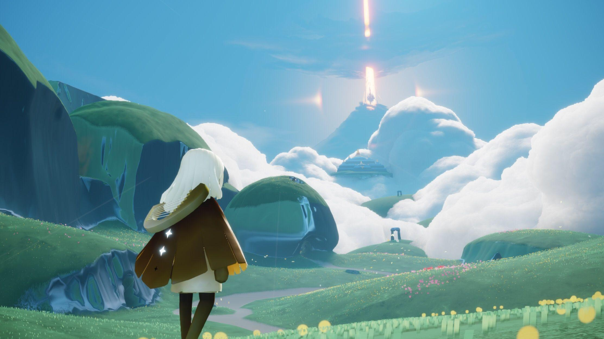
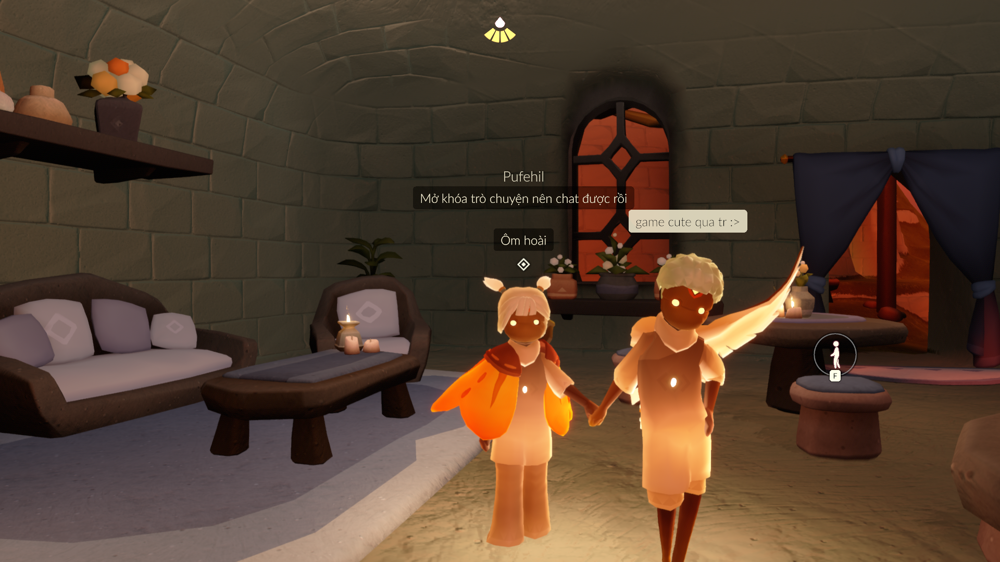
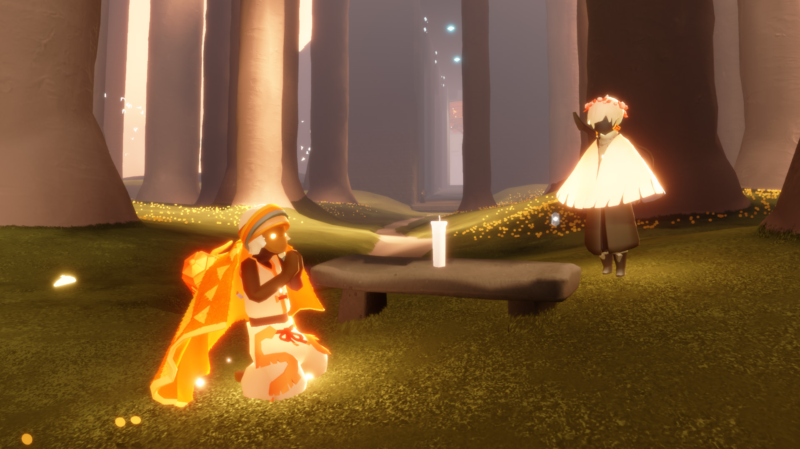
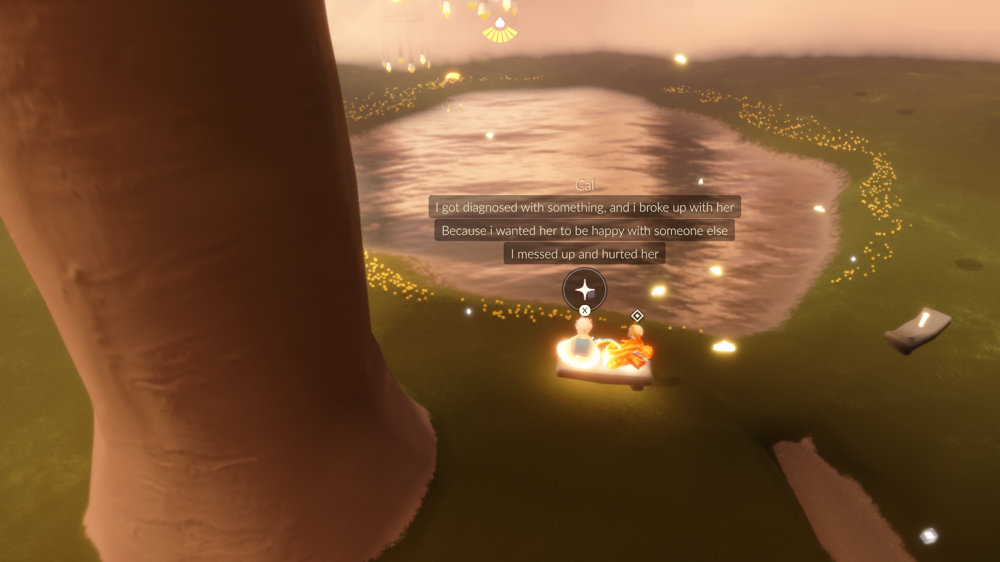
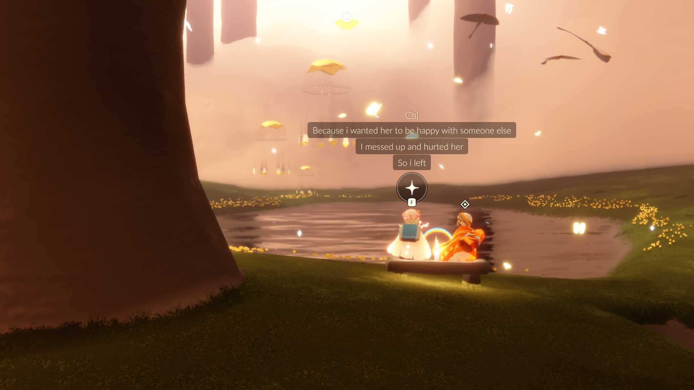
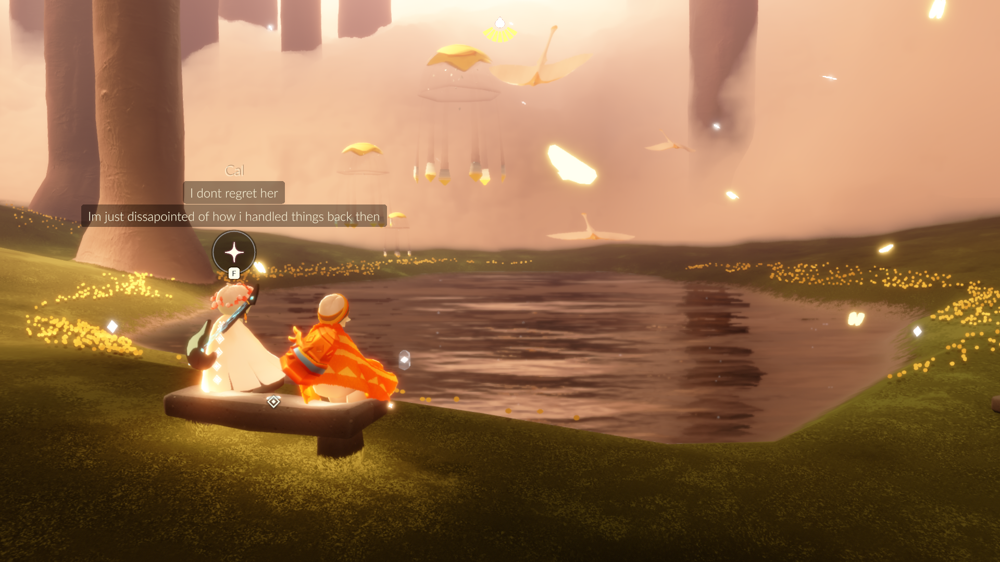
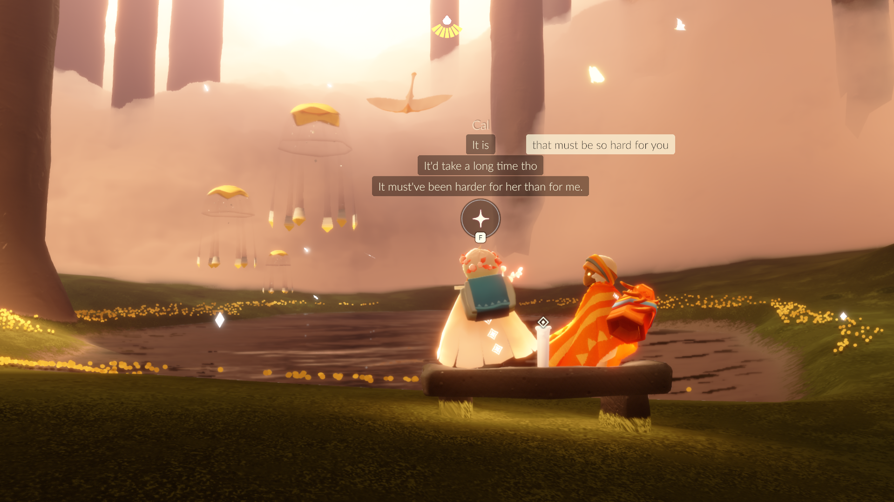
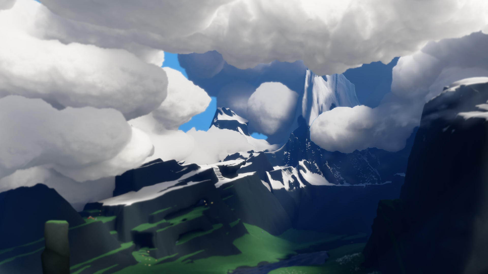
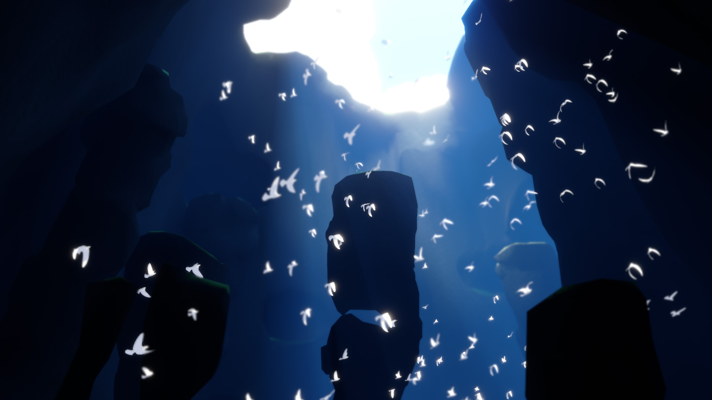
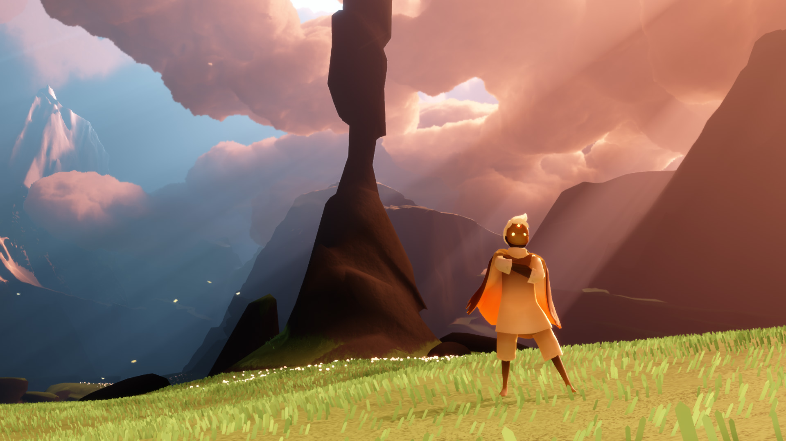

I did not expect to fall in love with a video game this week. But here I am, sitting quietly, thinking about a world made of light — and a stranger I will probably never speak to again.

I didn't go looking for Sky. A friend showed it to me — they were playing while we were talking, and somewhere in the middle of our conversation, they just said: _"Hey, come try this."_

So I did.

---

The first time I opened Sky: Children of the Light, I just stood there for a moment. Not because something dramatic happened — nothing exploded, no urgent quest appeared on screen. It was just... beautiful. The kind of beauty that feels cozy and safe, like a late afternoon when the sunlight turns golden and everything slows down. The soft clouds, the gentle music, the way my little character floated through the air with a cape trailing behind — it felt like the game was whispering, _take your time_.

I wandered around not really knowing what I was doing. That's the thing about Sky — it doesn't explain itself very much. You discover things by accident, by curiosity, by walking toward whatever catches your eye. And slowly, the world revealed itself to me: a hidden archway here, a candle that could be lit there, a constellation waiting to be completed.

But the moment I remember most from my first week isn't a place or a quest. It's a person — or rather, someone's small glowing character — who walked up to me out of nowhere and held out their hand.

I remember meeting them while I was sitting in a café, just chilling. As we started chatting, I found out they were Vietnamese — just like me. They showed me the ropes: how to find candles, upgrade my character, and explore the map. And to my surprise, as we leveled up our friendship, we unlocked new interaction features — high-fives, holding hands, even hugging. It was ridiculously cute.

I thought it was the cutest thing I'd ever seen in a game. Two strangers, holding hands in a world made of light. There's something in that gesture that words almost ruin.

And just like that, I had my first friend in the game.

Then one day, near the spawn area, I saw another player. I didn't know what to do — so I just... followed them. Quietly. At a distance. The way you might follow someone through a museum because they seem to know where they're going.

I don't think they noticed me at first. They kept walking, doing their thing, until eventually they turned back toward the village — and that's when they saw me trailing behind them. I imagine if they could've laughed, they would have.

That's how the second friend came into my life — well, my in-game life. His name is Cal.

We started talking, and it turned out he was from Indonesia and it happened to be his birthday that day. After some small talk, he decided to take me somewhere and asked if I wanted to come along. I said, "Sure, why not?" — and off we went.

The place was called the "Sacred Pond," tucked deep inside the Hidden Forest area. It was Cal's special place.

He told me it was special because it's where he used to spend time with his ex-girlfriend. It was their secret spot. Even though they had broken up, he still came here sometimes — just to sit with the memories.

It turned out he was the one who ended things, and I could sense a quiet sadness in his words. It had only been two or three months, and he was still finding his footing. So I just listened, and offered a few small thoughts that I hoped might help.

The part that really got to me: he told me he got sick, and that's the reason he broke up with her.

I sat there reading those messages for a while. That hit hard. But I'm glad he's doing better now. And I hope that someday he finds someone new to share that special place with again.

What struck me most, though, is that I got to be there for him — even if it was just in a virtual world. It reminded me that sometimes, the most meaningful connections happen in the most unexpected places. And maybe, just maybe, that little glowing character holding my hand in a game made of light is more real than I ever thought possible.

---

The game's visuals are so stunning that I can't stop taking screenshots. Every time I find a new spot, I just have to capture it — like I'm collecting little memories of this world. Here are some of my favorites:

I'm really glad I found this game. It's been a wonderful escape, and it's given me a chance to connect with people in ways I never expected. If you haven't tried it yet, I highly recommend giving it a shot. You might just find yourself falling in love with a world made of light too.
