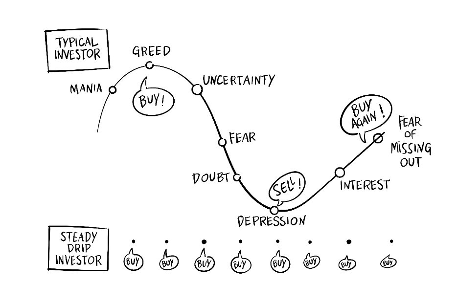

A loaf of bread cost 15,000 VNĐ last year. Now it’s 18,000–20,000 VNĐ[^1].

What hasn’t changed? My phone buzzing at 9 a.m. to say another $5 of cryptocurrency has landed in my wallet.

Inflation plays whack-a-mole with prices. I’m busy stacking bitcoin.

## What I have learned

First, we need to understand what **fiat money** is.

> Fiat money is currency that a government has declared to be legal tender, but it is not backed by a physical commodity like gold or silver. Its value comes from the trust and confidence of the people who use it.

See the problem?

Since it's not backed by a commodity, the government can print more at will, leading to inflation. Over time, this erodes your purchasing power.

In extreme cases, it leads to hyperinflation—where money becomes nearly worthless. Think Zimbabwe or Venezuela.

Hold that thought. Now let’s take a look at **GDP (Gross Domestic Product)**.

**GDP (Y)** is the sum of **consumption (C)**, **investment (I)**, **government expenditures (G)** and **net exports (X − M)**.

$$Y = C + I + G + (X - M)$$

Where:
- $C$ = Household consumption
- $I$ = Business investment
- $G$ = Government spending
- $X$ = Exports
- $M$ = Imports

> (Note: This is the Expenditure Approach to GDP—one of the most widely used methods.)

A growing GDP indicates a healthy economy, while a declining GDP can signal economic problems.

Now let’s focus on Vietnam.

The Vietnamese National Assembly has set an ambitious 8% GDP growth target for 2025.[^2]

So what factors are expected to contribute to this growth?

Let's start with **Consumption (C)**. This value can only increase if the people buy more goods and services. In theory, there are two simple ways the government can help this happen: (1) Raise people’s incomes. (2) Reduce taxes on goods and services.

With (1), this isn’t so easy right now. In 2025, Vietnam is undergoing a political restructuring meant to streamline the public sector[^4]. This will likely lead to job losses, especially among government workers. The National Assembly approved a budget of 44 trillion VND (≈$1.9 billion) to support this transition[^5].

With fewer jobs, people will likely cut back on spending. So (1) seems unlikely to help boost consumption.

Now let's look at (2). Here, the government has made some moves. For example, the 2% VAT reduction—originally temporary—has been extended through June 30, 2025[^6], and there's a proposal to extend it through 2026[^7].

But clearly, the tax cuts aren’t doing enough. Prices of essential goods and services are still rising, and people feel poorer even with lower VAT.

Adding to this is a surge in counterfeit goods. In just the first four months of 2025, over 34,000 violations were recorded—including fake food, medicines, and even gold[^3]. These undermine consumer confidence and make people more cautious about spending.

>  I also live in fear that I might consume some products that I will regret later.

So it is clear that the government is trying to boost consumption, but it is not working as expected. The people are still feeling the pinch of rising prices, and the government is looking for more time to see if the tax reduction can help.

Let's take a look at **Investment (I)** and **Net Exports (X - M)** to see if they can help boost GDP.

I group these two factors together because they are both being hit by one major event: **Trump 2.0 tariff**.

On April 2—what Trump called "Liberation Day"—he announced a minimum 10% tariff on all U.S. imports, with much higher rates for certain countries. Vietnam was hit with a 46% tariff, one of the highest[^9].

This hurts both investment and exports. Imports (M) rise due to costlier inputs. Exports (X) fall due to retaliation and reduced demand.

To explain the full impact, I asked ChatGPT. Here's what it said:

import Chatgpt1 from "./chatgpt1.mdx"
import ChatGPTFrame from "@/components/ChatGPTFrame.astro"

<ChatGPTFrame
  title="ChatGPT Analysis"
  date="May 20, 2025"
  model="o3"
>
    <Chatgpt1 />
</ChatGPTFrame>

As shown, both I and (X − M) take a hit. That's totally screwed up, the 8% GDP growth target looks like it is impossible to achieve.

So what was the Vietnamese government's response to this?"

Vietnam called the tariff "unfair" and "lacking scientific basis"—pointing out that its average MFN tariff is just 9.4%[^9].

Prime Minister Phạm Minh Chính convened an emergency cabinet meeting[^10]. The General Secretary even offered a 0% tariff on U.S. goods in exchange for lowered tariffs, which Trump publicly praised[^11] [^12].

For now, the tariff is suspended for 90 days during negotiations. But the outcome remains uncertain.

> I can't detail it here, but if you're curious why Vietnam is among the countries with high tariff rates, and why it moved so quickly to negotiate with the US government, you can start with [this article](https://www.reuters.com/world/asia-pacific/facing-trump-tariffs-vietnam-eyes-crackdown-some-china-trade-2025-04-11/) and explore further from there.

So almost all of the factors that contribute to GDP growth are not working as expected. Only one factor remains: **Government Expenditures (G)**.

And trust me, this is the easiest component to manipulate, as the government can:
- Raise public wages
- Fund infrastructure
- Offer subsidies

Proof? From July 1, 2024, public sector salaries rose 30%, injecting $1 billion extra per quarter into the economy[^14].

For 2025, the National Assembly allocated ₫829 trillion (~$32 billion) for public investment[^13]. As of April 30, 99% of that budget had already been assigned to key projects: highways, Long Thanh airport, 5G infrastructure, digital platforms.

If the fiscal multiplier is around 1.2–1.3, this could contribute 2–3 percentage points toward GDP.

But the most important question is: **"Where does the money come from?"**

It's taxpayers' money, of course. The government is using the money that it collects from taxes to fund these projects. This means that the government is essentially borrowing money from the people to pay for these projects.

But what happens if the government can't collect enough taxes to pay for these projects? The government will have to borrow money from other sources, such as banks or foreign investors. An example of this is the government bonds, which are essentially loans that the government takes out to fund its projects. The government promises to pay back the loan with interest over a certain period of time.

But there is a simpler way to do this, remember the **fiat money**? The government can simply print more money to pay for these projects. This is known as "monetizing the debt."

If Vietnam were an island that never imported a single bolt, the money-printer might save the day.
But the next mega-project on the docket—the **1,600-km North-South high-speed railway** that VinSpeed just pitched—shows how quickly that fantasy collides with hard currency reality.[^15]

| **Item**              | **Detail**                                                                                                                                                                                                                                                                     |
|-----------------------|--------------------------------------------------------------------------------------------------------------------------------------------------------------------------------------------------------------------------------------------------------------------------------|
| Price tag             | ₫1,562 trillion ≈ US \$60 billion (excludes land clearance). VinSpeed says it will put up **20% equity** and borrow the **other 80% from the state at 0% for 35 years**.[^15]                                                                                              |
| Domestic capacity     | At a May-14 forum, officials admitted “only about 20 Vietnamese firms can even meet the technical bar” for the project. In other words, the bulk of rolling stock, signaling gear, and system integration will come from overseas suppliers.[^16]     |
| Import intensity      | Vietnam imported **US \$31.36 billion of machinery and equipment in just the first eight months of 2024**, 59% of it from China—before a single bullet-train girder was ordered.[^17]                                                                   |

Why won't freshly printed dong cut it?

* Land compensation and Vietnamese salaries? Those can be paid in VND.
* Japanese trainsets, German signaling cabinets, Korean wheel sets, foreign specialists? They invoice in USD, EUR, or JPY—and they expect *hard* currency.

So the Treasury confronts a three-way fork:

1. Dip into foreign-exchange reserves (about US \$100 bn) to swap dong for dollars.
2. Issue foreign-currency debt (sovereign bonds, multilateral loans, maybe a climate-linked tranche) and service it with future tax revenue.
3. Let VinSpeed or its banks borrow abroad, pushing exchange-rate risk onto the project and, ultimately, ticket prices.

Whichever door Hanoi picks, the dong-printing press can cover only the *local* slice of the bill. The rest must be settled in money the rest of the world accepts.

> I don't know about you, but I don't want to be the one who pays for this project. I don't want to be the one who pays for the government's incompetence.

As you see there is some instability in the economy. And with the current actions of the government, I don't see any sign that it will get better. The inflation is still rising, and the hyperinflation look like a real possibility.

So I have to ask myself: **"What should I do?"**

I can’t control the government’s actions, but I can control my own.

## Let's buy Bitcoin

I won't explain what Bitcoin is here, as you can find a lot of information about it on the internet. I will just say that Bitcoin is a digital currency not controlled by any single government or central bank. And it offers a high degree of security and user control, as transactions are secured by cryptography, and, if you manage your own private keys, only you can authorize access to your funds.

So why do I want to buy now? Why not a year ago? Why not a year later?

I've known about Bitcoin since 2017. Back then, I was just a student and didn't have any money to invest. I remember clicking advertisements on the internet to earn some satoshi (each satoshi represents 0.00000001 BTC). I was so excited when I earned 0.001 BTC (worth about $5 at the time). But back then, I didn't know what to do with it. Since there weren't many exchanges to easily buy or sell Bitcoin, I just kept it in my wallet and eventually forgot about it.

I didn't think much about it again until the COVID-19 pandemic. I was stuck at home and had a lot of free time. I started to learn more seriously about Bitcoin and cryptocurrencies. I read numerous articles, watched many videos, and joined various forums. I learned about the underlying blockchain technology and how it works. I began to see the potential of Bitcoin and how it could change the world. However, at that moment, I still viewed parts of it with skepticism, mostly because things like NFTs, GameFi, and other speculative "shitcoins" made me misunderstand the core value proposition of the crypto world.

Then, in December 2024, I started studying for my Master of Business Administration. I learned about economics, finance, and how governments operate. I studied inflation, hyperinflation, and their devastating effects on people's lives. I also delved into the history of money and its evolution.

And boom – everything I had learned started to link together. It all began to make sense. I saw the connection between Bitcoin and the broader economy. I understood how Bitcoin could potentially serve as a hedge against inflation.

But the key point that made me lock in is the Trump 2.0 government. Trump made a lot of promises regarding crypto when he was elected president. And he wasn't lying; he is taking action now.[^18] The most important thing is **Strategic Bitcoin Reserve For Crypto**. This is a program that allows the government to buy Bitcoin and hold it in reserve. The goal is to create a stable and secure environment for Bitcoin to thrive. That means the role of Bitcoin could become similar to the role of gold in the past. Bitcoin will soon be **digital gold**.

And now I want to invest in it. The profit is not the main reason I invest in Bitcoin. I want to protect myself from the madness out there. 

So, I started digging into research. What strategy should I use? Do I need deep knowledge of technical analysis? Should I rely on indicators to buy and sell? Should I use trading bots?

It turns out I don't need to master all of those complex aspects right away (at least not now). A simple dollar-cost averaging (DCA) strategy seems sufficient for my current goals. This approach helps mitigate risks from volatility and removes the need for timing the market perfectly, which aligns with my current understanding and long-term perspective.

{/* check typo start */}

And yes, I have proof that DCA works. I have run some number and found that DCA is a great way to invest in Bitcoin. The risk is acceptable for me.

> Before go through the numbers, I want to clarify that I am not a financial advisor. This is just my personal opinion and experience. You should do your own research before making any investment decisions.

Dollar-cost averaging (DCA) is an investment strategy where you invest a fixed amount of money into a particular asset at regular intervals, regardless of its price.

Instead of trying to "time the market" by investing a large sum when prices seem low, DCA involves making consistent purchases over time. This means you buy more shares when prices are low and fewer shares when prices are high.

The main goal of dollar-cost averaging that I see very useful for me is to Avoid emotional investing. Take a look at this picture:

As you can see, if you go to this market and just make a buy, it gonna be a roller coaster for you. There is too much emotion to deal with. You will be happy when the price goes up, and you will be sad when the price goes down. But if you just buy a fixed amount of Bitcoin every weeks, you will not have to worry about the price. You can just sit back and relax.

Okay, I may make you curious about DCA. You may want to know how much money you can make with DCA. What is the return on investment (ROI) with DCA? How much money do you need to invest to make a profit?

Don't worry I got you covered. Here is how I calculate them:

First I need to know the price of Bitcoin. There is many sources to get the price of Bitcoin. I use [CryptoDataDownload](https://www.cryptodatadownload.com/) because it have the download csv link that I can plus direct into my code.

The data I use is from Binance Exchange. The data range is from 2017-08-17 to 2025-05-19. I use the daily price data. Here is what it looks like:

| timestamp           |   open |   high |    low |   close |
|:--------------------|-------:|-------:|-------:|--------:|
| 2025-05-15 00:00:00 | 103508 | 104193 | 101383 |  103764 |
| 2025-05-16 00:00:00 | 103764 | 104550 | 103100 |  103464 |
| 2025-05-17 00:00:00 | 103464 | 103710 | 102612 |  103127 |
| 2025-05-18 00:00:00 | 103127 | 106660 | 103105 |  106454 |
| 2025-05-19 00:00:00 | 106454 | 107109 | 102000 |  105574 |

Where:
- **timestamp**: The date and time of the price data.
- **open**: The opening price of Bitcoin on that date.
- **high**: The highest price of Bitcoin on that date.
- **low**: The lowest price of Bitcoin on that date.
- **close**: The closing price of Bitcoin on that date.

## Read more
[^1]:[Nhiều hàng hóa tăng giá - báo VNEXPRESS](https://vnexpress.net/nhieu-hang-hoa-tang-gia-4876851.html#:~:text=n%C3%A2ng%20gi%C3%A1%20m%E1%BB%97i%20chi%E1%BA%BFc%20b%C3%A1nh)
[^2]:[The National Assembly raises GDP growth target to at least 8 per cent for 2025](https://vneconomy.vn/the-national-assembly-raises-gdp-growth-target-to-at-least-8-per-cent-for-2025.htm)
[^3]:[Điểm những vụ án lớn, điển hình về hàng giả trong 4 tháng năm 2025](https://thanhtra.com.vn/an-ninh-trat-tu-D718A18CA/diem-nhung-vu-an-lon-dien-hinh-ve-hang-gia-trong-4-thang-nam-2025-50859b5f4.html)
[^4]: [Vietnam's Party leader urges revolution to streamline political system](https://e.vnexpress.net/news/news/politics/vietnam-s-party-leader-urges-revolution-to-streamline-political-system-4812532.html)
[^5]:[Quốc hội chốt bổ sung 44.000 tỷ đồng chi cho sắp xếp bộ máy](https://vnexpress.net/quoc-hoi-chot-bo-sung-44-000-ty-dong-chi-cho-sap-xep-bo-may-4887112.html)
[^6]:[Chính sách giảm thuế GTGT trong 6 tháng đầu năm 2025 theo Nghị quyết 174/2024/QH15 của Quốc hội](https://www.mof.gov.vn/webcenter/portal/thanhtrabtc/pages_r/l/chi-tiet-tin-thanh-tra-btc?dDocName=MOFUCM340222)
[^7]:[Trình Quốc hội giảm thuế VAT đến hết 2026, dự kiến giảm thu khoảng 121.740 tỉ đồng](https://tuoitre.vn/trinh-quoc-hoi-giam-thue-vat-den-het-2026-du-kien-giam-thu-khoang-121-740-ti-dong-20250513113940732.htm)
[^9]:[Trade ministry says Trump's 46% reciprocal tariff on Vietnam 'unfair'](https://e.vnexpress.net/news/business/economy/trade-ministry-says-trump-s-46-reciprocal-tariff-on-vietnam-unfair-4869746.html)
[^10]:[Cabinet convenes meeting following Trump administration’s announcement of newest tariffs](https://en.baochinhphu.vn/cabinet-convenes-meeting-following-trump-administrations-announcement-of-newest-tariffs-111250403141937313.htm)
[^11]:[Vietnamese Party chief holds phone talks with US President](https://e.vnexpress.net/news/business/economy/vietnamese-party-chief-holds-phone-talks-with-us-president-4870254.html)
[^12]:[Trump praises Vietnam's offer of '0%' tariff on American goods](https://truthsocial.com/@realDonaldTrump/posts/114280292618523684)
[^13]:[PM urges accelerated disbursement of public investment](https://en.vietnamplus.vn/pm-urges-accelerated-disbursement-of-public-investment-post319508.vnp)
[^14]:[Government workers' base salary to be hiked by 30%](https://e.vnexpress.net/news/news/government-workers-base-salary-to-be-hiked-by-30-4761023.html)
[^15]: [Vietnam to consider Vinspeed proposal to build high-speed railway](https://www.reuters.com/markets/emerging/vietnam-consider-vinspeed-proposal-build-high-speed-railway-2025-05-15)
[^16]: [High-speed rail project spurs call for domestic supply chain development: Forum | Vietnam+ (VietnamPlus)](https://en.vietnamplus.vn/high-speed-rail-project-spurs-call-for-domestic-supply-chain-development-forum-post319283.vnp)
[^17]: [Machinery and equipment import markets in first 8 months of 2024](https://asemconnectvietnam.gov.vn/default.aspx?ID1=2&ID8=139252&ZID1=8)
[^18]: [Trump’s Crypto Revolution: Promises Kept And Controversies Ignited](https://www.forbes.com/sites/digital-assets/2025/04/16/trumps-crypto-revolution-promises-kept-and-controversies-ignited/)